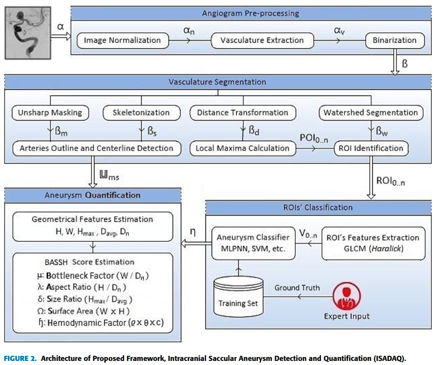

# 利用脑血管图的形态学分析进行颅内囊状动脉瘤检测和量化的框架

A Framework for Intracranial Saccular Aneurysm Detection and Quantification using Morphological Analysis of Cerebral Angiograms

# 一、简介

## （一）摘要

**动脉瘤破裂**的早期预测可以帮助神经外科医生在治疗动脉瘤，也能大大降低成本

这方面的研究工作大多涉及对收集的数据进行统计分析或模拟血流动力学因素来预测动脉瘤破裂的风险，而**对脑血管造影图像进行形态学分析**以定位和估计未破裂的动脉瘤则很少被考虑

本文旨在对**数字减影血管造影**（digital subtraction angiography，DSA）进行**形态学分析**，以准确**检测囊状动脉瘤**，精确**确定其大小**，并**估计其破裂的概率**（颅内囊状动脉瘤检测和量化）

诊断框架：

* 通过去噪血管造影图像（denoising angiogram images）提取脑血管结构，并利用分水岭分割（watershed segmentation）和距离变换（distance transformation）划定感兴趣区域（ROI）
* 然后，它使用根据稳健的 Haralick 纹理特征训练的多层感知器神经网络在分割的 ROI 中识别出囊状动脉瘤
* 最后通过对识别出的动脉瘤 ROI 的几何分析对动脉瘤破裂进行量化

包含 59 张血管图的去识别数据集（De-identified dataset）被用来评估动脉瘤检测和破裂风险量化的算法的性能

框架准确率：在动脉瘤分类 98%，动脉瘤量化 86% 

## （二）医学背景

图 1：DSA (a) - 大脑血管造影，(b) - 囊状动脉瘤，(c) - 动脉环路

* aneurysms - 动脉瘤
* intracranial - 颅内的
* intracerebral ruptures - 颅内破裂

动脉瘤患者的死亡率和发病率很高

病情：
颅内或脑动脉瘤是一种**血管向外膨胀**的情况，血管壁由于薄弱，像气球一样鼓起，如图 1-a
虽然在动脉瘤尺寸过大之前没有症状，但是其生长会导致鼓起处的血液压力增加，诱发破裂的风险
**动脉瘤破裂**会引起**动脉瘤性蛛网膜下腔出血**（aneurysmal Subarachnoid Hemorrhage，aSAH），即血液流入大脑，造成破坏

不同形式的颅内动脉瘤中（纺锤形动脉瘤 fusiform、远端动脉瘤 distal、夹层动脉瘤 dissection），囊状动脉瘤（saccular aneurysms）被认为是最容易快速生长和破裂的，其破裂约占 aSAH 的 80%；其他类型的脑动脉瘤通常生长较慢，破裂的频率较低

**识别动脉瘤并区分其与血管环**（vasculature loops）是非常重要的，不必要磁共振血管成像（MRA）、计算机断层扫描血管成像（CTA）和 数字减影血管造影（DSA）

在临床实践中，**使用 MRA、DSA 和 CTA 的一个子集来研究动脉瘤破裂的预后因素**

本研究旨在：**准确检测囊状动脉瘤**，**精确量化其破裂分数**（rupture score），这将作为未来使用CTA和MRA研究其生长速度的基线

本文提出了一个**新的框架：颅内囊状动脉瘤检测量化**（Intracranial Saccular Aneurysm Detection
and Quantification，ISADAQ），它阐明了对脑血管图的全面调查，以估计动脉瘤的破裂分数

## （三）数字减影血管造影（DSA）

文献中很少引用基于 DSA 的脑动脉瘤计算机辅助诊断（CAD）的努力

ISADAQ 需要克服 DSA 的视觉检查带来的设计上的挑战：

* 在不同的医疗机构拍摄的血管图具有**不同的尺寸和信噪比**，这阻碍了对囊状动脉瘤的自动检测；非常需要**血管图的正常化和去噪**，因为随后的形态学分析取决于从血管图中正确提取血管

* **脑动脉很复杂**，需要从健康的动脉细节（如环形和重叠）中区分恶性动脉瘤病变，专业医生甚至难以区分；定义**一套独特的囊状动脉瘤视觉特征**，并在此基础上训练一个系统，以高灵敏度准确地检测血管图中的动脉瘤存在

* 精确预测**囊状动脉瘤的大小、相对长宽比、破裂预测**，此任务最艰巨，但有助于验证颅内囊状动脉瘤的初步检测和增长的关键判断

## （四）ISADAQ 框架贡献

ISADAQ 框架的主要贡献：

* 对血管图进行去噪，准确提取脑血管结构
  * 用距离变换图像的局部最大值计算的**兴趣点**（points of interest，POI）
  * 用 POI 进行分水岭分割，以划定候选**兴趣区**（regions of interest，ROI）
* 用**多层感知器**（MLP）在分割的 ROI 中识别囊状动脉瘤，该网络是根据从灰度共现矩阵（GLCM）中计算出来的健壮的 Haralick 纹理特征进行训练的
* 根据提议的 **BASSH 评分**估计**动脉瘤破裂的概率**（瓶颈比 **b**ottleneck ratio，长宽比 **a**spect ratio，尺寸比 **s**ize ratio，表面积 **s**urface area， 血液动力学因子 **h**emodynamic factor），根据检测到的动脉瘤段的尺寸和形状指数以及对其局部和空间属性的几何分析计算。此外，通过改变输入数据和参数，从网络稳健性和效率方面评估了 MLPNN 分类的性能。

本文组织：

* 第二节通过引用相关的研究工作来描述当前的先进水平
* 第三节详细介绍了 ISADAQ 的结构，并描述了每个模块的功能。为了解释形态学分析的复杂顺序，我们通过处理具有一个囊状动脉瘤（图 1-b）和一个不清晰的动脉环（图 1-c）的血管造影图像来解释每个阶段
* 第四节介绍了我们提出的框架在稳健性和效率方面的实验结果和性能评估
* 第五节是本文的结论，并强调了一些未来的方向

## （四）个人理解

### 1. 框架处理过程

* 血管造影预处理
  * 将 RGB 图像转为灰度图像
  * 全局直方图均衡化，调整灰度分布差异
  * 抑制噪声：算术放大 + 中值过滤
  * 非线性中值滤波器进一步去噪
  * 逐像素减法去噪
  * 二值化，生成黑白 mask 图像 $\beta$
* 血管分割
  * 分支一：输入 $\beta$，生成分段 ROI
    * 用分水岭分割将血管分段（粗略分得 ROI）
    * 用距离变换得到感兴趣点（POI）
    * 用 POI 筛选 ROI，得到比较精确的 ROI
  * 分支二：输入 $\beta$，生成轮廓和中心线（骨架）
    * 非锐化掩蔽滤波器生成血管轮廓
    * 通过拓扑骨架化确定动脉的中心线
  * 将两个分支总结为分割结果 $\mathbb{U}_{ms}$
* 动脉瘤分类：对不同的动脉段进行分类
  * 计算每个 ROI 段内的 Haralick 纹理特征向量 14 × 4 = 56
  * 专家标注对应特征向量，训练 MLP 网络
  * MLP 网络负责从特征向量识别出对应 ROI 片段的识别结果 $\eta$
* 破裂风险量化：输入 $\eta$ 和 $\mathbb{U}_{ms}$
  * 从分割结果中量化 5 个几何特征
  * 从几何特征生成 5 个 BASSH 评分，并按经验加权求和
  * 用 BASSH 总分对应评估结果

# 二、材料和方法

## （一）数据收集

缺乏任何可公开获取的含有囊状脑动脉瘤的血管造影图像的匿名数据集是进行系统形态学分析的一个关键问题。我们从美国密歇根州Bloomfield Hills的Henry Ford医院获得了34名患者的59张相位对比数字减影血管图（IRB批准号11254）。患者的血管造影和其他临床数据在分析前都是匿名的。这些数据包括47张有单个囊状动脉瘤的血管图和12张没有动脉瘤的血管图。囊状动脉瘤的大小从6毫米到21毫米不等，为了限制这项工作的范围，排除了有多个动脉瘤和纺锤形或剖分型的图像。

## （二）参数选择

大脑血管图拥有局部像素强度模式，可以有效地描述大脑动脉结构在特定形态处理后的几何一致性。这种独特的纹理特征是我们分类技术的主要兴趣所在，因为它们收集了图像片段的离散灰度色调基元，例如，计算了14个Haralick特征来描述脑血管图的病理不同区域。这些独有的统计参数，包括对比度、相关性、能量、熵、同质性和方差，都来自二阶 GLCM

为估计囊状动脉瘤的大小而选择的另一组特征由形态学参数组成，这些参数准确地量化了动脉瘤破裂的风险。这些因素涉及动脉瘤局部和空间特征的突出的几何测量，在一些统计调查中是一致的[10], [12], [14], [15]。局部解剖学特征包括动脉瘤的颈部直径（Dn）、与颈部垂直的高度（H）、最大高度（Hmax）、最大宽度（W）和连接动脉的平均直径（Davg）。根据这些标量属性，计算出空间因子来预测破裂分数（"），如瓶颈因子（μ）、长宽比（λ）、大小比（δ）、表面积（）和血液动力学因子（）。

## （三）ISADAQ 框架

ISADAQ 处理可疑血管造影概述：

图 2：ISADAQ 处理可疑血管造影

* **血管造影预处理**：脑血管拓扑结构的自然复杂性增加了从不明确的动脉结构中鉴别动脉瘤的复杂性。因此，ISADAQ 对背景信号进行了实质性的去噪，并提取了斑块和动脉的像素

* **血管分割**：该框架通过采用基于区域、基于边缘和基于成分的分割，将动脉结构划分为感兴趣的候选段，以提取几何特征，对动脉段进行分类

* **动脉瘤分类**：ISADAQ 利用分割区域的突出的纹理特征，训练前馈的多层感知器（MLP）神经网络。C.3节解释了ISADAQ如何使用GLCM计算每个ROI的二阶统计特征并计算其Haralick纹理特征。使用提取的特征向量训练MLP人工神经网络，这些特征向量被注释为由放射科专家建立的基础事实，以将其分为恶性（囊性动脉瘤）和良性（非动脉瘤）区域。C.3节介绍了这种分类的实验结果

* **破裂风险量化**：该框架根据动脉瘤段的几何属性来计算其破裂分数。ISADAQ 利用对动脉瘤几何形状的形态学分析所提取的基本视觉特征（高度、宽度、颈部宽度和动脉直径），计算出 BASSH 分数，以估计动脉瘤破裂的概率。我们的尺寸估计和量化技术将在C.4节中解释

### 1. 血管造影预处理

图 3：血管提取和二值化

* $\alpha$
* 降维 & 全局阈值
（Dimensionality Reduction and Global Thresholding）
* $\alpha_n$
* 算术放大 & 中位数平滑 & 阈值屏蔽
（Arithmetic Up-scaling, Median Smoothing & Threshold Masking）
* $\alpha_n''$
* 从二进制阈值掩码中减去
（Subtraction from Binary Threshold Mask）
* $\alpha_v$
* 迭代跨度二进制阈值处理
（Iterative Intermeans Binary Thresholding）
* $\beta$

#### 1）图像正常化（IMAGE NORMALIZATION）

不同的医疗机构通过不同的扫描设备拍摄的血管图具有不同的像素密度和分辨率，从 1024x1024px 到 2448x3264px

因此，在进行有效的前景提取和准确分割之前，**归一化像素强度**是必须的

所提出的预处理算法通过一系列的形态学操作来处理输入的血管造影图像 $\alpha$，以减少整体的计算复杂性并使**图像分辨率标准化**

* 对输入图像在尺寸和颜色上降维：高分辨率的血管图图像被调整为 1024x1024px，并从 RGB 通道获得**灰度图像**以简化形态学计算

* 应用**全局直方图均衡化**（global histogram equalization）来调整灰度分布之间的差异：与自适应直方图均衡相比，全局直方图均衡能更好地在输出图像 $\alpha_n$ 上分布空间色彩面，并产生一个增强的直方图，在前景和背景信号之间表现出更多可区分的差异，以便进一步处理。

#### 2）脉管提取（VASCULATURE EXTRACTION）

如图 3-a，归一化血管图 $\alpha_n$ 中存在大量的噪声，为了提取前景动脉表面，则需要**抑制噪声**

ISADAQ 基于一个简单有效的**算术放大 + 中值过滤**操作来减弱噪声

* 用公式（1）和（2）计算出乘法常数 $c = (\alpha_{max} / \alpha_{mean})$，代表 $\alpha_n$ 中灰度值的最大值和平均值的比值

* 用公式（3）对输入图像 $\alpha_n$ 进行算术放大，同时输出图像 $\alpha_n'$ 的上标像素强度被截断在 $\alpha_{max}$

**过程理解**：将图中原本灰度值低于平均值的像素，灰度值拔高到平均值，然后对得到图像的所有像素按照【最大值/平均值】的比例放大，得到 $\alpha_n'$

$$
\alpha_{max} = \gamma \{\alpha_n \in \alpha_n(x,y) | x \in [0,n],y \in [0,m]\} \qquad \alpha_{max} \in [0,255]\tag{1}
$$

* $\gamma$ - 计算围绕点 $\alpha_n[x,y]$ 的 3x3 范围的滑窗内点灰度值的均值的函数

$$
\alpha_{mean} = \sum_{x=0,y=0}^{x=w-1,y=h-1} \alpha_n[x,y] \in z \tag{2}
$$

$$
\alpha_n'(x,y) = \sigma \{\alpha_n(x,y) \times c,\ a_{max}\} \tag{3}
$$

* $c$ - 算数放大系数 $c = (\alpha_{max} / \alpha_{mean})$
* $\sigma$ - 截断函数（truncating function）

输出的图像 $\alpha_n'$ 通过增加图像强度的自然亮度减少了大部分背景噪声，同时保留了图像区域之间的相对对比

----

$\alpha_n'$ 通过**非线性中值滤波器**进一步去噪，该滤波器通过扫描每个输入像素 $\alpha_n'[x,y]$ 来消除剩余的脉冲噪声：

$$\alpha_n''(x,y) = \lambda \{\alpha_n'[x,y],\ (x,y) \in z\} \tag{4}$$

* $\lambda$ - 计算围绕点 $\alpha_n'[x,y]$ 的 5x5 范围的滑窗 $z$ 内的中位数

中值滤波器估计一个被 $\alpha_n'[x,y]$ 的 8 个邻居包围的像素的强度，并在输出图像 $\alpha_n''$ 中映射相应像素的值 $\alpha_n''[x,y]$

中值平滑法（median smoothing）不会为输出图像计算出不真实的强度，并在不降低动脉边缘的情况下去除血管图中的斑点噪声

----

如图 3-b，公式（5）和（6）通过在平均灰度值 $\alpha_{mean}''$ 处将去噪图像 $\alpha_n''$ 阈值化为零来计算二进制掩码 $\alpha_b''$

$$
\alpha_{mean}'' = \sum_{x=0,y=0}^{x=w-1,y=h-1} \alpha_n''[x,y] \in z \qquad (x,y) \in z\tag{5}
$$

* $z$ - 围绕点 $\alpha_n''[x,y]$ 的 5x5 范围的滑窗

$$
\alpha_b''[x,y] = \mu \{\alpha_n''[x,y],\ \alpha_{mean}''\} \tag{6}
$$

* $\alpha_b''[x,y]$ - $(x,y)$ 处像素增强的结果
* $\mu$ - 二进制阈值函数（binary thresholding function）：使用二进制阈值分割图像，根据设定阈值，将像素按灰度分为黑白（一般对同质照明的背景下字符的分割很有用）
* $\alpha_{mean}''$ - 二进制阈值

----

对 $\alpha_n''$ 和 $\alpha_b''$ 使用逐像素减法 $\ominus$：$\alpha_v = \alpha_b'' - \alpha_n''$

如图 3-c，$\alpha_v$ 由**最小的噪声**和**最大的动脉前景**组成

**过程理解**：

* $\alpha_n'$ 经过一个中值滤波器，由于是滑窗内的中位数，所以图像被一定程度上变得模糊了，这样得到一个具有比较明显的背景噪声的图像 $\alpha_n''$
* $\alpha_n''$ 进一步将像素均值作为阈值，把整张图的像素编为二值化的黑白图像，此时动脉前景势必得到了增强，输出增强图像  $\alpha_b''$
* 将具有显著前景的 $\alpha_b''$ 减去具有显著噪声的 $\alpha_n''$，得到最小的噪声和最大的动脉前景的图像 $\alpha_v$

#### 3）二值化（BINARIZATION）

有了从输入血管图 $\alpha$ 中提取的确切的血管 $\alpha_v$，可以用一个阈值算法将 $\alpha_v$ 二值化，即背景和前景像素分别为白色和黑色（相当于分割 mask）

但是自动选择一个最佳阈值来进行二值化并不容易

因此不采用全局阈值，而是采用 isodata 或迭代跨度阈值聚类算法[17]

公式（7）和（8）迭代计算背景和前景强度的平均值，并计算出一个最佳阈值：$\alpha_{iso} = (\alpha_{bg} + \alpha_{fg}) / 2$

$$
\alpha_{bg} = (\sum_{x=0,y=0}^{x=m,y=m} \alpha_v[x,y],\ (x,y) \in bg) / m \tag{7}
$$

$$
\alpha_{fg} = (\sum_{x=0,y=0}^{x=m,y=m} \alpha_v[x,y],\ (x,y) \in fg) / n \tag{8}
$$

* $bg$ - $\alpha_v$ 的背景像素
* $fg$ - $\alpha_v$ 的前景表面像素
* $m$ $n$ - 属于相对表面的像素总数
* $\alpha_{bg}$ $\alpha_{fg}$ - 结果平均值

如图 3-d，血管图像 $\alpha_v$ 被二值化为 $\beta$，并被送入分割过程

$$
\beta[x,y] = 
\begin{cases}
255 \rightarrow \alpha_v[x,y] \ge \alpha_{iso} \\
0\ \ \ \  \rightarrow \alpha_v[x,y] < \alpha_{iso} \\
\end{cases}\tag{9}
$$

* $\beta[x,y]$ - 坐标 $[x,y]$ 处的结果像素

### 2. 血管分割

在预处理过程中应用了基于强度的分割后，ISADAQ 框架采用了**基于区域**、**基于边缘**、**基于组件**的分割，为分类提供了解剖学和几何学特征

图 4：分水岭分割

图 5：POI 和 ROI 的计算

#### 1）分水岭分割（WATERSHED SEGMENTATION）

图 4 说明了二进制阈值图像 $\beta$ 中的完整动脉表面是如何基于解剖学特征，通过分水岭转换，被划分为几个可分离的段 $\delta_{0 \cdots n}$ 的，如公式（10）

如图 5-a 所示，转换算法从给定动脉结构的复杂几何形状中计算出**山谷**或**盆地**，并通过将前景表面的每个像素分配到结果图像 $\beta_w$ 中的一个独特的血管段（盆地） $\delta_s$ 来进行基于区域的分割

$$\beta_w = \omega\{\beta(x,y)\} \tag{10}$$

* $\omega$ - 分水岭分割函数
* $\beta_w$ - 输出的分割图像

将 $\beta$ 的表面像素分配到 $\beta_w$ 中的非重叠段 $\delta_{0 \cdots s} = \{\delta_1, \delta_2, \cdots, \delta_s\}$

----

分水岭片段 $(\delta_1, \delta_2, \cdots, \delta_s)$ 在二值化血管图 $\beta$ 上无需人工自动计算和标记，至少几十个，比如图 5-a 中有 63 个片段，其大小和形状根据血管的复杂性而变化

分段的效率同比于**种子点**（seed points）的正确识别，种子点最终会成长为特征相似的区域

在复杂的图像分析中，如脑血管图，存在大量不明确的结构，如动脉环、重叠的血管、动脉分裂和合并，故感兴趣的段的划分很复杂

但是**血管图中的动脉瘤段（真阳性）总能通过分水岭转换准确地划定**，因为脊周围有同质的像素强度聚集

----

用分割算法将 $\beta_w$ 叠加在提取的血管结构 $\alpha_v$ 上，得到 $W$，从 $W$ 中裁剪出结果的 ROI，用于提取和分类纹理特征：

$$W = (\beta_w \odot \alpha_v) \tag{11}$$

* $\odot$ - 逐像素取与
* $W$ - 将 $\beta_w$ 叠加到 $\alpha_v$ 上的输出。

----

为了节省整体处理的开销和提高对真阳性的准确分类的概率，有必要过滤掉一些可疑的 ROI

如图 5-d，过滤算法将自动计算的兴趣点（POI）播种到 $W$ 中，以便从 $\delta_{0 \cdots s}$ 中筛选出数量非常有限的分水岭片段作为可疑的兴趣区（ROI）所示

#### 2）距离变换（DISTANCE TRANSFORMATION）

本框架提出了一种技术，同时解决了动脉结构固有的复杂性，也使选取计算 POI 的过程自动化

如图 5-b，首先将二值化图像 $\beta$ 中的血管结构进行距离变换，通过**计算每个表面像素到其最近的非零边界像素的加权距离**，将其转换为 $\beta_d$：

$$\beta_d [x,y] = \Delta\{\beta[x,y]\} \tag{12}$$

* $\Delta$ - 距离变换函数
* $\beta_d [x,y]$ - 输入像素 $\beta [x,y]$ 的加权距离计算后确定的结果像素强度

输出 $\beta_d [x,y]$ 是一个类似于动脉拓扑结构的图像，但强度是根据其加权距离重新计算的

----

分割算法进一步计算 $\beta_d$ 上的局部最大值，从而产生指向局部稳定区域的 $POI_{0 \cdots n}$

$$POI_{0 \cdots n} = M\{\beta_d [x,y]\} \tag{13}$$

* $M$ - 计算 $POI_{0 \cdots n}$ 为 $\beta_d$ 上局部最大值的函数

方程（14）将距离变换中计算的 $POI_{0 \cdots n}$ 映射到先前确定的分水岭段，因此，有限的疑似 $ROI_{0 \cdots n}$ 被筛选出来，通过训练的人工神经网络进行分类。

$$ROI_{0 \cdots n} = u\{W, POI_{0 \cdots n} \} \tag{14}$$

* $u$ - 筛分函数，以 $POI_{0 \cdots n}$ 为输入，从 $W$ 中划出相应的 $ROI_{0 \cdots n}$

如图 5-d 实验结果，63 个 ROI 中只有 3 个被筛分为 $POI_{0 \cdots 2}$ 所指向的 $ROI_{0 \cdots 2}$ ，显然自动筛选有效地减少了候选阳性的数量，有助于提高 ROI 准确分类的概率

图 6：

#### 3）非锐化掩蔽（UNSHARP MASKING）

本文试验了几种边缘检测技术来**检测动脉结构的轮廓**，如 Canny 和 Sobel 算子，或自适应和全局阈值等，其中大多数都无有效的表现

Canny 或 Sobel 这样的边缘检测器需要特定的阈值和预处理操作以获得最佳结果，而自适应或全局阈值增强了不需要的局部细节，导致了虚假的测量

相比之下，**非锐化掩蔽滤波器**通过从原始图像 $\beta$ 中减去非锐化（平滑）版本的 $\beta$，从输入的二进制阈值图像 $\beta$ 中产生一个准确的边缘增强图像 $\beta_m$

结果图像 $\beta_m$ 如图 6-a 所示，保留了原始图像 $\beta$ 的拓扑学特征，同时精确地分割了血管图中大、小血管的边界线

$$\beta_m(x,y) = \beta(x,y) \ominus \beta_{smooth} \tag{15}$$

* $\ominus$ - 比特减法函数，$\beta_m$ 是过滤后的轮廓，$\beta_{smooth}$ 是通过中值平滑操作获得的 $\beta$ 的模糊版本

#### 4）骨架化（SKELETONIZATION）

分割算法通过拓扑骨架化**确定动脉的中心线**

在这个过程中，前景动脉表面被缩小到一个骨架（最大 1 像素宽），同时保持血管的长度和拓扑结构的完整

如图 6-b，与形态学减薄相比，本文的骨架化保留了脑动脉和动脉瘤固有的管状和囊状结构的不规则性和其他特征

$$\beta_s(x,y) = \cup_{r>0}\cap_{q>0} [(\beta \ \theta \ r\beta) - (I \ \theta \ r\beta) \textcircled{o} q\beta']$$

* $\beta_s$ - 输出的骨架图像
* $\theta$ - 形态学腐蚀（phological erosion）
* $\textcircled{o}$ - 形态学开放（phological opening）
* $r\beta$ - 半径为 $r$ 的开放球
* $\beta'$ - $\beta$ 的封闭

如图 6-c，$\beta_s$ 中的每个骨架像素都通过连接成分分析进行扫描，并被分配到一个独特的中心线段 $l_s$

$$\beta_s = l_1 \cap l_2 \cap l_3 \cap \cdots \cap l_s$$

$$l_1 \cup l_2 \cup l_3 \cup \cdots \cup l_s = 0$$

* $\beta_s$ - 输出的骨架图像
* $l_{1 \cdots s}$ - 不同的线段

这些线段在估计动脉瘤的破裂分数时进一步用于几何计算

同样，分割算法通过扫描骨架图像 $\beta_s$ 中像素的邻域来检测线段的交叉点。对连接的组件进行分析，以分割出 $\beta_s$ 中独特的交叉点$$/0::s，如图6(c)所示，其中至少有四条线相互连接。然后计算出交点的各个腿的长度和每对腿之间的角度，以交叉验证动脉瘤段的球形形状。图6(d)显示骨架图像βs叠加在轮廓图像 $\beta_m$ 上产生的ms，它结合了轮廓和中心线像素，根据其平均直径计算和分割动脉。

其中，ms是结果图像，⊗是将βm和βs的边缘和中心线结合起来的比特XOR操作。

我们的算法将线的交叉点（四条或更多的腿合并在一个点上）分割出来并记录下来，有三个目的：

* 交叉验证分类的动脉瘤段 $η$，如果它的骨架形成一个交叉点
* 确定动脉瘤表面区域的中心点 $C_{xy}$，以便进行精确的几何和血液动力学测量
* 将中心点 $C_{xy}$ 映射到 $ROI_{0 \cdots n}$ 的特定分水岭段，以便进行各自的空间测量

### 3. 动脉瘤分类

在勾画病变图像段时发现了医生内部的分歧，这为基于机器的动脉瘤划定带来了挑战性的

囊状动脉瘤的自动识别需要根据 ROI 来训练分类器，可以**对不同的动脉段进行分类**

候选 ROI 的**灰度像素强度之间的空间关系**有独特的排列，可以以此区分囊状动脉瘤的表面区域和非动脉瘤

这种独特的纹理特征被计算为一阶（如直方图特征）、二阶（如灰度共现矩阵 - GLCM 或灰度色调依赖矩阵 - GTDM）、高阶（如灰度运行长度矩阵 - GLRLM）统计数据

在数字减影血管造影（DSA）图像分类中，从未利用过**纹理特征**分类动脉瘤段的内在能力，纹理分析被广泛用于医学图像的分割、检测、分类和压缩任务

表 1：Haralick 纹理特征及其数学定义

表 1 中的 14 个**相邻像素强度之间的二阶统计相关性**（被称为 Haralick 特征）是多光谱医学图像（如血管图）分类的最重要的**描述符**之一

这些描述符通过在空间域计算图像信号的统计数据来收集候选 ROI 的**离散灰度色调基元**（discrete grayscale tonal primitives），如，细度、粗度、平滑度、随机度、颗粒度、线条化等视觉特征，它们在动脉瘤和非动脉瘤区域的边界和表面强度中是**局部一致**的

分类算法提取 Haralick 特征，作为每个 ROI 段直方图中灰阶变化的空间分布

这种独特的特征向量本质上代表了每个 ROI 段的**前景和背景表面像素之间的实质性结构排布**

在领域专家的帮助下，每个特征向量被注释为“动脉瘤”或“非动脉瘤”，以用于训练

框架使用**前馈反向传播 MLP 神经网络**对投资回报率进行分类

#### 1）HARALICK 特征向量（HARALICK FEATURE VECTOR）

表 1 中的 14 个 Haralick 纹理特征，来自于在不同相邻方向计算的四个灰度级共现矩阵，$\theta = 0◦,45◦,90◦,135◦$，比如：

* 对比度：衡量一个像素和它的邻居之间的强度对比。如果灰度差持续发生，纹理就会变得粗糙，对比度就会变大；否则，如果对比度的值很小，纹理就会变得尖锐

* 相关度：衡量一个像素与它的邻域的相关程度，即衡量一个图像区段的灰阶线性依赖关系。其数值范围从 -1 到 1，分别表示完美的负相关和正相关

由 14 × 4 = 56 个数值组成的单一特征向量描述了纹理区域的语义，具有突出的能力来编码候选 ROI 的局部邻域强度的相关性，作为训练特定分类器的输入

经过机器分类器后，一个成功识别的动脉瘤段 $\eta$ 被送入估计算法中，以精确计算其几何特征并量化其破裂分数

#### 2）特征分类器（FEATURE CLASSIFIERS）

通过 GLCM 计算出的 Haralick **特征向量**在专家的帮助下进行标注，并使用交叉验证进行详尽的测试

为了使机器分类器达到最佳效果，对 ISADAQ 的 ROI 特征进行某些选择是必须的：

* ROI 尺寸和颜色空间的选择
* 特征集和分类器的选择

因此，在训练和测试之前，每个 ROI 片段被自动调整为 100x100px 的灰度图像，并从 GLCM 中计算出包括二阶空间相关性的特征集

框架选择了多层感知器（MLP），因为与包括支持向量机、逻辑回归和奈夫贝叶斯在内的著名统计分类器相比，它能够以最高的准确率识别囊状动脉瘤段的音调语义（tonal semantics）

#### 3）多层感知器神经网络（MLP，MULTILAYER PERCEPTRON NEURAL NETWORK）

MLP 是最有说服力的监督神经网络拓扑结构，能通过反向传播的梯度修正对非线性可分离数据集进行分类

由至少三层（输入 - 第一层，隐藏 - 一层或多层，输出 - 最后一层）和每层中任意数量的处理元素（称为正弦波节点）组成的 MLP 网络可以有效地用于描述 ROI 的纹理特征

使用以下四个阶段的训练周期，其中激活节点从统计特征中识别出重复的模式，并通过在连续的学习周期中适应新的数据模式来不断概括网络性能。

* 配置所需层数和感知器的网络 $(\rho_1,\rho_2,\cdots,\rho_n)$，用随机权重 $w_{ij}$ 初始化相邻层的节点对之间的联系
* 向输入层节点I1; I2; I3; :::; I56提供输入特征f1;0o; f2;0o; f3;0o;:;f14;135o，这样可以计算每个节点 $\rho_i$ 的非线性内积，并使用 sigmoid 激活函数反馈到后续的感知器 $\rho_j$
* 计算输出单元O1；O2的误差@i的大小，即@i D ti-σi，通过比较其计算的激活与目标激活，并通过所有隐层单元传播，各自的均方误差累计为：@i D σi Pm j wij@j
* 重新计算本地连接的处理节点对ρi和ρj之间的每个链接的初始突触权重wij，加入变化1wij，计算为：1wij D τ @jδσi，其中@j是均方误差，δ是小学习率，τ是动量项，分别取0.3和0.2，以达到实验网络的最大精度。

### 4. 破裂风险量化

图 7：

ISADAQ 的核心是对准确分类的囊状脑动脉瘤 $\eta$ 进行几何评估，根据局部和空间特征计算其破裂分数

如图 7，估计算法对几何特征进行量化，即：

* 颈部直径 $D_n$
* 动脉瘤最大高度 $H_{max}$
* 动脉瘤垂直于颈部直径的高度 $H$
* 动脉瘤最大宽度 $W$
* 连接动脉的平均直径 $D_{avg}$

然后根据这些属性，ISADAQ 计算出 BASSH 得分以预测破裂率：

* 瓶颈比 **b**ottleneck ratio：$\mu = W / D_n$
* 长宽比 **a**spect ratio：$\lambda = H / D_n$
* 尺寸比 **s**ize ratio：$\delta = H_{max} / D_{avg}$
* 表面积 **s**urface area：$\Omega = W \times H$
* 血液动力学因子 **h**emodynamic factor：$h = \zeta \times \theta \times c$

算法是以像素为长度单位计算这些比率的。虽然将像素转化为毫米可以增加放射科医生的理解，但由于图像分辨率和内容的多样性，这个比例不能一概而论

同样，标度器属性之间的几何比率免除了这种校准的需要，因为它们的关联性相应地反映了与计算的尺寸有关的风险。

为了促进基本参数和衍生参数的计算更加准确和精确，我们观察到以下条件：

* 在计算 $W$、$H$、$H_{max}$ 之前应确定动脉瘤中心点 $C_{xy}$
* 计算 $W$、$H$、$H_{max}$ 的线段应通过 $C_{xy}$
* 血液流入角是母动脉轴线相对于动脉瘤 $H$ 方向的角度
* 动脉瘤最大宽度 $W$ 应平行于 $Dn$ 计算
* $D_{avg}$ 应是动脉瘤相邻动脉的平均值

#### 1）几何特征的估计（GEOMETRICAL FEATURES ESTIMATION）

在 $\mathbb{U}_{ms}$ 上画出几条线，通过动脉瘤中心点 $C_{xy}$，以“度”的角度旋转轮子，向两边的边界移动

例如，图 7-a 显示了轮子以 $\varphi$ 度为单位旋转（如 15°），接触边界线的两个直径的边缘都被记录下来用于周长估计，因此产生了一个边缘列 $\xi_{1 \cdots 24}$（$360/\varphi$）

建议的算法运行两条蛇 $S_1$ 和 $S_2$，从一个边缘 $\xi_x$ 的相反方向扫描动脉瘤的内部边界，朝向 $\xi_{x+1}$ 和 $\xi_{x-1}$

在 $S_1$ 和 $S_2$ 的任何两点 $P_i$ 和 $P_j$，蛇在它们的邻域搜索 MxMpx，找到能量函数最小的位置，并将 $P_i$ 和 $P_j$ 移动到该位置，直到 $P_i = P_j$

对于颈部向连接动脉开放的动脉瘤，只有在确定了颈部直径 $D_n$ 之后才能定义周长

1. 颈部直径 $D_n$：如图7(a)所示，拟议的算法扫描从一个边缘到另一个边缘的每个像素，并计算相邻边缘之间的平均距离，同时将像素加入到结果的周长向量P中。每个像素pi(x; y)和pj(x; y)被分析，分别与它们之前的n个像素对目标边缘ξi和ξj所保持的方向有关。如果在目标边缘ξi或ξj方向的M×M邻域中没有直接相邻的像素，则确定为动脉瘤颈。那些像素开始的点被记录为Di(x; y)和Dj(x; y)，S1和S2扫描接下来的n个像素的连接。如果接下来的n个像素的发散继续增加，那么Di(x; y)和Dj(x; y)之间的最短距离被计算为颈部直径Dn，最后n个像素被丢弃。

2. 动脉瘤最大高度 $H_{max}$：图7(b)显示，从Dn上的每个点dn(x; y)画出几条线，通过Cxy走向P上的一个点pn(x; y)，从dn(x; y)到pn(x; y)的最长距离被记录为一个动脉瘤的最大高度Hmax。

3. 动脉瘤垂直于颈部直径的高度 $H$：如图7(c)所示，算法确定Dn上的中点mn(x; y)，并在mn(x; y)上画一条通过Cxy并在pn(x; y)处接触P的线。两点mn(x; y)和pn(x; y)之间的距离被记录为动脉瘤的高度H。

4. 动脉瘤最大宽度 $W$：如图7(d)所示，确定H在Dn上的角度θ，并以H在Cxy上的相同角度θ计算动脉瘤直径W。

5. 连接动脉的平均直径 $D_{avg}$：动脉的直径是通过计算从中心线ls向动脉边界的最短距离Ds来估计的，单位是ms。从各自动脉的一个边缘到另一个边缘的几个直径D0::s，通过l1::s的每个线段ls上的特定点来绘制。如图7(d)所示，D1和D2是两条动脉的直径，计算方法是：i)从分水岭段δ0::s的列表中，连接动脉和它们各自的中线被确定为l1;2，ii)绘制几条经过l1;2的中点的线，iii)ls的端点，以及/0::s中的任何交点/s。最后，从分水岭段δ0::s的列表中，确定连接动脉和它们各自的骨架，并将其平均直径估计为D avg。

#### 2）解剖因素的估计（ANATOMICAL FACTORS ESTIMATION）

图 8：（a）在矢量H和动脉中线矢量V的交汇处确定流入角；（b）利用通过连接动脉中线的血流方向近似确定流入破裂系数(1,2,3)

**HEMODYNAMIC FACTOR**

如图 7-c，另一个主要影响囊状动脉瘤尺寸快速增长的重要因素是**血液从母动脉流入动脉瘤囊的角度** $\theta$

如图 8，囊状动脉瘤相对于母体血管可以向内、向外、平行。动脉瘤的位置在动脉瘤壁上引起不同的应力水平（应力因子 stress factor），分别定义为，$\zeta = 1$（最小），$\zeta = 2$（中等）、$\zeta = 3$（最大）

算法：

* 首先通过使用动脉的中线画出向量 $V_{1 \cdots n}$ 来确定母动脉的近端方向，并定位动脉瘤的中心点
* 然后通过**从中心点向动脉瘤颈部延伸向量** $H$ 来计算血液流入的角度，并通过与中线连接向量相交来计算角度 $\theta$
* 血液流入囊状动脉瘤的趋势被计算为：$h = \zeta \times \theta \times c$，其中 $c = 0.01$，是使破裂评分正常的常数

#### 3）BASSH 评分估计（BASSH SCORE ESTIMATION）

动脉瘤破裂的概率首先通过确定前面所述的大小系数 $w$ 来估计

然后在神经外科专家的帮助下，根据各个解剖因素所涉及的风险程度，分配各个权重（在0.0-1.0之间）（如：w
µ-瓶颈因素，wλ-长宽比，wδ-尺寸比，w-表面积，w-血流动力学因素）

最后，破裂的风险被量化为 BASSH 评分 $\epsilon$，方法是将风险因素的乘积与各自的权重相加，如下所示。

$$\epsilon = w_\mu \times \mu + w_\lambda \times \lambda + w_\delta \times \delta + w_\Omega \times \Omega_w + w_h \times h \tag{19}$$

专家分配权重：$w_\mu = 0.05$、$w_\lambda = 0.1$、$w_\delta = 0.4$、$w_\Omega = 0.4$、$w_h = 0.05$

BASSH 评分 $\epsilon$ 越低，病人就越安全，BASSH 评分越高，破裂的风险就越大

BASSH 评分与在神经外科专家帮助下定义的未破裂颅内动脉瘤严重程度指数（IASI）进行映射和验证：

