

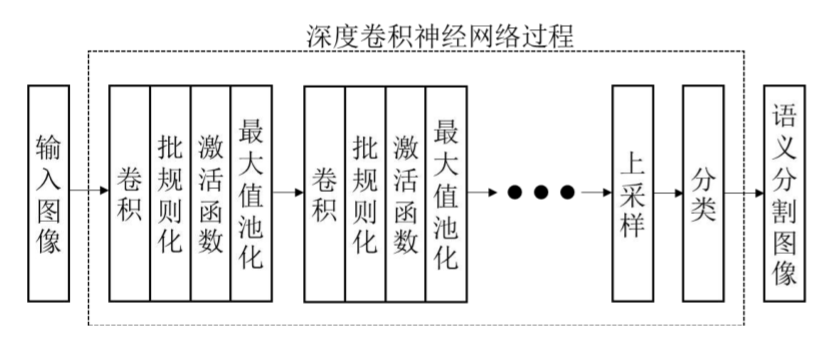

##U-net

###一、任务

端到端的网络，提供整张图片来预测每个像素的类别标签。

平衡位置where和分辨率what之间的关系

##FCN

###一、面临问题

####1. 要使用卷积神经网络来处理图像分割
每个像素点都有21种分类的可能性，要对图像做像素级别的预测，即按照每个像素的可能性给出预测值

####2. 更深的网络带来更多的信息丢失

###二、解决方案

####1. 将全连接层替换为卷积层 

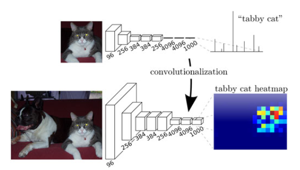

####2. 对图片进行上采样
反卷积

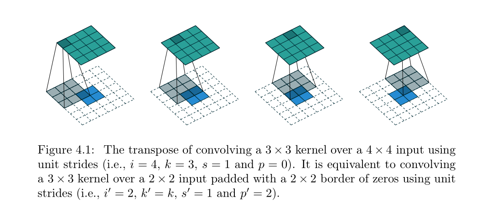

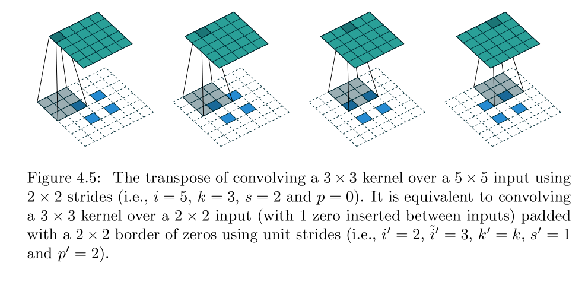

####3. 使用skip结构跳级连接
在还原图像的时候能够得到更多原图所拥有的信息

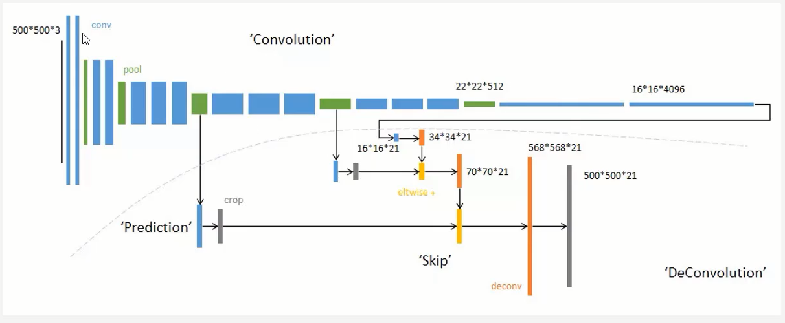

###三、效果

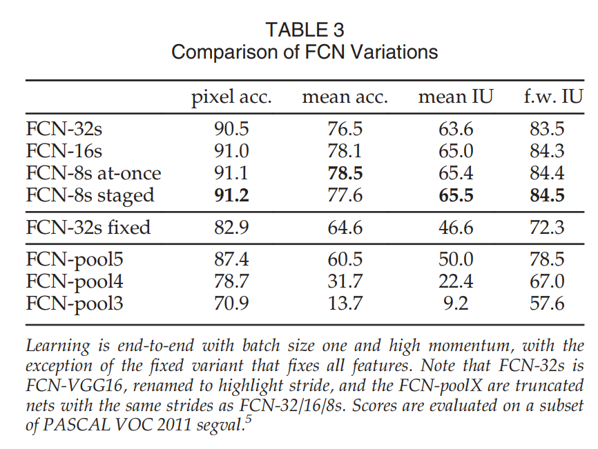

##Deeplab V1

###一、面临问题

深度卷积神经网络的位置精度和分辨率不够
 -> 两方面：减少位置信息的丢失，提高细节感知能力

###二、解决方案

####1. 减少位置信息的丢失方面，用空洞卷积取代池化

池化的作用：
* 缩小特征层的尺寸，减少对计算资源的需求
* 快速扩大感受野，利用更多的上下文信息进行分析

池化的劣势：
* 卷积操作具有平移不变性，对位置信息不敏感，这对分类网络是好事，但是对分割网络是坏事，因为丢失了位置信息；池化操作加剧了位置信息的模糊

空洞卷积取代池化：
* 在去掉 pooling 层后，感受野会随之下降，解决方法是引入**空洞卷积**（Atrous Convolution），这样可以在**不增加计算量**的情况下扩大感受野
* 相比于先pooling后再卷积，使用空洞卷积可以让**特征更密**（因为pooling减少了分辨率，这使得空洞卷积和普通卷积的位置不再是一一对应的了）

####2. 提高细节感知方面，引入CRF

以对象为中心的决策需要对空间变换保持不变性，这限制了模型的空间精度

通过采用完全连接的条件随机场 (CRF) 提高模型捕获细节的能力

在进行分割的时候考虑空间上临近的像素并进行评估，依评估结果，按概率选择整张图片整体上最优的分割方案，达到去除“孤岛”的目的

多次使用CRF进行迭代可以进一步提高分割图像的精度

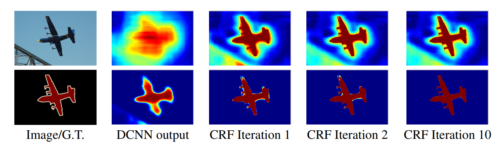

###三、整体结构

###四、效果

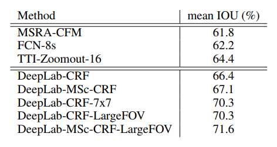

crf的效果：

* 速度：凭借“atrous”算法，我们的密集 DCNN 以 8 fps 运行，而全连接 CRF 的平均场推断需要 0.5 秒，
* 准确性：我们在 PASCAL 语义分割挑战中获得了最先进的结果，优于 Mostajabi 等人的次优方法。 (2014) 7.2% 的边际和 
* 简单性：我们的系统由两个相当完善的模块级联组成，DCNNs 和 CRFs。

<!-- 深度卷积神经网络在最后的输出层没有充分定位到准确的对象分割

精度不够
> We show that responses at the final layer of DCNNs are not sufficiently localized for accurate object segmentation.

将 DCNN 应用于图像标记任务有两个技术障碍：
信号下采样和空间“不敏感”（不变性）。

信号下采样

第一个问题与在标准 DCNN 的每一层执行最大池化和下采样（“跨步”）的重复组合所导致的信号分辨率降低有关，我们采用最初为有效计算未抽取离散小波变换而开发的“atrous”（带孔）算法。 这使得 DCNN 响应的高效密集计算可以采用比该问题的早期解决方案简单得多的方案。

> There are two technical hurdles in the application of DCNNs to image labeling tasks: signal downsampling, and spatial ‘insensitivity’ (invariance). 

> The first problem relates to the reduction of signal resolution incurred by the repeated combination of max-pooling and downsampling (‘striding’) performed at every layer of standard DCNNs (Krizhevsky et al., 2013; Simonyan & Zisserman, 2014; Szegedy et al., 2014). Instead, as in Papandreou et al. (2014), we employ the ‘atrous’ (with holes) algorithm originally developed for efficiently computing the undecimated discrete wavelet transform (Mallat, 1999). This allows efficient dense computation of DCNN responses in a scheme substantially simpler than earlier solutions to this problem (Giusti et al., 2013; Sermanet et al., 2013).

空间“不敏感”（不变性）

第二个问题涉及从分类器获得以对象为中心的决策需要对空间变换保持不变性，这从本质上限制了 DCNN 模型的空间精度。我们通过采用完全连接的条件随机场 (CRF) 来提高模型捕获精细细节的能力。

> The second problem relates to the fact that obtaining object-centric decisions from a classifier requires invariance to spatial transformations, inherently limiting the spatial accuracy of the DCNN model. We boost our model’s ability to capture fine details by employing a fully-connected Conditional Random Field (CRF). Conditional Random Fields have been broadly used in semantic segmentation to combine class scores computed by multi-way classifiers with the low-level information captured by the local interactions of pixels and edges (Rother et al., 2004; Shotton et al., 2009) or superpixels (Lucchi et al., 2011). Even though works of increased sophistication have been proposed to model the hierarchical dependency (He et al., 2004; Ladicky et al., 2009; Lempitsky et al., 2011) and/or high-order dependencies of segments (Delong et al., 2012; Gonfaus et al., 2010; Kohli et al., 2009; Chen et al., 2013; Wang et al., 2015), we use the fully connected pairwise CRF proposed by Krahenb ¨ uhl & Koltun (2011) for its efficient computation, and ability to capture fine edge details ¨ while also catering for long range dependencies. That model was shown in Krahenb ¨ uhl & Koltun ¨ (2011) to largely improve the performance of a boosting-based pixel-level classifier, and in our work we demonstrate that it leads to state-of-the-art results when coupled with a DCNN-based pixel-level classifier.

做法：
我们通过将最终 DCNN 层的响应与完全连接的条件随机场 (CRF) 相结合，克服了深度网络的这种不良定位特性。

效果：
定性地说，我们的“DeepLab”系统能够以超出以前方法的准确度来定位分段边界。定量地，我们的方法在 PASCAL VOC-2012 语义图像分割任务中设置了新的 state-of-art，在测试集中达到了 71.6% 的 IOU 准确率。

优势：
我们的“DeepLab”系统的三个主要优势是：

> The three main advantages of our “DeepLab” system are (i) speed: by virtue of the ‘atrous’ algorithm, our dense DCNN operates at 8 fps, while Mean Field Inference for the fully-connected CRF requires 0.5 second, (ii) accuracy: we obtain state-of-the-art results on the PASCAL semantic segmentation challenge, outperforming the second-best approach of Mostajabi et al. (2014) by a margin of 7.2% and (iii) simplicity: our system is composed of a cascade of two fairly well-established modules, DCNNs and CRFs.

我们的模型与其他最先进的模型之间的主要区别在于像素级 CRF 和基于 DCNN 的“一元项”的组合。 Cogswell 等人专注于在这个方向上最接近的作品。 (2014) 使用 CRF 作为基于 DCNN 的重新排序系统的提议机制，而 Farabet 等人。 (2013) 将超像素视为局部成对 CRF 的节点，并使用图割进行离散推理；因此，他们的结果可能会受到超像素计算中的错误的限制，同时忽略远程超像素依赖性。相反，我们的方法将每个像素视为一个 CRF 节点，利用远程依赖关系，并使用 CRF 推理直接优化 DCNN 驱动的成本函数。我们注意到平均场已被广泛研究用于传统的图像分割/边缘检测任务，例如 (Geiger & Girosi, 1991; Geiger & Yuille, 1991; Kokkinos et al., 2008)，但最近 Krahenb ¨ uhl & Koltun (2011) ) 表明推理对于完全连接的 CRF 非常有效，并且在语义分割的上下文中特别有效。

> The main difference between our model and other state-of-the-art models is the combination of pixel-level CRFs and DCNN-based ‘unary terms’. Focusing on the closest works in this direction, Cogswell et al. (2014) use CRFs as a proposal mechanism for a DCNN-based reranking system, while Farabet et al. (2013) treat superpixels as nodes for a local pairwise CRF and use graph-cuts for discrete inference; as such their results can be limited by errors in superpixel computations, while ignoring long-range superpixel dependencies. Our approach instead treats every pixel as a CRF node, exploits long-range dependencies, and uses CRF inference to directly optimize a DCNN-driven cost function. We note that mean field had been extensively studied for traditional image segmentation/edge detection tasks, e.g., (Geiger & Girosi, 1991; Geiger & Yuille, 1991; Kokkinos et al., 2008), but recently Krahenb ¨ uhl & Koltun (2011) showed that the inference can be very efficient for ¨ fully connected CRF and particularly effective in the context of semantic segmentation.

具体做法：

作为实现这一点的第一步，我们将 VGG-16 的全连接层转换为卷积层，并以原始分辨率在图像上以卷积方式运行网络。然而，这还不够，因为它产生的检测分数非常稀疏（步长为 32 像素）。为了在 8 像素的目标步幅上更密集地计算分数，我们开发了 Giusti 等人先前采用的方法的变体。 （2013）； Sermanet 等人。 （2013）。我们在 Simonyan & Zisserman (2014) 的网络中的最后两个最大池化层之后跳过子采样，并通过引入零来修改其后层中的卷积滤波器以增加它们的长度（在最后三个卷积层中为 2x，在最后三个卷积层中为 4 ×在第一个全连接层）。我们可以通过保持过滤器完好无损来更有效地实现这一点，而是分别使用 2 或 4 像素的输入步幅对应用它们的特征图进行稀疏采样。这种方法，如图 1 所示，被称为“孔算法”（“atrous 算法”），之前已开发用于有效计算未抽取小波变换（Mallat，1999）。我们在 Caffe 框架 (Jia et al., 2014) 中实现了这一点，方法是向 im2col 函数（它将多通道特征图转换为矢量化补丁）添加对底层特征图进行稀疏采样的选项。这种方法普遍适用，允许我们以任何目标子采样率有效地计算密集的 CNN 特征图，而无需引入任何近似值。

如图 2 所示并在第 4.1 节中进一步阐述，类分数图（对应于对数概率）非常平滑，这允许我们使用简单的双线性插值将其分辨率提高 8 倍，而计算成本可以忽略不计。

感受野问题：

将我们的网络重新用于密集分数计算的另一个关键因素是明确控制网络的感受野大小。 最新的基于 DCNN 的图像识别方法依赖于在 Imagenet 大规模分类任务上预训练的网络。 这些网络通常具有较大的感受野大小：在我们考虑的 VGG-16 网络的情况下，其感受野为 224×224（带有零填充），如果网络被卷积应用，则为 404×404 像素。 将网络转换为全卷积网络后，第一个全连接层有 4,096 个 7×7 空间大小的过滤器，成为我们密集得分图计算的计算瓶颈。

> Another key ingredient in re-purposing our network for dense score computation is explicitly controlling the network’s receptive field size. Most recent DCNN-based image recognition methods rely on networks pre-trained on the Imagenet large-scale classification task. These networks typically have large receptive field size: in the case of the VGG-16 net we consider, its receptive field is 224×224 (with zero-padding) and 404×404 pixels if the net is applied convolutionally. After converting the network to a fully convolutional one, the first fully connected layer has 4,096 filters of large 7×7 spatial size and becomes the computational bottleneck in our dense score map computation.

crf：

传统上，条件随机场 (CRF) 已被用于平滑噪声分割图 (Rother et al., 2004; Kohli et al., 2009)。 通常，这些模型包含耦合相邻节点的能量项，有利于将相同标签分配给空间邻近像素。 定性地说，这些短程 CRF 的主要功能是清理建立在本地手工工程特征之上的弱分类器的虚假预测。

与这些较弱的分类器相比，我们在这项工作中使用的现代 DCNN 架构会产生质量不同的分数图和语义标签预测。 如图 2 所示，分数图通常非常平滑并产生同质的分类结果。 在这种情况下，使用短程 CRF 可能是有害的，因为我们的目标应该是恢复详细的局部结构，而不是进一步平滑它。 将对比敏感势 (Rother et al., 2004) 与局部范围 CRF 结合使用可以潜在地改善定位，但仍然会错过薄结构，并且通常需要解决昂贵的离散优化问题。

> Compared to these weaker classifiers, modern DCNN architectures such as the one we use in this work produce score maps and semantic label predictions which are qualitatively different. As illustrated in Figure 2, the score maps are typically quite smooth and produce homogeneous classification results. In this regime, using short-range CRFs can be detrimental, as our goal should be to recover detailed local structure rather than further smooth it. Using contrast-sensitive potentials (Rother et al., 2004) in conjunction to local-range CRFs can potentially improve localization but still miss thin-structures and typically requires solving an expensive discrete optimization problem.

为了克服短程 CRF 的这些限制，我们将 Krahenb ¨ uhl & Koltun (2011) 的全连接 CRF 模型集成到我们的系统中。 该模型采用能量函数 -->

##DeepLab V2

###一、面临问题：
多尺度物体（the existence of objects at multiple scales）
空洞卷积存在的劣势：
* 局部信息丢失：由于空洞卷积的计算方式类似于棋盘格式，某一层得到的卷积结果，来自上一层的独立的集合，**没有相互依赖**，卷积结果之间没有相关性
* 远距离获取的信息没有相关性：由于空洞卷积稀疏的采样输入信号，使得远距离卷积得到的信息之间没有相关性
  
DCNN 分数图可以预测物体的存在和粗略位置，但不能真正描绘它们的边界

###二、解决方案
ASPP（Atrous Spatial Pyramid Pooling）
结合 ASPP 的代码来看：
* ASPP 层先对输入做一系列不同 padding 和 dilation 的空洞卷积，这些卷积通过调整这两个参数以满足输出通道数和尺寸保持一致
* 让这些空洞卷积的输出通过 concat 相加，得到 ASPP 层的输出

ASPP 层解决了空洞卷积信息丢失的劣势，也同时增大了感受野，从不同的尺度上提取特征

在卷积之前以多个速率对给定特征层进行重采样，即使用具有互补有效视野的多个过滤器探测原始图像，从而在多个尺度上捕获对象以及有用的图像上下文。

ASPP 不是重新采样特征，而是使用**具有不同采样率的多个并行空洞卷积层**有效地实现了这种映射

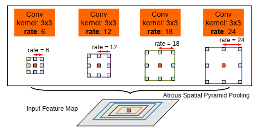

###三、效果

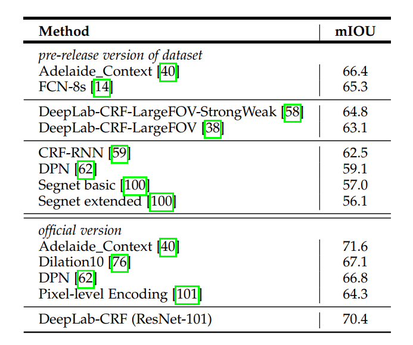

##DeepLab V3

###一、面临问题

使用空洞卷积会带来：

* 随着rate的增大，一次空洞卷积覆盖到的有效像素（特征层本身的像素，相应的补零像素为非有效像素）会逐渐减小到1，也就是说太大的 padding 和 dilation 带来了非中心采样点位置过于偏僻，要么太远，要么延申到 padding 补0区域，这些像素采样是没有意义的
* 这就与我们扩展感受野，获取更大范围的特征的初衷相背离了

###二、解决方案

####1. 改进 ASPP 拓展网络的宽度

措施：

* 使用1x1的卷积：即当rate增大以后3x3卷积的退化形式，替代3x3卷积，减少参数个数
* 增加image pooling：即全局池化，来补充全局特征。具体做法是对每一个通道的像素取平均，之后再上采样到原来的分辨率
* 在空洞卷积之后使用 Batch Normalization

改进结果：

####2. 使用空洞卷积加深网络

在级联结构的空洞卷积中，加入ResNet的striding结构，从而更容易地在更深的块中捕获远程信息

####3. 舍弃CRF

###三、效果

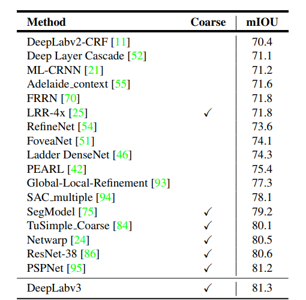

