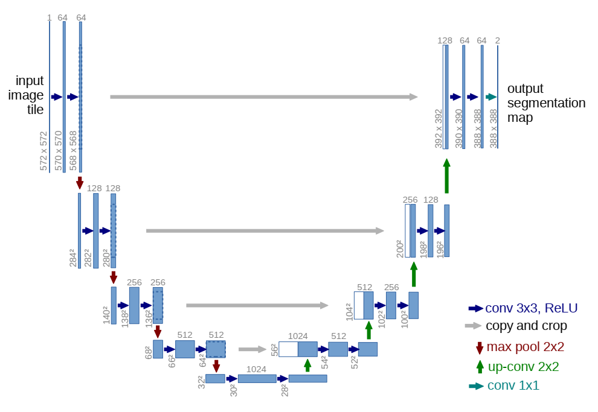
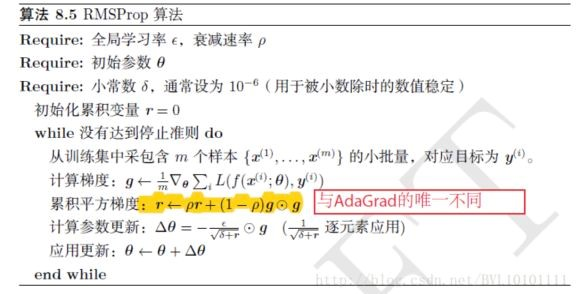

#论文阅读：《U-Net- Convolutional Networks for Biomedical Image Segmentation》

##一、摘要 Abstract

一种网络和训练策略，依赖于强大的数据增强功能，更有效地使用已标注样本。

收缩路径：捕获上下文
a contracting path to capture context 
扩展路径：精确定位 
a symmetric expanding path that enables precise localization. 

很少的图像，端到端训练 trained end-to-end
（端到端训练：将最原始的数据直接放入神经网络中处理，最后获得一个训练结果。其中省去了人工对数据的预处理和人工对结果的后续处理。）

##二、引言 Introduction

Ciresan等人在滑动窗口设置中训练了一个网络
通过提供像素周围的局部区域（补丁patch） -> 预测 -> 每个像素的类别标签
以此作为网络输入

#####缺点：

1. 非常慢，每个patch都需要重新运行网络，且每个patch间存在重叠，造成大量冗余；
2. 必须在精确定位（**localization accuracy**）和材料使用（**use of context**）之间做出权衡

较大的补丁 -> 更多的最大池层 -> 降低定位精度
较小的补丁 -> 只允许看到很少的上下文。

#####最近成果：

构造了一个分类器（classifier），考虑到多个层的特征
使得同时实现良好的定位（localization）和材料使用（use of context）成为可能

> Seyedhosseini, M., Sajjadi, M., Tasdizen, T.: Image segmentation with cascaded hierarchical models and logistic disjunctive normal networks. In: Computer Vision(ICCV), 2013 IEEE International Conference on. pp. 2168{2175 (2013)


图片可以定位 localize
基于补丁 patch 的训练数据远大于训练图像的数量

结构基础：全卷积网络（**fully convolutional network**）
改进：用非常少的训练图像，达到更精确的分割的效果
very few training images and yields more precise segmentations


#####主要思想：

用连续层（successive layers）来增补收缩网络（或下采样网络contracting network）

其中，池化操作（pooling operators）被下采样操作（upsampling operators）代替

作用：提高输出的分辨率

> The main idea in [9] is to supplement a usual contracting network by
successive layers, where pooling operators are replaced by upsampling operators.

收缩路径的高分辨率特征（high resolution features）需要与上采样输出（upsampled output）结合，从而定位

> In order to localize, high resolution features from the contracting path are combined with the upsampled output.

一个连续的卷积层（successive convolution layer）据此更精确地输出

重要改动：在上采样部分增加大量特征通道（feature channels），使得上下文信息（context information）传播到更高分辨率的层中

扩张路径与收缩路径存在对称 -> 形成U型网络（u-shaped architecture）

#####U-net策略：

1. 没有全连接层（fully connected layers），只使用每层卷积的有效部分
2. 分割图只包含像素 -> 输入图像可以使用完整的上下文（full context）
3. 重叠平铺策略（overlap-tile strategy）see Figure 2


> The network does not have any fully connected layers and only uses the valid part of each convolution, i.e., the segmentation map only contains the pixels, for which the full context is available in the input image.

效果：
1. 重叠平铺策略 -> 无缝分割任意大的图像（图 2）
2. 镜像输入图像 -> 推断缺失的上下文，预测边缘像素
3. 适用于大图像，分辨率不受GPU内存限制

我们的任务：数据增强（弹性形变 elastic deformations）

<!-- #region 无监督特征学习-->
<details><summary>无监督特征学习 unsupervised feature learning</summary>
<td style="WORD-BREAK: break-all; WORD-WRAP: break-word">

1. 自编码器 Autoencoder：
    编码 encoder：压缩输入图片大小，达到提取特征的目的，压缩得到图片x
    解码 decoder：从编码器的输出（图片x）中恢复图片
    在编码器的输入和解码器的输出之间存在预测误差，进行反向传递以训练自编码器
    需要让输入和输出趋近，保证提取出的特征x是图像的特征
    作用：
    在图片信息的学习中可以通过这样的方式浓缩特征（利用编码器的输出x），减小数据量，优化训练
    自编码器是一种无监督学习，不需要已标注的样本即可开始训练

* 条件：大量未标注的数据和少量已标注数据

* 流程：
（1）特征学习
    -> 输入原始数据集x（包含少量标注）
    -> 在无标注的数据集上训练稀疏自编码器（L1的正则限制，L1主要是约束每一层中的节点中大部分都要为0，只有少数不为0）
        产生隐藏特征层a
    -> 将原始数据x和特征a组合（用a替代x 或 将a和x合并）
        产生测试样本(x, a)
（2）数据预处理
在特征学习阶段可以进行数据的预处理，比如均值标准化（mean normalization）、主成分分析（PCA）等，需要将这些处理结果保存下来，供后续训练集和测试集使用
（3）送入分类器

</td></details>&nbsp;

<!-- #endregion -->

#####细胞分割任务的难题：
分离同类的接触对象（the separation of touching objects of the same class）
对应的建议：在损失函数中，赋予接触的细胞间的背景以更大的权重

>we propose the use of a weighted loss, where the separating background labels between touching cells obtain a large weight in the loss function.


##三、网络架构 Network Architecture

###（一）基本处理单元



####1. 向右操作：连续两个卷积和ReLU激活

``` python {.line-numbers}
%概念代码
%width * height
nn.Conv2d(in_channels, out_channels, kernel_size=3, stride=1, padding=0)
nn.ReLU()
%(width - 2) * (height - 2)
nn.Conv2d(in_channels, out_channels, kernel_size=3, stride=1, padding=0)
nn.ReLU()
%(width - 4) * (height - 4)
%每个向右操作后，尺寸变为 (width - 4) * (height - 4)
```

####2. 向下操作：最大池化

``` python {.line-numbers}
%概念代码
%width * height
nn.MaxPool2d(kernel_size=2, stride=2)
%(width / 2) * (height / 2)
%每个向下操作后，尺寸变为 (width / 2) * (height / 2)
%综合一个向右和向下组合，尺寸变为 ((width - 4) / 2) * ((height - 4) / 2)
```


####3. 向上操作：

``` python {.line-numbers}
%概念代码
%width * height
nn.Upsample(scale_factor=2, mode='bilinear', align_corners=True)
%或
nn.ConvTranspose2d(in_channels, in_channels // 2, kernel_size=2, stride=2)
%(width * 2) * (height * 2)
%每个向上操作后，尺寸变为 (width * 2) * (height * 2)
%综合一个向右和向下组合，尺寸变为 ((width - 4) * 2) * ((height - 4) * 2)
```


####零件：双卷积 DoubleConv 单元

将`Conv2d -> BatchNorm2d -> ReLU`重复两次，对应**向右的一行操作**
`BatchNorm2d`作用：强行将数据拉回到均值为0，方差为1的正太分布上，一方面使得数据分布一致，另一方面避免梯度消失
``` python {.line-numbers}
class DoubleConv(nn.Module):
    """(convolution => [BN] => ReLU) * 2"""

    def __init__(self, in_channels, out_channels, mid_channels=None):
        super().__init__()
        if not mid_channels:
            mid_channels = out_channels
            self.double_conv = nn.Sequential(
            nn.Conv2d(in_channels, mid_channels, kernel_size=3, padding=1, bias=False),
            nn.BatchNorm2d(mid_channels),
            nn.ReLU(inplace=True),
            nn.Conv2d(mid_channels, out_channels, kernel_size=3, padding=1, bias=False),
            nn.BatchNorm2d(out_channels),
            nn.ReLU(inplace=True)
            )

    def forward(self, x):
        return self.double_conv(x)
```

####封装：左侧收缩路径 Down 单元

`MaxPool2d -> DoubleConv`池化后两次卷积

``` python {.line-numbers}
class Down(nn.Module):
"""Downscaling with maxpool then double conv"""

def __init__(self, in_channels, out_channels):
    super().__init__()
    self.maxpool_conv = nn.Sequential(
         nn.MaxPool2d(2),
         DoubleConv(in_channels, out_channels)
     )

 def forward(self, x):
     return self.maxpool_conv(x)
```

####封装：右侧扩张路径 Up 单元

`self.up`变换：
* 当`bilinear = True`时，采用上采样`Upsample`，`scale_factor = 2`表示输出的尺寸扩张为输入尺寸的两倍
* 当`bilinear = False`时，采用反卷积`ConvTranspose2d`，此处设置输出通道数为`in_channels // 2`，即通道数减半
* 初步看代码，其中训练里使用的均为后者

与本层扩张路径同层的收缩路径输出为x2，上层对本层的输入x1尺寸必然小于x2，需要在第2和第3维度上通过`F.pad`函数在两侧补0扩展，使得新的x1与x2大小一致

在维度1（channel维度）上，用`torch.cat`将扩展后的x1和x2拼接，使得其通道数加倍，并参与到后续的双卷积中

`self.up上采样/反卷积 -> torch.cat增加通道 -> DoubleConv`
``` python {.line-numbers}
class Up(nn.Module):
"""Upscaling then double conv"""

def __init__(self, in_channels, out_channels, bilinear=True):
    super().__init__()
    # if bilinear, use the normal convolutions to reduce the number of channels
    if bilinear:
        self.up = nn.Upsample(scale_factor=2, mode='bilinear', align_corners=True)
        self.conv = DoubleConv(in_channels, out_channels, in_channels // 2)
    else:
        self.up = nn.ConvTranspose2d(in_channels, in_channels // 2, kernel_size=2, stride=2)
        self.conv = DoubleConv(in_channels, out_channels)

def forward(self, x1, x2):
    x1 = self.up(x1)
    # input is CHW
    diffY = x2.size()[2] - x1.size()[2]
    diffX = x2.size()[3] - x1.size()[3]
    x1 = F.pad(x1, [diffX // 2, diffX - diffX // 2,
                    diffY // 2, diffY - diffY // 2])
    # if you have padding issues, see
    # https://github.com/HaiyongJiang/U-Net-Pytorch-Unstructured-Buggy/commit/0e854509c2cea854e247a9c615f175f76fbb2e3a
    # https://github.com/xiaopeng-liao/Pytorch-UNet/commit/8ebac70e633bac59fc22bb5195e513d5832fb3bd
    x = torch.cat([x2, x1], dim=1)
    return self.conv(x)

```

<!-- #region torch.nn.functional.pad-->
<details><summary>torch.nn.functional.pad</summary>
<td style="WORD-BREAK: break-all; WORD-WRAP: break-word">

``` python {.line-numbers}
torch.nn.functional.pad(input, pad, mode, value ) 
Args:
	"""
	input：四维或者五维的tensor Variabe
	pad：不同Tensor的填充方式
		1.四维Tensor：传入四元素tuple(pad_l, pad_r, pad_t, pad_b)，
		指的是（左填充，右填充，上填充，下填充），其数值代表填充次数
		2.六维Tensor：传入六元素tuple(pleft, pright, ptop, pbottom, pfront, pback)，
		指的是（左填充，右填充，上填充，下填充，前填充，后填充），其数值代表填充次数
	mode： ’constant‘, ‘reflect’ or ‘replicate’三种模式，指的是常量，反射，复制三种模式
	value：填充的数值，在"contant"模式下默认填充0，mode="reflect" or "replicate"时没有			
		value参数
		
	"""
```

</td></details>&nbsp;

<!-- #endregion -->

####零件：输出卷积 OutConv 单元

一个卷积核尺寸为1的卷积，用于将已有的64个channel映射到需要的两个channel

``` python {.line-numbers}
class OutConv(nn.Module):
    def __init__(self, in_channels, out_channels):
        super(OutConv, self).__init__()
        self.conv = nn.Conv2d(in_channels, out_channels, kernel_size=1)

    def forward(self, x):
        return self.conv(x)
```

###（二）总体结构
左侧：收缩路径 contracting path
`DoubleConv -> Down -> Down -> Down -> Down ->`
右侧：扩张路径 expansive path
`-> Up -> Up -> Up -> Up -> OutConv`

``` python {.line-numbers}
class UNet(nn.Module):
    def __init__(self, n_channels, n_classes, bilinear=False):
        super(UNet, self).__init__()
        self.n_channels = n_channels
        self.n_classes = n_classes
        self.bilinear = bilinear
        factor = 2 if bilinear else 1

        self.inc = DoubleConv(n_channels, 64)
        self.down1 = Down(64, 128)
        self.down2 = Down(128, 256)
        self.down3 = Down(256, 512)
        self.down4 = Down(512, 1024 // factor)
        self.up1 = Up(1024, 512 // factor, bilinear)
        self.up2 = Up(512, 256 // factor, bilinear)
        self.up3 = Up(256, 128 // factor, bilinear)
        self.up4 = Up(128, 64, bilinear)
        self.outc = OutConv(64, n_classes)

    def forward(self, x):
        x1 = self.inc(x)
        x2 = self.down1(x1)
        x3 = self.down2(x2)
        x4 = self.down3(x3)
        x5 = self.down4(x4)
        x = self.up1(x5, x4)
        x = self.up2(x, x3)
        x = self.up3(x, x2)
        x = self.up4(x, x1)
        logits = self.outc(x)
        return logits
```


##四、训练 train

###1. 训练

优化算法：随机梯度下降 `stochastic gradient descent(SGD)`

批次大小：每个批次单张图片，每张图片可以取很大，以此减小开销并最大利用GPU内存

动量：高动量 `momentum = 0.99`，以便用大量之前使用过的样本来确定当前样本的优化步骤更新

能量函数：最终特征图上的像素级 soft-max 结合交叉熵损失函数

<!-- #region 能量函数E-->
<details><summary>能量函数E</summary>
<td style="WORD-BREAK: break-all; WORD-WRAP: break-word">

`soft-max`：

$$p_k = \frac{exp(a_k(x))}{\sum_{k'=1}^K exp(a_{k'}(x))}$$

`cross entrophy`:

$$E = \sum_{x\in\Omega} \omega(x)log(p_{l(x)}(x))$$

将`soft-max`带入`cross entrophy`中，得到完整的能量函数E

参数含义：
* $l(x)$：每个像素的正确标注
* $\omega$：引入的权重图，用于在训练中赋予一些像素更强的重要性
</td></details>

<!-- #endregion -->

<!-- #region ground truth-->
<details><summary>ground truth的含义</summary>
<td style="WORD-BREAK: break-all; WORD-WRAP: break-word">

在有监督学习中，数据是有标注的，以(x, t)的形式出现，其中x是输入数据，t是标注.正确的t标注是`ground truth`， 错误的标记则不是。

</td></details>&nbsp;

<!-- #endregion -->

预计算每个ground truth分割的权重图（weight map）
 -> 补偿训练数据集中某个类别的像素的不同频率
 -> 强制网络学习在细胞之间引入的小分离边界（small separation borders）

<!-- #region 权重图-->
<details><summary>权重图 weight map</summary>
<td style="WORD-BREAK: break-all; WORD-WRAP: break-word">

根据形态学计算（morphological operations），权重图（weight map）的计算方式：

$$\omega(x) = \omega_c(x) + \omega_0 \cdot exp(-\frac{(d_1(x)+d_2(x))^2}{2\sigma^2})$$

参数含义：
* $\omega_c$：用来平衡class frequencies的权重图
* $d_1$：到最近的细胞边界的距离
* $d_2$：到第二近的细胞边界的距离
* $\omega_0$：
* $\sigma$：

本实验中设定$\omega_0=10$和$\sigma=5 pixels$

</td></details>&nbsp;

<!-- #endregion -->

初始权重调整目标：理想情况下，使得网络中的每个特征图（feature map）都具有近似单位方差（unit variance）。

在U-net中，初始权重可以从一个**标准差为$\sqrt{N/2}$的高斯分布**中提取（$N$是神经元的输入节点数，比如，在64层的数据上做卷积核3*3的卷积，则$N=3*3*64=576$）

<!-- ？？？？怎么提取？？？有代码印证吗？？ -->

###2. 数据增强 Data Augmentation

* 在3x3的网格上用`随机位移向量（random displacement vectors）`生成平滑形变（smooth deformations），其中随机位移是从**标准差10 pixels的高斯分布**中提取出来的
* 采用`双三次插值（bicubic interpolation）`计算每个像素的位移
* 使用`Drop-out层`在收缩路径的末端对数据增强再进一步加强

> We generate smooth deformations using random displacement vectors on a coarse 3 by 3 grid. The displacements are sampled from a Gaussian distribution with 10 pixels standard deviation. Per-pixel displacements are then computed using bicubic interpolation. Drop-out layers at the end of the contracting path perform further implicit data augmentation.

<!-- ？？？？双三插值法体现在哪？平滑形变在哪？去找代码 -->

##五、阅读代码

###（一）数据集建立

``` python {.line-numbers}
# 1. Create dataset
try:
    dataset = CarvanaDataset(dir_img, dir_mask, img_scale)  # 创建dataset
except (AssertionError, RuntimeError):
    dataset = BasicDataset(dir_img, dir_mask, img_scale)

# 2. Split into train / validation partitions
n_val = int(len(dataset) * val_percent)  # n_val: 验证数据集大小
n_train = len(dataset) - n_val  # n_train: 训练数据集大小
train_set, val_set = random_split(dataset, [n_train, n_val], generator=torch.Generator().manual_seed(0))
# 将训练集和验证集按照9:1的比例随机分开

# 3. Create data loaders
loader_args = dict(batch_size=batch_size, num_workers=4, pin_memory=True)
# loader_args: dataloader载入参数
train_loader = DataLoader(train_set, shuffle=True, **loader_args)
# train_loader: 训练集dataloader，打乱顺序
val_loader = DataLoader(val_set, shuffle=False, drop_last=True, **loader_args)
# val_loader: 验证集dataloader，保持原顺序，断尾
```

###（二）模型设计

``` python {.line-numbers}
optimizer = optim.RMSprop(net.parameters(), lr=learning_rate, weight_decay=1e-8, momentum=0.9)
scheduler = optim.lr_scheduler.ReduceLROnPlateau(optimizer, 'max', patience=2)  # goal: maximize Dice score
grad_scaler = torch.cuda.amp.GradScaler(enabled=amp)
criterion = nn.CrossEntropyLoss()
global_step = 0
```

####1. 优化算法 RMSprop

RMSprop为从AdaGrad上改进而来


AdaGrad算法每次直接累计梯度的平方，以此对参数$\theta$进行更新，这样的更新是利用了之前历史上经历的所有梯度值，并对所有梯度值不加以区别，一视同仁的影响参数的更新



RMSprop算法在AdaGrad算法的基础上增加了**衰减速率**$\rho$这样以减小历史梯度对于参数更新的影响程度，即越新的梯度对参数的影响越大

作用：
在参数空间更为平缓的方向，会取得更大的进步（因为平缓，所以历史梯度平方和较小，对应学习下降的幅度较小），并且能够使得陡峭的方向变得平缓，从而**加快训练速度**。

模型参数：
* `weight_decay=1e-8`：衰减速率
* `momentum=0.9`：通用的冲量方法

####2. 学习率调整算法 ReduceLROnPlateau

该方法提供了一些基于训练过程中的某些测量值对学习率进行动态的下降

模型参数：
* `mode='max'`：'min'模式检测metric是否不再减小，'max'模式检测metric是否不再增大
* `patience=2`：不再减小（或增大）的累计次数

####3. 梯度缩放算法 GradScaler
如果特定op的正向传递具有浮点16输入，则该op的反向传递将产生浮点16梯度。具有小幅度的梯度值可能无法在浮点16中表示。这些值将刷新为零（“下溢”），因此相应参数的更新将丢失。
为了防止下溢，"梯度缩放"将网络的损失（es）乘以比例因子，并调用缩放损失（es）的反向传递。然后，通过网络向后流动的梯度将按相同的系数缩放。换句话说，梯度值的幅度更大，因此它们不会刷新为零。
在优化器更新参数之前，每个参数的梯度（.grad属性）都应取消缩放，因此缩放因子不会干扰学习速率。
<!-- 网上复制的，并不理解 -->

####4. 交叉熵损失函数 CrossEntropyLoss

###（三）训练循环

``` python {.line-numbers}
for epoch in range(epochs):
    net.train()
    epoch_loss = 0
    with tqdm(total=n_train, desc=f'Epoch {epoch + 1}/{epochs}', unit='img') as pbar:
        for batch in train_loader:
            images = batch['image']
            true_masks = batch['mask']

            assert images.shape[1] == net.n_channels, \
                f'Network has been defined with {net.n_channels} input channels, ' \
                f'but loaded images have {images.shape[1]} channels. Please check that ' \
                'the images are loaded correctly.'

            images = images.to(device=device, dtype=torch.float32)
            true_masks = true_masks.to(device=device, dtype=torch.long)

            with torch.cuda.amp.autocast(enabled=amp):
                masks_pred = net(images)
                loss = criterion(masks_pred, true_masks) \
                        + dice_loss(F.softmax(masks_pred, dim=1).float(),
                                    F.one_hot(true_masks, net.n_classes).permute(0, 3, 1, 2).float(),
                                    multiclass=True)

            optimizer.zero_grad(set_to_none=True)
            grad_scaler.scale(loss).backward()
            grad_scaler.step(optimizer)
            grad_scaler.update()

            pbar.update(images.shape[0])
            global_step += 1
            epoch_loss += loss.item()
            experiment.log({
                'train loss': loss.item(),
                'step': global_step,
                'epoch': epoch
            })
            pbar.set_postfix(**{'loss (batch)': loss.item()})

            # Evaluation round
            division_step = (n_train // (10 * batch_size))
            if division_step > 0:
                if global_step % division_step == 0:
                    histograms = {}
                    for tag, value in net.named_parameters():
                        tag = tag.replace('/', '.')
                        histograms['Weights/' + tag] = wandb.Histogram(value.data.cpu())
                        histograms['Gradients/' + tag] = wandb.Histogram(value.grad.data.cpu())

                    val_score = evaluate(net, val_loader, device)
                    scheduler.step(val_score)

                    logging.info('Validation Dice score: {}'.format(val_score))
                    experiment.log({
                        'learning rate': optimizer.param_groups[0]['lr'],
                        'validation Dice': val_score,
                        'images': wandb.Image(images[0].cpu()),
                        'masks': {
                            'true': wandb.Image(true_masks[0].float().cpu()),
                            'pred': wandb.Image(torch.softmax(masks_pred, dim=1).argmax(dim=1)[0].float().cpu()),
                        },
                        'step': global_step,
                        'epoch': epoch,
                        **histograms
                    })

    if save_checkpoint:
        Path(dir_checkpoint).mkdir(parents=True, exist_ok=True)
        torch.save(net.state_dict(), str(dir_checkpoint / 'checkpoint_epoch{}.pth'.format(epoch + 1)))
        logging.info(f'Checkpoint {epoch + 1} saved!')
```

####1. 自动混合精度 autocast和GradScaler

``` python {.line-numbers}
grad_scaler = torch.cuda.amp.GradScaler(enabled=amp)
 # 在训练最开始之前实例化一个GradScaler对象

...

 # 前向过程(model + loss)开启 autocast
with torch.cuda.amp.autocast(enabled=amp):
    masks_pred = net(images)
    loss = criterion(masks_pred, true_masks) \
            + dice_loss(F.softmax(masks_pred, dim=1).float(),
                        F.one_hot(true_masks, net.n_classes).permute(0, 3, 1, 2).float(),
                        multiclass=True)

optimizer.zero_grad(set_to_none=True)
grad_scaler.scale(loss).backward()
 # Scales loss 梯度放大
grad_scaler.step(optimizer)
grad_scaler.update()
```
目的：将不同精度的tensor混合使用，以达到减少计算量、提高训练速度的目的

常用的tensor类型有`torch.FloatTensor`和`torch.HalfTensor`，这两者在不同的环境下各有优势，自动混合精度将这两者的优势结合，加快训练过程

autocast上下文应该**只包含网络的前向过程**（包括loss的计算），不需要包含反向传播，因为Back Propagation神经网络的op会使用和前向op相同的类型

用了autocast操作之后就不能像传统的训练写法，要用新的方法更新使用优化器

####2. 训练过程中的评估 Evaluation round

每个训练循环后，`global_step += 1`，误差累积`epoch_loss += loss.item()`

首先确定评估的频率：
``` python {.line-numbers}
division_step = (n_train // (10 * batch_size))
if division_step > 0:
    if global_step % division_step == 0:
```
即，如果总样本有`n_train`个，一个batch中有`batch_size`个，一共有`batch_num = n_train / batch_size`个batch，那么在每隔`batch_num / 10`个batch就进行一次评估，大约进行10次

评估过程：
``` python {.line-numbers}
val_score = evaluate(net, val_loader, device)
scheduler.step(val_score)
```


##六、问题
1. 在训练中，U-net倾向于将每个批次的大小batch_size设置的尽可能小，甚至每张图片一个批次`batch_size: int = 1`，而在代码里，对于双重卷积DoubleConv的处理中，在每个卷积Conv2d后都用了批次归一化`nn.BatchNorm2d()`。但是据我在李宏毅老师的课上的了解，这个操作是将每个批次的所有样本做以归一化来防止梯度消失，这样的方法对于批次大小为1的训练方式有用吗？换成层归一化`nn.LayerNorm()`会变得更好吗？

2. 当我回顾文章introduction部分讲到的 关于通过每一个像素周围区域patch预测该像素的标签 这一块的时候，我没办法建立起来这部分和代码之间的关系，那么这些内容仅是文章的思想过程还是说它体现在了一些比较深层的地方？

3. 对于“细胞分割任务的难题”，即分离接触的细胞来说，文章给出的建议是**赋予接触的细胞间的背景以更大的权重**，这个过程在代码中是怎么做到的呢？