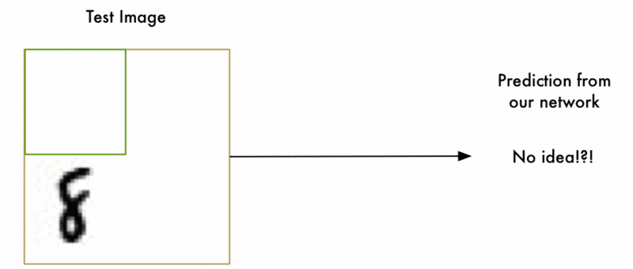
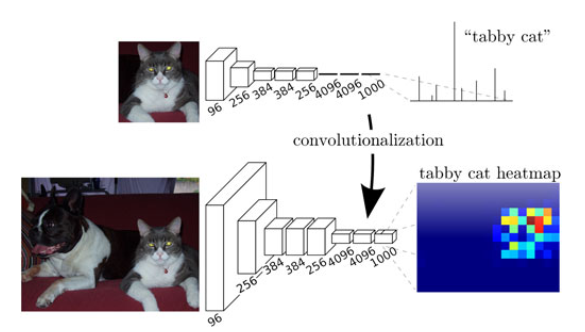
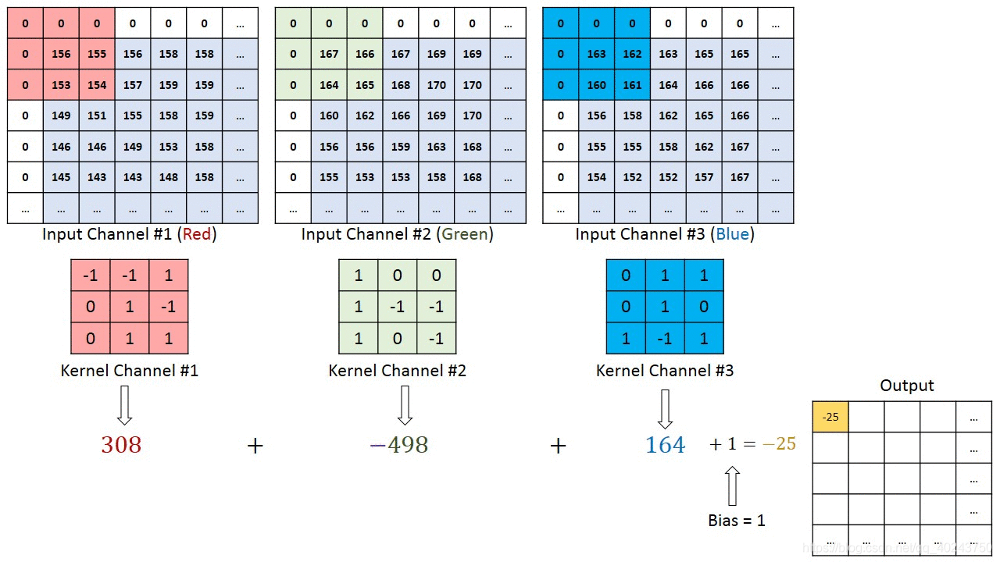
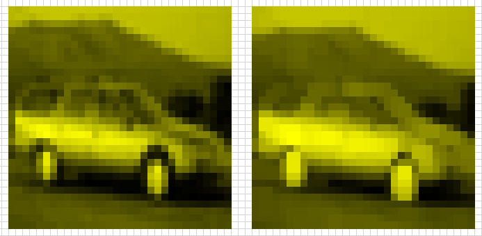
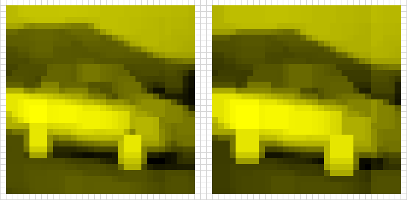
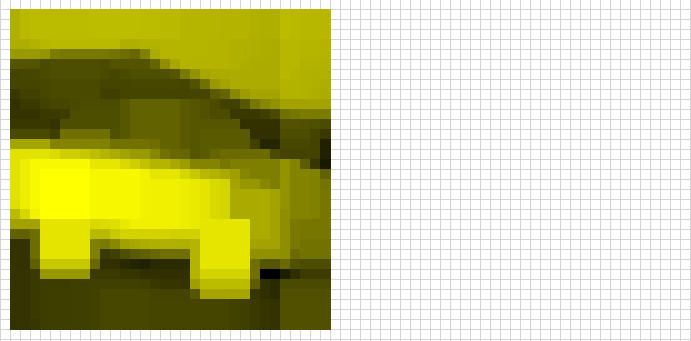
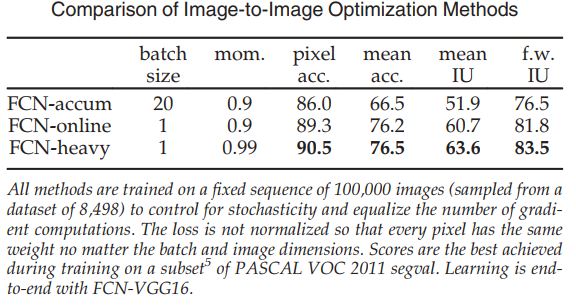
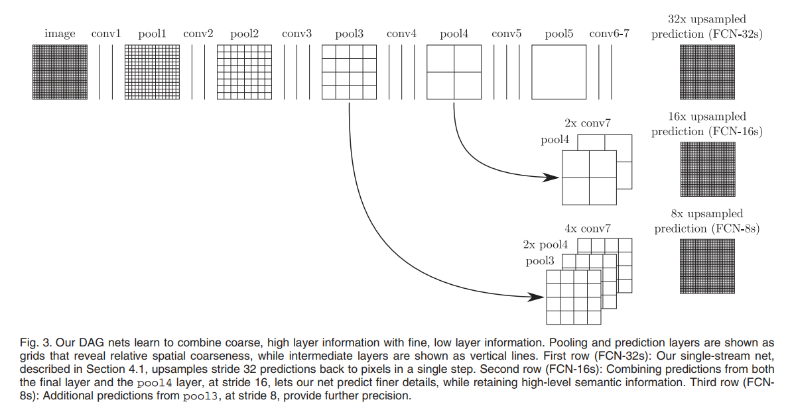

##一、引言 Introduction

利用卷积神经网络进行的语义分割可以对每一个像素都进行标注，每个像素都有被划入的区域和归入的类别，但是此法存在缺陷

<!-- 原来的方法是什么？pixelwise？ -->
原来的方法在渐进性和绝对性（asymptotically and absolutely）上都是有效的

patchwise的方法缺少全卷积的效率

本文的方法：
* 不采用复杂的预处理和后处理（pre- and post-processing）
* 将先贤的分类器成果转化成密集预测（dense prediction），方法是将分类网络重新解释为完全卷积（fully convolutional）并从其学习表示中进行微调。

> Our model transfers recent success in classification [1], [2], [3] to dense prediction by reinterpreting classification nets as fully convolutional and fine-tuning from their learned representations. 

语义分割面临内在平衡：
* 全局信息解决“是什么”（global information resolves what）
* 局部信息解决“在哪里”（local information resolves where）

即如何联系**局部的位置**和**全局的语义**
如何使**局部的决策**尊重**全局的结构**
目前尚不清楚用于图像分类的深度网络是否会产生足以进行准确的像素识别的表示
> It is not immediately clear that deep networks for image classification yield representations sufficient for accurate, pixelwise recognition.

##二、相关工作 Related Work

本网络改编自经典的LeNet

<!-- #region 滑动窗口检测 sliding window detection-->

滑动窗口检测

<td style="WORD-BREAK: break-all; WORD-WRAP: break-word">

用不同大小的图，在图片上从左到右，从上到下的搜索，找到目标
因为目标的大小不一样，所以很多时候需要很多个尺寸的框来搜索
基本属于穷举法，找到适合的为止

基本思路：

1. 训练分类器：比如用SVM或者CNN训练一个分类器，输入一个固定大小图片，输出类别概率
   
2. 切分窗口：用很多不同大小的窗口进行移动，把图片分成很多个小窗口，然后把每个窗口喂给分类器，保留有较高的分类分数的窗口，这些窗口有可能有目标物体，如此处理完所有窗口
   
3. 筛选窗口：窗口中会出现很多重叠，使用**非极大抑制**，留下合适的框，丢弃其他的框
   
4. 精确：得到各种窗口和对应的类别，此时可以拿标注的数据框来进行回归，让窗口更加精确点，不回归也可以，但可能不是很精确

https://blog.csdn.net/wangwei19871103/article/details/97514825

</td>
&nbsp;

<!-- #endregion -->

<!-- #region 密集预测 dense prediction-->

密集预测 dense prediction

<td style="WORD-BREAK: break-all; WORD-WRAP: break-word">

标注出图像中**每个像素点**的对象类别，要求不但给出具体目标的**位置**，还要描绘物体的**边界**，如图像分割、语义分割、边缘检测等等。

基于深度学习的做法：

* 基于图像分块：利用像素、超像素块周围小邻域进行独立的分类。（在分类网络中使用全连接层，固定图像块尺寸）

* 基于全卷积网络：对图像进行 pixel-to-pixel 的预测，可以得到任意大小的图像分割结果，而且不需要对每个图像块进行分类，速度快。重要的两点：卷积层上采样、skip connection结构

由于全卷积网络的各种优点，之后各种改进模型被提出来：

* u-net 结构：对图像进行**编码之后解码**，在编码时同样是**卷积+下采样**的结构，为了恢复图像的细节空间信息，在编码与解码过程中加入 **shortcut connection 结构**。

* segNet 结构：也是一种**编码解码结构**，无shortcut connection结构，（将最大池化索引maxpooling indices 转移到解码器）解码时，不像FCN中进行upsampling 的反卷积，而是**复制了最大池化索引**，使得segNet 比FCN节省内存。（但是准确率不高）

* dialated convolutions 结构：此结构**不需要池化层**，使用**空洞卷积**使得感受野指数增长，但空间维度不下降。3x3的卷积核对应5x5的视觉野。但是空洞卷积的缺点是：得到的都是高分辨率的特征图，**计算量较大**。

</td>
&nbsp;

<!-- #endregion -->

使用图片分类作为监督预训练（supervised pre-training），并通过完全卷积微调

<!-- 这部分没怎么看懂，跳过 -->

##三、Fully Convolutional Networks 卷积网络

卷积网络中的每一层输出都是一个大小为`(height, weight, dimension)`的三维数组，dimension是特征或通道维度

第一层是图像，像素大小为`(height, weight)`，通道数为`dimension`。 

较高层中的位置对应于它们路径连接到的图像中的位置，称为它们的**感受野（receptive fields）**。 

本质：平移不变

基本组件：卷积、池化、激活函数，这些组件在局部的输入上运行，且仅有空间依赖

（这里对卷积网络的描述就是在pytorch中常用的卷积操作，不做赘述）

###（一）Adapting Classifiers for Dense Prediction
<!-- 为密集预测调整分类器 -->

传统的网络（LeNet、AlexNet）都是用**全连接层**作为最后的几层来产生**非空间输出**（non-spatial outputs，也可以理解为类别的输出），这样使用全连接层等同于**丢弃空间坐标**

而全连接层可以被视为**卷积核尺寸覆盖整个区域的卷积**，则这样更改可以将网络转换为**完全卷积网络**

全连接层 -> 全尺寸的卷积层

图中的**热图**（heatmap）即是**粗糙输出**（coarse output）

####改进优势：

* 每个卷积计算块（patch）间的重叠部分计算量可以**摊销**（amortize），这导致卷积比全连接**计算速度提高**了约5倍
* 每个输出单元都可用 ground truth
* 前向和后向传递都很简单，并且都利用了卷积的固有计算效率（和积极优化）

####关于下采样（subsampling）

全卷积网络为任何尺寸的输入数据产生输出图像，输出通常会因下采样而**维度减少**

<!-- ？？？为什么下采样会减少维度？不是减少尺寸吗？？？ -->

分类网络通过下采样来保证过滤器（filter）尺寸合适，且计算量处于合理范围

下采样会粗化（coarsen）全卷积网络的输出，使输出的尺寸减小，减小量为**感受野的步长**（像素单位）

> While our reinterpretation of classification nets as fully convolutional yields output maps for inputs of any size, the output dimensions are typically reduced by subsampling. The classification nets subsample to keep filters small and computational requirements reasonable. This coarsens the output of a fully convolutional version of these nets, reducing it from the size of the input by a factor equal to the pixel stride of the receptive fields of the output units.

<!-- #region 过滤器 filter-->

过滤器 filter

<td style="WORD-BREAK: break-all; WORD-WRAP: break-word">

过滤器 filter 和卷积核 kernel 为差不多的概念，filter 为多维卷积核是卷积核的一个集合，比卷积核多出 channel 一个维度

在下图中，input是3通道，卷积核个数为3个，卷积输出通道为3个，output通道为1个

从微观上看，是一个`n*w*3`的 input 和3个`3*3`的卷积核进行了运算，得到了3个输出
从宏观上看，是一个`n*w*3`的 input 和1个`3*3*3`的滤波器进行了运算，得到1个输出

`一套卷积核 = 一个过滤器`

`输入每个channel与卷积核运算，再将每个channel的运算结果相加 <=> 等价于输入与过滤器运算`

一个过滤器产生一个通道的输出，卷积核个数可以理解为过滤器个数，即有：
`卷积核个数 = 过滤器个数 = 输出通道数`

</td>
&nbsp;

<!-- #endregion -->

###（二）Shift-and-Stitch Is Filter Dilation
<!--输入移位和输出交错是过滤器的扩张 -->

输入移位和输出交错是一种**可以在没有插值的情况下从粗糙的输出中产生密集预测**的方法

密集预测（dense prediction）：标注出图像中**每个像素点的对象类别**，要求不但给出具体目标的位置，还要描绘物体的边界，如图像分割、语义分割、边缘检测等等

####具体方法：
https://blog.csdn.net/qinghuaci666/article/details/80833866
但是这篇博客举的例子非常差劲，这样的示例输入和输出相同，完全没有参考意义

####个人理解：

#####流程：

* 设定因子$f$，输入图像矩阵（以一个通道的二维图像为例）
* 输入移位，将输入**向左和上移动**，最多移动$f-1$个像素，遍历所有移动的结果，这样的移动结果作为新的输入，一共生成$f^2$个**新的输入**
* 对新的输入在固定的位置进行**maxpooling**操作（需要在边缘padding），得到一共$f^2$个**输出**
* 输出交错，将所有输出排除掉重复的部分，进行行列间的交错排列，达到效果为：输出矩阵尺寸与输入尺寸相等，输出的每一个像素为**以该像素为中心的maxpooling的值**

#####存疑：

这样的操作按照个人理解，完全可以将“以该像素为中心的maxpooling的值”作为输出的目标，何必用这么复杂的方法？

我认为原因可能是对于计算机来说计算相对简单

#####效果验证：

我把一张CIFAR10数据集里的高糊图片先做灰度处理，生成一张32x32的单通道灰度图片，再放到excel里作为矩阵处理，把每个像素按照对应位置的maxpooling的值计算出来，组成新的图片，分别做了maxpooling卷积核尺寸为2、3、4、5的生成结果：

原图、`kernelsize = 2`

`kernelsize = 3`、`kernelsize = 4`

`kernelsize = 5`

可以发现确实是进行了特征提取，而且没有使用插值算法，但是我总感觉这样的作法有画蛇添足的成分，不知道我想的对不对

###（三）Upsampling Is (Fractionally Strided) Convolution
<!-- 上采样是后向步幅的卷积 -->

另一种连接粗糙输出到密集预测的方法就是**插值法**。

某种意义上，使用因子$f$的上采样是输入步幅为$1/f$的卷积。因此上采样称为输出步幅为f的**后向卷积**（或称为**反卷积**）。

反卷积的filter不是固定的（例如双线性上采样），**可以参与训练**

一组**反卷积层**和**激活函数**的堆叠甚至可以学习**非线性上采样**

###（四）Patchwise Training Is Loss Sampling
<!-- 块级别 Patchwise 训练是有损采样 -->
<!-- #region 术语-->

术语

<td style="WORD-BREAK: break-all; WORD-WRAP: break-word">

pixelwise 像素级别的（一个像素一次）
patchwise 块级别的（一个块一次）
imagewise 图片级别的（一个图片一次）
patch 块 介于一个像素和一张图之间的尺寸

</td>
&nbsp;

<!-- #endregion -->

全卷积训练比patch的均匀采样更有效，因为它减少了大量潜在的batches

（这一段我没看懂，大概在讲关于全卷积网络和分块卷积网络的效果和效率方面的问题，权且从网络上找到一句解释）

###四、Segmentation Architecture 分割结构

本文将ILSVRC分类器转化为FCN

通过**网络内的上采样**（in-network upsampling）和**逐像素损失**（pixelwise loss）来增强它们用于密集预测

通过微调训练分割，接着构建创新的跳跃架构（skip layer）来结合粗糙的，语义信息和局部的，表面信息做精细预测

####（一）从分类器到密集全卷积网络

用VGG16，将最后的全连接层去掉换上卷积层

用通道数为21的1x1卷积预测每个PASCAL类（包括背景）的分数

在每个粗糙的输出位置上，跟着反卷积层用于双线性上采样粗糙输出到像素密集的输出

模型细节和部分的超参：

* 优化算法：随机梯度下降 SGD
  * 学习率 learningrate = $10^{-3}, 10^{-4}, 10^{-5}$
  * 动量 momentum = 0.9
  * 权重衰减 weight decay = $5^{-4}, 2^{-4}$
* 对类评分层（class scoring layer）进行零初始化（因为随机初始化没有带来更好的效果）
* 保留原网络（VGG16）使用的 Dropout 层

从分类到分割的模型调整带来了至少75%准确率的分割模型表现

####（二）图像到图像的学习（Image-to-Image）

设定包含：**高效的批量大小**（high effective batch size）和**相关输入**（correlated inputs）

对损失（loss）的处理：不使用归一化算法，让每个像素都有相同的权重，并为此使用较小的学习率

关于批次：本文试用了三种 batch 的划分，并对比了结果

####（三）把 what 和 where 结合

为分割定义了新的全卷积网络

目前存在的问题：

* 完全卷积的分类器经过微调以识别和定位语义分割，也可以改进这些网络以直接使用更浅、更局部的特征。
* 这些基础网络在标准指标上得分很高，但它们的**输出却非常粗糙**。
* 网络预测的**步幅**限制了上采样输出中的细节规模。

解决方法：引入**skip**来融合层间的输出获得更精细的步幅

* 将线拓扑变成了 DAG ：边缘从**较浅的层**向前跳跃到**较深的层**
* 从较浅的层进行更多的局部预测是很自然的，因为它们的**感受野更小**并且看到的像素更少

效果：

* 网络可以从多个联合（jointly）和端到端学习的流中做出并融合预测
* 结合精细层和粗糙层，模型可以做出**尊重全局结构的局部预测**

> We address this by adding skips that fuse layer outputs, in particular to include shallower layers with finer strides in prediction. This turns a line topology into a DAG: edges skip ahead from shallower to deeper layers. It is natural to make more local predictions from shallower layers since their receptive fields are smaller and see fewer pixels.

#####层融合（Layer fusion ）：
* 本质上是一个元素操作
* **重采样**（resampling）和**填充**（padding）使得跨层元素间的对应关系因变得复杂
* 要融合的层必须通过**缩放**和**裁剪**来**对齐**
  
###### 1. 对齐操作

* 通过对较低分辨率的层进行**上采样**来使两层达到比例一致
* **裁剪**会移除由于填充而超出另一层的上采样层的任何部分

###### 2. 融合操作

* 通过连接来融合特征，然后立即通过由 1x1 卷积组成的“评分层”（score layer）进行分类
* 不将连接的特征存储在内存中，而对连接和后续分类进行交换（因为两者都是线性的）
* skip 操作：
  * 通过 1x1 卷积对要融合的每一层进行评分
  * 执行任何必要的插值和对齐
  * 对分数求和
* 添加跳过时，score layer 参数被初始化为零，因此它们不会干扰其他流的现有预测
* 一旦融合了所有层，最终的预测就会被上采样回图像分辨率

#####用于分割的 skip 结构

######双流网络 FCN-16s：

* 将 FCN-VGG16 扩展到一个具有 8 个像素步幅的三流网络（three-stream）
* 从 pool4 添加一个跳跃，通过从这个步幅 16 层进行评分，将步幅减半
* skip 的第 2 插值层被初始化为双线性插值，不是固定的，可以进行学习

通过添加来自 pool3 的进一步跳跃来定义 FCN-8s

