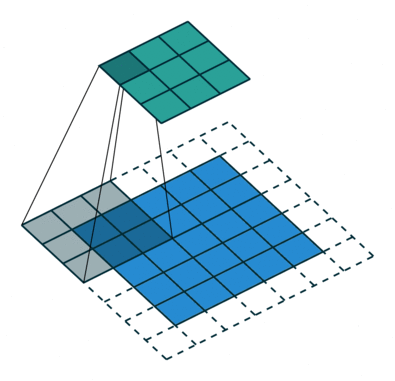
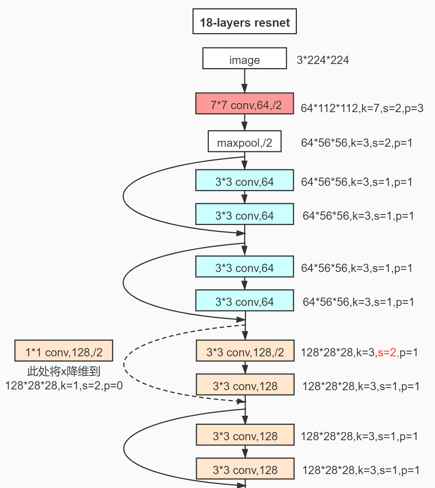

本文是基于一篇博客的学习笔记
博客原文：https://blog.csdn.net/fanxuelian/article/details/85145558

###一、DeepLab 系列

####（一）DeepLab V1

#####1. 基础：VGG16

> 参考：https://blog.csdn.net/qq_43636375/article/details/114917772

<center>

</center>

输入图像大小：224x224x3

VGG16的**卷积层**和**池化层**可以划分为**5个Block**

* Block1：`conv3-64 -> conv3-64 -> maxpool`
  * **in_size=(224,224,3)**
  * 2个卷积层，kernel_size=3，out_channels=64
  * 1个最大池化层，kernel_size=2
  * **out_size=(112,112,64)**
* Block2：`conv3-128 -> conv3-128 -> maxpool`
  * 2个卷积层，kernel_size=3，out_channels=128
  * 1个最大池化层，kernel_size=2
  * **out_size=(56,56,128)**
* Block3：`conv3-256 -> conv3-256 -> conv3-256 -> maxpool`
  * 3个卷积层，kernel_size=3，out_channels=256
  * 1个最大池化层，kernel_size=2
  * **out_size=(28,28,256)**
* Block4：`conv3-512 -> conv3-512 -> conv3-512 -> maxpool`
  * 3个卷积层，kernel_size=3，out_channels=512
  * 1个最大池化层，kernel_size=2
  * **out_size=(14,14,512)**
* Block5：`conv3-512 -> conv3-512 -> conv3-512 -> maxpool`
  * 3个卷积层，kernel_size=3，out_channels=512
  * 1个最大池化层，kernel_size=2
  * **out_size=(7,7,512)**

<center>

</center>

VGG16是多个卷积层和池化层交替组成的，最后做以多次全连接，这样的结构类似LeNet和AlexNet，前半部分利用了卷积层去观察全局的特征，后半部分利用线性层进行分类输出，抛弃了位置特征

#####2. 改进
> 参考：
> https://zhuanlan.zhihu.com/p/104562658
> https://blog.csdn.net/u011984148/article/details/109759574

* **去掉了最后的全连接层**：即改为 FCN 网络，语义分割全卷积网络的大势所趋

* **去掉了最后两个池化层**：
  * 池化层的作用：**缩小特征层的尺寸**，**快速扩大感受野**。（扩大感受野，可以利用更多的上下文信息进行分析）
  * 去除原因：
    * 传统的深度卷积网络 DCNN 需要完成的任务是**分类**，需要给出的结果是图片是什么，而并不关心图片中东西的位置，这与语义分割，这一关注识别的像素级别的**具体位置**的需求背道而驰
    * 在 DCNN 中，要求网络具有**平移不变性**，这就是卷积和池化的特征之一。pooling 的实际上是一个**模糊位置**的过程，增强了平移不变性这一特征，而这反而不利于语义分割，语义分割需要更精确的信息
  * 解决感受野不足的问题：在去掉 pooling 层后，感受野会随之下降，解决方法是引入**空洞卷积**（Atrous Convolution），这样可以在**不增加计算量**的情况下扩大感受野。而且更进一步，相比于先pooling后再卷积，使用空洞卷积可以让**特征更密**（因为pooling减少了分辨率，这使得空洞卷积和普通卷积的位置不再是一一对应的了）

<center>


</center>

 

#####3. 总处理流程

<center>

</center>

* 输入图像
* 经历基于 VGG 改造的 DCNN 网络得到**粗糙的 score map**（按我理解叫 heat map）
* 使用**双线性采样**进行上采样，提高 score map 的分辨率
* 使用 CRF 进行优化，去除“孤岛”
* 输出分割图


####（二）DeepLab V2

#####1. 基础：ResNet-101

> 参考：https://blog.csdn.net/qq_45649076/article/details/120494328

ResNet 可以理解为是 U-net 的叠加部分或者 FCN 中的 skip 相加部分（有异曲同工之处），都是将之前层的数据叠加到新的层上，这样可以兼顾浅层卷积的分辨率信息和深层卷积的位置信息，对于语义分割是有益的

######基本模块（两种不同的residual）：BasicBlock 和 BottleNeck

<center>

</center>

* 双层的残差结构 BasicBlock 很容易理解
* 三层的残差结构 BottleNeck ：先用1x1卷积降通道 `channel=256 -> 64`，再进行3x3卷积，然后用1x1卷积升通道 `channel=64 -> 256`，这样以来模块的输入尺寸和卷积输出尺寸一致，利用 short cut 相加得到模块输出。这样一降一升通道数的好处在于可以**减少训练参数**，训练速度更快
  > CNN参数个数 = 卷积核尺寸 × 卷积核深度 × 卷积核组数 = 卷积核尺寸 × 输入特征矩阵深度 × 输出特征矩阵深度
* 在实际应用的网络中最好采用 BottleNeck 模块为基本单元
* 实际使用的 ResNet 网络中，有时需要让通过 BottleNeck 模块后通道数下降，这时就需要对 short cut 进行1x1卷积的降通道处理

<center>

</center>

以18层的 ResNet 为例：

<center>


</center>

其他类型的 ResNet：（V2的基础为其中的101-layer）

<center>

</center>

#####2. 改进：空洞空间金字塔池化 ASPP

> 参考：https://blog.csdn.net/qq_41731861/article/details/122560247

空洞卷积存在的劣势：
* 局部信息丢失：由于空洞卷积的计算方式类似于棋盘格式，某一层得到的卷积结果，来自上一层的独立的集合，**没有相互依赖**，卷积结果之间没有相关性
* 远距离获取的信息没有相关性：由于空洞卷积稀疏的采样输入信号，使得远距离卷积得到的信息之间没有相关性

``` python {.line-numbers}
class ASPP(nn.Module):
    def __init__(self, in_channel=512, depth=256):
        super(ASPP,self).__init__()
        self.mean = nn.AdaptiveAvgPool2d((1, 1)) #(1,1)means ouput_dim
        self.conv = nn.Conv2d(in_channel, depth, 1, 1)
        self.atrous_block1 = nn.Conv2d(in_channel, depth, 1, 1)
        self.atrous_block6 = nn.Conv2d(in_channel, depth, 3, 1, padding=6, dilation=6)
        self.atrous_block12 = nn.Conv2d(in_channel, depth, 3, 1, padding=12, dilation=12)
        self.atrous_block18 = nn.Conv2d(in_channel, depth, 3, 1, padding=18, dilation=18)
        self.conv_1x1_output = nn.Conv2d(depth * 5, depth, 1, 1)
 
    def forward(self, x):
        size = x.shape[2:]
 
        image_features = self.mean(x)
        image_features = self.conv(image_features)
        image_features = F.upsample(image_features, size=size, mode='bilinear')
 
        atrous_block1 = self.atrous_block1(x)
        atrous_block6 = self.atrous_block6(x)
        atrous_block12 = self.atrous_block12(x)
        atrous_block18 = self.atrous_block18(x)
 
        net = self.conv_1x1_output(torch.cat([image_features，
                                              atrous_block1, 
                                              atrous_block6,
                                              atrous_block12, 
                                              atrous_block18], 
                                              dim=1))
        return net
```

结合 ASPP 的代码来看：
* ASPP 层先对输入做一系列不同 padding 和 dilation 的空洞卷积，这些卷积通过调整这两个参数以满足输出通道数和尺寸保持一致
* 让这些空洞卷积的输出通过 concat 相加，得到 ASPP 层的输出

ASPP 层解决了空洞卷积信息丢失的劣势，也同时增大了感受野，从不同的尺度上提取特征

######将 ASPP 融合入 ResNet-101：

即让卷积6分裂为一系列的空洞卷积，分别进行后续的卷积操作，然后将所有的输出 concat 在一起

<center>

</center>

####（三）DeepLab V3

#####1. 基础：DeepLab V2 ResNet-101

#####2. 改进

* **舍弃 CRF**：我觉得有必要研究一下
  > 因为分类结果精度已经提高到不需要CRF了（也可能是CRF不起作用了，谁知道呢）
* **改进 ASPP 方案一**：拓展网络的宽度
  * 在空洞卷积之后使用 batch normalization：待定
  * 增加了1x1卷积分支和 image pooling 分支：
    * 目的：解决使用空洞卷积带来的问题，即随着rate的增大，一次空洞卷积覆盖到的**有效像素**（特征层本身的像素，相应的补零像素为非有效像素）会逐渐减小到1也就是说太大的 padding 和 dilation 带来了非中心采样点位置过于偏僻，要么太远，要么延申到 padding 补0区域，这些像素采样是没有意义的。这就与我们**扩展感受野**，**获取更大范围的特征**的初衷相背离了
    * 措施：
      * 使用1x1的卷积：即当rate增大以后3x3卷积的退化形式，替代3x3卷积，减少参数个数
      * 增加image pooling：即全局池化，来补充全局特征。具体做法是对每一个通道的像素取平均，之后再上采样到原来的分辨率

<center>

</center>

* **改进 ASPP 方案二**：加深空洞卷积的深度

<center>

</center>

####（四）DeepLab V3+

#####1. 基础：Xception

> 参考：https://www.jianshu.com/p/9a0ba830af37?utm_source=oschina-app

Xception 是由 Inception v3 直接演变而来。其中引入了 Residual learning 的结构（Residual learning 在 CNN 模型中的使用可带来收敛速度的加快）

其中 Inception v3 可以如图表示，这样的网络与 DeepLab V2 的 ASPP 先分后合的思想有异曲同工之处

<center>

</center>

在此基础上

Xception 引入了 Entry/Middle/Exit 三个 flow ，每个 flow 内部使用不同的重复模块
* 最核心的是中间不断分析、过滤特征的 Middel flow。
* Entry flow 主要是用来不断下采样，减小空间维度
* Middel flow 是不断学习关联关系，优化特征
* Exit flow 是汇总、整理特征，用于交由FC（fully connected layer）来进行表达

<center>

</center>

#####2. 改进

> 参考：https://zhuanlan.zhihu.com/p/165632315

* 使用更深的网络
  
* 将所有的卷积层和池化层用**深度可分离卷积**（depthwise separable convolution / sep conv）进行替代
  * 深度可分离卷积主要分为**逐通道卷积**和**逐点卷积**两个过程
  * 逐通道卷积（Depthwise Convolution）：每个 channel 使用一个一维3x3卷积核，卷积生成一个单维 map 输出
    <center>
    
    </center>
  * 逐点卷积（Pointwise Convolution）：所有 map 构建一个多维输入，使用多维的1x1卷积核进行普通卷积，输出指定通道数的多维张量
    <center>
    
    </center>
  * 优势：从**理论上**讲可以降低计算量，可以在运算量不增加的情况下把卷积网络做的更深，但是这样的优势仅仅局限在理论上，因为这样的卷积形式不能有效的利用硬件，所以实际上计算量虽小，**效率并没有明显提升**，个人见解，这样的意义不大
  
* 在每一次3x3的 sep conv 之后使用 Batch Normalization 和 ReLU

#####3. 网络架构总体改良：引入了 Encoder-Deconder 结构

<center>

</center>

之前的三个版本中，重点使用了 ASPP 的方法，总体上结构是一步步卷积池化，进行下采样，然后再在最终得到的 feature map 上进行上采样，这样的在一个方向复杂而另一个方向简单的方法有些粗糙了

V3+ 版本在此基础上要引入类似 U-net 的 Encoder-Deconder 结构，即单方面复杂化了在 feature map 上进行上采样的过程，这里的具体操作方式与 FCN 的 skip 方法基本上一模一样，即上采样的到一定的分辨率，然后与相同尺寸的收缩路径中的某一层的输出进行 concat，然后继续如此上采样，直到分辨率达到端数据的要求

###二、对于 DeepLab 系列的理解与总结

首先必须指出 DeepLab 网络的工作的端到端输入输出，输入图像，输出与图像在像素级别对应的等大小分割图，这就使得 DeepLab 必定是一个先下采样提炼特征，再上采样恢复分辨率的过程，从这个宏观的尺寸变化上，我认为是非常类似 Encoder-Deconder 结构的。这个意义上来看，不妨借用 U-net 的说法，称两个过程为收缩路径和扩张路径

* V1 版本的总体结构是朴素的 VGG 网络，在收缩路径上引入了扩大感受野的方式——空洞卷积，在扩张路径上引入了 CRF 技术来优化“孤岛”的问题
* V2 版本有两个重大改进，一个是引入了类似 skip 的 ResNet 残差结构，来更好的匹配位置信息和图像内容；另一个是引入了 ASPP 的先分后合的空洞卷积模型，来建立卷积结果之间的相关性
* V3 版本在 V2 版本的基础上改进了 ASPP，选择性拓展了网络的宽度或深度，并且舍去了 CRF 技术
* V3+ 版本在收缩路径上改进了卷积方法，引入了深度可分离卷积来减少计算量，加深网络深度，在每一层的卷积完成后加入了  Batch Normalization 和 ReLU 来避免梯度消失；在扩张路径上进行了改进，完整引入了 Encoder-Deconder 结构，用 skip 的方法使扩张路径与收缩路径建立联系，更细化了网络的输出


