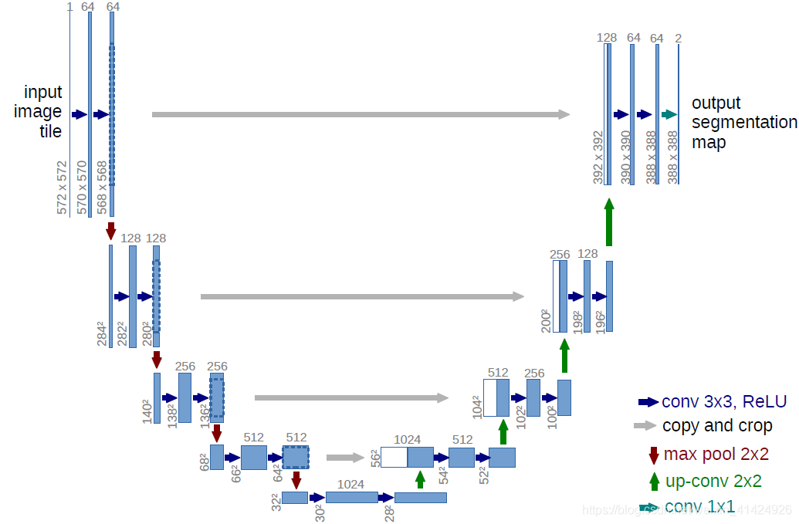
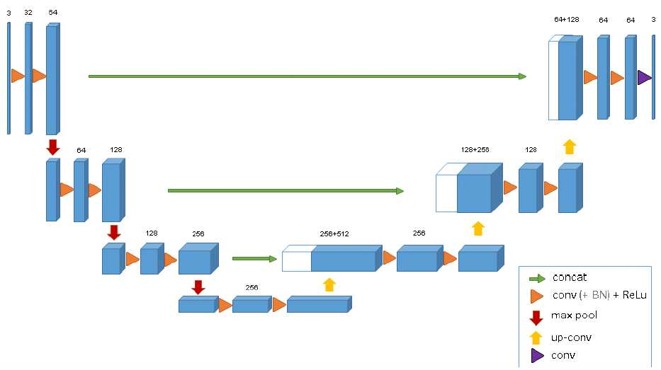
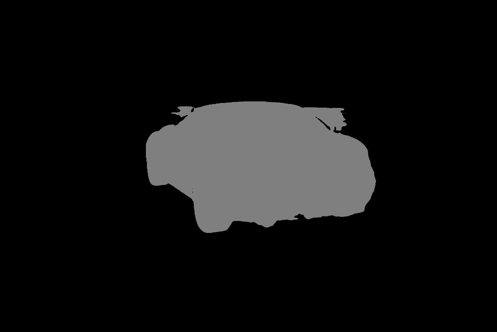
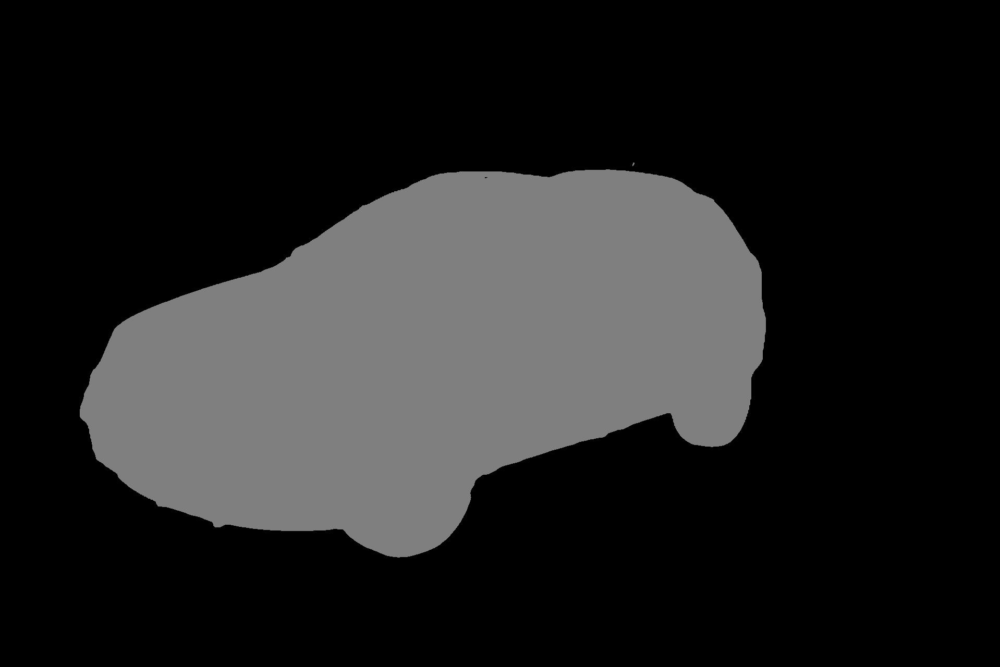
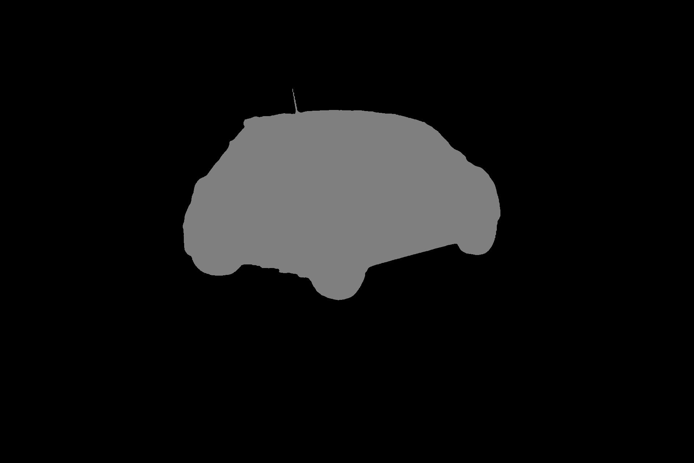
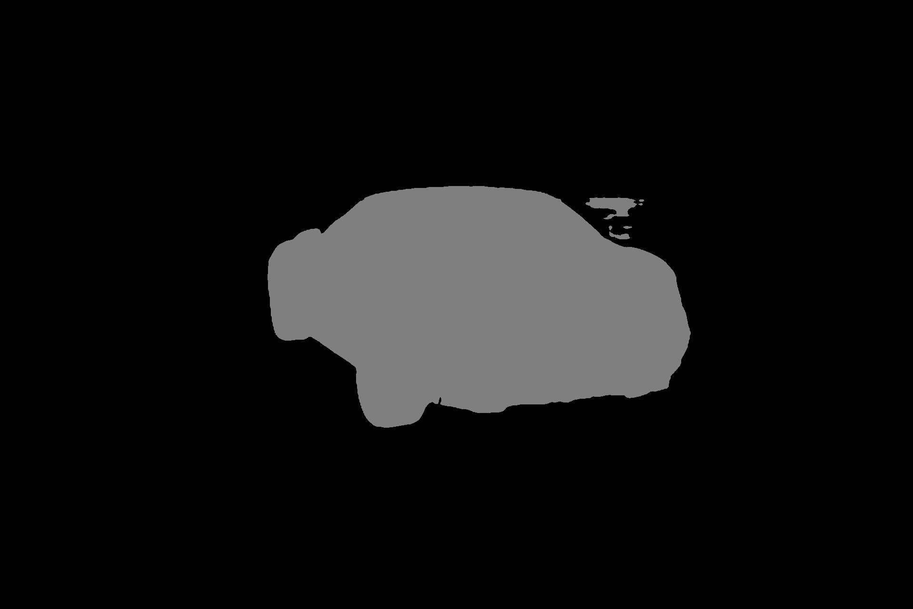
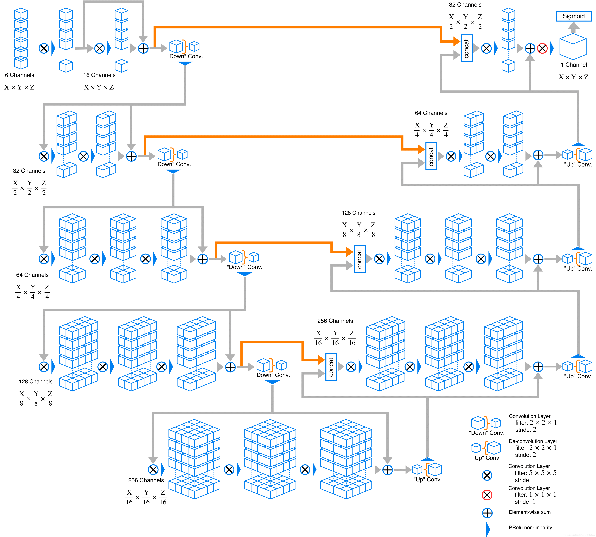
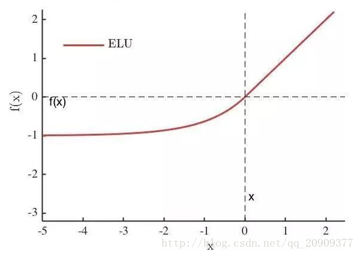
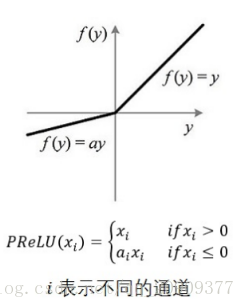

##博客阅读：3D U-net与V-net

<center>

</center>

###一、3D U-net

<center>

</center>

####（一）与U-net的区别

#####1. 通道数翻倍的时刻不同

* 在2D U-net中，通道数翻倍的时刻是在**下采样后的第一次卷积**时
* 在3D U-net中，通道数翻倍的时刻是在**下采样或上采样前的卷积**中


#####2. 反卷积操作不同

对于反卷积操作，2D U-net中通道数减半，而3D U-net中通道数不变

比如U-net反卷积之前的输入是256通道，通过反卷积得到128通道，叠加收缩路径的同层的128通道，叠加得到新的256通道

在反卷积和叠加后的第一次卷积中降一半通道，得到128通道，再进行一次通道数不变的卷积，以128通道参与到下一次的反卷积中去

在3D U-net中，反卷积之前的输入是256通道，**通过反卷积还是256通道**，叠加收缩路径的同层的128通道，叠加得到384通道

在反卷积和叠加后的第一次卷积中降更多的通道，得到128通道，再进行一次通道数不变的卷积，以128通道参与到下一次的反卷积中去

可见，U-net与3D U-net在此方面的区别在于：
* U-net在叠加之前（即反卷积中）降了一次通道，在叠加之后又降了一次通道
* 3D U-net在叠加之前不降通道，直接叠加，只在叠加之后降了一次通道

效果：未知，猜测是可以节省一次运算

#####3. 使用Batch Normalization

3D U-net在每一次卷积中都使用了Batch Normalization，这样可以加快收敛和避免网络结构的瓶颈

关于Batch Normalization：

* 随着网络的深度增加，每层特征值分布会逐渐的向激活函数的输出区间的上下两端（激活函数饱和区间）靠近，这样继续下去就会导致**梯度消失**

* Batch Normalization通过方法将该层特征值分布重新拉回**标准正态分布**，**特征值**将落在激活函数对于输入**较为敏感的区间**

* **输入较小的变化**可导致**损失函数较大的变化**，使得梯度变大，避免梯度消失，同时也可**加快收敛**，让每一层的值在更有效的范围内传递下去

但是我回看了U-net代码，发现我的U-net版本已经使用了Batch Normalization，所以这一点不作为改善，但借这一点我认为有必要去看看Batch Normalization去掉后对U-net的影响
<!-- 这里也提醒我了，原版的U-net并没有使用Batch Normalization，有点好奇为什么原版不用，原版如果用了会有什么效果 -->

####（二）3D U-net的使用范围

除了以上与U-net的区别外，一个重大差异是3D U-net将2D卷积换成3D卷积，并将原版2D U-net使用于3D图像中

生物医学影像很多时候都是3D块状的，也就是说是由很多个切片构成一整张图的存在

对于3D图像来说，用2D的图像处理模型去处理3D本身不是不可以，但是会存在一个问题，就是不得不将生物医学影像的图片一个slice一个slice成组的（包含训练数据和标注好的数据）的送进去设计的模型进行训练，在这种情况下会存在一个效率问题，并且数据预处理的方式也相对比较繁琐

而且我个人认为，如果用2D卷积来处理3D图像，会不可避免导致只保留两个维度上的空间位置关系，而把第三维度上的抛弃，这样可能会使得每个slice间不能很好的连接成一个整体，造成分割的形式上的误差。当然这个想法我没有验证，目前没有3D的数据集来实验

3D U-net在3D图像处理上的优势：

* 不需要将3D图片数据切片成slice成组再训练，可以直接进行端到端的训练
* 可以使用稀疏标注的3D图片，即一个3D图片中只标注些许slice来进行训练

####（三）实测结果

我根据以上看到的与原版U-net的区别，对原版U-net做出了调整，改造成3D U-net，由于我对于修改网络细节的能力不是很自信，故将原本三层的3D U-net收缩路径增大到与原版U-net相同的四层，当然这也可以控制两种网络的深度相同来对比效果

调试后预测效果如下：

输入图片：
<center>


</center>
U-net的分割结果：
<center>



</center>
3D U-net的分割结果：
<center>



</center>

可以看到，这两种网络的分割结果区别不大，但是从细节上看，3D U-net的效果比原版U-net略好一点，前两张图片的预测结果基本一致，第三章中存在背景的干扰，原版U-net将挺大一部分背景当成了车，而3D U-net犯错的像素数量明显更少

###二、V-net

<center>

</center>

V-net在U-net的基础上引入了ResNet的残差结构，从结构图中可以看到，在第n层引入相距n个卷积层的残差网络

V-net与3D U-net一样在3D图像上使用


###三、代码分析

> 代码：https://github.com/mattmacy/vnet.pytorch  （非原生V-net）

<center>

</center>

#####1. 更多激活函数

<center>


</center>

``` python {.line-numbers}
def ELUCons(elu, nchan):
    if elu:
        return nn.ELU(inplace=True)
    else:
        return nn.PReLU(nchan)
```

#####2. 新的Batch Normalization方式

``` python {.line-numbers}
# normalization between sub-volumes is necessary
# for good performance
class ContBatchNorm3d(nn.modules.batchnorm._BatchNorm):
    def _check_input_dim(self, input):
        if input.dim() != 5:
            raise ValueError('expected 5D input (got {}D input)'
                             .format(input.dim()))
        super(ContBatchNorm3d, self)._check_input_dim(input)

    def forward(self, input):
        self._check_input_dim(input)
        return F.batch_norm(
            input, self.running_mean, self.running_var, self.weight, self.bias,
            True, self.momentum, self.eps)
```

#####3. 卷积模块

`ELU函数激活 -> 3D卷积 -> Batch Normalization`
3D卷积中：输入输出的通道数不变，卷积核大小为5，配套padding为2，输入输出的尺寸不变

`_make_nConv`函数按照网络深度depth，设定网络层数，输出连续的depth个卷积


``` python {.line-numbers}
class LUConv(nn.Module):
    def __init__(self, nchan, elu):
        super(LUConv, self).__init__()
        self.relu1 = ELUCons(elu, nchan)
        self.conv1 = nn.Conv3d(nchan, nchan, kernel_size=5, padding=2)
        self.bn1 = ContBatchNorm3d(nchan)

    def forward(self, x):
        out = self.relu1(self.bn1(self.conv1(x)))
        return out

def _make_nConv(nchan, depth, elu):
    layers = []
    for _ in range(depth):
        layers.append(LUConv(nchan, elu))
    return nn.Sequential(*layers)
```

#####4. 输入模块

（1）用`torch.cat`把输入x在第0维度（channel维度）重复拼接起来，使原本输入的单通道数据变成16通道数据

（2）利用输入3D卷积将单通道输入数据x通过卷积后变成16通道数据，再进行Batch Normalization

（3）将（1）和（2）的输出直接相加，达成残差的结构，作为总输出

``` python {.line-numbers}
class InputTransition(nn.Module):
    def __init__(self, outChans, elu):
        super(InputTransition, self).__init__()
        self.conv1 = nn.Conv3d(1, 16, kernel_size=5, padding=2)
        self.bn1 = ContBatchNorm3d(16)
        self.relu1 = ELUCons(elu, 16)

    def forward(self, x):
        # do we want a PRELU here as well?
        out = self.bn1(self.conv1(x))
        # split input in to 16 channels
        x16 = torch.cat((x, x, x, x, x, x, x, x,
                         x, x, x, x, x, x, x, x), 0)
        out = self.relu1(torch.add(out, x16))
        return out
```

#####5. 收缩模块

（1）下采样down：使用一个步长stride为2，卷积核尺寸为2的3D卷积作为下采样，这样可以避免使用池化操作，再叠加一个Batch Normalization和激活函数ELU

（2）连续卷积ops：以LUConv为单位多次重复恒定通道恒定尺寸的卷积

（3）将连续卷积ops的输入和输出相加，加以激活函数ERU，得到单个收缩模块的输出

经过一个收缩模块DownTransition后，通道数翻倍，图像尺寸减半

``` python {.line-numbers}
class DownTransition(nn.Module):
    def __init__(self, inChans, nConvs, elu, dropout=False):
        super(DownTransition, self).__init__()
        outChans = 2*inChans
        self.down_conv = nn.Conv3d(inChans, outChans, kernel_size=2, stride=2)
        self.bn1 = ContBatchNorm3d(outChans)
        self.do1 = passthrough
        self.relu1 = ELUCons(elu, outChans)
        self.relu2 = ELUCons(elu, outChans)
        if dropout:
            self.do1 = nn.Dropout3d()
        self.ops = _make_nConv(outChans, nConvs, elu)

    def forward(self, x):
        down = self.relu1(self.bn1(self.down_conv(x)))
        out = self.do1(down)
        out = self.ops(out)
        out = self.relu2(torch.add(out, down))
        return out
```

#####6. 扩张模块

（1）Dropout：通过`nn.Dropout3d`对通道维度上按概率skipx将整个通道中的所有数值赋值为 0

（2）上采样up：使用一个步长stride为2，卷积核尺寸为2的3D反卷积作为上采样，再叠加一个Batch Normalization和激活函数ELU

（3）将（1）和（2）的输出在**第一维度**上拼接

（4）连续卷积ops：以LUConv为单位多次重复恒定通道恒定尺寸的卷积

（3）将连续卷积ops的输入和输出相加，加以激活函数ERU，得到单个扩张模块的输出

？？？？？？？？？？？？？？？？？

经过一个收缩模块UpTransition后，通道数变为指定的outChans，图像尺寸加倍

``` python {.line-numbers}
class UpTransition(nn.Module):
    def __init__(self, inChans, outChans, nConvs, elu, dropout=False):
        super(UpTransition, self).__init__()
        self.up_conv = nn.ConvTranspose3d(inChans, outChans // 2, kernel_size=2, stride=2)
        self.bn1 = ContBatchNorm3d(outChans // 2)
        self.do1 = passthrough
        self.do2 = nn.Dropout3d()
        self.relu1 = ELUCons(elu, outChans // 2)
        self.relu2 = ELUCons(elu, outChans)
        if dropout:
            self.do1 = nn.Dropout3d()
        self.ops = _make_nConv(outChans, nConvs, elu)

    def forward(self, x, skipx):
        out = self.do1(x)
        skipxdo = self.do2(skipx)
        out = self.relu1(self.bn1(self.up_conv(out)))
        xcat = torch.cat((out, skipxdo), 1)
        out = self.ops(xcat)
        out = self.relu2(torch.add(out, xcat))
        return out
```

#####7. 输出模块

这里将整个输出图像通过卷积降低到两个通道，，通过view展开为单行数据，从而达到分类器的效果

``` python {.line-numbers}
class OutputTransition(nn.Module):
    def __init__(self, inChans, elu, nll):
        super(OutputTransition, self).__init__()
        self.conv1 = nn.Conv3d(inChans, 2, kernel_size=5, padding=2)
        self.bn1 = ContBatchNorm3d(2)
        self.conv2 = nn.Conv3d(2, 2, kernel_size=1)
        self.relu1 = ELUCons(elu, 2)
        if nll:
            self.softmax = F.log_softmax
        else:
            self.softmax = F.softmax

    def forward(self, x):
        # convolve 32 down to 2 channels
        out = self.relu1(self.bn1(self.conv1(x)))
        out = self.conv2(out)

        # make channels the last axis
        out = out.permute(0, 2, 3, 4, 1).contiguous()
        # flatten
        out = out.view(out.numel() // 2, 2)
        out = self.softmax(out)
        # treat channel 0 as the predicted output
        return out
```

#####8. 整体组装

``` python {.line-numbers}
def passthrough(x, **kwargs):
    return x

class VNet(nn.Module):
    # the number of convolutions in each layer corresponds
    # to what is in the actual prototxt, not the intent
    def __init__(self, elu=True, nll=False):
        super(VNet, self).__init__()
        self.in_tr = InputTransition(16, elu)
        self.down_tr32 = DownTransition(16, 1, elu)
        self.down_tr64 = DownTransition(32, 2, elu)
        self.down_tr128 = DownTransition(64, 3, elu, dropout=True)
        self.down_tr256 = DownTransition(128, 2, elu, dropout=True)
        self.up_tr256 = UpTransition(256, 256, 2, elu, dropout=True)
        self.up_tr128 = UpTransition(256, 128, 2, elu, dropout=True)
        self.up_tr64 = UpTransition(128, 64, 1, elu)
        self.up_tr32 = UpTransition(64, 32, 1, elu)
        self.out_tr = OutputTransition(32, elu, nll)

    # The network topology as described in the diagram
    # in the VNet paper
    # def __init__(self):
    #     super(VNet, self).__init__()
    #     self.in_tr =  InputTransition(16)
    #     # the number of convolutions in each layer corresponds
    #     # to what is in the actual prototxt, not the intent
    #     self.down_tr32 = DownTransition(16, 2)
    #     self.down_tr64 = DownTransition(32, 3)
    #     self.down_tr128 = DownTransition(64, 3)
    #     self.down_tr256 = DownTransition(128, 3)
    #     self.up_tr256 = UpTransition(256, 3)
    #     self.up_tr128 = UpTransition(128, 3)
    #     self.up_tr64 = UpTransition(64, 2)
    #     self.up_tr32 = UpTransition(32, 1)
    #     self.out_tr = OutputTransition(16)
    def forward(self, x):
        out16 = self.in_tr(x)
        out32 = self.down_tr32(out16)
        out64 = self.down_tr64(out32)
        out128 = self.down_tr128(out64)
        out256 = self.down_tr256(out128)
        out = self.up_tr256(out256, out128)
        out = self.up_tr128(out, out64)
        out = self.up_tr64(out, out32)
        out = self.up_tr32(out, out16)
        out = self.out_tr(out)
        return out
```