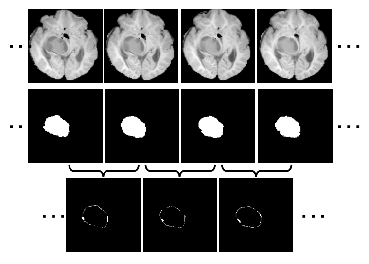
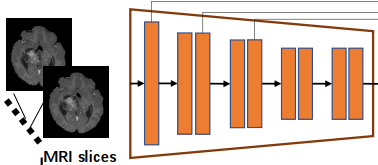
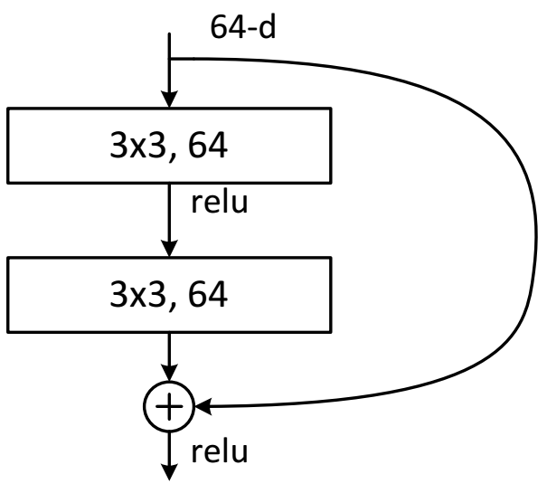
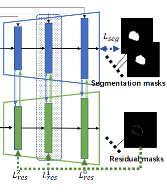
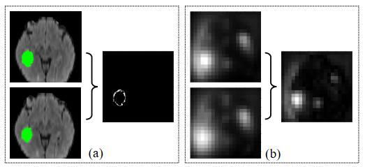
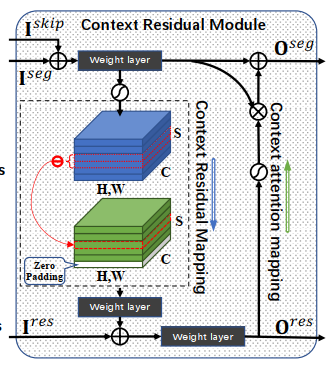
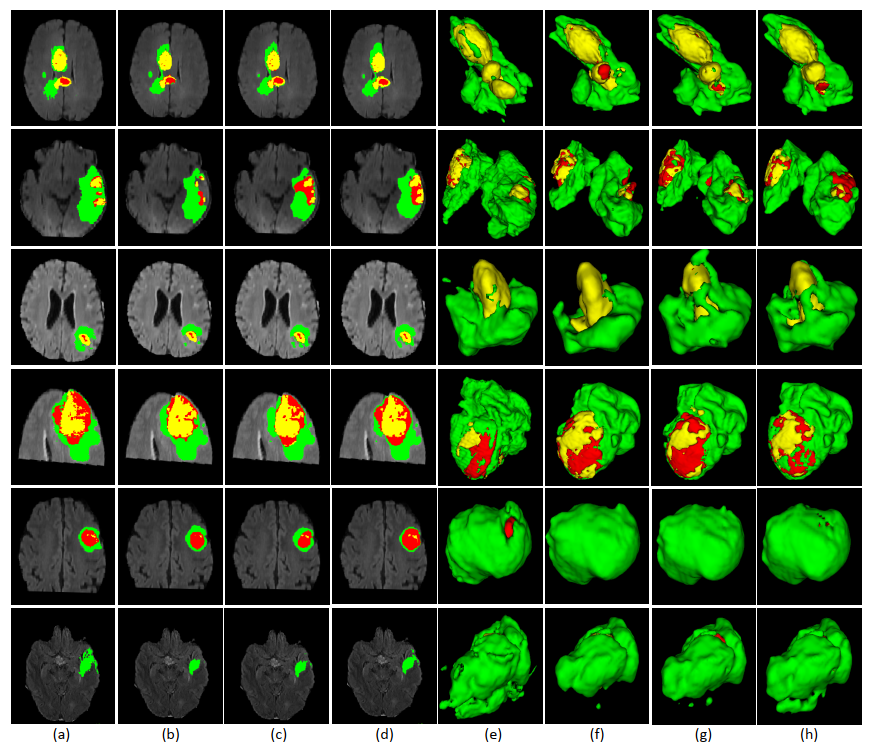
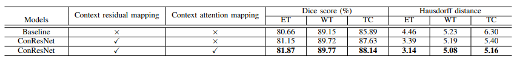
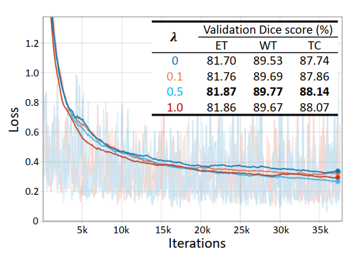

### 设计初衷

深度卷积神经网络（DCNN）们对 3D 上下文感知的能力有限，准确性仍需进一步提高

> Although deep convolutional neural networks (DCNNs) have widely applied to this task, the accuracy of these models still need to be further improved mainly due to their limited ability to 3D context perception.

### 创新

* 提出了用于精确分割 3D 医学图像的 3D 上下文残差网络 (ConResNet, 3D context residual network)，由编码器、分割解码器和上下文残差解码器组成
* 设计了上下文残差模块，并用它来桥接每个尺度的两个解码器，每个上下文残差模块都包含上下文残差映射和上下文注意映射，形式旨在显式学习切片间上下文信息

### 值得关注：自注意力机制

已在分割模型中引入了几种注意力学习机制，使它们能够更多地关注某些位置和通道
> several attention learning mechanisms have been introduced to segmentation models, enabling them to focus more on certain locations and / or channels [8], [9].
> [8] J. Schlemper, O. Oktay, M. Schaap, M. Heinrich, B. Kainz, B. Glocker, and D. Rueckert, “Attention gated networks: Learning to leverage salient regions in medical images,” Medical Image Analysis, vol. 53, pp. 197– 207, 2019. 
> [9] A. Sinha and J. Dolz, “Multi-scale guided attention for medical image segmentation,” arXiv preprint arXiv:1906.02849, 2019.

### 上下文残差

我们主张通过更有效地捕获和使用切片间上下文信息，可以进一步提高 3D 医学图像分割的准确性

* 第一行显示了从存在脑肿瘤的序列中采样的四个相邻切片
* 第二行给出了每个切片中的真实肿瘤区域
* 第三行显示相邻的切片之间肿瘤区域的体素差异，包括向外延伸的区域或向内收缩的区域

我们将这种差异定义为切片间上下文残差，它出现在肿瘤表面上或附近，包含肿瘤的基本和有趣的形态信息，因为我们可以使用它与任何切片中的肿瘤区域一起重建肿瘤的形状3D 肿瘤。直观地说，在分割过程中探索片间上下文残差一定有利于提高准确性。

不幸的是，由于两个相邻切片中的肿瘤区域具有相似的形状和大小，因此切片间上下文残差**通常很小**，因此从未直接表征过。

### ConResNet 网络

ConResNet 有一个 Encoder-Decoder 结构，包含一个**用于特征提取的编码器**和两个**用于生成分割掩码和片间上下文残差的解码器**

上下文残差（ConRes）解码器以分割解码器产生的相邻切片的残差特征图作为输入，同时也向分割解码器提供反馈作为一种注意力引导，旨在提升分割模型的感知能力并有效地使用片间上下文信息（见图2）。 

ConRes 解码器的设计在概念上是通用的，并且与任何现有的基于 3D DCNN 的医学图像分割模型兼容。我们在 MICCAI 2018 脑肿瘤分割 (BraTS) 数据集和 NIH 胰腺分割数据集上评估了提议的 ConResNet 模型，并在这两个分割任务上实现了最先进的性能。本文的主要贡献总结如下：

* 我们建议将 **ConRes 解码器**添加到 Encoder-Decoder 结构中，以显式提高模型的3D 上下文感知能力，从而提高分割精度
  
* 我们设计了**上下文残差模块**，用于每个尺度的分割解码器和ConRes 解码器之间，用于同时进行上下文残差映射和上下文注意映射

* 我们提出了一种准确的 3D 医学图像分割模型，称为 ConResNet ，它在脑肿瘤分割任务和胰腺分割任务上都比最先进的方法实现了更好的性能

### 前置研究

#### 上下文学习 Context learning

对象的上下文提供了其周围环境的信息，为此上下文学习提出三类策略：

* **为了探索多个尺度的上下文信息**：采用不同尺度的**金字塔空间池化**策略来聚合多尺度全局信息，将具有不同扩张率的空洞空间金字塔池引入并行分支，执行多尺度表示聚合

* **为了扩大感受野**：用具有可调节扩张率的**空洞卷积**代替了传统卷积，利用大卷积核来捕获丰富的全局上下文信息，更利于密集的每像素预测任务

* **为过滤掉无关信息**：提出了许多基于注意力的方法，通过显式建模卷积特征的通道相关性，自适应地重新校准通道特征响应。设计了一个具有自下而上和自上而下的前馈结构的**注意力模块**来学习软注意力权重。

这些策略已经在许多 2D 场景中证明了它们的有效性，且一些已经扩展到 3D 图像。虽然提高了性能，但这些 2D 和 3D 策略无法直接表征切片间上下文残差信息，而这对于 3D 医学图像分割尤为重要。

#### 残差学习 Residual learning

残差学习的思想是使用直接从输入跳转到输出的**跳过连接**（Skip）来学习输入和输出特征图之间的残差。

通过跳跃连接，残差学习消除了**退化问题**，因此可以训练具有数百甚至数千层的非常深的网络。此模型提出的 ConRes 解码器旨在感知**两个相邻切片之间的特征残差**，从而增强模型使用 3D 上下文信息进行分割的能力。

#### 医学影像分割

当 2D 模型应用于 3D 医学图像时，这些模型以逐个切片的方式执行分割任务，因此无法捕获切片间的上下文信息，导致分割精度有限。

借助 **3D 卷积**，3D DCNN 可以直接处理体积数据，因此在 3D 医学图像分割中比 2D DCNN 具有明显的优势。建议通过向现有 3D DCNN 添加 ConRes 解码器来提高现有 3D DCNN 的准确性，而不是设计新的分割模型，该解码器能够捕获和使用切片间上下文残差信息。

### 模型细节

#### （一）共享编码器 Shared Encoder

图中每一个红块都是一个残差块，每个残差块是由两个 3x3x3 的 3D 卷积和从块输入到块输出的 skip 捷径组成的，这里的 skip 的特征融合方式为 FCN 风格的方式，即像素对像素（voxelwise）相加

* 使用组数为 8 的组归一化（batch_size = 8）
* 使用权重标准化算法，通过标准化卷积层的权重来加速微批量训练

<!-- #region 权重标准化-->

权重标准化

<td style="WORD-BREAK: break-all; WORD-WRAP: break-word">

1. **Batch Normalization（BN）**
   
   Batch Normalization 在试图解决 ICS（Internal Covariate Shift）现象
&nbsp;
   简单理解，就是激活函数势必会改变各层数据的分布，那么随着网络的加深，这种改变的趋势也会加剧，数据分布会越来越偏移。我们知道像sigmoid、tanh这一类激活函数在x绝对值较大时梯度较小，当x逐渐向函数两端区域靠拢时，模型将很难继续优化更新。
&nbsp;
   因此，BN试图将各层数据的分布固定住（目前能肯定的是，确实固定了数据的范围，但不一定真的调整了分布），使得各层数据在进入激活函数前，保持均值为0，方差为1的正态分布。这样就能使数据尽量靠近激活函数的中心，在反向传播时获得有效的梯度。
&nbsp;
2. **Layer Normalization（LN）**
   
   BN是把整个batch的数据看做整体，针对每个神经元的输入来归一化。
&nbsp;
   LN则是把每一层的数据看做整体，针对每一层进行归一化
   解决了BN不能很好适用于RNN的问题
&nbsp;
3. **BN 存在的问题**
   * batch_size过小：
     由于BN是以整个batch来计算均值和方差，所以batch size不能设置过小，失去BN的意义
   * batch_size过大：
     * 超过内存容量
     * 跑一次epoch迭代次数少，达到相同精度所需要的迭代次数（参数调整的次数）是差不多的，所以大的 batch size 需要跑更多的 epoch ，导致总的训练时间变长
     * 过大的 batch size 会直接固定下降方向，导致很难更新
&nbsp;
4. **Weight Standarization（WS）**
    为了像 BN 一样加速训练过程，又能够摆脱对于 large batch size 的限制，就有了 WS
&nbsp;
    常见的 normalization 方式（BN,LN,IN,GN）都是从激活函数的输入来考虑，以不同的方式对激活函数的输入进行标准化
&nbsp;
    WS则想，我们这么费心费力地去处理卷积后的结果来加速训练，那为什么不直接去处理这个卷积的 weight 呢
&nbsp;
    实验表明，确实直接向 weight 下手对速度的影响更加直观。同时，直接处理weight，也很好地规避了对 batch size 的依赖，使得真正的 mini batch size 成为可能。

</td>
&nbsp;

<!-- #endregion -->

编码过程可以分为五个阶段：

* 第一阶段，输入由具有 32 个内核和一个残差块的卷积层处理
* 接下来的三个阶段中的每一个阶段，数据都由一个卷积层处理，该层具有双倍内核、步长为 2 和两个残差块。因此，我们逐渐将特征图下采样到输入大小的 1/8，同时将通道数从 32 增加到 256，从而扩大感受野并减少计算量
* 最后阶段，我们使用两个残差块，它们使用扩张率为 2 的空洞卷积，以进一步扩展感受野，同时保持特征分辨率以获得更多形状和边缘的细节。

#### （二）双重编码器（Dual Decoders）

ConResNet 包含两个解码器：分割解码器（Segement Decoder）和上下文残差解码器（Context Residual Decoder，ConRes）解码器

分割编码器产生分割 mask，残差编码器产生残差 mask

##### 1. 分割解码器（Segement Decoder）

分割解码器包括三个阶段，在每个阶段，我们提出了一个上下文残差模块（Context Residual Module）来桥接分割解码器和 ConRes 解码器：

* 使用**三线性插值**对先前的特征图进行上采样
* 使用逐元素求和将它们与从编码器传递的低级特征融合（skip）
* 将融合特征的上下文残差传输到 ConRes 解码器

##### 2. 上下文残差解码器（ConRes Decoder）

ConRes 解码器的结构与分割解码器结构相同

ConRes 解码器融合来自分割解码器的上下文残差特征和来自前一层的特征，然后对其进行细化以预测残差掩码

生成的片间上下文残差信息作为**注意力**引导回传给分割解码器，以提高分割解码器感知 3D 上下文的能力

#### （三）上下文残差模块（Context Residual Module）

3D 医学图像中的物体，都会在 2D 切片上逐渐改变横截面积

上下文残差表示两个相邻切片上的横截面积之间的差异，通常很小。我们怀疑这种差异也可以在生成分割解码器的相邻切片的特征图中找到

为了验证这一点，我们将两个相邻切片的特征图的通道平均值及其差异可视化。

它表明这两个平均特征图在大多数区域看起来相似，而不同之处仅出现在切片的一小部分，这类似于左图中所示的上下文残差模式。因此，我们设计了一个上下文残差模块来捕获基于分割解码器产生的特征图的上下文残差。

图中模块包含分割解码器中的一层、上下文残差解码器中的一层、两者之间的数据联系

* 分割解码器输入 $I^{skip}$ 和 $I^{seg}$，输出 $O^{seg}$
* 上下文残差解码器输入 $I^{res}$，输出 $O^{res}$
* 两种映射策略：context residual mapping 和 context attention mapping

##### 1. 上下文残差映射（context residual mapping）

$$F = Conv(I^{skip} \oplus I^{seg})$$

* $F$：得到的特征图 feature map，对应图中蓝色立方体
* $Conv$：权重层（weighted layer），包括Convolution、Group Normalization、ReLU 
* $\oplus$：像素对像素的相加

此处相当于 FCN 的 skip 相加特征融合，融合后进行一系列常规操作（卷积、归一化、激活）

$F$ 的尺寸为 $S' \times H' \times W'$ 可以理解为整个三维特征图的空间尺寸
（原文描述 $S'$ 为 inter-slice depth，猜测是这个意思）

---

$$G^{s+1,h,w} = \mid \sigma(F^{s+1,h,w}) - \sigma(F^{s,h,w}) \mid$$

* $G$：映射产生的上下文残差特征图，对应图中的红立方体
* $\sigma$：sigmoid 激活函数
  
由于 $G$ 是计算 $F$ 每层之间的残差，所以 $G$ 在 S 维度上比 $F$ 小1，$G$ 的尺寸为 $(S'-1) \times H' \times W'$，但是为了之后的运算方便，使用0来 padding 补全 $G$ 使得 $F$ 和 $G$ 的尺寸相同（后续的 $I^{res}$ 尺寸的需求）

取绝对值相减则意为，在深度上，两层二维图像相差越大，则反应的 $G$ 越大，即 $G$ 代表图像区别的程度的分布

---

$$O^{res} = Conv(Conv(G) \oplus I^{res})$$

将 $G$ 和 $I^{res}$ 联系起来，进行像素对像素的求和，再卷积激活，输出 $O^{res}$ 作为下一阶段的残差解码器的输入

##### 2. 上下文注意力映射（context attention mapping）

上下文残差映射（context residual mapping）生成切片间上下文残差特征图 $O^{res}$ 并将其馈送到残差路径以进行上下文残差学习。

同时，上下文残差路径的输出可以作为一种**注意力**来提高分割路径的上下文感知能力。

$$O^{seg} = F \otimes \sigma(O^{res})$$

* $\otimes$：像素对像素相乘

对于分割解码器来说，上下文残差模块整个结构相当于在通常意义上得到的特征图（ResNet）上，对所有像素叠加了一个权重，在相邻深度中差别越大的部分权重越高

这样的方法等同于加入了一个自定的注意力机制，使得分割网络把更多的注意力放在层间存在区别的位置，激活上下文残差区域并提示 3D 上下文方差的敏感性

由于上下文注意力仅突出显示剩余区域，直接将上下文注意力权重 $O^{res}$ 应用于特征图可能会同时衰减背景和前景。为了避免过度的衰减，对注意力权重 $O^{res}$ 做激活函数 sigmoid，并 +1，然后再作为权重

### 训练细节

#### （一）数据集 Dataset

本次训练采用了 MICCAI BraTS 2020 数据集，共 369 张带标注的 3D 医学图像（另外数据集中还包含了不带标注的图像，这部分图像我没有利用）

由于数据集下载与论文代码使用的数据集有差异，缺少训练集划分的 list，故对原文代码进行修改，对 369 张图片进行随机划分，抽取其中 20% 的图片作为验证集，其他作为训练集

> 数据集下载：https://pan.baidu.com/s/195ixlegpPgIHsUtH0WPiWQ 提取码: jr6h

#### （二）学习率 Learning Rate

$$lr(t)=lr(0)\times(1-t/T)^{0.9}$$

* $lr(t)$：第 $t$ 次训练循环的学习率 
* $lr(0)$：初始设置的学习率
* $T$：总训练循环的次数

#### （三）随机裁剪 Random Crop

将 155 x 240 x 240 尺寸的原图按照选定的尺寸进行随机裁剪。选定的尺寸比原图尺寸小，在原图上随机选用合适的偏移，作为裁剪起始位置，将其裁剪为较小尺寸的图像

论文代码中将 155 x 240 x 240 裁剪为 80 x 160 x 160，经实测，此尺寸配合 batch size = 1，需要占用不少于 1G 的 GPU 空间

为了减少 GPU 显存的使用，我尝试将训练的随机裁剪尺寸分别缩减为 40 x 80 x 80 和 72 x 144 x 144，这样的操作会导致训练得到的 dice score 明显下降，故选择遵从论文代码，使用 80 x 160 x 160 尺寸进行训练

#### （四）评估方法 Evaluation Metrics

$$
\begin{cases}
   L = L_{seg} + L_{res}\\
   L_{res} = L_{res}^0 + \lambda(L_{res}^1 + L_{res}^2)
\end{cases}
$$

$$ TotalDiceLoss = SegDiceLoss + SegBCE + ResBCE\\ + \lambda(Res2xBCE + Res4xBCE)$$

### 消融实验

#### （一）残差映射和注意力映射

将是否带有**上下文残差映射**和**上下文注意力映射**的 ConResNet 应用到 BraTS 验证数据集上的六个案例中获得的分割结果。

* （a）叠加在 FLAIR 切片上的 2D ground truth
* （e）3D 肿瘤的 ground truth，
* （b，f）【baseline 模型】的分割结果
* （c，g）【baseline 模型 + 上下文残差映射】的分割结果
* （d，h）【baseline 模型 + 上下文残差映射 + 上下文注意力映射】的分割结果
* ET：黄色； TC：黄色+红色； WT：黄色+红色+绿色。

结果表明，使用上下文残差映射有助于分割模型在 ET、WT 和 TC 上实现更大的 Dice score 和更小的 Hausdorff 距离，并且在所有指标上都具有显着的性能提升。同时，将上下文注意力映射与上下文残差映射结合到模型中可以进一步提高所有指标的分割性能

与不使用上下文残差映射和上下文注意力映射的 baceline 模型相比：

* Dice 分数提高了 1.66%、0.83% 和 2.27%
* Hausdorff 距离降低了 1.76、0.41 和 1.44。分别对 ET、WT 和 TC 进行分割

图中表明我们的 ConResNet 产生的结果更像 ground truth，定性比较表明 ConResNet 对 3D 医学图像分割是有效的

#### （二）深度监督

权衡参数 λ 控制深度监督的程度。为了验证深度监督的贡献，论文进行了四次训练，分别将 λ 设置为 0、0.1、0.5 和 1。其中 λ = 0 表示没有深度监督。当 λ = 0.5 时，作者观察到最低的训练损失和最佳的局部验证集性能，因此在论文代码中将 λ 设置为 0.5。

