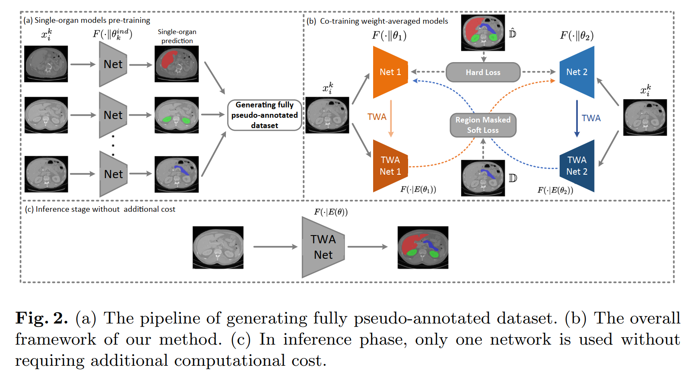

# 通过共同训练少数器官数据集的权重平均模型进行多器官分割
Multi-organ Segmentation via Co-training Weight-Averaged Models from Few-Organ Datasets

## 〇、摘要 Abstract

多器官分割要求**从每张图像中分割出多个目标器官**。

然而，一般来说，**在同一图像上收集所有器官的完整注释是相当困难的**，因为一些医疗中心由于自身的临床实践，可能只对一部分器官进行注释。

在大多数情况下，人们可能会从一个训练集获得**单个或少数器官的注释**，并从另一个训练图像集获得其他器官的注释。

现有的方法大多是为**每个器官子集**训练和部署一个**单一的模型**，这需要大量的内存，也没有时间效率。

在本文中，我们提出共同训练权重平均模型，从**少数器官数据集**中学习**统一的多器官分割**网络。

具体来说，我们合作训练**两个网络**，并让耦合的网络**在未注释的器官上相互教学**。

为了减轻网络之间的噪声教学监督，我们采用了**加权平均模型**来产生更可靠的**软标签**。

此外，**一个新的区域掩码被用来选择性地对需要协作教学的未注释器官区域应用一致的约束**，这进一步提高了性能。

在三个公开的单器官数据集 LiTS、KiTS、Pancreas 和来自 MOBA 的手工构建的单器官数据集上进行的大量实验表明，我们的方法可以更好地利用**少数器官数据集**，并以**较少的推理计算成本**实现了**优异的性能**。

## 一、简介 Introduction

### （一）面临困难

* 同一图像的多器官标注成本很大
* 各机构的标注往往针对特定研究目的和特定器官，数据集往往只提供一个单一器官的注释
* 传统方法无法基于多个单器官分割数据集训练一个多器官分割网络

### （二）解决方法一

从少数器官数据集中学习多器官分割。通过一个单独的模型使用训练数据集来分割每个器官。

#### 存在问题：

* 计算成本很高
* 不同器官之间的空间关系不能得到很好的利用。

### （三）解决方法二

采用了自我训练的方法，即利用训练好的单器官分割模型为每个数据集中未标注的器官生成伪标签，构建一个伪的多器官数据集。

多器官分割模型从伪多器官数据集中学习。

#### 存在问题：

由于每个单器官分割模型的**泛化能力不足**，以及不同数据集之间的**领域差距**，伪标签可能包含很多**噪音**。不准确的伪标签会损害训练过程并限制自我训练的性能。

### （四）本文解决方法

共同训练一对加权平均模型（weight-averaged model）：

* 为了给未注释的器官提供监督，采用了时间平均权重模型（temporally weight-averaged model）来生成未注释器官上的软性伪标签（soft pseudo labels）
* 为了限制错误的扩大，两个模型的平均权重版本通过一致性约束，以协作的方式为未注释器官的训练提供监督
* 我们提出了一个新的区域 mask（a novel region mask），以适应性地约束网络，使其主要利用未注释器官区域的软性伪标签。
* 带有两个网络的框架只在训练阶段采用
* 只有一个网络被用于推理，没有额外的计算或内存开销

### （五）本文工作贡献

* 提出**共同训练协作加权平均模型**，以便从少数器官的数据集中实现统一的多器官分割
* 我们开发了**联合训练策略**、**平均权重模型**和**区域 mask**，以实现更可靠的一致性训练
* 实验结果表明，本框架更好地利用了少器官数据集，并以较少的计算成本实现了卓越的性能

## 二、相关研究

主流单器官 CNN 语义分割网络模型：

* DeepLab、PSPNet 用于自然图像
* UNet、VoxResNet 用于医学图像

多类分割模型：

* Konstantin 等人首先提出了一个用于多类分割的条件 CNN 框架，并证明了使用在单类数据集上训练的单一模型产生多类分割的可能性。然而，他们的方法的推理时间与器官的数量成正比，这是不高效的

* Zhou 等人利用部分注释的数据集将特定领域的知识用于多器官分割。但是他们的训练目标很难优化，需要一些特殊的优化方法

* 教师-学生（teacher-student）模型是半监督学习（SSL）和模型提炼中广泛使用的一种技术。其关键思想是**通过一致性训练将知识从教师转移到学生网络**

* 深度相互学习提出在彼此的监督下协作训练两个网络

* Mean-teacher 模型在不同的训练迭代中平均模型权重，以产生对未标记数据的监督

* Ge 等人提出了一个名为 Mutual Mean Teaching 的框架，用于人员重新识别中的伪标签精炼

以上方法是在完全监督或半监督的情况下设计的。在这项工作中，我们利用**联合训练策略**（co-training strategy）和**权重平均模型**（weight-averaged models）的整合，从少数器官数据集中统一进行多器官分割。

## 三、方法

单器官数据集是少数器官数据集的特殊情况。在不丧失一般性的前提下，我们在本节中讨论如何从单器官数据集中训练多器官分割网络。该方法可以很容易地扩展到处理少数器官的数据集。

* $K$ 个单器官数据集 $\{D_1, ..., D_K\}$
* 其中 $D_k = \{(x^k_i , y^k_i)|i = 1, ..., N_k, k = 1, ..., K\}$
* $x^k_i$ 和 $y^k_i$ 表示 $k$ 个单器官数据集中的第 $i$ 个训练样本和其相关的二进制分割 mask

我们的目标是训练一个能够同时输出所有 $K$ 个器官的分割图的统一网络。

图：网络总图

### （一）预先训练单器官和多器官模型

**Pre-training Single-Organ and Multi-organ Models**

单一标注的数据集 $D_k = \{D_1, ..., D_K\}$

 `->` DeepLab / Resnet-50 / IBN 作为 backbone 训练单器官分割网络 $F_k$，每一个 $F_k$ 只负责标注器官 $k$ 上的分割任务

 `->` 在 $D_k$ 上使用所有的分割网络 $F_i$，得到 $D_k$ 数据集上所有器官的 mask，使得 $D_k$ 数据集成为全标注数据集（其中器官 $k$ 的标注是手工标注，其余都是自动生成的伪标注）

 `->` 构建联合完全伪标注数据集 $\hat{D}_k = \{ \hat{D}_1, ...,\hat{D}_K\}$

 `->` 使用 $\hat{D}$ 训练多器官分割网络 $\hat{F}$

伪标签的质量对最终的性能至关重要。由于每个单器官分割模型的**泛化能力**不足，一些伪标签图可能是不准确的，这是不可避免的。因此，有噪声的伪标签会损害最终的分割精度。

### （二）共同训练伪标签正则化的权重平均模型

**Co-training Weight-Averaged Models for Pseudo Label Regularization**

训练一对协作网络：$F(\cdot||\theta_1)$ 和 $F(\cdot||\theta_2)$

* 网络结构同之前的多器官分割模型 $\hat{F}$
* 随机初始参数
* 数据集同时使用被伪标签补齐的数据集 $\hat{D}$ 和被在线生成的软标签补齐的数据集 $D$ 
* 在数据集 $\hat{D}$ 中使用损失函数 `weighted focal loss` 和 `dice loss`

网络 1 训练的第 t 轮 $F(\cdot||\theta_1^t)$ 使用图像 $x_i^k$，使用的标签为：
* 当器官是图像原本带有 ground truth 标注的器官时，使用 ground truth
* 当器官在原数据集中未标注时，使用 $F(\cdot||E_t(\theta_2))$（使用 $E_t(\theta_2)$ 的网络 2）生成的软标签（$E_t(\theta_2)$ 为第 t 轮网络 2 的时间加权参数）

网络 2 的训练与之镜像同理

**网络互相监督的策略**：采用一个网络的时间平均值来监督另一个网络，这种策略可以避免每个网络使用自己以前的迭代预测作为监督，从而避免放大其以前迭代的分割错误

#### 1. 损失函数

##### （1）硬标签 - weighted focal loss

$$L_{focal}(\theta) = \sum_{k=1}^K \sum_{i=1}^{N_k} \sum_{c=1}^C \alpha_c(1-F(x_i^k|\theta)_c)^\gamma log(F(x_i^k|\theta)_c)$$

* $k$ 和 $K$ - 数据集序号，对应数据集 $D_k = \{D_1, ..., D_K\}$
* $i$ 和 $N_k$ - 数据集中的样本序号
* $x_i^k$ - 第 $k$ 个数据集中的第 $i$ 个训练样本
* $c$ 和 $C$ - 一个数据集中的器官的序号和器官数，即遍历 $D_k$ 数据集中全部的器官
* $F(x_i^k|\theta)_c$ - 对于单像素的模型预测结构，即此像素预测正确的概率
* $\alpha_c$ - 器官 $c$ 的权重，与每个器官的平均大小成反比
* $\gamma$ - 参数，经验值为 2

> focal loss 详解：
> https://blog.csdn.net/dendi_hust/article/details/116655739

按照我的理解，focal loss 即把正确分类的样本像素在整体中所占的权重降低，提高错误分类的像素的权重，从而解决**样本分布失衡时（错误分类像素占极少数时）损失函数的分布发生倾斜的问题**

##### （2）硬标签 - dice loss

$$L_{dice}(\theta) = \sum_{k=1}^K \sum_{i=1}^{N_k} \sum_{c=1}^C (1-2\frac{\sum \hat{y}_i^{k,c}F(x_i^k|\theta)_c+\epsilon}{\sum \hat{y}_i^{k,c}+\sum F(x_i^k|\theta)_c+\epsilon})$$

* $y_i^k$ - 第 $k$ 个数据集中的第 $i$ 个训练样本的标签（或伪标签）
* $\epsilon$ - 一个小数值，用来确保数值的稳定性

##### （3）软标签

首先定义一个区域掩码 mask：

$$\Tau(y_i^k) = 
\begin{equation}
\begin{cases}
1,\ 没有标注和背景的区域\\
0,\ 有器官 k 的ground\ truth标注的区域\\
\end{cases}
\nonumber
\end{equation}
$$

将软伪标签的 loss 定义为：

在网络 2 的第 t 轮训练参数 $\theta_2^{(t)}$ 的条件下计算网络 1 的 loss：

$$L_{soft}(\theta_1^{(t)}|\theta_2^{(t)}) = - \sum_{k=1}^K \sum_{i=1}^{N_k} (\Tau(y_i^k) \cdot F(x_i^k|E_t(\theta_2) \cdot log F(x_i^k|\theta_1^{(t)})))$$

在网络 1 的第 t 轮训练参数 $\theta_1^{(t)}$ 的条件下计算网络 2 的 loss：

$$L_{soft}(\theta_2^{(t)}|\theta_1^{(t)}) = - \sum_{k=1}^K \sum_{i=1}^{N_k} (\Tau(y_i^k) \cdot F(x_i^k|E_t(\theta_1) \cdot log F(x_i^k|\theta_2^{(t)})))$$

* 区域掩码 $\Tau(y_i^k)$ 将 loss 计算范围缩小到未标注区域
* 使用一个网络的时间加权平均参数来监督另一个网络，这样的协作训练方式可以进一步解耦网络的预测

##### （4）整体分割损失函数

$$L(\theta_1, \theta_2) = \lambda_{focal}(L_{focal}(\theta_1) + L_{focal}(\theta_2)) + \lambda_{dice}(L_{dice}(\theta_1) + L_{dice}(\theta_2)) + \\
\lambda_{rampup}\lambda_{soft}(L_{soft}(\theta_1|\theta_2) + L_{soft}(\theta_2|\theta_1))$$

* $\lambda_{focal}$、$\lambda_{dice}$、$\lambda_{soft}$ - 损失函数的权重
* 采用 ramp-up 逐步提高策略，逐渐提高 $\lambda_{rampup}$，使得训练过程更稳定

#### 2. 硬标签和软标签

##### （1）什么是硬标签和软标签？

> https://zhuanlan.zhihu.com/p/432662921

之前在全监督训练中使用的标签为硬标签，使用 onehot 编码，即每个像素有固定个数的状态，比如在 BraTS 数据集中，一个像素的状态包含是否为 ET、WT、TC，共 8 种状态，在 Pancreas 二分类数据集中共两种状态

相对的，软标签使用置信度取代 onehot 编码来指代一个像素的各种可能性，比如预测的是年龄，样本真实的年龄是30岁，我们希望预测的是29岁，28岁的置信度要大于12，13岁的置信度。即软标签指代的是一个像素在可能性上更倾向于哪一个类别，而不是 onehot 那样非此即彼的

产生软标签的一种方法：

$$y_i = \frac{e^{-\Phi(r_t, r_i)}}{\sum_{k=1}^K e^{-\Phi(r_t, r_k)}}$$

* $r_i$ - 待分类的预测值
* $r_t$ - 选中的一个目标类别的硬标签值
* $r_k$ - 遍历其他所有的硬标签值
* $\Phi(r_t, r_i)$ - 两个标签之间距离的计算方式，可以为各种定义好的方法
* $y_i$ - 生成的软标签值

可以看出，当 $r_i$ 与 $r_t$ 接近时，$\Phi(r_t, r_i)$ 变小，$e^{\Phi(r_t, r_i)}$ 变大，从而 $y_i$ 变大；当 $y_i$ 越大时，生成的预测标签 $r_i$ 对应的像素点越可能是 $r_t$ 类别的

##### （2）硬伪标签 hard pseudo labels

$$\hat{D}_k = \{ \hat{D}_1, ...,\hat{D}_K\}$$

* 由训练的单器官网络联合标注而成
* 噪声相当大（可能是由于硬伪标签是单器官分割网络训练而来的）

##### （3）软伪标签 soft pseudo labels

$$D_k = \{D_1, ..., D_K\}$$

* 由数据集 $D$ 直接在线生成补齐（online generate 的具体方法还没有看到）

#### 3. 时间加权参数 $E_t(\theta)$

网络 2 在第 t 轮的时间加权参数 $E_t(\theta_2) = \alpha E(\theta_2^{(t-1)}) + (1-\alpha)\theta_2^{(t)}$

* $\alpha$ - [0, 1] 区间内的参数，标志时间平均进行的速度，当 $\alpha$ 参数越大时，新训练得到的参数在总平均中的占比越小，平均的速度越快
* 时间加权参数是一个网络在其过去迭代中的时间集合，与特定迭代时的网络相比，它可以为未标注的器官在线生成更稳健的软伪标签（more robust online soft pseudo labels）

## 四、实验

### （一）数据集

我们在三个公开的单器官数据集 LiTS、KiTS、Pancreas 和人工构建的单器官数据集 MOBA 上评估了所提出的框架

* LiTS - 包括 131 个训练和 70 个测试的 CT 扫描，有肝脏注释
* KiTS - 包括 210 张训练和90张测试 CT 扫描的肾脏注释，收集自 300 名接受了部分或根治性肾切除术的患者
* Pancreas - 包括 281 张训练和 139 张测试 CT 扫描的胰腺注释
* MOBA - 一个多器官数据集，有 90 张 CT 扫描，提供了八个器官的分割掩模，包括脾脏、左肾、胆囊、食管、肝脏、胃、胰腺和十二指肠。具体来说，多器官的分割掩模被二进制化并单独存储，也就是说，该数据集构建了八个单器官数据集

由于注释只适用于训练集，实验中使用他们的训练集，且所有的数据集都以 4：1 的比例分为训练集和测试集

为了进行预处理，所有的 CT 扫描都被重新取样为 1×1×3 毫米。CT 强度值被重新缩放为 [0, 1]，使用 [-125, 275] HU 的窗口以获得更好的对比度

对352×352的斑块进行中心裁剪，作为网络输入

### （二）评价指标

#### 1. Dice-Score-Coefficient（DSC）

$$DSC(P, G) = \frac{2\times |P\cap G|}{|P|+|G|}$$

* $P$ - 网络的二进制预测结果
* $G$ - 对应的 ground truth

#### 2. Hausdorff Distance（HD）

$$HD(P, G) = \frac{d_H(P, G) + d_H(G, P)}{2}$$

哈斯多夫距离测量 $P$ 中的点到其在 $G$ 中的最近邻居的最大距离，两个方向的距离被平均化，得到最终的度量

### （三）参数设定

* 所有的模型都在 8 个 NVIDIA 1080 Ti GPU 上使用同步 SGD 训练了 10 个 epochs，最小批次为24个（每个GPU有3幅图像）
* 初始学习率为 0.05，采用余弦学习率策略
* 训练期间使用了 0.0005 的权重衰减和 0.9 的动量
* 超参数  $λ_{focal}$ = 1.0、$λ_{dice}$ = 0.1 和 $λ_{soft}$ = 0.1
* 平滑系数 $\alpha$ = 0.999
* 在推理过程中，只有两个具有较好验证性能的加权平均模型中的一个被作为最终模型使用。

### （四）消融实验