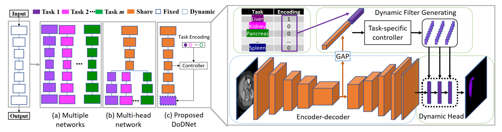

# DoDNet：学习从多个部分标记的数据集中分割多器官和肿瘤

## 〇、摘要

部分标记问题：在体素水平上对三维医学图像进行注释需要大量的人力和专业知识，大多数基准数据集只标注了一种类型的器官或肿瘤

为了解决这个问题，我们提出了一个动态按需网络（DoDNet），它可以学习**在部分标记的数据集上分割多个器官和肿瘤**

DoDNet 的组成：
* 一个共享的编码器-解码器结构（a shared encoder-decoder architecture）
* 一个任务编码模块（a task encoding module）
* 一个用于动态过滤器生成的控制器（a controller for dynamic filter generation）
* 一个单一但动态的分割头（a single but dynamic segmentation head）

当前分割任务的信息被编码为一个任务感知的先决条件，以告诉模型该任务预计会实现什么。与现有的训练后固定内核的方法不同，动态头的内核是由控制器根据输入图像和分配的任务自适应生成的。因此，DoDNet 能够像多个网络或多头网络（multiple networks or a multi-head network）那样，以一种更加有效和灵活的方式分割多个器官和肿瘤。

我们创建了一个名为 MOTS 的大规模部分标记数据集，并证明了我们的 DoDNet 在七个器官和肿瘤分割任务上比其他竞争者更出色的性能。

我们还将在 MOTS 上预训练的权重转移到下游的多器官分割任务中，并取得了最先进的性能。这项研究提供了一个通用的三维医学图像分割模型，该模型已经在一个大规模的部分标记数据集上进行了预训练，并且可以扩展（经过微调）到下游的体积医学数据分割任务中。

> 代码和模型见：https://git.io/DoDNet

## 一、简介

很难在大型数据集中对多个器官和肿瘤进行体素水平的注释，故大多数基准数据集只收集一种类型的器官或肿瘤的分割，而所有与任务无关的器官和肿瘤都被注释为背景。

* LiTS 数据集 - 只有肝脏和肝脏肿瘤的注释
* KiTS 数据集 - 只提供肾脏和肾脏肿瘤的注释

在其他的多分类数据集如 PASCAL VOC 和 Cityscapes 中，每幅图像上都有多种类型的物体注释，这使得因此多器官和肿瘤分割与常规的多分类问题不同，面临部分标注问题的挑战，即如何在这些部分标注的图像的监督下学习多器官和肿瘤的表示。

图：网络结构

主流方法：

1. 通过将部分标记的数据集分成几个完全标记的子集（分为各个分割任务），在每个子集上为特定的独立分割任务训练一个网络，从而形成图(a)中所示的“多网络”
   缺点：这样一个直观的策略大大增加了计算的复杂性
2. 设计一个多头网络(b)，它由一个共享编码器和多个特定任务的解码器（头）组成。在训练阶段，当每个部分标记的数据被送入网络时，只有一个头被更新，其他头被冻结。其他头所做的推断是不必要的，也是浪费的
   缺点：不灵活的多头结构不容易扩展到一个新的标注任务。

本文方法：

* 提出了一个动态按需网络（DoDNet），它可以在部分标记的数据集上训练，用于多器官和肿瘤的分割
* 具有**单一且动态的头部**的 encoder-decoder 网络见图(c)，它能够像多个网络或多头网络那样分割多个器官和肿瘤
* 动态头中的核是由一个控制器根据输入图像和分配的任务自适应生成的。特定任务经过收缩路径后先被送入控制器，与分割任务一起指导每个动态头核的生成
* 由于动态头的轻量级设计，与多头网络相比，重复推理的计算成本少到可以被忽略

本文贡献：

* 从一个新的角度来解决部分标签问题，即提出一个具有动态分割头的单一网络来分割多个器官和肿瘤，如同多个网络或多头网络所做的那样
* 与传统的分割头在训练后是固定的不同，我们模型中的**动态分割头对输入和分配的任务是自适应的**，从而大大提高了效率和灵活性
* DoDNet 在部分标记的数据集上进行了预训练，可以转移到下游的注释有限的分割任务中，因此对于只有有限的注释可用于三维图像分割的医学界是有益的

DoDNet 与以前的方法的不同：

* 将部分标记的问题表述为多类分割任务，并将未标记的器官视为背景，这可能会产生误导，因为在这个数据集中未标记的器官确实是另一个任务中的前景。为了解决这个问题，我们将部分标记的问题表述为单类分割任务，目的是分别分割每个器官
* 这些方法大多采用多头结构，由一个共享的主干网络和多个分割头组成，用于不同的任务。每个头是一个解码器或最后一个分割层。相比之下，所提出的 DoDNet 是一个单头网络，其中的头是灵活和动态的
* DoDNet 使用动态分割头来解决部分标记的问题，而不是将任务先期嵌入到编码器和解码器中
* 现有的大多数方法集中在多器官分割上，而我们的 DoDNet 同时对器官和肿瘤进行分割，这更具挑战性

## 二、方法

### （一）问题定义

一般的 m 多分类问题解决方式：训练 m 个网络，分别解决每一类分类问题，在过程中使得每一类的 loss 达到最小

DoDNet 的解决方式：训练 1 个网络，使得总体所有数据的 loss 总和最小，通过动态头的方法解决这一类问题

### （二）encoder-decoder 结构

#### 1. encoder

* 使用一系列的三维残差块（3D residual blocks）
* 每个三维残差块包含：
  * 卷积核尺寸为 3x3x3 的 3D 卷积
  * 分组归一化（Group Normalization）和 ReLU 激活
* 每个三维残差块间用 stride = 2 的 3D 卷积进行下采样，期间分辨率减半，通道数加倍

encoder 的输出特征图为：

$$F_{ij} = f_E(X_{ij};\theta_E)$$

#### 2. decoder

* 结构上基本与 encoder 对称
* 与 encoder 同层的特征融合
* 添加残差 residual 结构

decoder 的输出特征图为：

$$M_{ij} = f_D(X_{ij};\theta_D)$$

$M_{ij}$ 的尺寸为 CxDxWxH，与原图的尺寸一致

### （三）任务编码

**每个部分标记的数据集只包含一个特定器官和相关肿瘤的注释**

一个数据集用来分割什么任务这个信息需要让网络知道，网络以此知道处理的是哪个区域，分割的是哪个特征

方法：将任务编码为 m 维的 one-hot，并将任务编码向量与输入图像在通道维度拼接，形成一个增强的输入

代价：网络通过额外的输入通道感知任务，虽然能够完成多个任务，但是计算和内存成本的急剧增加，性能有所下降

定义一个 one-hot 向量：

$$T_{ijk} = 
\begin{equation}
\begin{cases}
0,\ k \neq i\\
1,\ k = i\\
\end{cases}
\nonumber
\end{equation}
$$

将 $T_{ijk}$ 扩展到 DxWxH 的尺寸，然后叠加到 $X_{ij}$ 的通道上

### （四）动态滤波的生成

对于传统的卷积层，学习的核在训练后是固定的，并被所有的测试案例所共享。因此，在一个任务上优化的网络对其他任务来说一定是不太理想的，而且很难用一个网络来完成多个器官和肿瘤的分割任务

为了克服这一困难，我们引入了一种动态滤波方法来生成内核，这些内核专门用于分割特定的器官和肿瘤。

具体来说，一个卷积层被用作特定任务的控制器 $\phi(\cdot)$ 。图像特征 $F_{ij}$ 通过全局平均池（global average pooling, GAP）聚合，并与任务编码向量 $T_{ij}$ 连接，作为 $\phi(\cdot)$ 的输入。然后，内核参数 $\omega_{ij}$ 是动态生成的，取决于所分配的任务 $S_i$，也取决于输入图像 $X_{ij}$ 本身，表示如下

$$\omega_{ij} = \phi (GAP(F_{ij})||T_{ij};\theta_\phi)$$

### （五）动态头

在监督训练期间，预测那些没有注释的器官和肿瘤是没有价值的

因此，设计了一个轻量级的动态头，以使特定的内核被分配给每个任务，用于分割特定器官和肿瘤

动态头包含 3 个具有 1x1x1 核的堆叠卷积层。三层中的内核参数，用 $\omega_{ij} = \{\omega_{ij1}, \omega_{ij2}, \omega_{ij3}\}$表示，由控制器 $\phi(\cdot)$ 根据输入图像和指定任务动态生成（四中的 $\omega_{ij}$ 公式）

前两层有 8 个通道，最后一层有 2 个通道，其中一个通道用于器官分割，另一个用于肿瘤分割，总共有162个控制器参数

第 j 幅图像对第 i 项任务的部分预测被计算为：

 $$P_{ij} = ((M_{ij} ∗ \omega_{ij1}) ∗ \omega_{ij2}) ∗ \omega_{ij3}$$

* $∗$ - 卷积
* $P_{ij}$ - 尺寸为 2xDxWxH 的器官和肿瘤的预测结果

在 DoDNet中，每一个分割任务都需要一组特定的内核来完成，但与许多个完整的 encoder-decoder 结构相比，这样的轻量级动态头的计算和内存成本可以忽略不计

### （六）训练和测试

#### 1. 损失函数

采用 dice loss 和 BCE loss 作为损失函数：

$$L = 1 - \frac{2\sum_{i=1}^V p_i y_i}{\sum_{i=1}^V p_i+y_i+\epsilon} - \sum_{i=1}^V (y_i log p_i + (1-y_i) log (1-p_i))$$

* $p_i$ $y_i$ - 第 i 个体素的预测值和 ground truth
* $V$ - 体素的总数
* $\epsilon$ - 平滑因子