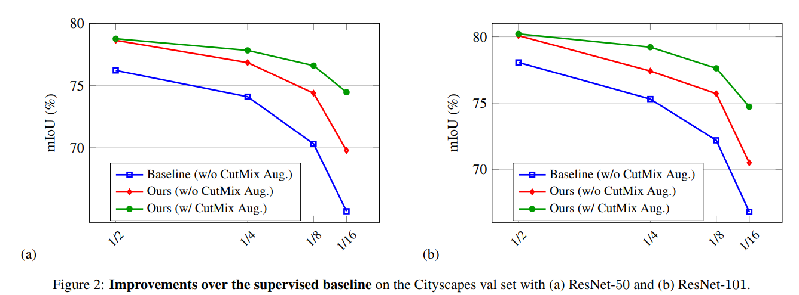

# 带有交叉伪监督的半监督式语义分割法
## （Semi-Supervised Semantic Segmentation with Cross Pseudo Supervision，CPS）

## 〇、摘要 Abstract

* 通过标记数据和额外的未标记数据来研究半监督的语义分割问题，提出交叉伪监督（Cross Pseudo Supervision，CPS）
* CPS 方法：对同一输入图像的两个分割网络施加了**不同初始化**的一致性
  * 一个分割网络中输出的 pseudo one-hot 标签图，监督另一个分割网络（标准交叉熵损失），反之亦然
* CPS的一致性：
  * 鼓励两个扰动网络对同一输入图像的预测的高相似性
  * 通过使用带有伪标签的未标记数据来**扩大训练数据**
* 通过一致性假设来构造损失函数

实验结果：CPS 在 Cityscapes 和 PASCAL VOC 2012 上实现了最先进的半监督分割性能

> 代码：https://git.io/CPS

## 一、简介 Introduction

语义分割训练数据需要像素级的人工标注，成本更高，解决方法为：通过使用标记的数据以及额外的**未标记的数据**来学习分割模型。

半监督式语义分割方法：

* 一致性正则化：使预测与各种扰动保持一致，如通过增加输入图像进行输入扰动[11, 19]，特征扰动[27]和网络扰动[18]
* 自我训练（self-training）[6, 43, 42, 9, 13, 25]：将在标记图像上训练的分割模型得到的未标记图像上的**伪分割图**纳入到训练数据中，以扩大训练数据，并重新训练分割模型

本文提出了一种新颖而简单的**带有网络扰动的一致性正则化方法**，称为**交叉伪监督**（cross pseudo supervision）：

* 将已标记和未标记的图像输入两个分割网络，这两个网络具有相同的结构，但初始化的方式不同
* 两个网络在标记数据上的输出分别由相应的 ground truth 分割图进行监督
* 交叉伪监督：
  * 可以强制两个分割网络之间的一致性
  * 每个输入图像的分割网络估计一个分割结果，即伪分割图
  * 伪分割图被用作监督其他分割网络的额外信息

交叉伪监督策略的优势：

* 像以前的一致性正则化一样，鼓励不同的初始化网络对同一输入图像的预测是一致的，并且预测决策边界位于低密度区域（the prediction decision boundary lies in low-density regions）
* 在优化阶段后期，伪分割变得稳定，比只在标记数据上进行正常监督训练的结果更准确，因为伪标记数据变相扩大训练数据，从而提高了分割网络的训练质量

### 一致性正则化（Consistency Regularization）

> https://blog.csdn.net/by6671715/article/details/123087728
> https://zhuanlan.zhihu.com/p/46893709

深度学习的神经网络，都存在两个问题：

* 模型容易过拟合
* 模型在受到**微小扰动**（噪声）后，预测结果会受相当程度的影响

解决方法：全监督学习中会添加一个新的损失项，半监督学习中使用一致性正则化方法

基于平滑假设和聚类假设：

* 不同标签的数据点在低密度区域分离
* 相似的数据点具有相似的输出

一致性正则化：如果对一个未标记的数据应用实际的扰动，预测结果不发生显著变化，即输出具有一致性

主要思想：对于一个输入，即使受到微小干扰，其预测都应该是一致的

此法一般**基于模型输出**的预测向量，不需要具体的标签，所以其刚好能能应用于半监督学习

方法：通过在未标记数据上构造添加扰动后的预测结果 $\tilde{y}$ 与正常预测结果 $y$ 之间的**无监督正则化损失项**，提高模型的泛化能力

$$Consistency\ Loss = D[P_{model}(y|Augment(x), \theta),P_{model}(y|Augment(x), \theta)]$$

* $D$ - 度量函数，一般采用 KL 散度或 JS 散度，或交叉熵或平方误差等
* $\theta$ - 模型参数，多个模型的参数可以共用，或者通过一些转换建立联系（Mean-Teacher），如 EMA，也可以相互独立（Daul-Student）
* $Augment(\cdot)$ - 数据增强函数，添加一些噪声扰动，其类型在近几年的论文有以下几种：
  * 常规的数据增强，平移旋转，或`随机 dropout` 等，如 `Π-model`
  * 时序移动平均，如 `Temporal Ensembling`，`Mean-Teacher`，`SWA`
  * 对抗样本扰动，如 `VAT`，`Adversarial Dropout`
  * 高级数据增强，如 `UDA`，`Self-supervised SSL`
  * 线性混合，如 `MixMatch`

## 二、相关工作 Related work【机翻】

### （一）语义分割

用于语义分割的现代深度学习方法大多基于完全卷积网络（FCN）[23]。随后的发展主要从三个方面研究模型：分辨率、背景和边缘。关于扩大分辨率的工作包括调解分类网络中造成的空间损失，例如，使用编码器-解码器方案[5]或扩张卷积[36，4]，以及保持高分辨率，如HRNet[34，30]。

利用语境的工作包括空间语境，如PSPNet[41]和ASPP[4]，物体语境[38，37]，以及自我注意的应用[33]。提高边缘区域的分割质量包括Gated-SCNN[31]、PointRend[20]和SegFix[39]。在本文中，我们重点讨论了如何使用无标签数据，主要使用DeepLabv3+进行实验，同时报告了HRNet上的结果。

### （二）半监督的语义分割

语义分割的手动像素注释是非常耗费时间和成本的。探索可用的未标记的图像以帮助学习分割模型是很有价值的。

一致性正则化被广泛研究用于半监督性分割。它使预测/中间特征与各种扰动的一致性得到加强。输入扰动方法[11, 19]对输入图像进行随机增强，并对增强后的图像预测进行一致性约束，从而使决策函数位于低密度区域内。

特征扰动通过使用多个解码器提出了一个特征扰动方案，并强制要求解码器的输出之间的一致性[27]。GCT[17]方法通过使用两个结构相同但初始化不同的分割网络进一步进行网络扰动，并强制要求被扰动网络的预测结果之间保持一致。我们的方法与GCT不同，通过使用伪分割图来执行一致性，并有一个额外的好处，如扩大训练数据。

除了在一幅图像的各种扰动之间强制执行一致性外，基于GAN的方法[25]还强制执行标记数据的基础真实分割图和未标记数据的预测分割图的统计特征之间的一致性。统计特征是从判别器网络中提取的，该网络被学习用来区分地面实况分割和预测分割。

自我训练，又称自我学习、自我标记或决策导向学习，最初是为在分类中使用未标记的数据而开发的[15, 10, 1, 3, 22]。最近，它被应用于半监督的分割[6, 43, 42, 9, 13, 25, 14, 24]。它将以前在标记数据上训练的分割模型获得的未标记数据上的伪分割图用于重新训练分割模型。这个过程可以反复进行多次。关于如何决定伪分割图，引入了各种方案。例如，基于GAN的方法[13, 25, 29]，使用为区分预测和地面真实分割而学习的判别器，在未标记的图像上选择高置信度的分割预测作为伪分割。

PseudoSeg[44]，与我们的工作同时进行，也探索了半监督性分割的伪分割。与我们的方法至少有两个区别。PseudoSeg遵循FixMatch方案[28]，通过使用弱增强图像的伪分割来监督基于单一分割网络的强增强图像的分割。我们的方法采用两个相同的、独立初始化的分割网络，输入相同的图像，并使用每个网络的伪分割图来监督其他网络。另一方面，我们的方法对两个分割网络都进行了反向传播，而PseudoSeg只对强增强图像进行了反向传播。

### （三）半监督式分类

  半监督分类在本世纪的第一个十年被广泛研究[3]。大多数解决方案都是基于假设，如平滑性、一致性、低密度或集群性。直观地说，相邻的数据有很高的概率属于同一类别，或者决策边界应该位于低密度区域。

深度学习方法对扰动的输入或增强的图像施加一致性，鼓励模型对扰动的输入产生类似的输出/分布，如时间集合[21]及其扩展的平均教师[32]。双人学生[18]通过联合学习两个分类网络进行修改，这两个网络的初始化方式不同，预测和图像增强的复杂一致性不同。

### （四）本文提到的文献

#### 1. CutMix

> [11] Semi-supervised semantic segmentation needs strong, high-dimensional perturbations. 
> In BMVC, 2020.
> 1, 2, 3, 4, 5, 6, 7

#### PseudoSeg

> [44] Pseudoseg: Designing pseudo labels for semantic segmentation.
> arXiv preprint arXiv:2010.09713, 2020. 
> 2, 3, 4, 6, 7

## 三、方法 Approach

* 数据集 $D^l$ - 带标注的数据集，共 N 张图像
* 数据集 $D^u$ - 不带标注的数据集，共 M 张图像

### （一）交叉伪监督 CPS

两个平行的分割网络：

$$
\begin{cases}
P_1 = f(X;\theta_1)\\
P_2 = f(X;\theta_2)\\
\end{cases}
$$

* 两个网络结构相同
* $\theta_1$ $\theta_2$ - 参数/权重，初始化不同
* $X$ - 输入数据，做完全相同的处理
* $P_1$ $P_2$ - 分割置信度图，是经过 softmax 归一化后的网络输出，即软伪标签（soft pseudo label）

$$
X \rightarrow f(\theta_1) \rightarrow P_1 \rightarrow Y_1\\
X \rightarrow f(\theta_2) \rightarrow P_2 \rightarrow Y_2
$$

* $Y_1$ $Y_2$ - one-hot 预测结果图，伪分割图（pseudo segmentation map），即硬伪标签（hard pseudo label）

图：CPS 网络模型

#### 1. 监督策略

* 在存在标注的图像上使用 ground truth 进行监督，产生 supervision 损失函数 $L_s$
* 在所有图像上，两个网络交换使用对方的软伪标签进行监督，产生 cross pseudo supervision 损失函数 $L_{cps}$
* 所有损失函数使用交叉熵计算

#### 2. 在 ground truth 上的损失函数

$$L_s = \frac{1}{|D^l|} \sum_{X \in D^l} \frac{1}{W \times H} \sum_{i=0}^{W \times H} (l_{ce}(p_{1i},y_{1i}^*) + l_{ce}(p_{2i},y_{2i}^*))$$

* $p_{1i}$ $p_{2i}$ - 两个网络在位置 $i$ 的 softmax 层输出软伪标签
* $y_{1i}^*$ $y_{2i}^*$ - 带标注图像在位置 $i$ 的 ground truth
* $l_{ce}(\cdot)$ - 交叉熵损失函数

#### 3. 在伪标签上的损失函数

$$L_{cps} = \frac{1}{|D|} \sum_{X \in D} \frac{1}{W \times H} \sum_{i=0}^{W \times H} (l_{ce}(p_{1i},y_{2i}) + l_{ce}(p_{2i},y_{1i}))$$

* $y_{1i}^*$ $y_{2i}^*$ - 两个网络在位置 $i$ 的输出 one-hot 硬伪标签
* $D$ - $D^l \cup D^u$，全部数据集，包含带标注数据和不带标注数据

#### 4. 总损失函数

$$L = L_s + \lambda L_{cps}$$

总的来说，每一张图像上的损失函数计算方式由是否被标注而决定

* 对于有标注的图像，用 ground truth 和对方网络产生的硬伪标签共同监督训练，并为硬伪标签赋予权重 $\lambda$
* 对于无标注的图像，只用对方网络产生的硬伪标签训练，赋予的权重没有作用

创新点：

* 利用双网络来规避样本噪声对网络的影响，使其具备一致性
* 利用硬伪标签来充分使用未标注的图像，增加训练数据量

### （二）使用 CutMix 数据增强

CutMix 数据增强本应用于半监督的 mean-teacher 网络中，将这样的方法迁移到本网络中

将两张图像叠加生成 CutMix 图像，将这张图像送入一个网络中得到硬伪标签。对两个网络都这么做得到两个硬伪标签，将这两个硬伪标签混合后（混合方法未知，参考文献11）

## 四、讨论对比 Discussions

### （一）交叉概率一致性 Cross Probability Consistency

即两个扰动网络之间的可选一致性（An optional consistency across the two perturbed networks）

两个网络的概率向量（softmax 输出的置信度图）应该相似

图：交叉概率一致性

损失函数：

$$L_{cpc} = \frac{1}{|D|} \sum_{X \in D} \frac{1}{W \times H} \sum_{i=0}^{W \times H} (l_2(p_{1i},p_{2i}) + l_2(p_{2i},p_{1i}))$$

* $l_2(\cdot)$ - 两个概率向量的几何距离 $||p_1 - p_2||^2_2$

除了使用 $L_{cpc}$ 保持一致性以外，还使用如 KL 散度等损失函数以及中间层的一致性监督

本文方法使用的是特征-概率一致性（feature-probability consistency），这个层面上两种一致性监督的意义相同

本文在此法之上的改进在于：采用了带有伪标签的未标注数据做完额外的训练数据集

### （二）平均教师模型 Mean teacher

模型的核心思想：

* 模型即充当学生，又充当老师
* 作为老师，用来产生学生学习时的目标
* 作为学生，利用老师模型产生的目标来学习
* 教师模式是连续学生模式的平均值（EMA），因此我们叫它 Mean teacher

图：Mean teacher

模型要点：

* 学生网络参数 $\theta$ 由两种 loss 的反向传播训练而成
* 教师网络参数 $\theta'$ 由学生网络参数 $\theta$ 经过权重平均（Exponential Moving Average，EMA）生成：

$$\theta_t' = \alpha \theta_{t-1}' + (1 - \alpha) \theta_t$$

* EMA 操作每个 step 进行一次（Temporal Ensembling 模型中，EMA 操作每个 epoch 进行一次）
* 教师网络和学生网络产生的软伪标签计算 loss
* one-hot 标签和学生网络产生的软伪标签计算 loss
* 教师网络不进行反向传播，参数只从学生中产生

在 EMA 中，$\alpha$ 是 EMA decay 参数，$\alpha$ 越大，教师网络更新中过去的参数权重就越大，教师网络的记忆力越好

* 在 ramp-up 阶段 $\alpha = 0.99$，在之后的训练中 $\alpha = 0.999$
* 初始时学生网络训练的很快，故教师网络需要忘记之前的、不正确的权重
* 之后，在学生网络提升很慢的时候，教师网络记忆越长越好

为什么 EMA 有用？

* 普通的参数权重：一直累积更新整个训练过程的梯度
* EMA 的参数权重：使用训练过程梯度的加权平均，且初始梯度权值很小，越往后越大
* 由于刚开始训练不稳定，得到的梯度给更小的权值更为合理，所以 EMA 会有效

### （三）单个网络的伪监督

图：Single-network

本文一个降级版本，与本文网络的区别在于：

* 两个网络的参数和结构完全相同（也就是实际上是一个网络）
* 两个网络的输入相同，而本文网络的输入一个为强增强，一个为弱增强
**（暂时没看懂，或许是 CutMix 数据增强的程度不同）**

这个网络结构也就是使用网络的 one-hot 输出来监督网络的软伪标签，这样的监督倾向于**学习网络本身以更好地接近伪标签**，因此网络可能在错误的方向上收敛

本文中，由对方网络的交叉伪标签进行监督，由于网络扰动而与网络本身的伪标签不同，能够以一定的概率学习网络，使其远离错误方向

两个网络之间的**伪标签的扰动**在某种意义上起到了**正则器**的作用，不存在过度适应错误方向的问题

> In contrast, supervision by the cross pseudo label from the other network, which differs from the pseudo label from the network itself due to network perturbation, is able to learn the network with some probability away from the wrong direction. 
> 
> In other words, the perturbation of pseudo label between two networks in some sense serves as a regularizer, free of over-fitting the wrong direction.

### （四）PseudoSeg 模型

使用弱增强数据产生的硬伪标签监督强增强数据产生的软伪标签

图：PseudoSeg

此网络类似于单网络伪监督：弱增强和强增强数据所使用的网络完全相同

不同的是：硬伪标签由弱增强的数据产生，并被用于监督强增强数据的训练

产生结果优于单网络伪监督，原因猜测：

* 基于弱增强的分割图更准确
* 来自弱增强的伪分割图也给伪监督引入了额外的扰动（这也是本文网络有效的原因之一）

## 五、实验细节 Implementation details

### （一）数据集

* PASCAL VOC 2012
* Cityscapes

#### 分区协议 partition protocols 

> [17] Guided collaborative training for pixel-wise semi-supervised learning、
> In ECCV, 2020.
> 2, 3, 4, 5, 6, 7, 9

使用 Guided Collaborative Training （GCT，论文 [17]）中的分区方法，通过对整个训练集进行 $1/2$、$1/4$、$1/8$ 和 $1/16$ 随机下采样

将整个训练集分为两组，作为标记数据集，将其余的图像视为未标记数据集

### （二）评估方法

平均交并比（mean Intersection-over-Union，mIoU）

### （三）实施细节

* backbones - Two segmentation networks with the same weights pre-trained on ImageNet and the weights of two segmentation heads (of DeepLabv3+) randomly
* 优化方式 - SGD（`momentum = 0.9`，`weight decay = 0.0005`，`learning rate = (1 − max _iter/iter )^0.9`）
* 数据增强 - 随机水平翻转、多尺度

## 六、网络效果 Result

### （一）在 baseline 之上的改进

图：效果对比

方法皆基于 DeepLab V3+、ResNet-50、ResNet-101

图表显示本文方法在 ResNet-50 和 ResNet-101 的 Cityscapes 上一直优于监督基线，且下采样程度越低，效果越明显

| mIoU 改进 | $1/16$ 分区 | $1/8$ 分区 | $1/4$ 分区 | $1/2$ 分区 | 
|---|---|---|---|---|
| ResNet-50 vs baseline | 4.89% | 4.07% | 2.74% | 2.42% |
| ResNet-101 vs baseline | 3.70% | 3.52% | 2.11% | 2.02% |
| ResNet-101-CutMix vs ResNet-101 | 4.22% | 1.91% | - | 0.13% |

### （二）与 SOTA（State-of-the-Art）对比

* Mean-Teacher (MT) [32]
* Cross-Consistency Training (CCT) [27]
* Guided Collaborative Training (GCT) [17]
* CutMix-Seg [11]

表：Comparison with SOTA on PASCAL VOC 2012

表：Comparison with SOTA on Cityscapes

### （三）全监督/少部分监督的提升

#### 1. 全监督 Full-supervision

使用完整的 Cityscapes 训练集（2975 cases）来验证我们的方法，并从Cityscapes粗略集中随机抽取3；000张图片作为无标签集。对于无标签集，我们不使用其粗略注释的地面真相。图3说明了对Cityscapes val集的单尺度评估结果。我们可以看到，即使有大量的标注数据，我们的方法仍然可以从无标注数据的训练中受益，而且我们的方法在最先进的分割网络HRNet上也能很好地工作。

#### 2. 少部分监督 Few-supervision