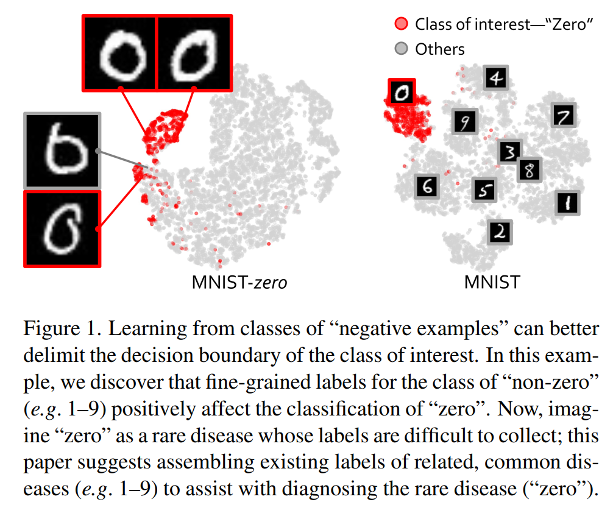

# 〇、摘要 Abstract

Label-Assemble：旨在从公共数据集的集合中释放出部分标注数据的全部潜力。

* 引入了一个新的动态适配器来编码不同的视觉任务，这解决了不可比的、异质的、甚至是冲突的标签协议的挑战
* 采用了伪标签和一致性约束来驾驭有缺失标签的数据，并缓解了不同数据集之间的领域差距

通过对三个自然成像和六个医学成像任务的严格评估：
从“负面例子”中学习有利于分类和感兴趣的类别的分割。这为罕见疾病和新出现的大流行病的计算机辅助诊断提供了新的启示，其中“正面例子”很难收集，而“负面例子”则相对容易收集。

除了在 chest X-ray 数据集（二分类肺部数据集）基准中超过 SOTA 之外，我们的模型在识别罕见病方面特别强大，平均产生超过 3% 的改进

当使用现有的部分标签时，我们的模型性能与使用完整标签的性能相当，消除了额外 40% 的注释成本

# 一、简介 Introduction

本文问题：
如何才能组装和利用大量的孤立的数据集？
How can we assemble and exploit such a great number of isolated datasets?

为了解决这个问题，我们从探究主要的假设开始：一个有不同类别标签的数据集比一个只有相关类别标签的数据集可以培养出更强大的模型。因此，我们提出“标签组合”，以利用部分标签的数据集的组合

具体来说，我们引入了一个新的**动态适配器**来编码不同的视觉任务，它可以动态地整合不同数据集上的部分标签

动态适配器的四个独特优势：
* 发现新的类，
* 有利于多标签分类
* 减少计算成本
* 建立类间关系

此外，**伪标签**和**一致性约束**被用于标签的缺失部分，并缓解不同数据集的领域差距

在三个自然成像数据集和六个医学基准上的结果表明：
* 用严格不重叠的标签组合数据可以提高性能
* 从部分标签的混合物中学习的性能与从全部标签中学习的性能相当
* 注释 "负面例子 "有利于长尾和罕见疾病的分类
* 超过 NIH ChestXray 的 SOTA

这些结果归功于我们简单而有力的观察（如图1所示）：从“负面例子”的类别中学习可以更好地划定感兴趣类别的决策边界。这表明，除了追寻感兴趣的类别的标签外，集合其他类别的标签也能带来可观的性能提升，特别是当感兴趣的对象属于少数类别，例如罕见的疾病和新出现的流行病。

图：手写数字数据集举例

在手写数据集中，对比仅使用“0”作为分割目标和使用所有数字作为分割目标，可以发现带有所有数字作为分割目标时，对“0”的分割正确率较高，也就是说其他的标签对于“0”有积极影响，称其他标签为“负面例子”。

设想“0”是一种罕见的疾病，在其标签难以收集的情况下，集合相关的、常见的疾病的现有标签，可以协助诊断罕见的疾病“0”

本文贡献：

* 设计了一个新的框架，其中包括：
  * 一个带有可学习任务编码的**动态适配器**，以利用部分标记的数据
  * **伪标记**和**一致性约束**，以利用未标记的数据，同时缓解不同数据集的领域差距（§3）

* 开始了一项新的倡议，即“标签-组装”，并建立了用部分标签组装多个数据集的可行性和有效性（§5.1）

* 证明了使用现有的部分标签，我们的模型可以达到与使用具有详尽标签的完全标注的数据集相媲美的性能，消除了胸部疾病分类中额外 40% 的注释成本（§5.2）

* 为计算机辅助诊断罕见疾病和新出现的大流行病提出了一个独特的注释方案，集合了相关疾病的现有标签，而不是狭隘地追求感兴趣的类别的广泛标签（§5.3）

# 二、准备工作 Preliminary

## （一）重要假设 Principal Hypothesis

### 1. 假设

假设一个标有各种类别的数据集比一个只标有感兴趣的类别的数据集可以培养出更强大的模型。

### 2. 验证

MNIST-zero 数据集：
* 从原始的 MNIST 数据集中创建
* 数字为“0”的图像被标记为阳性，其余图像为阴性
* 目标是训练一个能够识别“0”的图像的模型
* MNIST-zero 和 MNIST 之间的图像总数是相同的
* 在 MNIST-zero 中底片的构成是未知的，但在 MNIST 中却是已知的
* MNIST-zero 减少了对带有“0”的图像的分类。因为负片例子中缺乏细粒度的标签，这有可能导致类似零的“6”和“0”之间的混淆

表：“负面例子”的效果增益

如果模型在 Cityscapes 中的所有 19 个类别中，它可以更精确地从图像中分割出“公共汽车”，而只接触到 5 个部分类别的模型则相反

得出的结论：
* 从“负面例子”中学习可以更好地划定感兴趣类别的决策边界，这在分割和分类任务中都得到了验证。这是“标签组合”倡议的基础，强调了将具有不同（但部分）标签的多个数据集相结合的必要性
* 空间相关的标签是分割的首选：通过包括其邻近器官的标签，可以更好地分割胰腺
* 语义相关的标签是分类的首选：通过包括其他胸部疾病的标签，肺结节可以被更好地分类

## （二）问题定义 Problem Definition

部分标注数据集和全标注数据集

# 三、标签整合 Label-Assemble

## （一）带有可学习任务编码的动态适配器

**Dynamic Adapter with Learnable Task Encoding**

图：动态适配器结构

此结构能够利用异源的部分标记和未标记的数据（$D_0$、$D_1$、$D_2$）

这些数据集的标签是**不可比的**且是**冲突的**，$D_0$ 中的负面例子可以包括 $D_1$ 中的正面类

因此，我们引入了一个动态适配器，它可以通过整合问题（如 q = "图像中是否有 0 ？"）和图像特征（来自共享特征提取器 $f(\cdot)$）来生成答案。

如果现有的标签中提供了 ground truth，使用监督 loss（$L_{bce}$）
如果现有的标签中没有提供 ground truth，使用两个非监督 loss（$L_{consist}$ & $L_{pseudo}$）。

----

为了从部分标记的数据集中学习，我们开发了一个具有可学习任务编码的动态适配器，并以问答（question-and-answer）的方式对其进行训练

与 DoDNet 的控制器类似，我们的任务编码是一个数字向量，但我们的任务编码在训练阶段是可以学习的

因此，学习到的编码将成为软标签向量，并建立一个类间关系，这比传统的 one-hot 向量（所有的类之间都是正交的）更有信息量

我们的动态适配器包括一个卷积层，根据任务编码生成参数，然后是一个线性分类层，产生输出答案。如图2所示，给定任务编码（q）和输入图像（x），我们的动态适配器可以计算出答案（a）如下:

$$a = \omega(q;\theta_\omega) * f(x)$$

* $*$ - 内积运算（inner product operation）
* $\omega$ - 动态适配器的卷积层
* $f(\cdot)$ - 特征提取器

提供 ground truth 时的 BCE loss：

$$L_{bce} = -(y \cdot log(a) + (1 - y) \cdot log(1 - a))$$

* $y$ - ground truth 提供的正确答案

## （二）伪标签和一致性约束

为了充分释放无注释标签的潜力，我们引入了一个锐化算子（sharpening operator）来生成伪标签：

$$
\tilde{a}=
\begin{cases}
a + (1 - a) / t,\quad a > \tau \\
a - a / t,\quad a \le \tau \\
\end{cases}
$$

* $\tilde{a}$ - 生成的伪标签答案
* $t$ - 锐化温度（sharpen temperature），实验中为 4.0
  * 如果 $t=\infin$，就没有伪标签
  * 如果 $t=1$，模型将软标签转换为完全的 one-hot 硬标签
* $\tau$ - 门限值，实验中为 0.5
  * 超过（低于）阈值 $\tau$ 的预测可以分配给由 $t$ 控制的更高（更低）的分数

有了锐化算子，使模型能够在未标记的数据上进行自我训练的损失：

$$L_{pseudo} = ||a_w - \tilde{a}_w||^2_2$$

* $a_w$ - 弱增强图像的答案
* $\tilde{a}_w$ - 弱增强图像的答案生成的伪标签

为了减少异质数据源之间的领域差距，我们进一步对弱增强（$a_w$）和强增强（$a_s$）的图像采用一致性约束：

$$L_{consist} = ||a_s - \tilde{a}_w||^2_2$$

## （三）总损失函数

$$L_{total} = L_{bce} + L_{pseudo} + L_{consist}$$

# 四、实验 Experiment

## （一）数据和评估标注 Dataset & Metric

在六个医学影像数据集和三个自然影像数据集上检验：
CheXpert2 [25], ChestXray3 [57], DermaMNIST, TissueMNIST, OrganAMNIST, RetinaMNIST, MNIST [32], CIFAR10 [29], Cityscapes [13]

附录A-C提供了训练配方，以及每个数据集的进一步细节。正如第2.2节所定义的，ChestXray和CheXpert的联合可以被认为是一个部分标记的数据集，因为它们来自两个不同的机构，总共提供了21个类别的标签，其中只有7个重叠的类别。考虑到CheXpert官方val集的图像数量有限，我们将训练集分离为166,739张图像和56,675张图像，作为新的训练集和测试集（比例与ChestXray官方分割相同）。

用曲线下面积（AUC）来评估胸部疾病分类的性能
用交叉联合（IoU）来评估语义分割
对于所有的实验，我们提出了基于独立双样本t检验的统计分析

## （二）基础模型和实现细节 Baseline & Implementation

为了进行比较，我们必须为多标签分类任务重新实施现有的方法，因为大多数方法[14, 17, 68]是为多器官分割任务提出的。我们将我们的方法与DoDNet[68]（更确切地说，与它的控制器）进行了比较，因为它是该领域的最新作品之一。我们还比较了主要的半监督方法，如FixMatch[52]。我们还在第2.1节中证明了我们的方法比多网络策略[37]（一个模型一个任务）的优越性。此外，我们在表3-4中使用完全标记的数据集作为强有力的参考，设定了一个性能上限。最后，我们将我们的方法与最先进的方法[7, 18, 19, 26, 39, 49, 55]在ChestXray上进行比较（§5.4和附录§A）。

我们选择DenseNet121[24]作为骨干。所有的实验都运行64个epochs，利用Adam优化器[27]，初始学习率为2e-4。我们在高原上将学习率降低2.0倍，并有5步的耐心。早期停止的耐心被设定为10个历时。伪标签阈值τ和锐化温度t分别为0.5和4.0。表10中提供了锐化温度t的消融研究。
