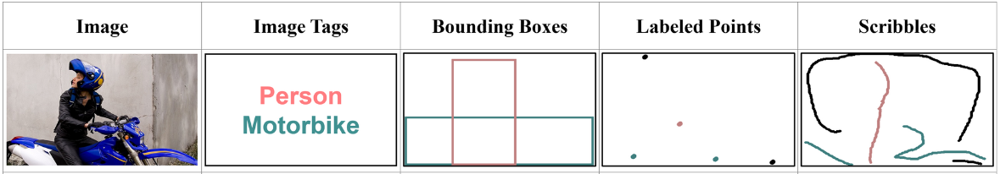
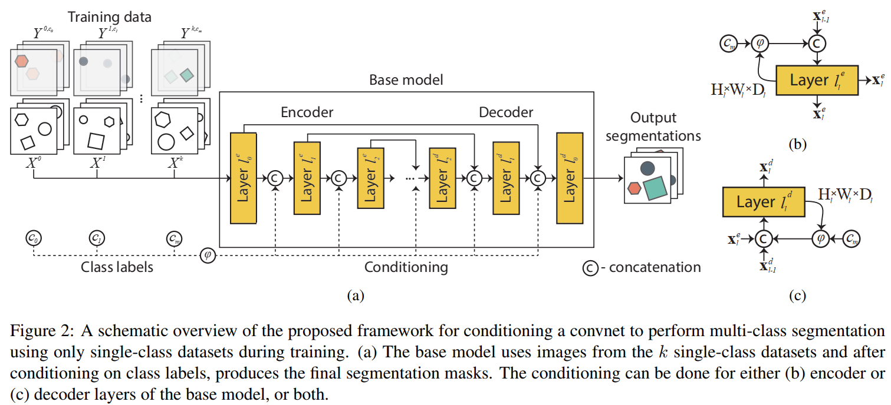
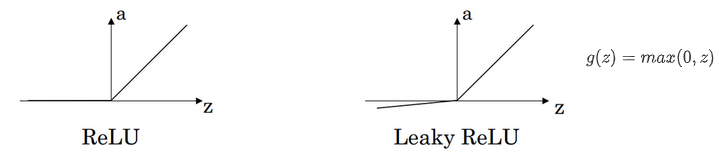
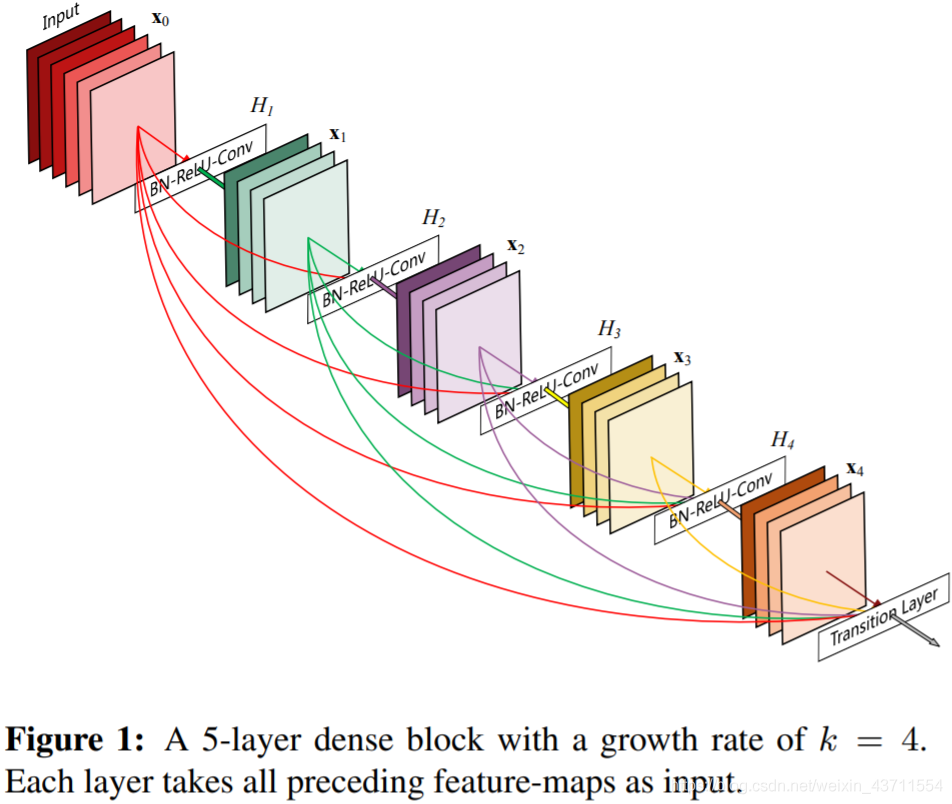

# 〇、摘要 Abstract

生物医学图像，获得足够的多类注释是一项费力的工作，而且往往是不可能的，只有单类数据集可用

提出了一个统一的高效框架，通过结合单类数据集和利用一种**新的调节卷积网络的方式**来实现多类分割的稳健同步学习

超过了目前最先进的解决方案（高达2.7％）

与目前为特定的单类数据集精心定制的解决方案不同，我们利用了来自不同来源的数据集。此外，我们还展示了我们的方法对自然图像的适用性，并在 Cityscape 数据集上对其进行评估。

# 一、简介 Introduction

然而，虽然单类数据集经常包含单个图像中的相同对象，但地面真实注释只以二进制掩码的形式提供给某一类对象，而且不同数据集的图像集并不重叠。

因此，简单地结合数据集来训练一个多类分割的单一模型是有障碍的。传统上，单类数据集被用来为特定类别的分割开发高度定制的解决方案。

在本文中，我们介绍了一种新的、有效的训练和调节单一卷积网络（convnet）的方法，以利用非重叠的单类数据集进行多类分割。

方法允许模型通过所有被建模的目标类隐含地共享其所有参数。这促使模型有效地学习不同类别的物体之间的空间联系，并提高其概括能力。

本文贡献：
* 首次将 convnet 调节用于语义分割
* 所提出的调节框架能够通过在单类数据集上训练的单一模型进行有效的多类分割，与单独的特定类别模型相比，大大降低了训练复杂性和参数总数
* 在公开的肝脏、脾脏和胰腺分割的数据集上，以明显降低的计算成本，改善了最先进的结果（高达2.7%）。
* 证明了此方法对自然图像的适用性，并在 Cityscapes 数据集上对其进行评估

# 二、相关工作 Related work

弱标注方式：
* 图像标签 image labels
* 点和涂鸦 points and scribbles
* 边界框 bounding boxes

图：弱标注方式

解剖结构的分割，特别是腹部器官，被认为是一个困难的问题，因为它们在尺寸、位置和形状上表现出高度的可变性（图1）。各种基于Convnet的分割方法已被提出用于腹部器官的分割。这些利用单类数据集的方法大多是专门针对某一特定器官的分割，如肝脏[10, 25]或胰腺[13, 34]。此外，这些工作往往描述了复杂的、错综复杂的多阶段方法[45]。一些更普遍适用的基于Convnet的方法已经被提出并在多个器官上进行测试[11]。这些方法描述了单个器官的分割模型，并将单独的分割融合在一起以产生最终的轮廓。然而，虽然显示了最先进的性能，但这些模型必须单独训练和应用于每个器官的分割，这表现为计算资源的低效使用和额外的训练时间。此外，这种单独训练的模型没有嵌入腹部器官之间的空间相关性，因此很可能对每个特定的单类数据集过度拟合。此外，这些模型往往还需要预处理和后处理步骤，这使模型更加复杂和特殊化。

已有一些研究提出了对医学图像中的解剖结构进行多类或多器官同步分割。其中大多数利用概率图谱[4, 29, 40]和统计形状模型[28]。这些方法需要对训练数据集中的所有体积图像进行注册。这个预处理步骤在计算上是昂贵的，而且由于病人之间的腹部器官的大小、形状和位置有相当大的差异，往往不完美。最近，一些基于Convnet的解决方案[35]被提出，用于多器官同步分割。然而，所有这些方法都是在公开的不可用的多类分割数据集上开发和评估的。此外，所使用的多类数据集是由一个机构获得的，并表现出相同的图像质量和缺乏慢性异常。相比之下，我们利用不同的单类数据集，并描述了一种调节Convnet的新方法，以开发一个具有高泛化能力的多类分割模型。

调理已被广泛用于图像合成中。一系列关于生成以某些属性（如类别或标签）为条件的图像的工作[23, 38, 42, 43]已经显示出成功和引人注目的结果。Ma等人[26]提出了一个基于任意姿势的人物图像合成的框架。Zhu等人[49]对图像-图像转换的潜在结果的分布进行了建模。Reed等人[32]展示了给定所需内容及其在图像中的位置的图像合成。然而，用于语义分割的条件卷积网领域还没有被开发，也没有被探索过应用。在本文中，我们描述了一种以分割为目的的条件信念网的方法，对该方法在腹部器官和城市场景的分割上进行了评估，并讨论了一系列其他可能的应用。

# 三、方法 Method

## （一）基础模型 Base model

图：网络结构图

3D 全卷积类 U-net 型结构网络结构，带有跳跃连接的编码器-解码器结构

具体为使用 DenseNet 结构的 baseline，使得每一层的输入为之前各输入的拼接：

$$x_l = F_l([x_0, x_1, x_2, \cdots, x_{l-1}])$$

* $x_l$ - 第 $l$ 层的输出
* $[ \cdots ]$ - concat 维度层面拼接
* $F_l$ - Leaky ReLU 层（α 为 0.3），3x3x3 的卷积层

图：Leaky ReLU 层

图：DenseNet

使用 DenseNet 的优势：

* 每一层的输入来自前面所有层的输出，可以减轻梯度消失现象，训练更深的网络
* 跳跃连接充分利用各层特征，可以相对削减网络宽度，以减少参数（跳跃连接是以合并通道的方式，大量的中间 Feature maps 是否太占内存）

编码器部分：

* 一个 3x3x3 卷积层 + 六个密集块（猜测是图中的结构），通过 2x2x2 的最大池化层相连接
* 每个密集块的通道数与深度成正比

解码器部分：

* 使用反卷积作为上采样
* 与编码器对称
* 使用 sigmoid 作为分类

## （二）条件限制 Conditioning

条件限制的目标：

* 给模型注入能够从单类数据集中推断出多类的分割和关系能力，
* 保持基础模型的完全卷积性、简单和高效，以避免可能对性能产生负面影响的额外开销

利用一个需要分割的标签类别 $c_m$ ​来调整卷积网络
在卷积操作之后和非线性之前，将条件信息作为中间激活信号的一部分：

$$\varphi(c_m, H_j, W_j, D_j) = O^{H_j \times W_j \times D_j} \odot hash(c_m)$$

* $O^{H_j \times W_j \times D_j}$ - 尺寸为 $H_j \times W_j \times D_j$ 的全 1 张量
* $\odot$ - 矩阵元素点成
* $hash(\cdot)$ - 定义的类别对应表

生成的 $\varphi$ 等同于一个尺寸为 $H_j \times W_j \times D_j$，值为 $hash(c_m)$ 的张量

则第 $l$ 层的输入为：

$$x_l = [x_{l-1}, \varphi(c_m, H_j, W_j, D_j)]$$

这样的调节不依赖于类别可能的属性，如位置、形状等，这样做是为了框架的泛化能力

