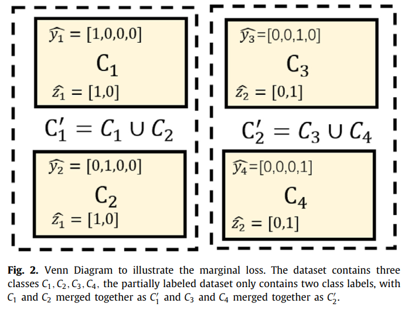
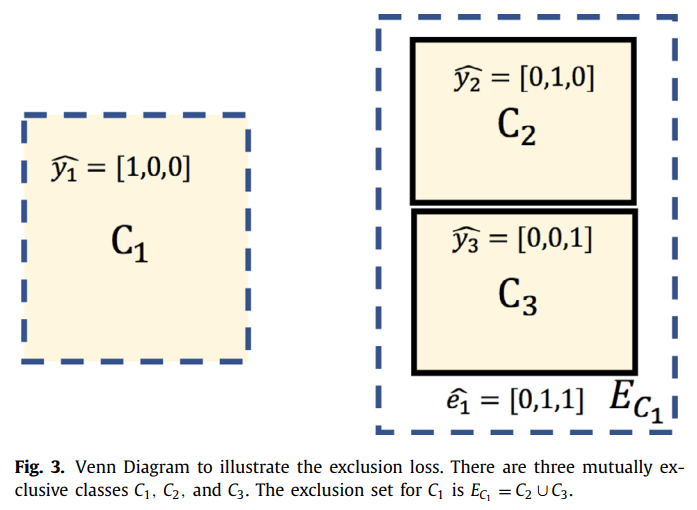

# 〇、摘要 Abstract

本文研究如何从数据集的联合中学习一个多器官分割网络

提出了两类新的损失函数：边际损失（Marginal loss）、互斥损失（Exclusion loss）

因为部分标记的图像的背景标签实际上是所有未标记的器官和真实背景的合并，这种合并的背景标签的概率是一个边际概率，是合并前相关概率的总和

这个边际概率可以插入任何现有的损失函数（如交叉熵损失、Dice损失等），形成一个边际损失

利用器官不重叠的事实，我们提出了互斥损失来衡量已标记的器官和未标记的器官的估计分割之间的差异

# 一、简介 Introduction

目前几乎所有的分割模型都依赖于完全注释的数据，具有很强的监督性。策划一个大规模的完全注释的数据集是一项具有挑战性的任务，既昂贵又耗时。在多器官分割研究领域，目前的标注数据集通常样本量较低，且多为部分标注，这也是一个瓶颈。也就是说，一个数据集有几个器官被标记，但不是所有的器官（如图1所示）。这种部分标注的数据集使我们无法使用需要全面监督的分割方法。

如何充分利用这些部分注释的数据来提高分割的准确性和鲁棒性，成为一个具有实际需求的研究问题。在网络模型能力充足的情况下，大量的数据通常意味着它更有可能代表现实中的实际数据分布，从而导致更好的整体性能。受此启发，在本文中我们研究了如何从这种部分标记的数据集的联合中学习一个单一的多器官分割网络。这样的学习并没有引入任何额外的计算。

# 二、方法 Method

分割是通过对相同标签的像素进行分组来实现的

一个有标签的像素有两个属性：像素和标签，因此，有可能通过利用像素或标签信息来提高分割的性能，有两个想法：

* 利用每个图像像素的一些先验知识，如它的解剖位置或它与其他像素的关系，以促进网络更好地进行分割
* 合并或分割标签，以帮助网络更专注于特定的任务要求

将这两个想法应用于多器官分割任务：

* 由于大量的部分标签图像，我们将所有未标记的器官像素与背景标签合并，这形成了一个边际损失
* 关于众所周知的器官相互排斥的先验知识，我们设计了一个排除性损失，在每个图像像素上增加排除性信息，以进一步减少分割误差

## （一）常规交叉熵损失和常规 Dice 损失

常规交叉熵损失：

$$L_{rCE} = - \sum_{n \in \Omega_N} y_n log(p_n)$$

常规 Dice 损失：

$$L_{rDice} = \sum_{n \in \Omega_N} (1 - 2 \cdot \frac{y_n p_n}{y_n + p_n})$$

## （二）边界损失 Marginal loss

有一些类别的像素标注并不准确，为了解决这一问题，将多个标签相互融合

由原来的 N 个类别 $\Omega_N = \{C_1, C_2, \cdots\, C_N\}$ 缩减到 M 个类别 $\Omega_M' = \{C_1', C_2', \cdots, C_M'\}$，且有 $N > M$

图：标签融合

标签融合后，将预测的 one-hot 标签集从 $\hat{y}_n = [y_1, y_2, \cdots, y_N]$ 转换为 $\hat{z}_m = [z_1, z_2, \cdots, z_M]$，即当一个像素属于第 $i$ 类时 $z_i = 1$，其他 $z = 0$

所有类别的一个子集 $\Phi_m \subset \Omega_N$ 用来构成一个多个类别组合的新类别 $C_m'$，组合而成的新类别的概率称为边界概率（marginal probability），第 $m$ 个边界概率 $q_m$ 为组成其新类别所有类的概率之和：

$$q_m = \sum_{n \in \Phi_m} p_n$$

将常规交叉熵损失和常规 Dice 损失迁移到此领域来，即为边界交叉熵损失（marginal cross-entropy loss）和边界 Dice 损失（marginal Dice loss）:

$$L_{mCE} = - \sum_{m \in \Omega_M'} z_m log(q_m)$$

$$L_{mDice} = \sum_{m \in \Omega_M'} (1 - 2 \cdot \frac{z_m q_m}{z_m + q_m})$$

## （三）互斥损失 Exclusion loss

在多器官分割任务中，有些类别是相互排斥的，互斥损失的设计是将排他性作为每个图像像素的额外先验条件

我们将第 $n$ 类的互斥子集定义为 $E_n$，它包括与第 $n$ 类互斥的部分或所有的标签索引

互斥标签信息被编码为 $N$ 维向量 $\hat{e}_n=[e_1, e_2, \cdots, e_N]$，其获得方式为：

$$\hat{e}_n = \sum_{k \in E_n} \hat{y}_k$$

图：标签互斥

同样定义互斥交叉熵损失和互斥 Dice 损失：

$$L_{eCE} = - \sum_{n \in \Omega_N} e_n log(p_n + \epsilon)$$

$$L_{eDice} = \sum_{m \in \Omega_M'} 2 \cdot \frac{e_n p_n}{e_n + p_n}$$

* $\epsilon$ - 避免无限大的影响

# 三、实验和结果 Experiments and results

## （一）问题设置和基准数据集 