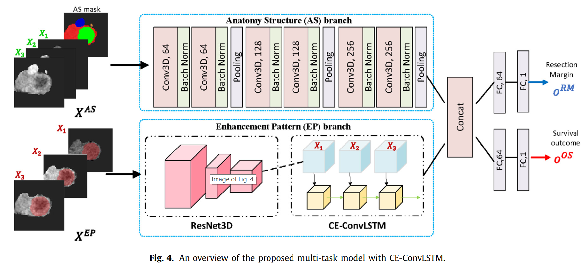
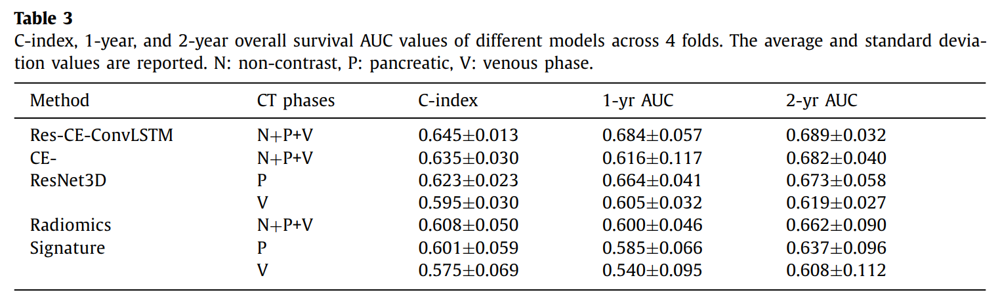

# DeepPrognosis: 通过对比度增强CT成像预测胰腺癌的术前生存率和手术切缘

# 〇、摘要 Abstract

胰腺导管腺癌（pancreatic ductal adenocarcinoma，PDAC）是最致命的癌症之一，预后很差。对于符合初步切除 PDAC 的患者来说，手术仍然是潜在治愈的最佳机会。

即使在相同阶段和接受过类似治疗的切除患者中，其结果也有很大差异

因此，希望对可切除的 PDAC 进行准确的术前预判，以进行个性化治疗

然而，目前还没有自动化的方法来充分利用对比度增强计算机断层扫描（contrast-enhanced computed tomography，CE-CT）成像来治疗 PDAC

不同CT阶段的肿瘤衰减变化可以反映出单个肿瘤的内部基质部分（tumor internal stromal fractions）和血管化（vascularization），可能会影响临床结果

本文贡献：

* 提出了一个新的深度神经网络，用于可切除 PDAC 患者的生存预测，命名为：三维对比度增强卷积长短期记忆网络（3D Contrast-Enhanced Convolutional Long Short-Term Memory network，CE-ConvLSTM），它可以从 CE-CT 成像研究中得出肿瘤衰减特征或模式

* 提出了一个多任务 CNN 来完成结果和边缘预测的任务，其中网络受益于学习肿瘤切除边缘相关的特征来改善生存预测

* 与现有的最先进的生存分析方法相比，所提出的框架可以提高预测性能

# 一、简介 Introduction

胰腺癌是美国癌症死亡的第三大原因，胰腺导管腺癌（PDAC）是最常见的（约 95%）胰腺癌，在所有实体恶性肿瘤中预后最差，5 年总生存率（OS）为 10%

**阴性切除边缘的手术**切除可能是 PDAC 患者潜在的治愈性治疗选择，故为那些最有可能受益的人提供手术治疗（例如，治愈后长期生存的机会很高），对改善患者的预期寿命非常重要

最近，许多机器学习和深度学习方法被提出来，用于利用计算机断层扫描（CT）或 MRI 成像对各种人类癌症进行术前预后

## （一）手工制作的放射学方法  handcrafted radiomics approach

放射学方法是一种将医学图像转换为手工制作的放射学特征的新兴技术，已经在胶质母细胞瘤脑瘤、肺癌和头颈部癌症等方面成功展示了其力量

手工制作的放射学方法通常包括在医学影像上对感兴趣的区域（如肿瘤）进行手工分割，并从 ROI 中提取数百个定量特征，这些特征描述了肿瘤的几何、强度和纹理特征。

机器学习方法被用于最后一步，以识别或选择与特定临床任务相关的成像特征。

缺点：由于依赖人类的特征设计、手工分割、成像和预处理技术的变化来提取特征，因此对**可重复性**和引入的**人为偏见**存在有效的担忧

## （二）深度学习方法

与传统的放射组学特征学习相比，深度学习方法可以自动学习临床相关的放射图像和几何特征，**避免了对人工干预**

基于三维卷积神经网络（CNN）的预后模型在肺癌和胶质瘤的结果预测中表现出良好的性能

三维 CNN 的成功有助于捕捉三维总肿瘤体积和瘤周区域的深层特征

缺点：这种模型可能不能很好地概括 PDAC 的预后，因为**重要的预测信息没有从动态对比增强计算机断层扫描（DCE-CT）成像和胰腺及胰腺周围的解剖学中得到有效利用**

动态对比度增强计算机断层扫描（DCE-CT）是胰腺癌的首选成像模式，在描绘、分期、病人管理和评估 PDAC 可切除性上发挥着重要作用

本研究中使用的术前多阶段 CE-CT 胰腺成像已经在**三个时间点**进行了扫描

在非对比阶段后，胰腺阶段的平均成像时间延迟为 40-50 秒，门静脉阶段为 65-70 秒

## （三）主要贡献

本文中提出了一种新型的三维对比度增强卷积长短时记忆（CE-ConvLSTM）网络，从多相 CE-CT 图像中学习肿瘤衰减的增强动态变化

### 1. 框架设计

* LSTM：相比于直接将融合的图像输入网络，使用 LSTM 网络可以更有效地捕获肿瘤在几个阶段的时间变化

* 多任务学习：为了使切除边缘信息能够被生存预测任务利用，此框架需要是一个多任务学习框架，对边缘状态和结果进行联合预测，如此可以使这两个任务相互受益，提高这两项任务的预测精度，得出更有效、更全面的预后相关的深层图像特征

* 自学习：我们提出了一种自学习方法，用于自动胰腺和胰腺周围的解剖分割，而不需要对我们的 PDAC 数据集进行任何注释

在临床上，将深度学习的输出结果与既定的临床预后因素（如 pTNM 分期、病理肿瘤大小、CA19-9 和基质部分等）结合起来分析，以证实其是一个独立的风险因素

肿瘤和周围胰腺实质（不包括胰腺导管）之间的图像对比反映了 PDAC 的分子和病理异质性——它可用于将患者分层为不同的亚型，包括更长-更短的生存时间

## （四）相关医学知识

### 1. 切除边缘

切除边缘是在手术期间切除以治疗肿瘤的组织部分周围的区域。它们可能包括完全健康的正常细胞，或健康组织和癌变组织的混合物。在某些情况下，外科医生未能切除所有癌症，并且边缘是癌变的。癌症手术的目标通常是获得“干净的边缘”，这意味着病理学家无法识别样本边缘的任何癌细胞

边缘切除状态与 PDAC 患者的总体生存率有关，需纳入放射学的 PDAC 预后模型。但只有在进行手术后才能获得边缘状态，希望术前对边缘切除情况进行预测

### 2. 肿瘤切除

对恶性肿瘤的切除效果和切除切缘，可做不同的标定，分别为 R0、R1 和 R2 切除

R0 切除和 R1 切除，有本质上的区别。R0 切除代表完整切除肿瘤，且镜下切缘为阴性，即无肿瘤残留

有时会出现 R1 切除，R1 切除指肉眼看到肿瘤切除干净，但在显微镜下时，切缘可以看到肿瘤细胞，**R1 切除效果远不及 R0 切除**，不能真正达到肿瘤的根治效果，预后效果较之 R0 切除差，且术后整个复发率、转移率、总体生存率均效果较差。还有一种切除方法为 R2 切除，**R2 切除效果更差**，R2 切除的肿瘤肉眼可见未切干净，多用于晚期肿瘤的姑息手术

R0、R1 切除中，应尽量做到 R0 切除，可达到肿瘤较满意的综合治疗效果。为了达到 R0 切除，应在术中对肿瘤的切缘，送病理科做快速病理检查。若切缘有肿瘤细胞，应做扩大切除，若没有，则 R0 切除能达到较满意的效果

### 3. 肿瘤密度

肿瘤并不能是以高密度和低密度来判断的，密度高的一般是指对 CT 或核磁共振等影像学检查的描述

一般来说肝癌的患者 CT 平扫时一般表现为低密度的病灶

* 动脉期由于肿瘤内动脉供血的丰富，强化比较明显，则表现为高密度
* 门静脉期肝脏强化密度比较高，肿瘤内造影剂开始下降，多表现为相对的低密度
* 延迟期肿瘤内的造影剂已经基本消退，肝脏密度也开始下降，此时的肿瘤显示比较清楚

胸部 CT 发现肺部高密度结节影可能是钙化灶出血，也可能是非实体的肿瘤

### 4. 肿瘤异质性

肿瘤异质性指肿瘤在不断增殖和分化过程中发生变化，导致分子生物学特点或者基因层面的特点发生改变，在增殖、侵袭、转移能力，以及对药物抵抗能力方面都发生质的变化

可以是同一癌肿分化而来，以后很多代癌细胞都有可能发生变化，导致肿瘤异质性

肿瘤异质性可以分为时间异质性和空间异质性：

* 时间异质性：指肿瘤在一开始时是表现为此种特性，而过一段时间后因为通过不同治疗而发生变化

* 空间异质性：比如同样是肝癌，在不同个体中表现不一样，有的患者肝癌恶性程度高，治疗困难、生存期短，而有的患者恶性程度比较低，不容易转移。空间异质性也可以表现为不同器官，比如在原发灶的病灶和在骨转移肺转移上面的病灶，特点不一样，有的病灶对化疗敏感，而有的病灶对化疗不敏感，而有些病灶靶向治疗过程中又会出现增大，是肿瘤异质性的表现

### 5. 胰腺导管内乳头状黏液肿瘤 IPMN

胰腺导管内乳头状黏液肿瘤（intraductal papillary mucinous neoplasm，IPMN）是一种较少见的胰腺囊性肿瘤，多诊断为慢性胰腺炎或黏液性囊腺瘤

IPMN 和 IPMT（intraductal papillary mucinous tumor）是同一个疾病的称谓

起源于胰腺导管上皮，呈乳头状生长，分泌过多的黏液，引起主胰管和分支胰管进行性扩张或囊变

临床症状和体征取决于导管扩张的程度和产生黏液的量

肿瘤可局限性生长，也可沿主胰管或分支胰管蔓延，导致相邻的主胰管或分支胰管进行性扩张，扩张的导管内分泌大量黏液，位于胰头及钩突区的肿瘤可突入十二指肠，使黏液从扩大的十二指肠乳头流入肠腔

显微镜下可见肿瘤内有无数的小乳头，表面覆以柱状上皮，上皮分化程度差异较大，可从不典型增生到乳头状腺瘤或腺癌，也可混合存在。因此，有学者也用 IPMT 指代恶性或潜在恶性肿瘤的 IPMN

# 二、相关工作 Related work

计算机断层扫描（CT）是检测、分期和评估人类癌症最常用的成像方式。利用 CT 图像进行生存预测的方法分为两类：传统的**基于放射学**的方法和**基于深度学习**的方法

## （一）放射学方法

放射学特征已经证明了描述潜在肿瘤生物学的潜力，因此被用来与许多癌症类型的各种诊断和预后任务相关联

放射学方法利用纹理分析将成像数据转换为高维可测量和预定义的特征，该方法捕获了肿瘤内像素强度的空间变化。这些特征通常包括信号强度、形状、纹理和高阶纹理特征：

* 信号强度特征是根据单个体素强度的直方图来计算的
* 形状特征是根据目标（如肿瘤）的 2D/3D 几何形状设计的
* 纹理特征是在二维或三维计算的，以考虑相邻像素或体素的衰减空间关系
* 高阶纹理特征包括统计学，在特征提取前加入小波滤波器等过滤过程

放射学特征提取过程通常会产生数百个手工制作的特征，随后要进行降维和特征选择，以确定最相关的特征

放射性组学最重要的临床相关应用是预测癌症患者术前的生存率，尤其 PDAC 患者

PDAC 与其他实体瘤类型的癌症不同，目前手术切除是 PDAC 患者的唯一治愈方法，但胰腺切除术会提高发病率，并带来手术死亡风险

有效的术前风险模型对那些能从胰腺切除术中获益最多的患者非常有用。在多项研究工作中，放射组学特征被用来预测可切除 PDAC 的总生存率和无病生存率

Cassinotto 等人发现肿瘤低密度化与较高的肿瘤等级、较大的淋巴结侵犯和较短的无病生存期有关

另一项研究从门静脉期 CT 的所有肿瘤切片中提取放射学特征，发现异质性低衰减的肿瘤与不良的总生存率有关。虽然有些报告认为异质性肿瘤与较差的生存率有关；其他报告则发现更多的同质性肿瘤与不良的生存率有关，这与之前的发现相矛盾

最近，传统的放射组学方法因其缺乏可重复性和可解释性以及对小数据集的过度拟合而受到批评和挑战。

## （二）深度学习生存模型

基于深度学习的方法不仅在医学影像诊断方面表现良好，而且在寻求更强大的深度表征的深度生存模型方面也表现良好，基于各种成像模式，包括病理、放射图像和 PET 成像

在计算数字病理学方面，许多带有病理切片的深度学习生存模型，已经被证明在解决各种癌症类型和来自真实大规模临床环境的特定结直肠癌方面都很成功

与只能通过手术活检程序获得的病理切片不同，动态对比度增强CT可作为对癌症进行分期和评估的第一线成像方式

对于 PDAC 患者来说，使用CT图像的预测模型可能更加重要和方便，因为他们的大部分病理结果只能在手术后获得

许多研究提出了胶质母细胞瘤和肺癌患者 CT 图像中的各种深度学习生存模型

胶质母细胞瘤（GBM）是最常见的恶性脑肿瘤，许多工作设计了模型并报道了他们对 GBM 患者的生存预测

其中利用多模态 MRI 图像从脑瘤中提取的放射学特征被反馈到训练一个人工神经网络来进行总体生存率预测

为了自动学习总体生存率相关的深度MRI特征，提出了几种基于深度学习的总体生存率预测方法，其中提出了一个多通道 CNN。提出了一个多任务模型，对肿瘤基因型和总体生存率时间进行联合预测，大大提高了总体生存率预测的准确性。类似的多任务深度学习模型也可用于肺癌患者的个体化放疗剂量

尽管深度学习模型成功地应用于相关放射学信息的自动学习，而不需要人工定义，但最近的模型仍然不适合处理利用多相动态对比增强 CT 的胰腺癌成像方案

## （三）医学图像分割的自学习

图像分割是医学图像分析中的一个基本问题。在许多医学应用中，基于 UNet 的方法显示了强大的图像分割准确性，当有大量的像素级完全注释的图像的训练数据集可用时

构建一个大型的、有组织的、有体积注释的医学图像数据集通常是不可行的，也是不方便的

最近的 PDAC 和胰腺导管分割使用了一个完全注释的数据集来训练模型

自学假设从噪声注释（教师）中训练出来的深度模型（学生）有可能超过教师

最近的工作发现了新的有效策略来进一步提高学生的表现，包括添加正则化或噪声来扰乱噪声注释，并在大型未注释的外部数据集上生成噪声但有信息的注释

最近，我们调整了自学框架，用于提高多机构多阶段部分注释的 CT 扫描场景下的肿瘤分割性能

预先训练的分割模型和深度学习生存模型可以被整合到一个端到端的框架中。然而，这在自学环境中可能是一个挑战，在这种情况下，缺乏地面真实注释不能确保可靠的联合学习。此外，最佳的图像强度归一化方法对于分割和预测任务可能是不同的。在临床研究中，人工分割大多是在对病人结果信息盲目的情况下进行的。以前基于深度学习的预后研究也是在有人工遮挡的情况下进行的。

# 三、方法 Method

图：工作流程

工作流程包括：

* 胰腺和胰腺周围的解剖学分割
* 用对比度增强（CE）ConvLSTM 进行总体生存率和切除边缘预测的深度多任务模型
* 根据风险评分和切除边缘预测建立最终的 PDAC 分期（PDAC staging）

<!-- ## （一）问题描述

本研究中使用的术前多阶段 CE-CT 胰腺成像，已对位于胰头和未端部的 PDAC 进行了三个时间点的扫描。在非对比阶段后，胰腺阶段的平均成像时间延迟为 40-50 秒，门静脉阶段为 65-70 秒。

肿瘤在特定 CT 阶段的衰减是识别和检测肿瘤的非常重要的特征。与典型的低张力 PDACs 相比，视觉上的等张力 PDACs 在手术后有更好的生存率[9]

图1显示了三个例子来说明 PDAC 患者的不同肿瘤衰减（tumor attenuation）和切除边缘（resection margins）：

* 每一行代表一个 PDAC 患者
* 红色边界是肿瘤的注释
* 白色箭头表示典型的低增殖肿瘤
* 蓝色箭头表示等增殖肿瘤

肿瘤衰减：

在第一和第二位患者的胰腺和静脉期都可以清楚地观察到低膨胀的肿块，表明基质分量低（临床结果更差）

对于第三位患者，即使在胰腺期观察到肿瘤低增殖，但与其相邻的胰腺区域相比，在静脉期反映出等高或高增殖，表明基质分量高（生存率更高）

这提醒我们，不同阶段的肿瘤增强变化是反映肿瘤内部变化的一个非常有用的标志物，可以有利于预后

例如，在观察图中的第二位患者的 PDAC 和周围血管时，我们可以观察到肿瘤与门静脉和脾静脉（PVSV）有接触，该患者的最终切除边缘为阳性（R1）。然而，在第一和第三位R0状态的患者中，没有明显的肿瘤-血管接触。这些病人的例子表明，通过术前 CT 成像预测术后切除边缘是可能的或可行的

切除边缘：

切除边缘表示手术切除的肿瘤周围明显非肿瘤组织的边缘。

* 当在原发肿瘤部位的显微镜下没有发现恶性腺体的证据时，切除边缘被定性为 R0
* R1 切除术的永久切片上至少有一个切除边缘有恶性腺体浸润，通常与总生存率低有关

第一个和第二个病人的肿瘤都显示出低张力的外观，但可以清楚地看到第二个肿瘤已经浸润出了肿瘤和胰腺掩膜中显示的胰腺
第二名患者为 PDAC，并进行了 R1 切除，随访研究显示该患者的预后比第一名患者差

通过 CE-CT 成像对肿瘤衰减和手术边缘状态的放射学观察，促使我们建立一个**术前 PDAC 生存模型**

我们用时间点 1、2、3 分别代表非对比期、胰腺期和静脉期。

一位在胰腺成像方面有18年经验的放射科医生在胰腺期上逐片手动划定肿瘤的范围。

胰腺的分割是由一个在带有注释的公共胰腺癌数据集[16]上训练的nnUNet模型[7]自动完成的。我们使用DEEDS[6]将非对比相和静脉相配准为胰腺相。得出三个图像特征通道：

* 软组织窗口 [-100, 200HU] 中的胰腺和 PDAC（去除背景）的 CT 图像，并被归一化为零均值和单位方差
* 二元肿瘤分割掩码
* 二元胰腺分割掩码

以肿瘤三维中心点为中心的64×64×64像素的图像子卷的多相序列被裁剪以覆盖整个肿瘤及其周围的胰腺区域

数据集构成：4D 的 CE-CT 数据 $X_t = \{X_t^{CT}, X_t^{M_T}, X_t^{M_P}\}$，其中 $M_T$ 指肿瘤的 mask，$M_P$ 指胰腺的 mask，数据集为训练和测试使用 -->

## （一）胰腺和胰腺周围解剖学分割

图：自我学习框架

上图是使用多机构多阶段**部分注释**的 CT 扫描进行胰腺和胰周解剖学分割的自我学习框架

考虑到 A 和 B1 医院的没有任何解剖注释的 PDAC 多相 CT 数据集，此方法可以有效地纳入并利用其他 B2、C、D 医院的带标注的数据集来分割胰腺和胰周的解剖结构

### 1. `Teacher P&T`

**多相，半监督，数据集 A + B1 + C，胰腺和肿瘤分割**

训练一个多阶段的胰腺和肿瘤分割模型 `Teacher P&T`

数据集 A 和 B1 是自行收集的大规模（867 cases）多阶段 CT 的 PDAC 数据集，没有胰腺解剖的注释

数据集 C 是公共的静脉期 CT 数据集，包括胰腺和肿瘤的手动像素级注释

数据集 C 被用来训练一个（五重）集合分割模型，用来生成数据集 A 和 B1 中静脉相位 CT 图像中的胰腺和肿瘤的**伪标签**

最后在带有伪标签的数据集 A 和 B1 的无对比度、动脉期、静脉期的 CT 图像上训练 `Teacher P&T`

### 2. `Teacher O&V`

**单相，全监督，数据集 D，器官和血管分割**

使用与 Zhang 2020 相同的过程训练单相器官和血管分割模型（`Teacher O&V`）

数据集 D 是公共数据集，包括 90 个病人的腹部 CT，部分注释的器官和血管多达 14 类

用自学方法对所有 90 张有 17 类注释的CT扫描进行 `Teacher O&V` 训练。

### 3. `Teacher D`

**多相，全监督，数据集 B2，胰腺导管分割**

训练一个多阶段胰腺导管分割模型（`Teacher D`）

数据集 B2 是自行收集的 IPMN（管内乳头状粘液瘤）的多相 CT 数据集

IPMNs 是产生粘液的囊肿，在空间上可能涉及主导管、分支导管或两者的组合

`Teacher D` 在多相 CT 图像上进行训练，有胰腺和 IPMN / 导管的注释

模型训练中使用的胰腺注释是由 `Teacher P&T` 在数据集 B2 上的输出分割产生

### 4. 教师网络的数据

将上述三位教师分别应用于数据集 A 和 B1 的多相 CT 扫描，推断出相应的伪注释

* 胰腺和肿瘤 - `Teacher P&T`（pancreatic & tumor）
* 器官和血管 - `Teacher O&V`（organ & vessel）
* 胰腺导管 - `Teacher D`

由于 `Teacher O&V` 分割单相 CT（动脉或静脉），首先应用它来分割数据集 A 和 B1 中的动脉和静脉相 CT 图像。然后，通过信任动脉期掩码（如 TC、SMA、主动脉）和静脉期掩码（如 PVSV、SMV、下腔静脉），将产生的两个血管掩码结合起来

在静脉期生成的十二指肠掩码被用作十二指肠的伪标签，因为十二指肠在静脉相上更明显

所有的教师都能对胰腺进行分割，而使用 `Teacher P&T` 分割的胰腺掩码，是因为它是在数据量最大的多相 CT 图像数据集上自我学习的

血管掩码被用来叠加胰腺掩码，因为前者的分割任务一般比后者更容易，所以 `Teacher P&T` 没有学会如何区分胰腺和血管

不同专业的教师在生成大数据集（867 cases）上的伪标签时，表现得像一个集合体，显示出更多的解剖学变化

学生能够利用不同的教师，有效地学习超越教师，能够理想地分割更具挑战性的图像

### 5. 训练学生网络

在数据集 A 和 B1 上训练一个学生模型，伪标签（教师网络生成）共十个类：胰腺、肿瘤、导管、主动脉、下腔静脉、十二指肠、TC、SMA、PVS、SMV

多分类任务可以让学生隐含地捕捉到空间背景信息，与教师相比，进一步提高每个类别的分割精度

一些器官和血管被排除在学生的学习过程之外（如肝脏、脾脏、食道），因为它们与 PDAC 的总体生存率预测没有直接关系

将训练好的学生模型应用于数据集 A，以产生用于预后模型的掩码（第3.2节）

对于作为预处理的多阶段 CT 成像配准，我们使用 DEEDS（Heinrich等人，2013），它在最近的腹部 CT 成像配准算法评估中表现最好

以上分割模型的训练使用 nnUNet 作为 baseline，

以全图像分辨率工作的 3D UNet 被用作网络架构

使用 Dice 和交叉熵损失的组合作为损失函数，优化所有给定类别的损失

在验证集上计算最佳的 dice score 以评估模型

## （二）采用 CE-ConvLSTM 的深度多任务模型

网络有两个分支，用于预测切除边缘和预测总体生存率

### 1. 解剖结构分支（Anatomy Structure，AS）

分支使用一个 3D-CNN 模型，有六个卷积层，配备了 Batch Normalization 和 ReLU

类似的 3D 架构对肺癌显示出良好的预测性能

为了考虑肿瘤血管的参与，我们包括四个血管（PVSV、SMV、SMA、TC）、胰腺和 PDAC 的分割结果

分支输入：三期的 CT 影像、肿瘤掩码、胰腺掩码、血管掩码的拼接 $X^{AS}_t \in \mathbb{R}^{4 \times 64^3}$

该分支将尝试学习 **CT 强度衰减变化**和**肿瘤与周围胰腺区域和血管之间的关系**，这有助于将肿瘤分类为不同的切除状态

注意，R0/R1 只能在手术和病理后获得。此模型可以在真实场景中进行术前应用，为 PDAC 患者提供有关手术决定的适当建议

### 2. 增强模式分支（Enhancement Pattern，EP）

为利用肿瘤的衰减，此分支使用每个阶段的 CT 影像（每个阶段是 CT-M 双通道输入，$X^{EP}_t \in \mathbb{R}^{2 \times 64^3}$）

使用 PDAC、胰腺和胰腺导管掩码裁剪三维感兴趣区（Volume of Interest，VOI）

将 PDAC 掩码作为一个输入通道（图中原始 CT 图像 $X^{EP}$ 上显示的 PDAC 掩码）

肿瘤衰减通常是指肿瘤与其周围的胰腺组织之间的对比度差异，因此该分支可以帮助捕捉**不同阶段的肿瘤衰减模式**

这个分支的核心部分是一个 LSTM 递归模块，允许网络保留它所看到的东西，并在观察到新的相位图像时更新记忆。

最近的 ST-ConvLSTM 同时学习了连续图像切片之间的空间一致性和不同时间点的时间动态，用于肿瘤生长预测（Zhang等 2019）

建议使用基于 ResNet3D 的对比度增强三维卷积 LSTM（CE-ConvLSTM）网络来捕捉 CE-CT 序列的时间增强成像模式，而不是使用相邻的二维 CT 切片，并以三维物体重建为动机（Choy 等 2016）

CE-ConvLSTM 可以通过明确编码并将其三维空间结构投射到时域来模拟 4D 时空 CE-CT 序列

主要的 ConvLSTM 的方程：

$$
\begin{cases}
f_t = \sigma(W_f^X * X_t^{EP} + W_f^H * H_{t-1} + b_f) \\
i_t = \sigma(W_i^X * X_t^{EP} + W_i^H * H_{t-1} + b_i) \\
o_t = \sigma(W_o^X * X_t^{EP} + W_o^H * H_{t-1} + b_o) \\
C_t = f_t \odot C_{t-1} + i_t \odot tanh(W_C^X * X_t^{EP} + W_C^H * H_{t-1} + b_C) \\
H_t = o_t \odot tanh(C_t) \\
\end{cases}
$$

* $X_t^{EP}$ - 时间 $t$ 的 CE-CT 序列
* $*$ - 卷积运算，
* $\odot$ - Hadamard 乘积
* LSTM 中所有的门 $f$、$i$、$o$、存储单元 $C$、隐藏状态 $H$ 都是 4D 张量

使用 128 层 3x3x3 卷积核作为 LSTM 单元的隐藏状态

采用 3D-ResNet18 作为编码器，将每个三通道输入编码为 CE-ConvLSTM 的低维特征图。

### 3. 预测结果

在对两个任务的特征图进行串联后，这个共同的表示的通道数为 256，然后送入两个独立的全连接网络产生两个结果

在训练阶段，每个输入的 CE-CT 序列的切除状态和病人总生存信息（总体生存率时间和剔除状态）的标签是已知的。

* 加权二元交叉熵（BCE）损失被应用于切除边缘预测任务
* 负对数部分似然（negative log partial likelihood）被用于预测该患者的总体生存率 $y_i$，这是一个连续得分（continuous score），具体损失函数为：

$$L_{OS} = \sum_{i} \delta_i (-y_i + log \sum_{j:t_j \ge t_i} exp(y_j))$$

其中 $j$ 来自生存时间等于或大于 $t_i$ 的集合（$t_j \ge t_i$）。

将两分支的特征图拼接起来生成新的特征图通道数为 256

然后，两个独立的全连接网络将在每个预测任务中使用共同表示

训练中每个输入的 CE-CT 序列的切除状态 $y$ 和病人总体生存率（总体生存时间 $t_{OS}$ 和剔除状态 $\delta$）的标签是已知的

两个全连接网络对切除边缘和总体生存率的预测任务的输出分别表示为 $o^{RM}$ 和 $o^{OS}$

**大多数病人的切除边缘为 R0**，且实践中存在不平衡类，故使用加权二元交叉熵（BCE）作为损失函数

$$L_{RM} = - \frac{1}{N} \sum_i^N w_0 y_i \cdot log(o_i^{RM}) + w_1 (1-y) \cdot log(1 - o_i^{RM})$$

> 负对数似然：https://www.jianshu.com/p/61cf7f2ac53f

负对数部分似然允许使用删减数据的信息，被用作生存损失来预测该患者的生存结果 $o^{OS}$

$$L_{OS} = \sum_{i} \delta_i (-o_i^{OS} + log \sum_{j:t_j \ge t_i} exp(o_j^{OS}))$$

* $j$ - 来自生存时间等于或大于 $t_i$ 的集合（$t_j \ge t_i$）
* $\delta$ - 1 表示死亡发生，0 表示切除

最终的训练损失：

$$L = L_{OS} + \lambda L_{RM}$$

* $\lambda$ - 设定为 0.5

## （三）最终的 PDAC 分期

该模型是有效的，可以提供连续的风险分数（continuous risk scores）来表示患者的总体生存率和预测其切除边缘状态

为了满足临床使用和患者风险分层的需要，在风险分数和预测切除率的基础上建立了一个**癌症分期系统**

当把训练好的模型应用于测试集时，我们可以得到每个病人的测试风险分数和切除边缘的预测值

设 $m_i^{tr}$ 为训练病人的中位数，我们用训练的中位数作为分界线来表示风险分期

对于测试组中的第 $i$ 个病人，如果 $o_i^{OS} \ge m_i^{tr}$，其风险分期定义为 $S_i^R=1$，否则 $S_i^R=0$（高于或低于中位数）

切除边缘阳性（$S_i^{RM} = 1$）与不良的临床结果有关，故可以将预测分割边缘为 R1 病人分配到高风险组

因此，我们通过考虑风险分期和切除边缘分期建立最终的分期：

$$
S_i^{final} = 
\begin{cases}
0,\quad if \ S_i^R = 0 \ and \ S_i^{RM} = 0 \\
1,\quad if \ S_i^R = 1 \ or \ S_i^{RM} = 1 \\
\end{cases}
$$

这个分期系统不仅可以用来评估个体患者的风险，而且还可以帮助指导个性化医疗的治疗决策

# 四、实验 Experiment

## （一）数据集描述

本工作中使用了来自四家医院的数据集（1209 名胰腺肿瘤/囊肿患者）

在这些数据集中，只有数据集 A 有完整的数据来进行 OS 预测，包括 PDAC 基线 CT 成像、总体生存时间和状态、术前临床以及术后病理（如切除边缘状态）信息

数据集 A 已经进行了质量控制，排除了有支架的患者，因为支架可能导致成像伪影，影响注释

故数据集 A 被用于预测和预后的实验中

数据集 A 的所有信息，包括辅助治疗，可以在表 1 中看到

所有五个数据集都被用来训练胰腺和胰腺周围的解剖学分割模型

表1

### 1. 数据集 A

包括 296 名病理证实的 PDACs 患者（肿瘤中位数为 2.5 厘米）

收集自中国医科大学附属盛京医院（SHCMU）的非对比、胰腺（动脉晚期）和静脉阶段的CT扫描

这样的多阶段 CT 成像设置是国家综合癌症网络（NCCN）指南（NCCN-PDAC，2020）中规定的 PDAC 的描绘、分期和可切除性评估的标准化方案

成像间距中位数为 0.70x0.70x3 mm

### 2. 数据集 B1 B2

包括 571 名病理证实的 PDACs 患者（无手工注释）和 61 名病理证实的 IPMNs 患者（手工注释）

分别收集自长海医院，本工作中使用的非对比、早期动脉/胰腺和静脉相 CT

成像间距中位数为 0.68x0.68x3 mm

### 3. 数据集 C

包括 281 名有胰腺肿瘤注释的患者

公共数据集，由纪念斯隆-凯特琳癌症中心提供的

成像间距中位数为 0.80x0.80x2.5 mm

### 4. 数据集 D

两个公共数据集的组合，包括 90 名患者的腹部 CT 扫描，有 17 类像素级器官和血管注释

## （二）分割性能的评估

### 1. 实施细节

使用 nnUNet，大多数参数都是默认设置的

原始的三维扫描图像被重新取样到训练数据的中值间距（median spacing）

网络输入是 3D 子卷（subvolumes）

将多阶段配准的 CT 图像直接拼接起来，作为输入通道输入到网络中

* `Teacher P&T` 和 `Teacher O&V` 以及学生模型训练 200 个 epoch（每个 epoch 包含 250 个 batch）
* `Teacher D` 训练 1000 个 epoch
* 训练集和验证集按 80% / 20% 比例随机分割

### 2. 评价方法和结果

#### （1）胰腺导管分割评估

评估了 IPMN / 胰腺导管和四个胰腺周围血管（TC、SMA、SMV、PVSV）的分割性能

在数据集 B2 的验证集上检验，以人工注释作为 ground truth，IPMN / 胰腺导管分割的 dice score 为 0.73

相比最近的研究（Wang 等 2020，Xia 等 2020），胰腺导管分割的 dice score 为 0.62-0.64

这些数字不能直接比较，因为使用了不同的数据集（本文使用了 IPMN 病例和 PDAC 病例）

#### （2）血管分割评估

随机选择 19 例，9 个 R0 和 10 个 R1（4 个 pT1、8 个 pT2、3 个 pT3、4 个 pT4），进行手动分割并进行评估

对胰腺期进行 TC 和 SMA 的手动分割，对静脉期进行 SMV 和 PVSV 的手动分割

以 dice score、平均表面距离（ASD，mm）、Hausdorff 距离（HD，mm）作为衡量标准

在公共数据集（Gibson 等 2018）上训练的 `Teacher O&V`（Zhang 等 2020）被用来比较

注意：评估只考虑胰腺区域附近的血管（每个方向比胰腺边界框大 $5 mm$），因为它们对 PDAC 的预后是有意义的

学生模型在所有四个血管类别中的表现都优于其老师，评估结果如下表：

表 2

下图是一个血管分割的例子：

图：血管分割例子

## （三）预后性能的评估

### 1. 实施细节和衡量标准

#### （1）实施细节

我们采用嵌套的四折交叉验证法（每个折中都有训练、验证和测试集）来评估我们的预后模型和其他竞争方法

> 四折交叉验证法（four-fold cross validation）：将样本随机分成 4 份，其中任意 3 份均用作训练样本，剩余 1 份用作测试样本。记录每一种机器学习方法在每一次测试样本中的表现(正确分类的样本数、错误分类的样本数)，以检验机器学习方法的有效性

所有的 CT 图像都被重新取样到各向同性的 $1 mm^3$ 的分辨率

训练过程中，做了以下数据增强：

* 围绕肿瘤中心在轴向旋转肿瘤区域，步长为 90°，得到相应的三维 CT 图像斑块及其镜像斑块
* 在训练过程中每次迭代选择随机移动的裁剪区域
* 对三维 CT 图像斑块应用随机高斯噪声。数据增强可以提高网络定位所需平移不变量的能力。

所有参与对比的方法 batch size = 8

训练中，使用 Adam 优化，权重衰减为 $5×10^{-4}$，学习率为 $10^{-4}$

训练过程监控验证集的损失，如果损失明显增加，训练过程提前停止

最大迭代次数为 500 次

在训练过程中，选择在验证集上表现最好的模型进行测试

#### （2）预后评估衡量标准

我们选择 Harrell 的一致性指数（C-index）（Harrell 等 1982）

C-index 量化排名质量，即预测的生存时间是否与他们的真实生存时间排名相同，计算方法：

$$c = \frac{1}{n} \sum_{i \in \{1 \cdots N | \sigma_i = 1\}} \sum_{t_j > t_i} I[f_i > f_j]$$

* $n$ - 可比对的数量
* $I[\cdot]$ - 指标函数（indicator function）
* $t$ - 实际的时间观察（actual time observation）
* $f$ - 相应的风险（corresponding risk）

C-index 的值从 0 到 1 不等，值越大表示模型的预测效果越好

在消融研究中，我们首先验证了**不同成像模式方案下**的深度生存预测性能，包括仅胰腺期、仅静脉期和所有三期一起早期融合

与传统的三维 ConvNets 相比，采用具有预训练权重的 ResNet3D-18 作为高级模型。为了便于比较，还评估了单相的放射组学特征和多相 CT 图像的放射学共线图

### 2. 其他竞争性方法

#### （1）多任务模型

评估多任务模型的有效性，与其他深度多任务模型进行比较：

* Tang 等 提出使用三维 CNN 独立分支预测胶质母细胞瘤（GBM）患者的总体生存时间和肿瘤基因型（Tang 等 2020）
* Lou 等 2019 提出了一个关于单个模型的共享隐藏表征的多任务训练模型

我们用负对数部分似然损失取代 Tang 等 2020 的 RMSE 损失，因为它可以处理活着的病人（Tang 等 2020 中丢弃了一些活着的病人）

本文的初步工作（Yao 等 2020a），**没有胰腺解剖学分割，也没有考虑肿瘤血管的参与**

对于其他 baseline（Tang 等 2020，Lou 等 2019），输入不仅包括 PDAC，还包括周围的血管和胰腺组织，让模型接受肿瘤血管信息

#### （2）放射学特征和共线图（nomogram）

为了与传统的放射学方法进行比较，建立了每个 CT 阶段的放射组学特征，然后从多阶段特征中创建了放射学共线图

对于每个阶段（非对比期、胰腺期和静脉期），按以下方法构建签名：

* 使用开源的 Python 软件包 Pyradiomics（Van Griethuysen 等 2017）从三维肿瘤区域提取特征，总共有 482 个放射学特征，分为以下四组：

  * 强度特征：量化了感兴趣的区域（肿瘤或淋巴结）内体素强度的一阶统计分布。统计测量包括能量、熵等，共有 18 个特征（第 1-18）
  * 纹理特征：测量了体素强度的空间分布，从而量化了肿瘤内的异质性，共有 34 个特征（第 19-52组）
  * 几何特征：量化肿瘤或淋巴结的三维形状特征的特征，共有 14 个特征（第 53-66）
  * 小波特征：对原始输入图像应用小波变换计算得到，共有 416 个特征（第 67-482）

* 采用了从粗到细的特征选择策略，以选择最重要的成像特征，减少偏差和潜在的过度拟合风险：
  * 对训练集中的每个特征都进行了单变量分析
  * 假设机率（P-value）< 0.1 的特征被认为与总体生存率有潜在的关联，并被选入下一个过程

* 然后使用最小绝对收缩和选择算子（least absolute shrinkage and selection operator，LASSO）Cox 回归法（Tibshirani 等 1997），从候选特征中获得最具统计学意义的预后特征，并构建放射学特征
* 每个阶段最终选定的特征数量在不同的 fold 中是不同的，从 6 到 20 不等
* 为了考虑多期 CT 成像的威力，我们建立了一个放射体征图（Huang等人，2016），结合了3个阶段的放射体征。

> Cox 回归模型：又称比例风险回归模型(proportional hazards model，简称 Cox 模型)，是由英国统计学家 D.R.Cox 在 1972 年提出的一种半参数回归模型。该模型以生存结局和生存时间为因变量，可同时分析众多因素对生存期的影响，能分析带有截尾生存时间的资料，且不要求估计资料的生存分布类型。由于上述优良性质，该模型自问世以来，在医学随访研究中得到广泛的应用，是迄今生存分析中应用最多的多因素分析方法

### 3. Result：使用单相和多相成像方案的效果

在本节中，我们研究了使用单一胰腺和静脉相以及 DCE-CT 成像协议中所有三个相的预后性能（数据集 A）

我们使用 ResNet3D 作为骨干建立了深度生存学习 baseline 模型，然后在单一对比度增强相（胰腺或静脉）和所有三个相的输入上进行测试

绘制单一阶段的放射组学特征和所有阶段的放射组学共线图。下表列出了不同预测模型的表现

表 3

**胰腺期** CT 是临床环境中胰腺癌分期和预后的一个特定成像阶段，它**为观察胰腺和肿瘤提供了最佳的对比度**（NCCN-PDAC 2020）

表中可以观察到：

* 在相同的 CT 阶段，深度生存模型比放射组学模型取得了更好的预测效果
* 可以发现**单相的最佳表现是来自使用胰腺相的模型**（使用 CE-ResNet3D 的 0.623 vs 0.595；使用放射学特征的 0.601 vs 0.575）
* 在深度学习和放射学模型中**将三阶段图像融合时可以得到更好的结果**
* 带有 CE-ConvLSTM 的 ResNet3D 与带有早期融合的 CE-ResNet3D 相比，性能进一步提高（0.645 vs 0.635）
 
为了实现统计分析，我们遵循最近的一项研究（Lou 等 2019），应用自举法。对于每个 fold，测试集被随机重新取样以计算 C-index，对每个 fold 重复 100 次

然后用 Wilcoxon signed rank test 来比较 C-index 的分布。结果如下表

表 4

结果说明，与早期的融合 CNN 相比，CE-ConvLSTM 学习和捕获的动态增强 CT 成像模式有助于实现明显的预测改进

### 4. Result：多任务深度学习模型的比较

#### （1）“血管接触”与切除边缘的相关性

首先研究了“血管接触”的患者与 R0/R1 切除边缘状态之间的相关性

使用自动自学分割（automatically self-learned segmentation）研究这种相关性：

* 考虑 PDAC 与周围四个重要血管的接触信息，包括 PVSV、SMV、SMA、TC
* 计算从 PDAC 的每个体素到这些目标血管的最近体素的三维欧氏距离
* 如果一个 PDAC 的体素与一个目标血管的最近体素的距离 $\le 1mm$，则认为这样的体素已经与目标血管接触（考虑到自动分割误差）
* 可以计算出接触面积（接触的体素数）和切除边缘状态（R0/R1）之间的斯皮尔曼相关系数（Spearman’s correlation）

下表显示了这种关联性的相关性

表 5

我们可以看到，PVSV- 和 SMV- 肿瘤接触与 R0/R1 明显相关，而 SMA- 和 TC- 接触则没有

#### （2）考虑“血管接触”的好处

我们以前的模型（Yao 等 2020a）没有包括胰腺解剖学的分割

我们随后调查了简单地增加“与解剖学接触”是否能带来好处

我们通过考虑用 PDAC 与 PVSV、SMV、SMA、TC 的接触区域来编码，因为这四条血管被认为与切除边缘甚至总体生存率更相关

然后，我们在以前的模型（Yao 等 2020a）的 concat 层中把这些变量连接起来

下表显示了每个深度学习模型的性能

表 6

可以看出，对于 R0/R1 的预测，修改后的 MICCAI 2020 模型（Yao 等 2020a）的接触特征可以**提高灵敏度**，但比原始模型的**特异性下降**

对于生存预测，修改后的模型的 C-index 略低

此结果表明，简单地在模型中加入混杂变量可能不会带来明显的性能提升

#### （3）进一步评估多任务 baseline 模型

与最近的多任务深度预测方法的比较结果，如下表所示

表 7

* Yao 等 2020a 没有包括胰腺解剖学分割
* Tang 等 2020 和 Lou 等 2019 不能捕捉到肿瘤的时间增强变化，因为他们只在**早期融合**的 CT 图像上采用了三维 CNN 网络

分类性能由 Balanced Accuracy、Sensitivity 和 Specificity 等指标来评估，而生存预测则用 C-index 来比较

在上表中，单一分类任务使用 CE-ResNet3D 和 CE-3DCNN 可以在最后两行找到。

可以看出，多任务模型的RM预测取得了更好的平衡-ACC结果，这表明通过**增加生存分支的联合学习可以使分类任务受益**

使用 CE-ConvLSTM 捕捉肿瘤动态变化是有效的

本文提出的模型整合了来自胰腺和胰腺周围解剖的肿瘤衰减和肿瘤血管参与，在生存期和切除边缘任务中的表现都比没有使用的前一个模型进一步提高（Yao 等 2020a）

#### （4）评估了最终分期系统对预测总生存率的预后相关性

因为一个 fold 中的分期实际上与其他 fold 中的结果无关，我们可以通过将所有四个测试 fold 组合在一起对整个数据集 A 进行分析

本研究首先进行单变量 Cox 分析，通过计算 Wald $\chi^2$ 统计量评估各个协变量的重要性，如表所示

表 8

我们可以看到，拟议的最终分期作为一个时间相关的协变量，产生的 HR 为 2.39（95% CI 1.77- 3.22），$\chi^2$ 值为 34.81，这比单一的“风险分期”和“RM 预测”有改进

还可以看到，除了一个模型（Tang 等 2020）外，不同的最终分期模型取得的 $\chi^2$ 和 HR 值均高于相应的单一分期系统

在多任务模型中加入 R0/R1 的预测和总体生存率的预测可以带来比仅有生存率预测的模型更高的性能

在多任务环境下共同学习癌症风险和可切除性，可以得出更有效和全面的预后相关的深层图像特征，并随后提高这两项任务的预测精度

下表展示了不同的最终分期结果在多变量Cox模型中的表现

表 9

进一步的多变量分析表明，在所有多任务方法中，提出的模型对总体生存率的贡献最大

本模型的最高 $\chi^2$ 值对整个模型 $\chi^2$ 的贡献超过 50%

与其他分期标志物相比，拟议模型的分期可能是一个（统计学上）非常强的预后标志物

## （四）增加的临床价值

为了验证我们提出的模型中新的成像标志物和分期系统的潜在临床价值，我们进行了广泛的定量实验和分析，与胰腺癌的术前和术后重要预后因素进行比较。术前因素是指在手术前捕获的变量，包括来自基线CT图像的成像标志物，来自血液测试的标志物（如CA19-9），以及人口统计学（如年龄、性别）。PDAC的术后因素来自术后根据NCCN/AJCC指南进行的评估，通常包括标准的TNM分期、肿瘤大小和切除边缘测量。

我们首先在图6中绘制了所提出的影像学标志物与其他因素包括pTNM和肿瘤大小的OS预测的ROC曲线。分别给出了1年和2年的OS的ROC曲线。有趣的是，所提出的模型中的术前影像学标志物可以获得比pT分期、pN分期和病理检查中的肿瘤大小更好的统计学结果，以识别PDAC患者是否可以生存1年或2年以上。我们的签名也比其他深度成像签名（Yao 等 2020a）和放射组学提名图（Huang等人，2016）表现更好。

在表10中，使用单变量和多变量cox proportionalhazards模型来评估每个因素的危险比（HR）和log-rank检验p值，包括不同模型的最终分期、radiomics nomogram分期和其他临床病理因素（术前CA19-9和术后肿瘤大小测量）。从统计学分析（见表10）来看，在单变量分析中，所提出的特征是一个强有力的预后因素，就HR值而言，仅次于术后切除边缘。在多变量分析中，提议的特征仍然具有代表性的强大作用（HR=1.809，p=0.0019），调整了既定的临床病理预后标记，例如，基质分数（HR=0.164，p=0.0013），切除边缘（HR=4.323，p<0.0001）。每个因素的贡献可以在表11中找到，我们的模型提供了所有术前因素中最强的因素。所提出的标记也比任何其他使用放射组学提名图（Huang等人，2016年）或我们的初步模型（Yao等人，2020a）的CT衍生的成像特征更强。

为了证明我们提出的标记的附加临床价值，我们在图7和图8中绘制了分别按TNM和肿瘤大小分组后进一步分层的患者的Kaplan-Meier生存曲线，这是两个成熟的分层标准，用于做出治疗决定或建议。进行对数等级检验，以检验两条曲线的差异。P值<0.05被视为具有统计学意义。TNM分期和病理肿瘤大小是两个临床上公认的预测因素。我们研究了我们提出的标记物对按以下分层的患者亚组的附加价值。(1）TNM分期I与II-III，（2）肿瘤大小<3.0cm与≥3.0cm；其中3.0cm是有临床意义的肿瘤大小分界线，在最近的临床研究中被使用（Groot等人，2019）。从图7可以看出，在大多数TNM亚组--I期，提议的标记仍然是最有意义的对数rank检验结果，Radiomics标记在两个患者亚组内没有达到统计学意义。图8显示，与我们之前的最终分期模型（Yao 等 2020a）相比，提议的分期在较小的肿瘤尺寸亚组（<3.0厘米）中取得了更好的风险分层性能（更高的HR值），在≥3.0厘米的亚组中表现稍好。在使用目前的临床病理TNM分期系统或肿瘤大小后，我们提出的基于CT成像的多期分期确实可以进一步提供风险分层的重要证据。这种基于深度学习的新型预测系统（如前所述）可与既定的临床病理标准相结合，完善风险分层并指导PDAC患者的个体化治疗。

在一项研究中（Bilimoria等，2007），作者报告了接受胰腺切除术的患者的C指数为0.613（与我们的研究环境相同）；包括切除和不切除的所有患者的C指数为0.63。我们的方法达到了明显更高的C指数，即0.667 vs 0.613（AJCC第六版）。同样，在图6的数据上，我们的标记物的AUC为0.718-0.707，高于pT阶段的0.665-0.622。值得一提的是，我们的标记物是术前获得的，而接受切除手术的患者的AJCC分期是术后获得的。换句话说，我们的标记物可用于指导PDAC术前的治疗选择，同时可能比术后分期系统具有更高的预测准确性。关于一些临床放射组学论文中报道的潜在较高的c-index值，我们认为可能是由几个原因造成的，如不同的患者群、不同的疾病（如pT分期）分布、较小的数据规模和不同的评估设计等。

# 五、讨论和结论

本方法可以在以下几个方面进行改进：

* 需要由放射科专家对分割的质量进行检查，特别是对肿瘤-血管接触区域
* 可以设计一个更复杂的肿瘤-血管关系的表示，以更好地描述重要的临床先验知识
* 基于 CT 的淋巴结转移检测可能有助于更全面地了解疾病

这项工作主要是为了开发一个全面的基于深度学习的成像生物标志物，并研究其在被其他既定的临床和病理学变量调整后的预后价值

评估该生物标志物对临床变量和分期系统（如 CA 19-9 和 AJCC）的附加价值是本开发研究的下一步

总结：

* 提出了一个新的多任务 CNN 框架，通过同时预测 PDAC 患者的肿瘤切除边缘来进行癌症生存预测
* 使用 CE-ConvLSTM 和自我学习分割来考虑和编码动态的肿瘤衰减模式和胰腺解剖结构，促进了整个框架的发展，使其明显优于早期融合深度学习模型和传统的基于放射组学的生存模型
* 结果验证了从生存率和切除边缘预测的最终分期可以作为一个强大的预后和预测的定量生物标志物，适用于按成熟的病理 TNM 或肿瘤大小标准分期后的亚组患者

