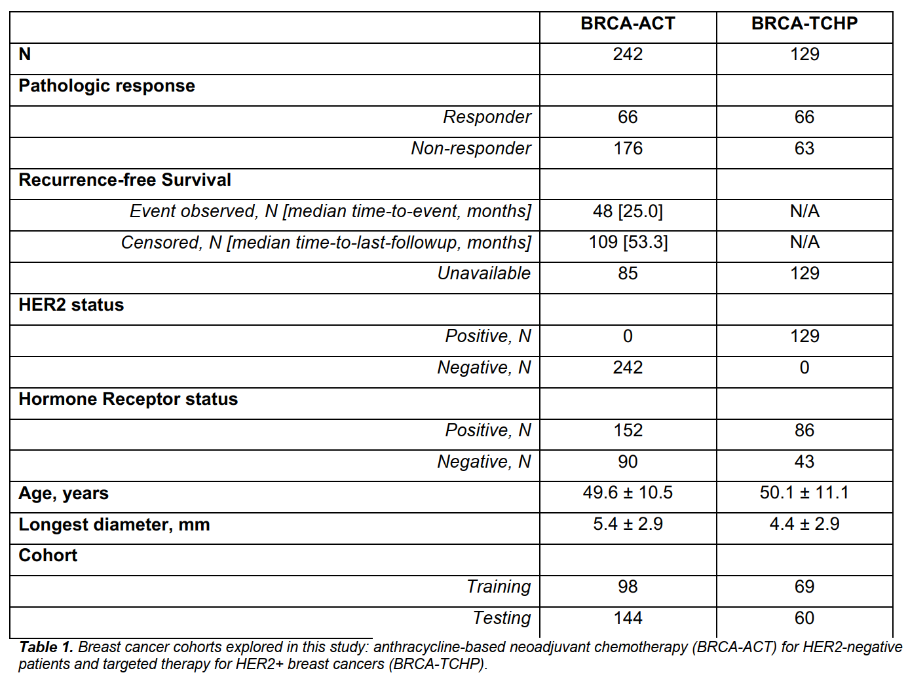
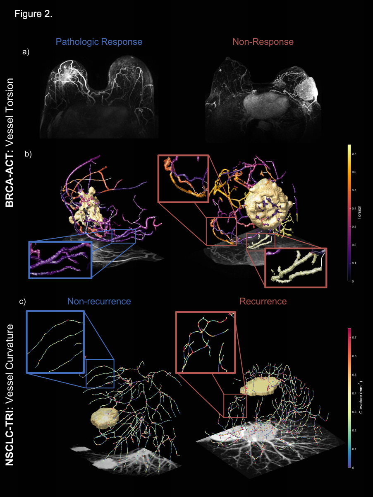

# 临床成像中肿瘤相关血管形态的新型放射组学测量作为多种癌症治疗反应的生物标志物
Novel Radiomic Measurements of TumorAssociated Vasculature Morphology on Clinical Imaging as a Biomarker of Treatment Response in Multiple Cancers

# 〇、摘要 Abstract

## （一）目的

肿瘤相关的血管与健康血管的不同之处在于其**卷曲性**、**渗漏性**和**混乱的结构**，这些属性会创造一个抗治疗的肿瘤微环境

这些属性中可测量的差异可能有助于按治疗的可能受益情况对患者进行分层

在这项工作中，我们提出了**一类新的基于计算图像的生物标志物**，称为**定量肿瘤相关血管特征**（quantitative tumor-associated vasculature，QuanTAV），并证明它们能预测多种癌症类型、成像模式和涉及化疗的治疗方案的反应和生存

## （二）实验设计

从总共 558 名患者的常规治疗前放射学检查（计算机断层扫描或对比度增强的 MRI）中分离出肿瘤血管，并提取了扭曲度和组织的数学测量值，患者治疗经历：

* 接受了四种基于化疗的治疗策略的乳腺癌（n=371）
* 非小细胞肺癌（NSCLC）的治疗（n=187）

## （三）结果

在四种基于化疗的治疗策略中，QuanTAV 测量的分类器在单独举行的测试队列中显著预测了反应（AUC=0.63-0.71），当单独加入到重要的临床变量模型中时，AUC增加了0.06-0.12

我们得出 QuanTAV 风险评分，对乳腺癌化疗后接受手术的治疗队列（p=0.0022，HR=1.25，95%CI 1.08-1.44，C-index=0.66）和 NSCLC 化疗放疗（p=0.039，HR=1.28，95%CI 1.01-1.62，C-index=0.66）的无复发生存率有预知性

从基于血管的风险评分中，我们进一步得出分类的 QuanTAV 高/低风险组，在所有治疗组中具有独立的预后作用，包括只接受化疗的 NSCLC 患者（p=0.034，HR=2.29，95%CI 1.07-4.94，C指数=0.62）

QuanTAV 反应和风险评分独立于临床病理风险因素，并与包括治疗后反应在内的临床变量模型相匹配或超过了

## （四）结论

在这些领域中，我们观察到 CT 和 MRI 上的血管形态（由血管曲率、扭转和组织异质性等指标所捕获）与治疗结果的关联

发现表明，**肿瘤相关血管的形状和结构**在开发多种癌症和不同治疗策略的预后和预测生物标志物方面具有潜力。

## （五）转化相关性的声明

在这项研究中，我们介绍了一类新的成像生物标志物，测量肿瘤相关血管（TAV）的形状和结构。我们开发并验证了多种癌症（乳腺癌和非小细胞肺癌）、成像模式（计算机断层扫描和对比度增强 MRI）以及包括化疗在内的四种治疗方案中的 TAV 预测和预后模型

我们表明，在这一系列的临床问题中，TAV 的形态与治疗后的反应和预后相关，治疗前混乱的血管组织通常预示着不良的结果

其他许多临床成像预测和预后的计算方法主要依赖于算法复杂的 "黑匣子 "机器学习工具，如深度神经网络或抽象的量化措施

本文方法直接扎根于**肿瘤血管生成的潜在癌症生物学**，具有高度的临床可解释性

# 一、简介 Introduction

## （一）新辅助化疗

新辅助化疗（在手术干预前进行的化疗）往往构成一些癌症领域的一线干预措施

如果成功，新辅助化疗可以通过**减少肿瘤负担**和**增加病人的手术选择**，为病人带来巨大的好处

在许多癌症中，如乳腺癌（BRCA）和非小细胞肺癌（NSCLC），目前缺乏能够明确指导一线化疗干预的有效的预测性和预后性生物标志物

## （二）肿瘤相关血管（TAV）

肿瘤血管生成早已被证明是癌症进展的关键。通过影响身体合成血管的机制，肿瘤会从其周围环境中已有的血管中迅速形成新的血管

这种新形成的血管网络被称为肿瘤相关血管（TAV），它通过向肿瘤灌注大量的氧气和营养物质而使肿瘤生长，并为转移性扩散提供途径

然而，TAV 也拥有与健康血管至关重要的**结构差异**，这些差异通过常规的临床评估是无法检测到的

以前的工作表明，**肿瘤血管的形状异常在 CT 和 MRI 扫描中是可以检测到的**，并且可以区分癌症和良性病变

通过抗血管生成治疗成功地使 TAV 结构正常化，可以增强治疗干预的效果

对治疗有抵抗力的肿瘤与有反应的肿瘤相比，其血管的扭曲度和排列方式可能会有所不同，而这又有可能在放射影像学上被定量捕捉到

因此，对 TAV 形态和空间组织的计算机分析可能会根据可能的治疗效果对患者进行分层，从而更好地指导基于化疗的治疗

## （三）本文贡献

* 提出了一个新的计算成像生物标志物，它基于定量的肿瘤相关血管（QuanTAV）测量，以描述放射学扫描中肿瘤周围血管网络的形态和结构

* 提出并评估了一些通过计算提取的对乳腺癌患者治疗前对比度增强磁共振成像（MRI）和肺癌患者计算机断层扫描（CT）的肿瘤血管的扭曲度和组织的测量

* 进一步证明了 QuanTAV 测量在化疗相关治疗反应方面的预测和预后效用，涉及乳腺癌和肺癌的四个案例，跨越这些模式

* 总共对 558 名患者评估了 QuanTAV 的预后和预测效用
  * 242 名乳腺癌患者接受基于蒽环类的新辅助化疗[BRCA-ACT]
  * 129 名乳腺癌患者接受 HER2 靶向治疗的新辅助化疗
  * 97 名 NSCLC 患者接受以铂为基础的化疗而不进行手术[NSCLC-PLAT]
  * 90 名 NSCLC 患者接受新辅助化疗后进行手术干预的三模式方案[NSCLC-TRI]

## （四）相关医学知识

### 1. HER2 受体蛋白

HER2 临床上是指人表皮生长因子受体 2，是用来**判断乳腺癌患者治疗效果的重要指标**

如果 HER2 较高，说明患者预后不是特别的好，可能容易引起癌细胞复发以及转移

HER2 也是乳腺癌患者做病理免疫组检测当中的项目之一，和抗 HER2 药物治疗比较重要的预测指标

* HER2 阳性：可以结合身体的情况，在医生指导下使用靶向药物曲妥珠单抗治疗，可以达到比较理想的临床疗效
* HER2 阴性：**不适合使用靶向药物**治疗，需要采取其他方式医治，包括放疗、化疗、内分泌治疗的方法。

# 二、材料和方法 Materials and Methods

## （一）概述

从划定肿瘤及其相应的血管的三维体积来看，我们的方法从数学上描述了肿瘤相关血管的复杂性，以用于机器学习模型来预测结果。在分析之前，血管体积通过算法被缩小23到中心线，并分割成离散的分支。然后计算出一组91个QuanTAV测量值，属于两个类别之一。

* QuanTAV 形态学（61 个特征）：描述肿瘤血管的**三维形状**的特征
  * 血管扭曲度的指标：扭转（整个血管分支的扭曲度）和曲率（沿分支相邻点之间的局部扭曲度）
  * 其他指标：血管体积、长度，进入肿瘤的血管比例等

* QuanTAV 空间组织（30 个特征）：对肿瘤血管结构的**异质性程度**进行量化的特征
  * 肿瘤血管的二维投影是在成像平面的每个维度上生成的，并在一个相对于肿瘤中心点的**球面坐标系**中，在肿瘤的**固定半径内**生成
  * QuanTAV 空间组织特征集是描述**每个投影图像上血管方向**的统计数据

对于每个治疗组，我们从这些指标中得出 QuanTAV 反应（QuanTAV response）和风险分数（risk scores）

评估它们对于反应（response）、复发时间（recurrence time）、进展时间（progression time）的预测能力

> QuanTAV 代码和 demo：https://github.com/ccipd/QuanTAV （MATLAB）

图：总工作流程

## （二）数据集

### 1. 乳腺

本研究共确定了 470 名接受乳腺新辅助化疗的患者，治疗前进行 **动态对比增强（DCE）MRI** 检查

每个乳腺 MRI 检查包括几个 T1 加权的采集，包括对比剂前扫描和几个注射钆基对比剂后扫描

由于图像质量差导致血管分割有缺陷（包括空间分辨率低，时间扫描不足或时间分辨率差，严重的伪影，或血管增强不足），31 名患者被排除

68 名患者为 HER2 阳性，但在引入抗 HER2 药物之前接受了治疗，故被排除在分析之外

用于分析的患者总数为 371 人

患者的反应被定义为化疗后的病理完全反应（pathologic complete response，pCR），这是乳腺新辅助化疗中最常用的替代终点，定义为：根据切除的手术样本的病理检查，乳腺或腋窝内没有剩余的浸润性癌细胞（ypT0/isN0）

115 人达到 pCR，而 256 人在化疗后保留有残留的疾病（非 pCR）

患者根据 HER2 受体蛋白的表达情况接受不同的化疗方案，并将患者分成相应的治疗组进行分析。

* BRCA-ACT：242 名患者为 HER2 阴性，并接受了以蒽环类药物为基础的方案，同时接受或不接受他汀类药物
  * 化疗后，48 名患者达到 pCR，194 名患者非 pCR
  * 该队列包括来自 ISPY1（n=109）和 Breast-NAC Pilot（n=48）研究的患者，这些研究也有无复发生存（recurrence free survival，RFS）信息
  * 我们考虑从新辅助化疗开始的 RFS （Breast-NAC MRI 试验研究的 RFS 是在化疗结束后记录的，但根据研究方案，根据治疗时间进行调整）

* BRCA-TCHP：在克利夫兰医学中心（n=28）或克利夫兰诊所（n=101）接受靶向新辅助治疗的 129 名 HER2+ 患者的多机构队列也被评估
  * 大多数患者接受了辅以曲妥珠单抗和培妥珠单抗的新辅助化疗（n=125）
  * 克利夫兰医学中心的 5 名患者只接受了曲妥珠单抗
  * 67 名患者达到 pCR，62 名非 pCR
  * 没有 BRCA-TCHP 患者有生存信息

### 2. 肺部

在治疗前共收集了 187 个标准剂量的非对比性肺部 CT 容积进行分析

患者在克利夫兰医学中心接受治疗和成像，并根据他们接受的治疗方案的类型分为两组（三联疗法 / 培美曲塞化疗）

* NSCLC-PLAT： 97 名在克利夫兰诊所接受了基于铂的**化疗**而没有手术干预的患者，提供了治疗前的 CT 扫描。在没有治疗后手术样本的情况下，根据 RECIST 标准，根据治疗前和治疗后 CT 的大小变化，从影像学上确定反应
  * 47 名患者为反应者，表现为铂类化疗后的反应或疾病稳定
  * 49 名患者为无反应者，在影像学上有进展
  * 92 名患者有无进展生存期信息（progression-free survival，PFS），定义为：从开始治疗到发现疾病进展或死亡（以较早发生者为准）的时间，对于没有进展的活着的患者，在最后一次随访日期进行删减

* NSCLC-TRI：90 名患者接受了**三联疗法**，包括新辅助化疗和手术干预
  * 反应的终点是主要病理反应（major pathologic response，MPR），定义为：新辅助化疗后 10% 或更少的残存肿瘤，是推荐的可切除 NSCLC 的替代终点
  * 无复发生存期（RFS）是从手术日期到复发日期或死亡日期（以较早发生者为准）来衡量的，无疾病复发的幸存者在最后一次随访时被剔除

### 3. 数据分组

对于每个治疗组，患者被分为训练组和测试组。在训练集上建立和优化模型，然后应用于测试集

其中三个治疗组（BRCA-TCHP、NSCLC-PLAT、NSCLC-TRI）的反应率约为 50%，因此在训练和测试中随机分成两半，可能使用先前研究的相同分法

鉴于不同类别之间的训练数据不平衡可能会对分类器的性能和稳健性产生负面影响，随机选择了一个 BRCA-ACT 训练队列，其中包含 50% 的应答者和足够的非应答者，以实现 3:1 的类别平衡（先前已证明可限制 LDA 分类器的类别不平衡的负面影响）。

每个训练和测试组的组成，以及反应和生存终点的可用性，如表 1

表 1

## （三）量化肿瘤相关的脉管系统

**Quantifying the tumor-associated vasculature**

### 1. 预处理和分割 - 肺部 CT

* 调整肺部 CT 体素为 $1 mm^3$ 的各向同性分辨率
* 肿瘤边界做了 3D 注释
* 进行肿瘤血管的自动分割，如图 1 所描述的
* 用以前显示的在非对比 CT 上有效分割肺血管的协议分几步提取肿瘤相关的血管（38,39）
* 通过 -550H 的阈值，然后进行形态学处理（40，图 1-b），将每个 CT 图像掩盖到肺部

> 38. Rudyanto, R. D. et al. Comparing algorithms for automated vessel segmentation in computed tomography scans of the lung: the VESSEL12 study. Med. Image Anal. 18, 1217–1232 (2014).
> 39. Paing, M. P., Hamamoto, K., Tungjitkusolmun, S. & Pintavirooj, C. Automatic Detection and Staging of Lung Tumors using Locational Features and Double-Staged Classifications. Appl. Sci. 9, 2329 (2019).
> 40. Mansoor, A. et al. Segmentation and Image Analysis of Abnormal Lungs at CT: Current Approaches, Challenges, and Future Trends. Radiographics 35, 1056–1076 (2015).

图 1-b：形态学处理

* 用一个开源（41）的多尺度三维血管增强过滤器（42）来强调管状血管的结构（参数实施细节）（图 1-c）

> 41. Kroon, D. J. Hessian based Frangi Vesselness filter. https://www.mathworks.com/matlabcentral/fileexchange/24409-hessian-based-frangi-vesselness-filter (2010). 
> 42. Frangi, A. F., Niessen, W. J., Vincken, K. L. & Viergever, M. A. Multiscale vessel enhancement filtering. in Medical Image Computing and Computer-Assisted Intervention — MICCAI’98 130–137 (Springer, Berlin, Heidelberg, 1998). doi:10.1007/BFb0056195. 

图 1-c：多尺度三维血管增强过滤器

* 通过 Otsu 的方法（43）对血管增强图像进行阈值处理（thresholding），以隔离属于血管的像素
* 用形态学操作（morphological operations）来去除噪声和非血管伪影（图 1-d）

> 43. Otsu, N. A Threshold Selection Method from Gray-Level Histograms. IEEE Trans. Syst. Man Cybern. 9, 62– 66 (1979). 

图？

* 为进一步分析，提取了一个包含肿瘤和每个方向额外 $5 cm$ 的方框（图 1-e）
* 用一个开源的快速行进算法（44）来分割的血管，以识别血管的中心线（45），并将血管网络划分为不连续的组成分支（图 1-b）

> 44. Kroon, D. J. Accurate Fast Marching. https://www.mathworks.com/matlabcentral/fileexchange/24531- accurate-fast-marching (2011).
> 45. Li, H., Yezzi, A. & Cohen, L. 3D Multi-branch Tubular Surface and Centerline Extraction with 4D Iterative Key Points. in Medical Image Computing and Computer-Assisted Intervention – MICCAI 2009 (eds. Yang, G.-Z., Hawkes, D., Rueckert, D., Noble, A. & Taylor, C.) 1042–1050 (Springer, 2009). doi:10.1007/978-3-642-04271- 3_126.

**有些图未匹配**

### 2. 预处理和分割 - 乳腺 MRI

* 通过仿生配准（affine registration）将第一次对比后的扫描（first post-contrast scan）与对比前的扫描（pre-contrast scan）在空间上对齐
* 计算对比增强前后的图像强度差异，得出减法图像（图 2-a）
* 体素分辨率调整为各向同性 $1 mm^3$

三维肿瘤边界由人工标注和自动分割技术结合获得：

* 几个相邻的轴向切片上的部分肿瘤注释是由手动划定的或从公开数据集上训练的分割中得出（28,29）
* 用三维主动轮廓分割算法（47，MATLAB 中的 `chenvese` 函数）来扩展注释二维切片，以在三维中对肿瘤进行全体积分割（full volumetric segmentation）

血管分割在图 2 中描述：

* 自动检测并去除心脏和后躯干（图 2-b）
* 用血管增强过滤器（41,42 图 2-c）来检测体积内的血管样物体（vessel-like objects）
* 因为与 CT 相比，MRI 缺乏真正的定量值（true quantitative values），故将血管增强图像按 Otsu 方法进行多个阈值的分割，每个阈值都通过形态学操作进行完善（图 2-d，未匹配）。评估所得到的分割（图 2-e，未匹配）与最大强度投影和三维中的血管增强是否一致。由一个对临床数据和治疗结果保密的读者手动选择最能捕捉到每个扫描中增强的血管的阈值，以便进一步分析。在每个维度上，从肿瘤处裁剪体积5厘米（补充图2f），并通过快速行进法计算最终血管网络的中心线坐标和分支（图 1-b）。

图 2

### 3. QuanTAV 形态学的测量

从三维血管骨架中，计算出61个定量的血管迂回特征，这些特征是从以前介绍的35个特征中扩展出来的，17。全套QuanTAV形态学特征在补充表2中描述。在分支内的每个点，曲率被计算为包含该点和分支内两个相邻点的圆的半径的倒数。通过一阶统计（平均值、标准差、最大值、偏度和峰度）对整个血管和每个分支的曲率分布进行总结，并在患者层面用相同的统计数字对分支级统计进行总结。对于每个分支，扭转的计算方法是：一个分支的第一点和最后一点之间的欧氏距离与该分支的长度之比减去1，并通过一阶统计在患者层面上进行总结。整个血管的曲率和扭转的分布通过10-bin直方图进一步总结。此外，还计算了其他的血管指标--包括血管体积、长度、进入肿瘤的血管数量，以及进入肿瘤的血管网络中的血管百分比。

### 4. QuanTAV 空间组织的测量

我们计算了一套描述肿瘤相关血管组织的30个特征，这些特征之前已经介绍过24，并列在补充表3中。提取QuanTAV空间组织特征的步骤见补充图3。从血管中心线出发，生成一组二维血管投影图，计算出总结血管局部方向的统计数据。沿着投影图像，在一个固定大小的局部窗口内，通过Hough变换计算出五个最突出的血管方向，这是一种用于检测图像中线条的数学运算。分析的窗口沿着图像逐步移动，以获得整个血管图像的血管方向分布。然后用五个一阶统计量（平均值、中位数、标准差、偏度和峰度）对血管方向的总体分布进行总结，这构成了QuanTAV空间组织特征集。

这一过程被应用于六个不同的投影图像。通过在轴向、矢状面或冠状面将脉管沿三个空间维度之一压平，得到一组三个笛卡尔投影。除了在原始坐标系统中分析TAV外，三维脉管内的每个点也被转换为球面坐标系统，以捕捉血管相对于肿瘤的位置。球形坐标不是(X, Y, Z)位置，而是对应于从肿瘤中心的仰角，围绕肿瘤中心的旋转，以及与肿瘤表面的距离。与笛卡尔视图一样，肿瘤血管沿这些维度进行投影，以获得三个二维投影图像：相对于旋转的仰角，相对于距离的旋转，以及相对于距离的仰角。QuanTAV组织特征的计算有两个可调控的参数：包括血管与肿瘤的最大距离和用于计算血管方向的滑动窗口的大小。这些参数在每个成像模式/癌症领域内都进行了优化，其过程和结果在位于补充方法中的扩展实施细节中进行了更详细的描述。

## （四）特征开发和评估

### 1. QuanTAV 预测性反应得分

在训练集的3倍交叉验证中，通过两轮Wilcoxon特征选择，确定了对每个用例的治疗反应有最佳预测的顶级特征集。该特征集的大小是根据交叉验证中训练集的表现确定的（见补充实施细节）。对于每个队列，顶级血管特征被纳入线性判别分析（LDA）分类器，并在整个训练队列中训练，以预测测试集的反应。这个分类器的输出是一个介于0和1之间的分数，反过来对应于患者在治疗结束后获得反应的信心水平。

### 2. QuanTAV 预后风险评分和群体

对于每个有生存信息的队列，在训练集中得出一个生存模型，利用Bhargava等人48的启发，生成QuanTAV风险评分，所有的观察时间最多删减10年。将高度相关和可能多余的特征从特征集中修剪出来，在多变量比例危害模型中保留绝对系数最高的特征。通过使用MATLAB软件包Glmnet的10倍弹性网正则化，使用剩余的血管特征训练一个Cox回归模型。在每个队列的训练集中，根据危险比的最大化，得出风险分数阈值，将患者分为高风险组和低风险组，以达到最佳效果。进一步的实施和优化细节在补充方法中描述。

### 3. 统计学分析

用于评估反应预测模型的主要指标是赔率（OR）和接受者操作特征曲线下的面积（AUC）。AUC的显著性水平和95%的置信区间是通过蒙特卡洛抽样50,51的互换检验计算出来的，详细描述见以前稿件的补充材料52。QuanTAV反应评分和临床变量与反应的单变量和多变量联系是根据逻辑回归模型中的OR来评估的。训练集中具有单变量意义的临床变量被纳入仅有临床特征的逻辑回归模型，以及将临床变量与QuanTAV反应评分相结合的逻辑回归模型。在包含所有特征的逻辑回归模型中，根据OR值评估QuanTAV反应得分和临床变量与反应的单变量和多变量关系。

对于预后模型，QuanTAV风险评分和分类QuanTAV风险组都在单变量和多变量设置中与基线临床变量以及化疗方案完成时的病理和治疗反应信息一起评估。Cox比例危害模型和风险组仅由基线临床变量得出，以便与QuanTAV风险组进行比较。用来评估与生存期关联的主要指标是危险比（HR）和一致性指数（C-index）。根据感兴趣的队列内Cox模型的系数，评估与预后的显著关联的单变量和多变量测试。

## （五）数据可用性

本研究中使用的部分数据可通过癌症成像档案馆（TCIA）公开获取27。从大学医院克利夫兰医学中心获取数据集（经许可用于本研究）应通过数据访问请求表直接向这些机构申请。根据机构审查委员会的伦理批准，未识别的数据将作为一个测试子集提供。

# 三、结果 Results