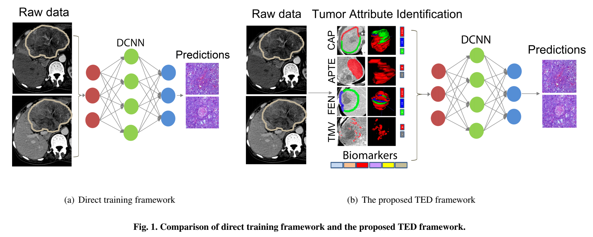
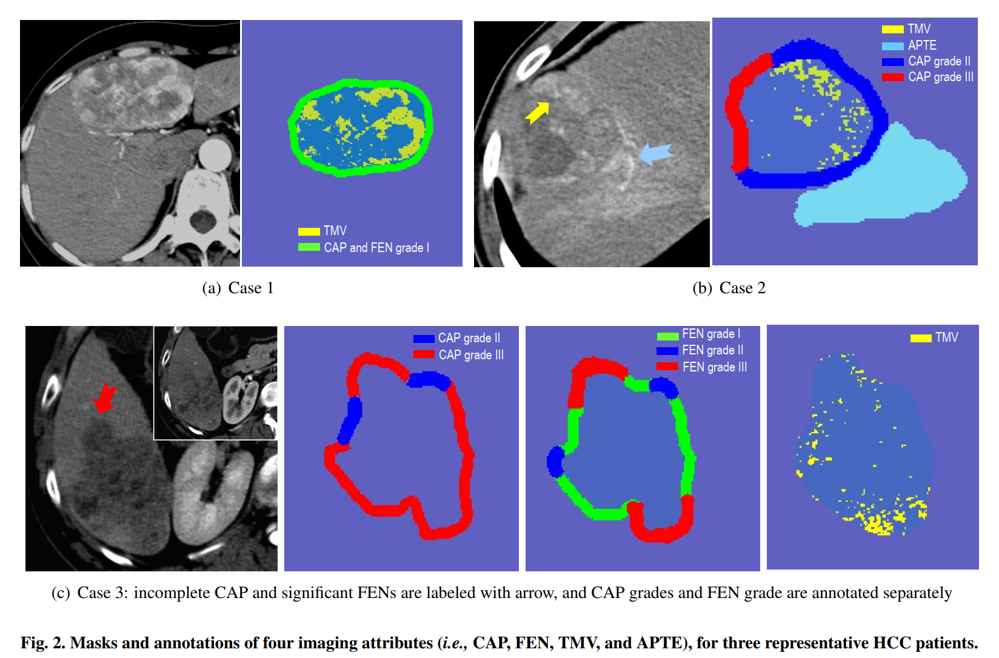
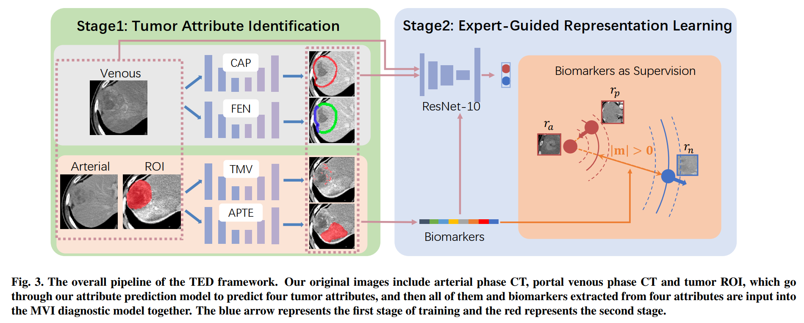
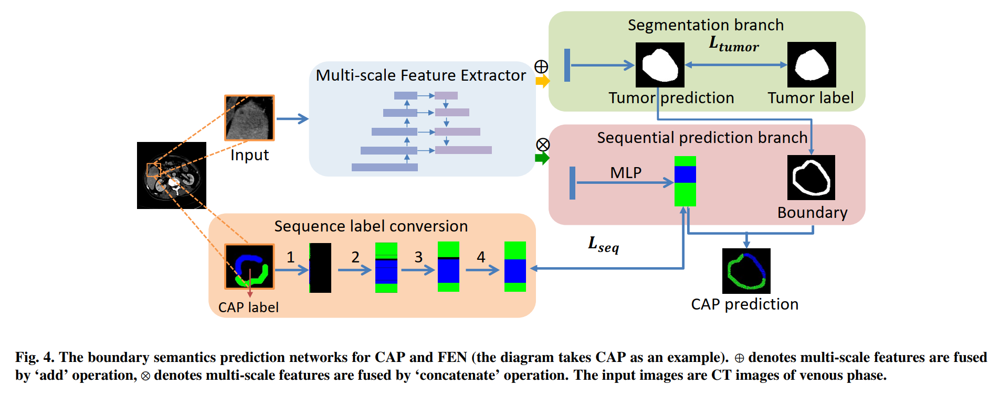
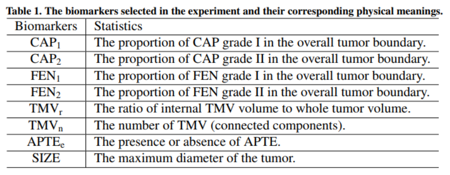

# TED: 肝细胞癌的微血管侵袭的两阶段专家指导解释诊断框架

# 〇、摘要 Abstract

微血管侵犯（MVI）是肝细胞癌（HCC）手术治疗后的一个预后因素

术前检测 MVI 对患者的预后和生存大有好处，现有的 MVI 自动诊断方法大多直接使用深度神经网络进行预测，没有考虑到临床知识，缺乏可解释性

为了模拟放射科医生的决策过程，本文提出了一个针对 HCC 中 MVI 的两阶段专家指导诊断（Two-stage Expert-guided Diagnosis，TED）框架

具体来说：

* 第一阶段旨在预测 MVI 诊断的关键影像属性
* 第二阶段利用这些预测作为一种关注形式，以及通过变体三重损失的软监督，指导 MVI 诊断网络的拟合

注意力和软监督有望共同引导网络学习更多的语义相关的表征，从而提高诊断网络的可解释性

在 466 个病例的私人数据集上进行的广泛实验分析表明，所提出的方法在 AUC 上达到 84.58%，在召回率上达到 84.07%，大大超过了 baseline 方法

# 一、简介 Introduction

微血管侵犯（MVI）是肿瘤复发的独立危险因素，有 MVI 的患者肿瘤复发的风险增加 4.4 倍，术前预测 MVI 可能有助于外科医生选择适当的手术方式，但 MVI 只能通过切除组织的组织学特征进行可靠的诊断，所以一个无创的工具来识别术前的 MVI 将是非常理想的

深度卷积神经网络的发展在疾病的成像诊断中显示出巨大的前景，如肺结节、甲状腺结节、胰腺癌和阿尔茨海默症

图：直接训练网络与TED网络

虽然 MVI 的自动诊断已经得到了探索，但大多数现有方法只是采用**黑盒深度神经网络**来直接评估 CT 或 MRI 体积进行诊断（上图 a），尽管这些模型的性能很好，但因**缺乏可解释性**而臭名昭著，这极大地阻碍了它们的临床应用

我们在此探索将临床知识，特别是**放射科医生决策**的关键因素，紧密地整合到机器学习过程中，以带来**诊断结果的可解释性**

## （一）TED 框架

本文提出了一个用于 HCC 的 MVI 的两阶段专家指导诊断（TED）框架（上图 b）

### 1. TED 框架的第一阶段

旨在学习预测那些已知**对放射科医生的诊断具有决定性的关键因素**。具体来说，基于一些临床研究的结果，确定了四类与 MVI 诊断相关的属性：

* 囊性外观（CAP）
* 病灶扩展结节（FEN）
* 肿瘤微血管（TMV）
* 动脉瘤周增强（APTE）

对于上述每个选定的属性，我们通过监督下的**语义分割**，学习同时**预测属性类别**和**定位**相应的指示区域

每个属性的统计数据被计算出来，并被认为是一种**生物标志物**的形式

### 2. TED 框架的第二阶段

预测的**位置掩码**，作为一种**注意力**的形式，与生物标志物一起，作为一种**软监督**的形式，以一种变体的三重损失（triplet loss）引入，被用来指导 MVI 诊断网络的适应。预测掩码引入的注意力使 MVI 诊断网络能够更加关注临床相关区域

三重损失是对交叉熵的分类损失的补充，它使同一类别的样本如果具有类似的生物标志物，就能用类似的特征来表示

注意力和软监督有望共同引导网络学习更多语义相关的表征，从而提高诊断网络的可解释性

### 3. 验证 TED 框架的有效性

从南京医科大学第一附属医院收集了一个 MVI 数据集，包括 466 名患者的腹部 CT 扫描，其中 142 名有 MVI，324 名没有 MVI。每个病人的 CT 扫描都包括**动脉**和**门静脉**相位的图像

CAP 和 FEN 在门静脉期被标记，而 APTE 和 TMV 在动脉期被标记

对 MVI 数据集的广泛实验分析表明，所提出的 TED 框架在 MVI 诊断方面取得了 84.58% 的 AUC 和 84.07% 的 Recall，大大超过了 baseline（78.62% 的 AUC 和 66.15% 的 Recall）

实验结果还表明，我们的自动属性预测结果不仅比医生的人工标注更快、更方便，而且产生的结果也更平滑、更连续

## （二）本文贡献

* 提出了一个针对肝癌微血管侵犯的两阶段可解释性诊断框架，模拟放射科医生的决策过程，即首先确定关键的影像属性，在此基础上做出诊断决定

* 对于与 MVI 诊断有关的四个临床属性，即CAP、FEN、APTE 和 TMV 中的每一个，训练一个神经网络模型来**自动预测其位置和类别**

* 探索以两种方式同时利用预测的属性：
  * 预测的语义掩码被用作额外的输入渠道，以便作为一种关注的形式
  * 预测的统计数据被总结为一组“生物标志物”，通过一个变体三重损失作为补充的弱监督

# 二、背景 Background

## （一）MVI 成像的属性

图：图像属性

影像学特征包括：不完全囊（CAP）、存在局灶性扩展结节（FEN）、肿瘤微血管（TMV）和存在动脉瘤周强化（APTE），是 MVI 的独立预测因素，与患者预后相关

* CAP 在 CT 成像中显示为周边的光滑高亮，对应于组织学中的纤维囊或假囊，完整的 CAP 可以阻碍 HCC 的传播，是 HCC 的一个**有利**的预后因素

* FEN 描述了延伸到囊外的肿瘤边界，反映了 HCC 的规则性和囊外延伸。在以往的研究中，FEN 和相应的扩展等级可以占到 40% 到 80% 的 HCC 的 MVI

* TMV 及其相关丰度反映了肿瘤血管生成和新生血管。**血管过多**是 HCC 最重要的生物学特征之一，是肿瘤侵袭性的原因

* APTE 被定义为肿瘤边缘外的斑块状或新月形或楔形密度增强，在动脉期与肿瘤边界有广泛接触。一些研究表明，APTE 与 MVI 的高概率和不良临床结果有关

## （二）微血管浸润的诊断

目前，现有的基于深度神经网络的 MVI 自动诊断方法主要是基于直接训练，常用的方法是利用 MRI 多模态数据进行特征融合。例如：

* Zhou 等 2021 利用 3D-CNN 提取对比度增强 MR 的多个阶段（动脉、门静脉和延迟期）的特征，通过深度监督和特征串联进一步提高模型的预测性能。
* Wei 等 2021 证明了深度学习在预测 MVI 方面的潜力，并发现钆喷酸增强磁共振成像（EOB-MRI）在评估 MVI 方面优于对比剂增强计算机断层成像（CE-CT）。

其他研究在诊断模型中加入了临床信息，证明了使用专家知识的诊断能力。例如：

* Chen 等 2021a 利用全血细胞计数、血液检查和 AFP 检查结果进行 MVI 的术前预测，并量化 MVI 的风险
* Song 等 2021 根据术前动态对比增强磁共振成像（DCE-MRI）和临床参数包括淋巴细胞计数、INR、AFP 和肿瘤大小，建立了一个深度学习模型来预测 HCC 患者的 MVI 状态和等级
* Jiang 等 2021 表明，信息灵通的 Radiomics-Radiological-Clinical（RRC）模型和 3D-CNN 模型在术前识别 MVI 方面具有相当的功效

这些方法要么缺乏专家知识，无法解释，要么需要人为干预来提取临床相关信息，不够灵活

我们的方法可以**自动提取更丰富的信息**，包括**结构位置信息**、**结构统计信息**和**视觉特征**，无需人工干预，而且**性能和可解释性更好**。

## （三）可解释的深度诊断方法

为了实现深度学习算法在临床实践中的进一步应用，有必要在临床领域建立信任，了解网络预测的基础和网络学习的特征

目前，深度神经网络在医学疾病自动诊断方面的应用已经显示出良好的前景。同时，通过引入可解释的特征，为提高模型的性能和可解释性做了大量的工作

可解释性研究可以分为两类：

* 在训练后对神经网络模型进行解释：包括基于类激活图（CAM）的方法，基于网络剖析的方法和基于生成的方法，本文不讨论
* **在训练期间引入先验知识**以增强可解释性，即如何将临床知识嵌入到深度神经网络中，在训练过程中同时提高模型的性能和可解释性，本文主要讨论

我们根据可解释性特征发生的位置将这类方法进一步分为三类：

* 基于结构解耦的方法：使用先验知识对原始输入图像进行分解，这有助于学习各部分的信息
  * Xie等 2017 使用三个 ResNet-50 预训练的模型分别表征肺结节的整体外观、体素值的异质性和形状的异质性，并联合利用它们对肺结节进行分类
  * Xie等 2018 将一个三维结节分解为九个固定视图，以多任务方式预测结节的整体外观、体素和形状异质性，肺结节诊断的准确性进一步提高

* 基于属性预测的方法：采用深度神经网络对临床属性标签进行分类和回归，最后融合各属性特征进行最终诊断
  * Shen等 2019 提出了一个层次化的诊断网络，首先预测放射学语义标签，然后融合这些中间特征进行最终的良性和恶性诊断
  * Liu等 2019 提出了一种用于自动分析肺结节的多任务模型，通过在诊断的同时预测属性（包括细微、内部结构、钙化、球形、边缘、棘突、分叶、纹理）的得分，提高了整体性能

* 基于特征提取的方法：是在没有临床属性标签的情况下，人为引入一些特殊的特征提取网络，如 GCN，或传统的特征提取算子，如 Haar、HoG 等，最后融合所有属性特征
  * Chen等 2016b 进行三种多任务学习方案，包括堆叠去噪自动编码器（SDAE）、卷积神经网络（CNN）和手工制作的 Haar-like 和 HoG 特征，利用这些异质特征进行肺结节诊断
  * Chen等 2016a 利用SDAE和CNN提取的特征以及 Haar-like 特征来接近肺部 CT 结节的诊断特征
  * Chen等 2020 考虑了从 GCN 和 CNN 提取的组织学特征和基因组（包括突变、CNV、RNA-Seq）特征的多模式融合，用于癌症诊断的生存预测。

所有这些研究表明，在疾病的自动诊断中，可解释的特征和深度模型的结合不仅可以在一定程度上具有可解释性，而且可以达到更高的诊断精度

我们的方法打破了可解释特征只能用于融合的刻板印象，而是用它们来指导诊断网络的训练

本文的方法还涵盖了前两类方法的特点，包括原始图像的结构解耦信息和属性的自动预测

# 三、方法 Method

图：TED 网络

为了在深度神经网络中紧密结合临床知识，TED 框架由两个阶段组成，即**用语义分割进行肿瘤属性识别**和**专家指导下的表征学习**。该两阶段框架能够预测对 MVI 诊断起决定性作用的属性以及 MVI 诊断的最终结果，从而为 MVI 自动诊断方法带来可解释性。

* 第一阶段：
  * 训练四个独立的语义分割网络，分别预测 CAP、FEN、TMV、APTE 四个选定**属性的类型**和**位置掩码**
  * 第一阶段基本上模仿医生为最终诊断确定关键证据的决策过程

* 第二阶段：
  * 属性的掩码作为原始图像的**附加通道**输入到诊断网络，这有利于使模型更加关注那些被掩码的区域，从而促进网络提取与属性相关的局部特征
  * 对于上述每个属性，其预测的统计数据被计算出来，并作为生物标志物的一种形式。生物标志物被用作一种软监督，通过三重损失的变体来指导 MVI 诊断网络的训练
  即具有相似的生物标志物的样本，特征就会被拉近，通过这种方式，专家知识（属性特征）被当作注意力和软监督来利用，从而更深地表征生物标志物特征

## 第一阶段：用语义分割进行肿瘤属性识别（Tumor Attribute Identification with Semantic Segmentation）

在对病人的 CT 扫描进行诊断时，放射科医生通常会先**寻找决策所需的证据**，而不是直接提供最终的诊断结果

TED框架的第一阶段基本上试图模仿放射科医生的决策过程，学习发现 MVI 诊断的关键证据

为了达到上述目的，模型被训练来自动预测四个属性

### 1. CAP 和 FEN：肝脏肿瘤的边界语义预测

* CAP - 囊性外观（Capsular Appearance）
* FEN - 病灶扩展结节（Focal Extensional Nodule）

由于 CAP 和 FEN 都对应于**肿瘤的边界语义**（boundary semantics），并且具有相同数量的类别，我们遵循 Chen等人 2021b 对肿瘤的边界进行分割并预测边界的语义

图：边界语义

整个框架由多尺度特征提取器，即特征金字塔网络（Feature Pyramid Network，FPN）、分割分支和顺序预测分支组成

FPN 由预先训练的 ResNet-50 编码器和 UNet 解码器组成

FPN 的中间特征被融合以产生多尺度特征

* 分割分支（segementation branch）使用多尺度特征来预测肿瘤
* 序列预测分支（sequential prediction branch）使用这些特征来预测序列形式的边界的具体语义

**人工标注的肿瘤区域和边界语义往往在位置上并不严格对应**，因为它们是独立标注的。因此，为了实现更准确的监督，我们将肿瘤位置预测和边界语义预测作为两个任务分别学习。

#### （1）分割分支

分割分支与传统分割网络相同。我们进一步从预测肿瘤掩膜的扩张和侵蚀的残余中获得边界区域，然后使用 5x5 核的高斯模糊，使边界厚度接近于人工标注。

分割分支的损失函数：

$$DiceLoss = - \frac{2}{|K|} \sum_{k \in K} \frac{\sum_{i \in I} u_i^k v_i^k}{\sum_{i \in I} u_i^k + \sum_{i \in I} v_i^k}$$

$$CorssEntrophyLoss = - \frac{1}{pq} \sum_{p, q} Y(p, q) log\hat{Y}(p, q)$$

$$L_{seg} = DiceLoss + CorssEntrophyLoss$$

$$L_{seg} = - \frac{2}{|K|} \sum_{k \in K} \frac{\sum_{i \in I} u_i^k v_i^k}{\sum_{i \in I} u_i^k + \sum_{i \in I} v_i^k} - \frac{1}{pq} \sum_{p, q} Y(p, q) log\hat{Y}(p, q)$$

* $k \in K$ - 遍历所有的类别
* $i \in I$ - 遍历所有的像素
* $u$ - 网络输出的 softmax
* $v$ - one-hot 形式的分割标签
* $p, q$ - 每个像素的坐标
* $Y(p, q)$ - 指定像素的标签
* $\hat{Y}(p, q)$ - 指定像素的网络输出标签

#### （2）序列预测分支

在序列预测分支中，我们从肿瘤边界掩膜中的极坐标系中固定角度间隔的区域取样点，将肿瘤边界转化为序列信息。固定角度间隔将 360 度的圆形边界划分为固定的分数，对应于序列的长度。这种方法可以保证边缘语义预测结果的连续性。我们也把将边缘语义标签转换成序列监督信号的过程表示为序列标签转换（如图4所示），它包括以下四个步骤：

* 在极坐标系统中以固定的角度间隔对语义点进行采样，得到初始序列
* 在同一角度区间下数量最多的类别被作为该角度的语义类别
* 对该序列进行插值，以消除采样过程中引入的噪声
* 通过补足当前序列的缺口得到最终序列

简而言之，将从分割分支中获得的边界进行采样、分类、插值、补足，展开为一个序列，将此作为标签进行比对训练

序列预测分支的训练损失表述为：

$$1dDiceLoss = 1 - \sum_{x_i, y_i \in D} 2 \cdot \frac{\sum f(x_i)y_i}{\sum f(x_i) + \sum y_i}$$

$$1dCrossEntrophyLoss = - \sum_{x_i, y_i \in D} y_i \cdot log(f(x_i))$$

$$L_{seq} = 1dDiceLoss + 1dCrossEntrophyLoss$$

$$L_{seq} = 1 - \sum_{x_i, y_i \in D} 2 \cdot \frac{\sum f(x_i)y_i}{\sum f(x_i) + \sum y_i} - \sum_{x_i, y_i \in D} y_i \cdot log(f(x_i))$$

* $x_i, y_i \in D$ - 遍历整个数据集 $D$，得到图像数据和标注数据对 $(x_i, y_i)$
* 1D dice loss 用于缓解标签不平衡

结合分割分支和顺序预测分支的损失，我们得到边界语义预测的最终损失为：

$$L_b = \lambda_1 L_{seg} + \lambda_2 L_{seq}$$

其中 $\lambda_1$ 和 $\lambda_2$ 是两个手动设置的系数。

### 2. TMV 和 APTE：肝脏肿瘤的血管语义预测

* TMV - 肿瘤微血管（Tumor Microvessel）
* APTE - 动脉瘤周增强（Arterial Peritumoral Enhancement）

因为 **TMV 只存在于肿瘤内部**，所以需要迫使模型专注于肿瘤区域，解决方法是将肿瘤的 RoI（Region of Interest）掩码与动脉期的 CT 扫描一起作为输入

这种设置的目的是，因为 **TMV 只存在于肿瘤内部**

图：TMV 预测网络

TMV 预测网络由特征提取器、解码器和三个任务分支组成，即：

* TMV 的分割分支（the segmentation branch of TMV）
* 估计 TMV 密度的回归分支（the regression branch to estimate TMV density）
* 预测 TMV 存在的分类分支（the classification branch for predicting the presence of TMV）

三个任务代表了**不同颗粒度**的**密切相关**的预测任务的级联

后面两个密切相关的粗略预测目标的定义主要是考虑到在实践中，由于微血管的尺寸较小，很难在像素级获得准确的 TMV 注释

即从分割，到密度估计，再到分类，这些任务不仅需要越来越弱的监督，而且还希望能更容易地适应模型

#### （1）分割分支

分割分支的标准分割损失使用前文提到的的 $L_{seg}$

#### （2）密度回归分支

密度估计的监督是通过采用一个核来模糊像素级 TMV 标签而获得的

具体来说，我们遵循种群计数中的密度图生成，并使用一个类似的三维高斯核（由两个二维高斯核相乘得到，核大小 = 7，σ = 2）作为元核（meta kernel），用来**模糊 TMV 的像素级标签**，以**生成反映 TMV 空间分布的密度图**

密度回归分支的回归损失：

$$L_r = \frac{1}{2N} \sum_{i=1}^N ||\hat{F} - F||_2^2$$

* $\hat{F}$ - 密度回归分支网络的密度图预测值
* $F$ - 通过模糊 TMV 标签产生的密度图
* $N$ - 训练的 batch size，遍历一个 batch
* $||\hat{F} - F||_2^2$ - 采用欧氏距离来衡量预测的密度图 $\hat{F}$ 和生成的密度图 $F$ 之间的差异

从 TMV 的像素级注释中可以很容易地得到 TMV 存在的 ground truth 标签。即对于 CT 扫描，只要有一个以上的像素被标记为 TMV，整个扫描就被认为是 TMV 的阳性

预测 TMV 存在的分类分支的损失函数被表述为：

$$L_c = - \sum_{x} p(x) \cdot log(q(x))$$

* $p(x), q(x)$ - 分类分支在像素 $x$ 的二进制标签和预测值

结合上述三个分支的损失，血管语义预测的最终损失为：

$$L_v = \lambda_3 L_{seg} + \lambda_4 L_r + \lambda_5 L_c$$

对于 APTE 预测，采用 nnU-Net 网络进行分割预测

APTE 呈现的频率比 TMV 还要低

与 TMV 类似，我们在 nnU-Net 中增加了一个分类分支来预测 APTE 的存在。分割部分的损失与 nnU-Net 的损失相同，分类损失使用 $L_c$

训练 APTE 的总体损失函数可以写成：

$$L_A = \lambda_6 L_{seg} + \lambda_7 L_c$$

## 第二阶段：专家指导下的表征学习（Expert-Guided Representation Learning）

TED 框架第一阶段的预测属性代表了 MVI 诊断的重要线索

TED 框架第二阶段用两种方式利用预测：

* 将第一阶段的预测的语义掩码与原始 CT 扫描一起输入，以作为一种关注形式
* 将第一阶段的预测总结为一组反映相应属性的某些统计数据的“生物标志物”，并通过一个变体三重损失，采用这些“生物标志物”作为补充的弱监督

### 1. 生物标志物：属性的统计

下表总结了我们定义的一组生物标志物

表：生物标志物

* $CAP_i, FEN_i \quad (i = {1, 2})$ - 代表 $CAP$ 和 $FEN$ 的不同边界语义的分布
* $TMV_r, TMV_n$ - 描述肿瘤内 $TMV$ 的分布
* $SIZE$ - 代表肿瘤的最大直径，肿瘤大小与 MVI 有关

这八个生物标志物，经过最大最小标准化后，汇总成一个**生物标志物向量**：

$$v = \frac{1}{8} \begin{bmatrix}
w_1 \cdot CAP_1 \\
w_2 \cdot CAP_2 \\
w_3 \cdot FEN_1 \\
w_4 \cdot FEN_2 \\
w_5 \cdot TMV_r \\
w_6 \cdot TMV_n \\
w_7 \cdot APTE_e \\
w_8 \cdot SIZE \\
\end{bmatrix}$$

其中 $w_i$ 分别代表相应的生物标志物和 MVI 之间的 Pearson 相关系数

### 2. 使用生物标志物监督

与关于病人是否有 MVI 的二元标签相比，生物标志物与 MVI 结果的相关性表明有机会**在实例水平而不是类别水平上区分病人**

例如：对于同一类别的病人 p1、p2、p3，如果 p1 和 p2 有相似的生物标志物，p2 和 p3 有不同的生物标志物，那么希望 p1 和 p2 也有相似的表现，p2 和 p3 有不同的表现

探索用生物标志物作为弱监督协助学习，一个可行的想法是拉近相似的样本对和推开不相似的样本

给定三个样本（即分别为锚点 $a$、阳性 $p$、阴性 $n$），其中 $a$ 和 $p$ 来自同一类别，$a$ 和 $n$ 来自不同类别

表示 $r_a$, $r_p$, $r_n$ 为相应的代表量（corresponding representation）
表示 $v_a$, $v_p$, $v_n$ 为样本 $a$、$p$、$n$ 的生物标志物向量

三重损失的初步形式：

$$L_{triplet} = \sum_{a,p,n \ y_p = y_a \ y_n \neq y_a} max\{d(r_a, r_p) - d(r_a, r_n) + m(v_a, v_p, v_n), 0\}$$

* $r_a$ $r_p$ $r_n$ - 锚点样本预测、阳性样本预测、阴性样本预测
* $d(\cdot, \cdot)$ - 预测结果间距离函数
* $m(v_a, v_p, v_n) = ||v_a - v_n||_1 -||v_a - v_p||_1$ - 基于生物标志物的动态距离

这样，三重损失可以根据生物标志物之间的差异**动态调整距离**，从而为网络优化提供归因相关的弱监督信息

特别是，当 $v_a$ 和 $v_p$ 的差异大于 $v_a$ 和 $v_n$ 的差异时，$m(v_a, v_p, v_n)$ 将小于 0，这对应于硬样本，即类别和生物标志物成为矛盾的。在这种情况下，无法进行正确的优化，所以我们取 $m(v_a, v_p, v_n)$ 的绝对值来保证生物标志物相似但类别不同的样本可以进一步推敲

考虑到随机抽样引起的三重损失训练的不稳定性，采用了批量硬训练方法（batch hard training method），只计算每个小批量中每个锚的最难三重损失

三重损失的最终形式：

$$L_{triplet} = \sum_{i=1}^C \sum_{a=1}^K [\max_{p = 1 \cdots K} d(r_a^i, r_p^i) - \min_{n = 1 \cdots K \ j = 1 \cdots C \ j \neq i} d(r_a^i, r_n^j) + |m(v_a, v_p, v_n)|]$$

* $C$ - 每个批次中的类别数量（此任务中 $C = 2$）
* $K$ - 每个批次中每个类别的样本数量
* $r_j^i$ - 是相应批次中第 $i$ 个类别的第 $j$ 个样本

三重损失核心思想：**最小化同类别中的最大距离，最大化异类别中的最小距离**，从而拉近相似的样本对，推开不相似的样本

### 3. MVI 诊断网络

图：TED 网络

MVI 诊断网络由 ResNet-10 backbone 和 MLP 分类器组成。网络输入包括：

* 静脉 CT、动脉 CT
* 肿瘤 RoI
* TED 框架第一阶段的四个属性的预测掩码

将预测掩码作为额外的输入通道，使网络能够更加关注 MVI 诊断的临床相关区域

将生物标志物作为弱监督提供给 MVI 诊断网络的训练

注意力和弱监督将共同引导网络学习与专家决策高度相关的特征

MVI 诊断的最终损失：

$$L = L_{triplet} + L_{ce}$$

# 四、数据集和实装细节 Datasets and Details

## （一）数据集和注释

南京医科大学第一附属医院的数据集，共收集了 2009 年 1 月至 2017 年 8 月期间治疗前的 466 张腹部 CT 扫描（每个病人一张 CT 扫描），其中包含 145 例 MVI 患者和 321 例非 MVI 患者

CT扫描采用 64-MDCT 获取，并使用碘化对比剂

对于每个病人，动脉相和门静脉相的图像都包括在本研究中

图像是以 1 毫米或 5 毫米的切片厚度重建的

在我们的实验中，5 毫米的 CT 扫描被重新取样到 1 毫米的CT，以便整个数据集的间距一致

肿瘤由两位腹部放射科医生分别进行半自动分割，CAP、FEN、APTE、TMV（包括相应的掩膜和解释等级）由三位放射科住院医师在一位具有15年肝脏成像经验的委员会认证放射科医师的监督下，逐片进行人工注释

**CAP 和 FEN 有一个相关的等级标签，即 I 级、II 级和 III 级，并在 5 毫米切片厚度的门静脉阶段进行了注释**

APTE 是在 1 毫米切片厚度的动脉相中手动注释的

TMV 的掩码是由放射科医生使用 FireVoxel 软件及其扩展阈值分割算法在 1 毫米厚度的动脉相成像体积上进行分割

## （二）实施细节

整个训练过程包括两个阶段，这两个阶段是独立训练的。对于所有的实验，采用三倍交叉验证（3-fold cross-validation）

在第一阶段，对于 CAP 和 FEN 的识别，使用了在 ImageNet 上预先训练的参数。特别是，给定一个二维输入图像（H = 512，W = 512），共享的多尺度特征提取器产生四个尺度特征fs∈RH/s×W/s×C，其中s∈{4，8，16，32}对应于不同尺度的特征，C=256对应于特征通道的尺寸。在肿瘤分割分支中，四个尺度特征fs被上采样为H/4×W/4×256大小，并通过添加运算器进行合并，然后通过卷积、上采样运算和softmax激活层来预测二元肿瘤掩码yi∈RH×W。我们进一步从预测的肿瘤掩膜的扩张和侵蚀的残余中获得边界区域Yb，然后用5×5的核进行高斯模糊处理。在顺序预测分支中，首先将共享的多尺度特征提取器输出的四个尺度特征fs通过上采样和卷积操作处理成相同的特征大小H/4×W/4×64，然后串联生成多尺度特征f∈RH/4×W/4×256。为了嵌入采样点的相对位置，我们利用坐标位置图fcoor，其中代表x和y直角坐标的通道被归一化为[-1, 1] ，并将fcoor和f串联起来，形成新的特征fg∈RH/4×W/4×(256+2)。特征fseq∈RN×(256+2)是根据预测的肿瘤边界Yb从fg中抽出N个点得到的。最终的序列预测结果fpred∈RN是由MLP和fseq得到的。我们在本文中设定N=90，每个点的采样范围对应于极坐标系中的4度区间。这样一来，可以包括360度的预测范围，以保证边缘语义预测结果的连续性。我们使用SGD作为网络训练的优化器，学习率为0.01，动量为0.9，权重衰减为1e-4。批量大小为64。应用了包括随机旋转、随机调整大小和翻转的数据增强。默认的训练历时为300。边界语义预测的损失函数Lb的权重为λ1 = 0.35，λ2 = 0.15。

对于TMV和APTE识别，我们网络的主干是3D-UNet（C¸ ic¸ek等人，2016），优化器是Adam，学习率为3e-4，权重衰减为3e-5。批量大小为2，三维斑块的大小为（64,64,64），只使用翻转作为数据增强。容器语义预测的损失函数Lv的权重为λ3 = 0.5, λ4 = 1.0, λ5 = 1.0，APTE预测的损失函数LA的权重为λ6 = 0.5, λ7 = 1.0。

在第二阶段，我们网络的特征提取器是3D-ResNet-10，分类器是MLP。这个阶段的优化器是亚当，学习率为3e-4，权重衰减为3e-5。默认的批次大小为4，其中2个取自阳性样本，2个取自阴性样本，以确保每个小批次都包含阳性和阴性样本，形成三胞胎。三维斑块大小为（64,64,64）。我们应用高斯模糊、随机裁剪、随机旋转和翻转作为我们的数据增强，训练历时为30。生物标志物的皮尔逊相关系数分别为：CAP1为0.36，CAP2为0.32，FEN1为0.28，FEN2为0.24，TMVr为0.26，TMVn为0.31，APTEe为0.21和SIZE为0.5。

## （三）评价指标

考虑到数据集中的不平衡类，我们采用了准确率、精确率、召回率、F1 score，来评估所提方法的整体性能

* $TP$ - 真阳性
* $FN$ - 假阴性
* $TN$ - 真阴性
* $FP$ - 假阳性

采用了平均精度（AP）和曲线下面积（AUC）

IoU 和 Dice score 被用于分割任务。

* $X$ - 模型的预测结果
* $Y$ - 医生的注释

# 五、实验和结果 Experiments and Results

属性预测网络的评估

我们首先评估属性识别网络的性能，以验证自动属性预测结果的可靠性。对于CAP和FEN，顺序分类和肿瘤分割的性能报告在Tab. 2. 我们将属性识别网络的预测结果与基线方法的预测结果进行了比较，后者的网络由与我们相同的ResNet-50编码器和UNet分割解码器组成。基线方法直接产生二维语义边界掩码，通过我们的序列标签转换进一步转换为一维序列预测，用于评估序列分类。我们的方法在所有评估指标上都明显高于基线方法，这表明与基线方法相比，我们的方法的预测结果更接近于医生的注释，证明了我们方法的有效性。然而，我们的方法的预测结果也与医生的注释有一定的差异，主要是因为这两项任务对读者来说都具有天然的挑战性，而且不同的读者往往表现出很大的差异性。对于TMV和APTE，因为它们并不总是存在，所以性能评估包括物体分割评估和存在评估，如表3所示。3. 对于TMV，我们将我们的多任务预测框架与只包含标签监督的基线方法进行了比较，DSC从83.49%提高到85.97%，表明多任务预测方法是有效的，可以提高与医生注释的相似度。对于APTE来说，与nnUnet相比，引入分类分支并没有太大的区别，两者在分割方面的表现相对不理想。其原因有两个方面。首先，APTE的出现是一个相对罕见的事件，导致训练和测试中含有APTE的样本相当有限。因此，在评估中观察到了很大的变化。另一方面，APTE在形状和大小上差异很大，使模型拟合更具挑战性。因此，我们只使用APTE的存在作为后续任务的生物标志物。

使用深度神经网络进行属性预测的优点是自动和快速，考虑到注释不严格（如非连续的边界注释，以及APTE和TMV注释的重叠），它进一步发挥了减少噪声的作用。图6提供了一个预测结果和医生注释的对比性可视化。由于三维标签的难度，医生的注释不可避免地会有一些不准确的地方。例如，第一行中CAP和FEN的边界是不连续的（CAP或FEN的三个语义应该共同构成肿瘤的边界），第三行中APTE和TMV的注释有重叠的区域（TMV应该位于肿瘤内部，而APTE应该位于肿瘤外部，TMV和APET之间不应该有重叠）。网络预测结果避免了这两个明显的错误，更符合实际的病理结构，这说明我们的预测结果是合理的。更多的可视化数据可在补充材料中找到。

生物标志物的诊断价值分析

根据每个单独的属性以及四个属性的组合，使用逻辑回归（LR）来预测MVI的诊断结果。我们比较了分别使用第一阶段的预测和放射科医生的注释来计算生物标志物的结果。考虑到类的不平衡性，我们把重点放在F1得分和AUC上，这两点已经用黑体字强调。从Tab. 4中可以看出，从网络预测中总结出来的生物标志物的性能至少与从医生的注释中提取的生物标志物的性能相当，甚至明显优于后者（TMV的AUC除外），这表明属性预测网络不仅学习了相应的专家知识，而且在平滑噪声方面还有额外的优势。所有生物标志物的综合表现也显示出优于任何单独的生物标志物的表现，证实了在TED框架的第二阶段融合所有生物标志物的必要性。

图7进一步将患者之间的生物标志物向量的差异可视化为矩阵。矩阵中的每个条目是该行和该列中相应病人的生物标志物向量之间的差异。颜色越浅代表生物标志物向量的差异越明显。患者根据MVI注释排序，前145名患者有MVI，最后321名没有MVI。差异矩阵的右下方比其他部分要深得多，表明没有MVI的样本一般都有类似的生物标志物。相反，有MVI的样本在生物标志物方面没有表现出明显的相似性，这表现在矩阵左上方的颜色要浅得多。尽管有MVI的样本显示出较大的类内方差，但好消息是这两个类之间的类间方差甚至更大。也就是说，在非对角线区域可以观察到更浅的颜色。此外，还观察到一些具有矛盾的类标签和生物标志物的硬样本，例如，来自同一类别的样本的生物标志物向量之间的巨大差异或不同类别的样本的类似生物标志物向量。差异矩阵中的颜色模式表明，生物标志物可以为MVI的诊断提供有价值的信息，但由于样本中肿瘤的多样性，仅使用这些选定的生物标志物不能完全对肿瘤进行分类。因此，我们通过Triplet Loss的一个变体，以弱监督的方式引入生物标志物信息。

消融研究

在这一节中，我们评估了我们的方法对MVI诊断的每个组成部分的有效性，包括属性的掩码（表示为'掩码'），生物标志物向量（表示为'生物标志物'）和引入的三重损失（表示为'三重'）。具体来说，我们比较了以下设置的性能。

基线：指直接将原始图像输入深度神经网络进行诊断训练。
- 生物标志物：直接使用逻辑回归从生物标志物向量预测MVI。
 - +mask：将第一阶段的语义分割结果添加到原始图像中，作为输入的额外通道。
- +生物标志物：在MLP之前直接将生物标志物与深度特征连接起来。
 - +both：整合'+mask'和'+biomarkers'的设置。
- 三重性：通过提议的三重性损失，使用生物标记物作为监督。

对于每个设置，都进行了一对实验，一个使用来自医生注释的属性，另一个使用来自属性识别模型的预测，分别进行实验。消融研究的实验结果列于表5。首先，比较使用医生注释的属性和使用预测属性的结果，只有在'+掩码'和'+两者'中，使用预测属性的性能略低于使用医生注释的属性（'+掩码'中AUC 80.32%对81.25%，'+两者'中AUC 80.21%对81.25%）。一个可能的原因是APTE的预测掩码不够准确，即DSC值很低，这使得诊断网络很难从这个区域提取相关信息。然而，两者之间的AUC没有明显差异，说明虽然我们的属性预测掩码与医生的注释有些不同，但它仍然可以发挥类似的诊断作用。另一方面，在'+生物标志物'、'+三联体'和'TED'中，使用预测属性的性能高于使用医生注释的性能，尤其是在'+三联体'中（AUC 83.36% vs. 81.51%），说明我们的属性识别网络在提取生物标志物方面比医生注释有更大的优势，可以有效地协助网络诊断。这可能是因为在提取生物标志物时只考虑APTE的存在，从而减少了APTE预测不准确的不利影响。总的来说，我们的属性预测结果可以起到与使用医生注释类似的辅助诊断作用，这表明了我们的属性识别网络的有效性。

将设置 "+掩码 "与设置 "基线 "相比较，其AUC和召回率都分别从78.62%和66.15%明显增加到80.32%和73.19%。对上述收益的一个可能的解释是，将语义掩码添加到原始图像中作为额外的输入渠道，可以被认为是一种注意的形式，从而迫使网络更加关注与临床诊断相关的区域，并帮助模型提取更多的方向性特征。这些与临床相关的属性导致了诊断模型的显著改善。

通过比较 "生物标志物 "和 "+生物标志物 "的实验结果，发现前者的性能更好（AUC 80.71% vs. 79.70%）。这一现象表明，生物标志物和深度特征的直接结合是不合适的，这启发我们找到一种更有效的训练机制，即我们提出的 "+Triplet "方法。我们评估了两种不同的利用生物标志物的设置，'+生物标志物'和'+三联体'。设置 "+生物标志物 "导致AUC为79.70%，召回率为67.69%，略微超过设置 "基线"。在比较 "+both "和 "+mask "的设置时也观察到类似的现象。另一方面，设置 "+Triplet "导致AUC（从78.62%到83.36%）和召回率（从66.15%到81.87%）与 "基线 "相比有相当大的提高，验证了提议的三重损失的必要性和有效性。

我们最后的方法，'TED'整合了'mask'和'Triplet'的设置，它们具有最大的性能改进。TED'在AUC和召回率方面都优于'+掩码'和'+三倍体'，表明这两个部分可以相互促进，带来进一步的收益。此外，我们注意到'生物标志物'和'TED'之间的性能有很大的差距（AUC上为80.71%对84.58%），这表明仅仅依靠生物标志物向量中的信息可能不足以进行准确的诊断，因为生物标志物向量作为从CAP、FEN、TMV和APTE的掩模中提取的统计数据，不可避免地比原始掩模预测中的信息少。

与其他方法的比较

在本节中，我们将TED框架的性能与最先进的方法进行比较。被比较的方法可以分为两种类型。1）具有标准三连体损失的方法；2）SOTA MVI预测方法。实验结果总结在表6。6.

由于TED的主要贡献之一是引入了三倍体损失的变体，我们首先将其与标准三倍体损失（Hermans等人，2017）进行了比较，其余量值不同。两者的区别在于，TED的三倍体损失有一个动态变化的余量，而标准三倍体损失有一个固定的余量。从表6可以看出，当m=0.1和m=0.5时，三倍体损失分别取得了最高的AUC和最高的召回率。然而，两者都低于TED（AUC 83.58% vs. 84.58%，召回率80.81% vs. 84.07%），证明了TED中动态边际设计的有效性。

接下来我们将我们的方法与三种有代表性的基于深度神经网络的MVI诊断方法进行比较（Jiang等人，2021；Zhou等人，2021；Song等人，2021）。Jiang等人（2021年）使用多个具有非本地块的网络分别训练CT的每个模式（他们的实验中是AP、PVP和DP），然后结合每个网络的输出特征进行最终预测。Zhou等人（2021）假设MRI的每一种模式都有独立的诊断能力，并为MRI的每一种模式训练一个单独的网络，并有网络特定的诊断损失。每个网络的特征被串联起来用于最终的预测。Song等人（2021年）还引入了临床变量，并将其与从8种MRI模式中提取的特征联合起来进行最终预测。为了进行相对公平的比较，我们复制了上述三种方法，并以我们的数据集对其进行评估。该方法的实验设置总结于表7。由于我们的数据集只包括两种模式的CT图像（动脉期和门静脉期），为了实现多模式的特征融合，我们使用两个网络分别对动脉期CT和门静脉期CT进行学习，然后将它们的输出特征连接起来进行最终预测。在复制（Zhou等人，2021）时，我们还通过使用交叉熵损失函数为上述两个网络增加了额外的诊断监督。为了再现（Song et al., 2021），在双分支网络的基础上，我们直接用我们的生物标志物向量来代替他们原始论文中的临床变量，然后在最后的分类层之前将它们串联起来。除了上面提到的复制细节，三种复制的其他设置与我们的方法完全相同。从表6可以看出，我们的TED框架的性能远远优于这三种方法，AUC上的收益分别为4.52%、4.50%和3.98%，召回率上的收益分别为14.17%、18.10%和15.11%，证明了提出的TED方法的有效性。

# 末、几个问题

## （一）为什么分别使用动脉和静脉？

## （二）几个因素各有什么影响

