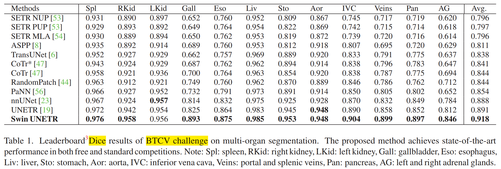
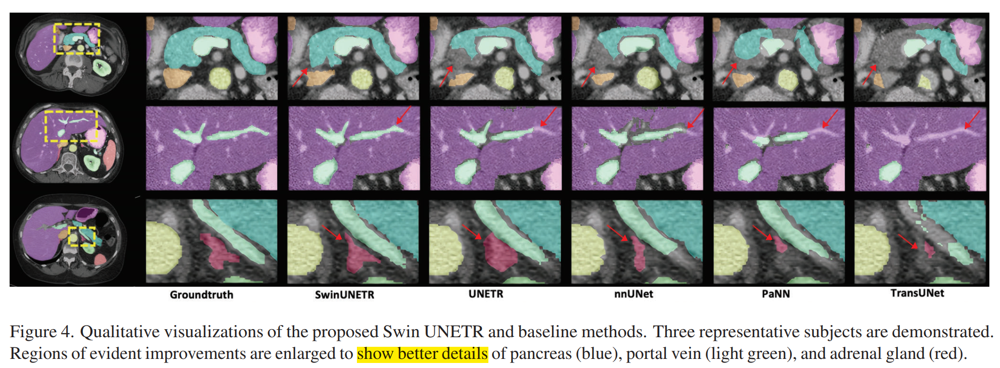
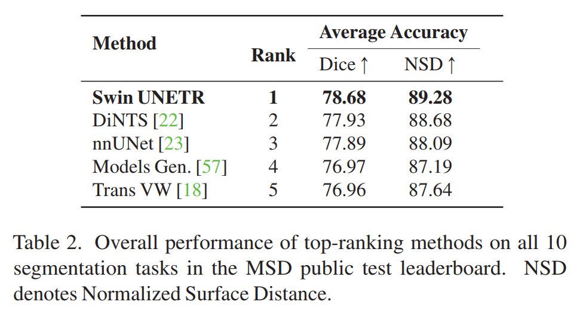
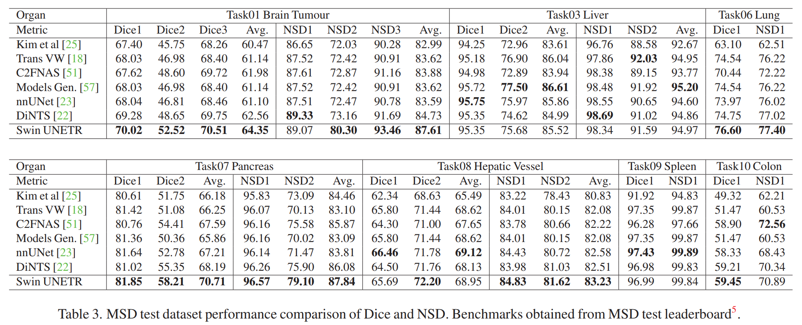
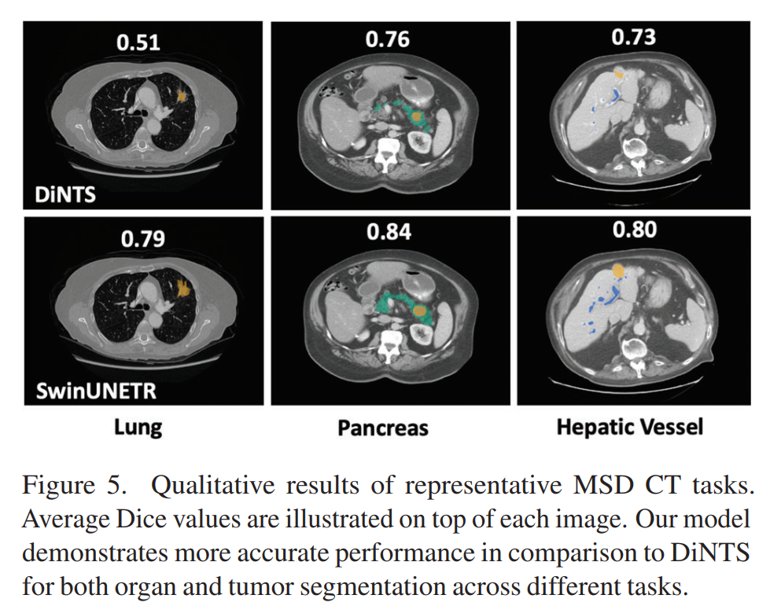
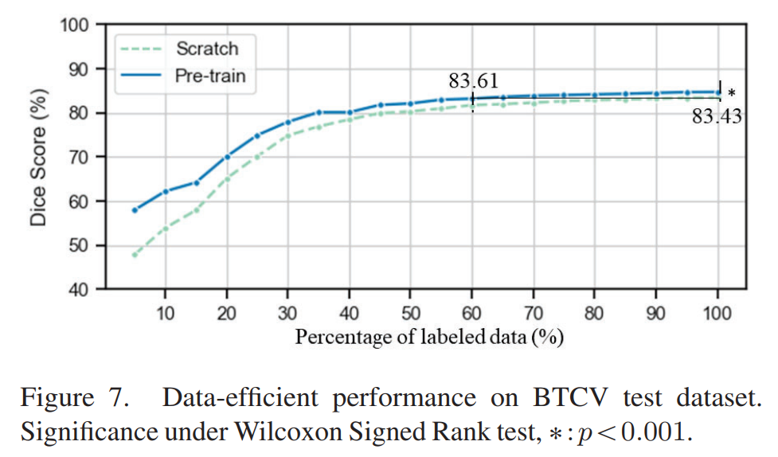
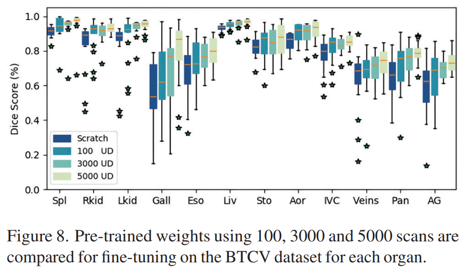
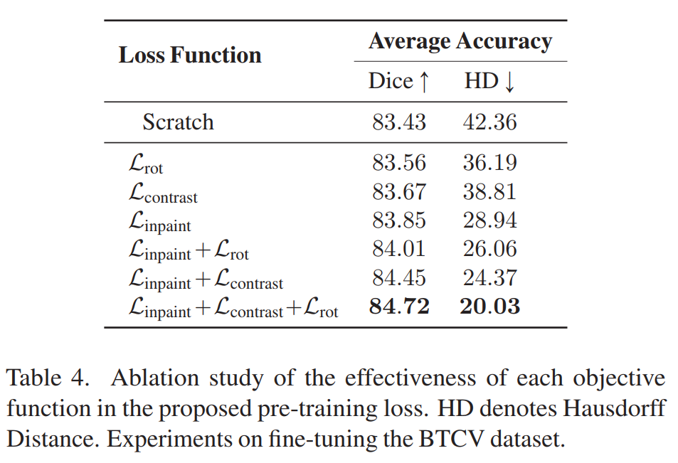

# 编码器预训练

## （一）图像遮挡重建（Masked Volume Inpainting）

使用 cutout 遮挡固定大小的正方形区域，采用全 0 填充（允许正方形区域在图片外）

使用**重建头**（reconstruction head）进行图像重建

## （二）图像旋转（Image Rotation）

将绕 z 轴旋转的图像输入，旋转角度固定为 0°、90、180°、270° 四类

通过**多层感知分类头**（MLP classification head）进行旋转角度分类

cutout 和图像旋转也作为数据增强方式

## （三）对比编码（Contrastive Coding）

当转移到下游任务时，自监督的对比编码在视频特征表示学习（visual representation learning）任务上有很好的性能

对一批增强的子卷，对比编码通过**最大化同一子卷的增强样本的相互信息，最小化不同子卷样本的相互信息**来实现更好的表征学习

对比编码为 Swin UNETR 编码器上附加一个**线性层**获得的一个潜在的表征向量 $v$

定义同类内两个子卷的 $v$ 之间的距离为 loss，通过最小化 loss 来加强同类的紧凑性（intra-class compactness）和类间的可分离性（inter-class separability）

# 数据集

## （一）预训练数据集

5 个公开的 CT 数据集，5050 个病例

* Head & Neck Squamous Cell Carcinoma (HNSCC)
* Lung Nodule Analysis 2016 (LUNA 16)
* TCIA CT Colonography Trial
* TCIA Covid 19
* TCIA LIDC

胸部 - 2018，腹部 - 1520，头颈部 - 1223

预训练阶段不使用数据集的标签

## （二）BTCV（Beyond the Cranial Vault）

BTCV 腹部挑战数据集，30 个病例的腹部 CT，

13 个器官被注释

CT 为造影剂门静脉期获得的，包括 80 到 225 个切片，像素为 512，切片厚度为 1 到 6 毫米

多器官分割问题为 13 类分割任务（详见表1）

预处理详见补充材料

## （三）MSD（Medical Segmentation Decathlon）

医学分割十项全能（MSD）数据集，10 个不同器官和图像模式的分割任务

这些任务是针对整个医学图像的困难而设计的，如小训练集、不平衡的类别、多模式数据、小物体

故 MSD 挑战可以作为一个对**医学图像分割方法通用性**的全面评估基准

预处理详见补充材料

# 实施细节

## （一）预训练任务

* 图像遮挡重建：ROI 裁剪比例 30%；裁剪区域是随机产生的，总和达到总体体素数

* 对比编码：使用 512 的特征尺寸作为嵌入尺寸

* 图像旋转：旋转度配置为0°、90°、180°、270°

预训练实验使用每个 GPU 处理 4 个 batch，每张图像 96x96x96

## （二）训练参数

使用 AdamW 优化器

热身余弦调度（warm-up cosine scheduler）设置为 500 次迭代

初始学习率为 $4e^{-4}$，动量为 $0.9$，衰减为 $1e^{-5}$，迭代 450K 次

在所有的 BTCV 和 MSD 实验中，采用了五倍交叉验证策略来训练模型

在每个 fold 中选择最好的模型，并将它们的输出集合起来用于最终的分割预测

# 评估标注

实验结果评估：DSC（Dice similarity coefficient）、Surface DSC、HD95（Hausdorff Distance 95%）

HD95：【分割边界 A，标签边界 B】A 上的点到 B 的最小值 $d_{AB}$，遍历 A 上的所有点，找到一个点使得 $d_{AB}$ 最大，同理得到 $d_{BA}$，取 $d_{AB}$ 和 $d_{BA}$ 中的最大值为 HD；HD 再乘 95% 得到 HD95（为了消除离群值的一个非常小的子集的影响）

DSC 对分割出的**内部填充**比较敏感，HD 对分割出的**边界**比较敏感

Surface DSC：在 MSD 挑战评估中称为归一化表面距离（Normalized Surface Distance，NSD），测量 ground truth 和预测**表面的重叠**（有固定的公差），而不是体积的重叠

# 实验结果

## （一）BTCV 多器官挑战赛

表 1

最高的平均 Dice 为 0.918，比排名第二、第三、第四分别高出 1.6%、2.0%、2.4%

在尺寸较小的器官的改进尤其明显：脾脏和门静脉提高了 3.6%，胰腺提高了 1.6%，肾上腺提高了 3.8%，其他器官也有适度的改善

图 4：Swin UNETR识别器官细节的成功

本方法胰腺的尾部（第 1 行）和门静脉的分支（第 2 行），而其他方法对此都没有分段

本方法在肾上腺的分割上也有明显的改进（第 3 行）

## （二）MSD 多器官挑战赛

表 2

本文的 Swin UNETR 在【Task01-脑肿瘤】、【Task06-肺】、【Task07-胰腺】、【Task10-结肠】中取得了领先的性能

在【Task02-心脏】、【Task03-肝脏】、【Task04-海马】、【Task05-前列腺】、【Task08-肝脏血管】、【Task09-脾脏】，结果与 SOTA 相当

Swin UNETR 在所有 10 个任务中有 78.68% 的最佳平均 Dice，在 MSD 排行榜上居于榜首

表 3：MSD 多任务

图 5：MSD 定性视觉效果

带有自监督预训练的 Swin UNETR 在 CT 任务中有更好的分割结果

预训练的权重只用于微调 CT 任务（肝脏、肺、胰腺、肝脏血管、脾脏、结肠）

由于 CT 和 MRI 图像之间的领域差距，MRI 任务（脑肿瘤、心脏、海马体、前列腺）的实验从头开始训练

# 消融实验

## （一）预训练的效果

图 6：MSD 的 CT 任务中使用预训练模型与否的对比

【Task03-肝脏】，DSC - 77.77% > 75.27%

【Task08-肝脏血管】，DSC - 68.52% > 64.63%

【Task10-结肠】，DSC - 43.38% > 34.83%（最大提升）

【Task07-胰腺】，DSC - 67.82% > 67.12%

【Task09-脾脏】，DSC - 97.32% > 96.05%

## （二）人工标注比例

图 7：使用 BTCV 数据集的一个子集进行微调的比较结果

与从头开始训练相比：

* 10% 的标记数据 - 预训练取得了约 10% 的改进*
* 100% 的标记数据 - 预训练取得了 1.3% 的改进

60% 的标记数据可以达到从头开始学习且 100% 的标记数据效果（DSC = 83.13）

结论：对于 BTCV 任务，我们的方法可以减少至少 40% 的注释工作

## （三）预训练数据量

图 8：预训练 100、3000、5000 张图像对比

我们通过使用较小的未标记数据的预训练权重，对 BTCV 数据集进行了有组织的研究。我们观察到，Swin UNETR 在训练的 CT 扫描总数方面是稳健的

结论：随着预训练使用的未标记数据规模的增加，本文模型从预训练数据集中获益更多

## （四）自监督方法的有效性

表 4：不同的自监督方法组合的预训练实证研究

在 BTCV 测试集上，使用图像遮挡重建的预训练权重在单一任务建模中取得了最高的改进

在配对任务上，图像遮挡重建和对比编码的 Dice 为 84.45%，HD 为 24.37

总的来说，采用所有的代理任务实现了 84.72% 的最佳 Dice

# 讨论和限制

本文自监督框架在利用大量可用医学图像方面的有效性，且不需要注释工作

与随机初始化权重的训练相比，减少了注释工作

框架是可扩展的，可以很容易地用更多的代理任务和扩增变换来扩展

预训练的编码器可以有利于各种医学成像分析任务的迁移学习，如分类和检测

在 MSD 胰腺分割任务中，具有预训练权重的 Swin UNETR 优于 AutoML 算法，如 DiNTS[22] 和 C2FNAS[51]，这些算法专门用于在同一分割任务中搜索最佳网络架构

限制：Swin UNETR 只使用 CT 图像进行了预训练，当直接应用于其他医学成像模式（如 MRI）时，本实验还没有显示出足够的可转移性，这主要是由于**明显的领域差距**和每种模式特有的**不同数量的输入通道**

