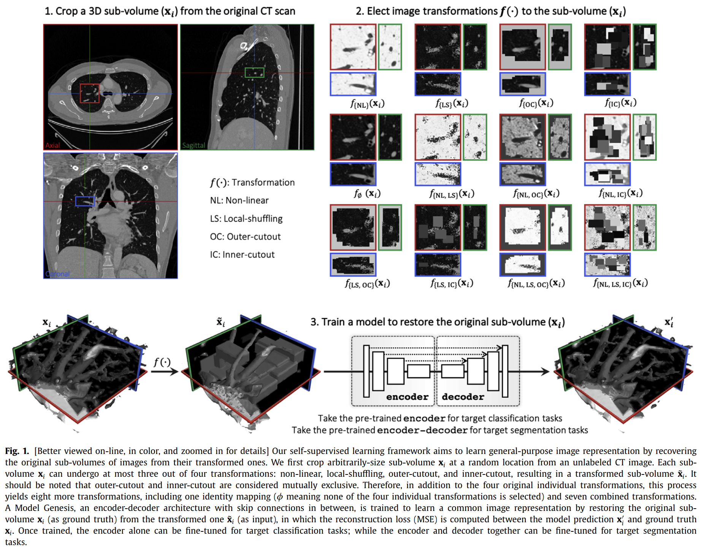
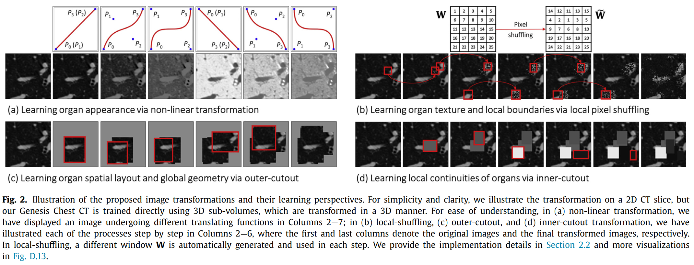
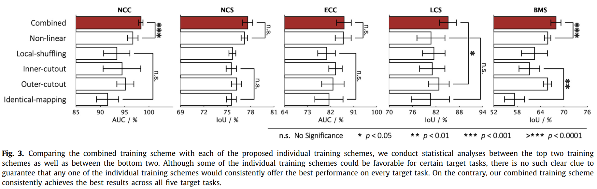
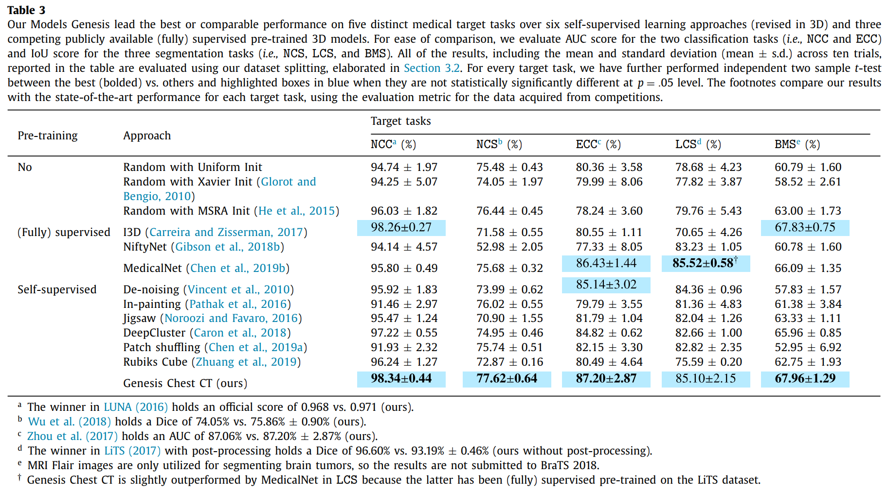
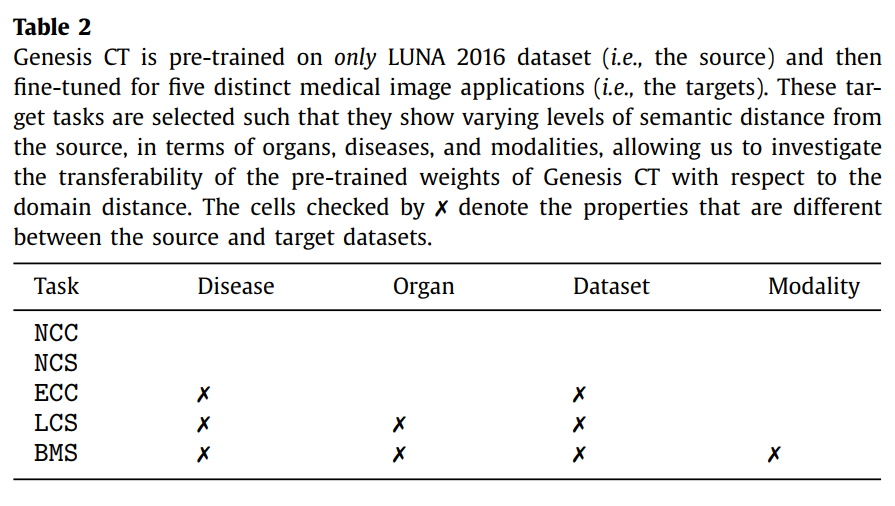
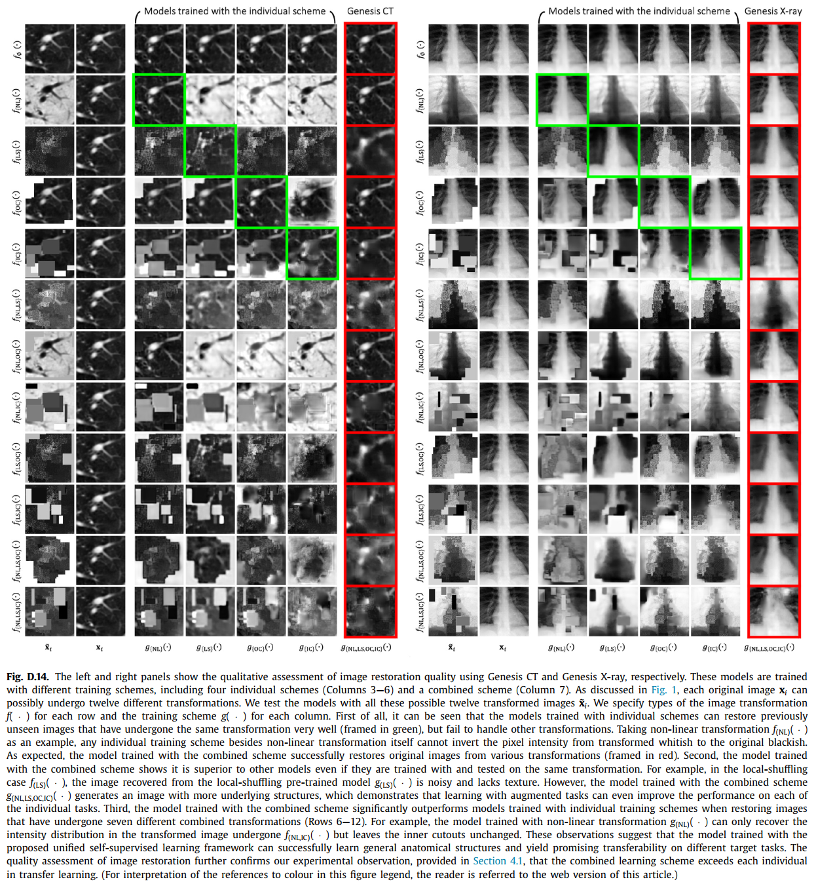
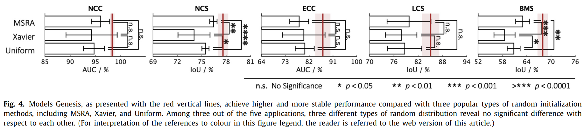
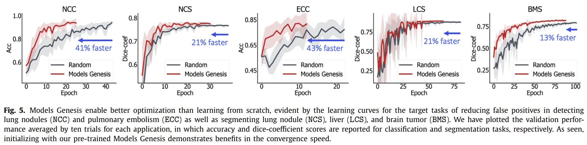
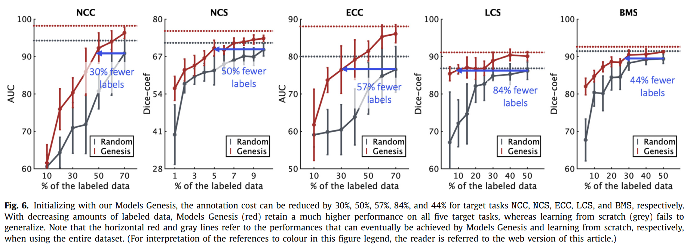

# 一、概述

从自然图像到医学图像的迁移学习（Transfer Learning）是医学图像中最实用的范式之一

在 ImageNet 上训练的模型的微调在二维领域取得了巨大的成功，但对于三维表征学习，没有像 ImageNet 这样的大规模标记数据集（1000 个类别，14,197,122 张图像）

但自然图像多为 2D 背景，如果将 CT 和 MRI 的 3D 成像任务降维为 2D 来解决，失去丰富的 3D 解剖信息，影响其性能

3D 模型通常比 2D 模型有更多的参数，因此需要更多的标记数据来训练

为了克服这一局限性，本文建立了**通用自学模型**（Generic Autodidactic Models，别名 Models Genesis 创世纪），因为它们是：

* 凭空创造的：没有人工标注
* 自学的：通过自监督消除对标记数据的需求
* 通用的：通过转移学习使一系列的三维医学成像任务受益
* 可扩展的：将各种自监督任务整合到具有相同 encoder-decoder 架构的单一图像修复任务中

本模型在五个 3D 应用（分割 / 分类）中的表现明显优于从头学习（scratch）和现有的预训练三维模型

3D 中从头开始学习模型不一定能产生比在 2D 中从 ImageNet 中转移学习更好的性能

但我们的 Models Genesis 在任何 2D / 2.5D 的方法中都名列前茅，包括微调从 ImageNet 预训练的模型以及微调我们 Models Genesis 的 2D 版本，证实了 3D 解剖信息的重要性以及 Models Genesis 对三维医学成像的意义

这一性能归功于统一的自监督学习框架，该框架建立在一个简单而强大的观察结果之上：
**医学图像中复杂而重复的解剖结构可以作为强大而自由的监督信号，让深度模型通过自监督自动学习常见的解剖学表征**

Genesis 代码和预训练模型：https://github.com/MrGiovanni/ModelsGenesis

这一性能可归因于以下关键观察：

医学成像协议通常侧重于身体的特定部位，以达到特定的临床目的，从而产生类似的解剖学图像。**复杂而重复**的解剖学为自监督学习提供了一致的模式，以发现特定身体部位（在我们的案例中是肺部）的相同表现

如图 1，本文自监督学习方法的基本思想：在一个统一的框架内从通过各种方式转换的图像中恢复解剖学模式

本文贡献：

1. 一个通用的预训练的三维模型的集合，有效地跨越疾病、器官和模式
2. 一个可扩展的自监督学习框架，提供分类的编码器和分割的编码器-解码器
3. 一套自监督的训练方案，从多个角度学习稳健的表述

# 二、创世纪模型 Models Genesis

模型的目标是**学习一种通用的图像表示**，这种表示可以在不同的疾病、器官和模式中转移和通用

图 1：本文的自监督学习框架

图 2：具体变换方式

本框架能够使用未标记的图像从头开始训练三维模型，包括三个步骤：

* 从病人的CT图像中裁剪子卷
* 使子卷变形
* 训练模型以恢复原始子卷

在下面的章节中，我们首先介绍了我们的自监督学习框架的含义，然后详细介绍了每个训练方案的学习目标和观点，接着总结了我们的模型创世的四个独特属性

## （一）从图像修复学习（image restoration）

自监督学习框架旨在通过从转换后的图像中恢复原始图像学习通用的图像表示

在无标签的 CT 图像的随机位置裁剪任意大小的子卷图像

每个子卷图像最多可以经历四种变换中的三种：

* 非线性（non-linear，NL）
* 局部打乱（local-shuffling，LS）
* 外部 cutout（outer-cutout，OC）
* 内部 cutout（inner-cutout，IC）

从而得到变换后的子卷图像（外切和内切是互斥的）

除了四个原始的单独变换外，又产生了八个变换，包括：

* 一个身份映射（φ意味着四个单独变换中没有一个被选中）
* 七个组合变换

Models Genesis 为一个带有 skip 的 encoder-decoder 结构，通过从变换后的子卷图像（输入）恢复原始子卷图像（ground truth）来训练学习一个通用的图像表示

训练损失函数使用 MSE

预训练后，编码器可以单独为**目标分类任务**进行微调，且编码器和解码器可以一起为**目标分割任务**进行微调

最终目标不是图像修复任务本身

虽然将修复图像作为模型学习图像表征的训练方案，但必须根据其通用性和对各种目标任务的可转移性来评估所学表征的作用

## （二）从多角度学习（multiple perspectives）

### 1. 通过非线性转换学习表征

提出了一种基于非线性转换的新型自监督训练方案，通过这种方案，模型可以学习**还原用一组非线性函数转换的输入图像的强度值**

原理：CT 扫描中的绝对**强度值**（Hounsfield units）或其他成像方式中的相对强度值传达了**潜在结构和器官的重要信息**

因此，这种训练方案使模型能够学习**图像中存在的解剖结构的外观**

为了保持解剖结构的外观可感知性，我们有意使用将**单调**非线性强度转换函数，具体使用**贝塞尔曲线**（平滑和单调的变换函数，由两个端点 P0 P3 和两个控制点 P1 P2 产生

应用转换函数之前的处理：

* 在 Genesis CT 中，首先在 [-1000, 1000] 的范围内剪辑 Hounsfield 单位值，然后将每个 CT 扫描归一到 [0, 1]
* 在 Genesis Xray 中，直接将每个X射线归一到 [0, 1]，不进行强度剪辑

### 2. 通过局部像素打乱学习纹理特征

提出了局部像素打乱（local pixel shuffling），以**丰富子卷的局部变化**，而不大幅损害其全局结构，从而鼓励模型学习**物体的局部边界和纹理特征**

具体做法：对于每个输入的子卷，我们随机选择 1000 个窗口，然后按顺序打乱每个窗口内的像素

本地窗口的大小决定了代理任务的难度。在实践中，为了保留图像的全局内容，我们保持**窗口小于网络的感受域**，这样网络就可以通过“重置”原始像素的位置来学习**更稳健的图像表示**

注意：

* 与 PatchShuffling（Kang 等 2017）完全不同，后者是一种正则化技术，以避免过度拟合
* 与去噪（Vincent 等 2010）和画中画（Pathak 等 2016；Iizuka 等 2017）不同，我们的局部打乱不用噪声替换像素值，因此保留了与原始子卷相同的全局分布

此外，如图 2-b，在一个范围内的局部打乱可以**保持物体的可感知性**，有利于深度神经网络学习局部不变的图像表征

### 3. 通过外部 cutout 和内部 cutout 学习语境

我们设计了外部 cutout 作为自监督学习的一个新的训练方案

我们生成任意数量（≤ 10）的窗口，具有不同的尺寸和长宽比，并将它们叠加在一起，形成一个复杂形状的单一窗口（外部 cutout 区域限制在总子卷体积的 1/4 以下），将窗口以外的区域用随机值填充

通过恢复生成窗口以外的区域，模型将学习**医学图像中器官的全局几何结构和空间布局**

框架也将内部 cutout 作为一种训练方案，即用随机值填充窗口内区域（内部 cutout 区域限制在总子卷体积的 1/4 以下），通过恢复内切口，该模型将**通过在每个子卷内插值来学习医学图像中器官的局部连续性**

与 Pathak 等 2016 不同的是，他们提出的内画（in-painting）是通过只恢复图像的中心区域作为代理任务，我们恢复整个子卷作为模型输出

## （三）Models Genesis 的几个独特的属性

### 1. 无需人工标注

模型以自监督的方式训练，使用未标记的图像数据集

就我们所知，这项工作代表了为三维医学图像分析建立公开可用的自监督模型的首次努力

### 2. 多角度鲁棒性学习

组合方法从多个角度（外观、纹理、背景等）训练模型，从而在所有的目标任务中产生更强健的模型

这种兼收并蓄的方法，将多种任务纳入单一的图像修复任务中，使 Models Genesis 有能力学习更全面的表征

大多数自监督方法设计了孤立的训练方案，而众多最新结果表明，**单幅图像使用一个以上的变换组合很重要**（Graham 2014；Dosovitskiy 等 2015；Wu 等 2020），这在本文的图像修复任务中也得到了实验证实

图 3：组合方法与单独方案的比较

### 3. 扩展适应许多训练方案

此自监督方案在训练期间共享相同的编码器和解码器

如果每个任务都需要自己的解码器，由于 GPU 的内存有限，我们的框架将无法容纳大量的自监督任务

通过**将所有任务统一为图像修复任务**，任何有利的转换都可以很容易地修正到我们的框架中，克服了与多任务学习相关的可扩展性问题（Doersch & Zisserman 2017；Noroozi 等 2018；Standley 等 2019；Chen 等 2019b），将网络头适配于具体的代理任务

### 4. 多样化的应用

Models Genesis 通过一套多样化的自监督方案进行训练，学习一种**通用的图像表征**，可以利用它进行广泛的目标任务

Models Genesis 可以用来初始化目标分类任务的编码器，以及初始化目标分割任务的编码器-解码器，而现有的自监督方法主要集中在只提供编码器模型（Jing和Tian，2020）

表 3 中，Models Genesis 可以在不同的疾病（如结节、栓塞、肿瘤）、器官（如肺、肝、脑）和模式（如 CT 和 MRI）中通用，这种通用行为使我们有别于以往文献中缺乏通用性的通过特定的自监督

表 3

# 三、实验

## （一）预训练模型的产生

### 1. 数据集

Models Genesis 是以自监督的方式从 LUNA 2016（Setio 等 2017）的 623 张胸部 CT 扫描图中预训练出来的（不使用全部的 888 张因为要避免代理任务和目标任务之间的测试图像泄露）

Models Genesis 只从未标记的图像中训练，不使用数据集的注释

Models Genesis 2D 是由 LUNA 2016（Setio等人，2017）和 ChestX-ray14（Wang 等 2017b）分别使用轴向视图的 2D CT 切片和 X 射线图像进行自监督的预训练

### 2. 训练细节

所有的代理任务和目标任务，在训练前将原始图像强度归一化为 [0,1] 范围

使用 MSE 作为图像修复的损失函数，MSE 损失对于表征学习来说是足够的，尽管修复后的图像可能模糊

当预训练 Models Genesis 时，以预先定义的概率在子卷上应用每个变换。也就是说，**模型不仅会遇到转换后的子卷作为输入，也会遇到原始子卷**，这种设计有两个优点：

* 该模型必须**区分原始图像和转换后的图像**，辨别转换类型，并在转换后恢复图像。因此，我们的自监督学习框架产生了能够处理各种任务的预训练模型

* 由于原始图像在代理任务中呈现，代理任务和目标任务之间的**输入图像的语义差异较小**。因此，预训练的模型可以在广泛的目标任务中转移到处理正常图像和种类繁多的目标任务

## （二）微调 Models Genesis 

**评估目标：自监督表征法在迁移学习中的性能，预训练权重在跨越领域距离方面的转移性**

预训练的 Models Genesis 可以通过转移学习或微调来适应新的成像任务

有三种主要的转移学习情况：

* 特征提取任务：采用编码器作为新数据集的固定特征提取器，并用线性分类器（如线性 SVM 或 Softmax 分类器）跟进
* 分类任务：采用预训练的编码器，为目标分类任务添加一连串完全连接层
* 分割任务：采用预训练的编码器和解码器，用 1x1x1 卷积层取代最后一层，用于目标分割任务

对于后两种，可以对模型的所有层进行微调，也可以将早期层保持固定，只对深层部分进行微调

我们通过对网络中的所有层进行微调，评估了我们的自监督表示法在迁移学习中的性能

在下文中，我们在**五个不同的医学应用**中检验了 Models Genesis，涵盖了 CT 和 MRI 图像的分类和分割任务，从源头（胸部 CT）到目标的器官、疾病和模式的语义距离各不相同（表 2），以调查 Models Genesis 的转移能力。

表 2：五个医学应用与预训练环境的差距

（表中 ✗ 表示预训练数据集和任务数据集具有不同属性）

Genesis CT 仅在 LUNA 2016 数据集上进行了预训练，然后针对五个不同的医学图像目标任务进行了微调

这些目标任务的选择使它们在器官、疾病、模式等方面显示出与预训练环境的不同程度的语义距离，据此够研究 Genesis CT 的**预训练权重在领域距离方面的转移性**

### 1. 减少肺结节假阳性（NCC）

目标：区分真阳性和假阳性，**分类任务**

数据集：LUNA 2016，包括 888 张切片厚度小于 2.5mm 的低剂量肺部 CT，随机分配到训练集（445）、验证集（178）、测试集（265）

标注：提供 5,510,166 个候选位置的注释，其中真阳性标记为 “1”，假阳性标记为 “0”

评估：通过曲线下面积（AUC）得分来评估对真阳性和假阳性的分类性能

### 2. 肺结节分割（NCS） 

目标：分割肺结节，**分割任务**

数据集：LIDC-IDRI 提供（Armato III 等 2011），1018 个病例，三维 CT 扫描，分成训练组（510）、验证组（100）、测试组（408）；将体积重新采样为 1-1-1 的间距，然后在每个结节周围 64×64×32 的范围裁剪，将得到的裁剪结果用于模型训练和评估

标注：肺结节被标记为 3D 的二进制掩码

评估：采用交并比（IoU）和 DSC 来评估性能（在 0.5 到 0.95 的阈值范围内计算 IoU 的平均值，步长为 0.05）

### 3. 减少肺栓塞假阳性（ECC）

目标：区分真阳性和假阳性，**分类任务**

数据集：一个由 121 次计算机断层扫描肺血管造影（CTPA）扫描组成的数据库，326 个栓子

按照先前的工作（Liang和Bi，2007年），我们利用他们基于toboggan算法的PE候选生成器，结果共有687个真阳性和5568个假阳性

然后，数据集在病人层面被分为训练集和测试集，训练集有434个真阳性PE候选人和3406个假阳性PE候选人，测试集有253个真阳性PE候选人和2162个假阳性PE候选人。

评估：通过曲线下面积（AUC）得分来评估对真阳性和假阳性的分类性能

### 4. 肝脏分割（LCS） 

目标：分割肝脏，**分割任务**

数据集：MICCAI 2017 LiTS 挑战赛，包括 130 个标记的 CT 扫描，分为训练集（100）、验证集（15）、测试集（15），ground truth 提供肝脏标签和病变标签

只将肝脏作为阳性，其他作为阴性

评估：采用交并比（IoU）和 DSC 来评估性能

### 5. 脑肿瘤分割（BMS） 

目标：分割所有脑肿瘤相关部分，**分割任务**

数据集：BraTS 2018 挑战赛，285 名患者（210 名 HGG 和 75 名 LGG），每个患者都有四个三维 MRI 模式（T1、T1c、T2、Flair）刚性对齐，采用三折交叉验证，其中两个折（190名患者）用于训练，一个折（95名患者）用于测试；注释包括背景（0）、GD 增强的肿瘤（4）、瘤周水肿（2）、坏死的和非增强的肿瘤核心（1）

将 0 认定为阴性，其他为阳性

评估：采用交并比（IoU）和 DSC 来评估性能

## （三）Models Genesis 的基准分析（Benchmarking）

为了彻底比较，使用了三种不同的技术来随机初始化模型的权重：

* 基于高斯分布的基本随机初始化
* Xavier 方法，在 Glorot & Bengio 2010 中提出
* Xavier 方法的修订版本 MSRA，在 He 等 2015 中提出

按照Keras的Initializers1，它们分别被实现为uniform、glorot_uniform和he_uniform

我们将 Models Genesis 与 Rubik's cube（Zhuang 等 2019）进行比较，Rubik's cube 是最新的多任务和自监督学习方法，用于 3D 医学成像

考虑到大多数自监督学习方法最初都是在 2D 中提出和实现的，我们将五个最具代表性的方法扩展到它们的三维版本，以进行公平的比较

* De-noising (Vincent et al., 2010)
* In-painting (Pathak et al., 2016)
* Jigsaw (Noroozi and Favaro, 2016)
* DeepCluster (Caron et al., 2018)
* Patch shuffling (Chen et al., 2019a)

此外还研究了公开的医学影像 3D 迁移学习的预训练模型：

* NiftyNet (Gibson et al., 2018b)
* MedicalNet (Chen et al., 2019b)
* I3D (Carreira and Zisserman, 2017)

在 3D 应用中使用 3D U-Net 架构，在 2D 应用中使用 U-Net 架构

在代理任务中使用尺寸 64x64x32 的三维子卷对模型进行预训练，而在目标任务中，输入不限于具有一定尺寸的子卷

也就是说，我们的预训练模型可以根据用户的需要，用 CT 子卷、整个 CT 卷、甚至 MRI 卷作为输入，对任务进行微调。输入尺寸的灵活性归因于两个原因：

* 我们的预训练模型学习了通用的图像表征，如外观、纹理和背景特征
* 编码器-解码器架构能够处理任意尺寸的图像

表 3

Models Genesis 在五个不同的医疗目标任务上，比**六个自我监督的学习方法**（3D 版本）和**三个竞争性的开源全监督的预训练三维模型**的性能更好或相当

评估了两个分类任务（NCC、ECC）的 AUC 和三个分割任务（NCS、LCS、BMS）的 IoU

> 网络设置：开源模型不重新训练代理任务，而只尽力调整超参数，假定开源模型都达到了最佳设置

# 四、结果

从一项消融实验开始，将组合方法与每个单独的方案进行比较，得出结论：**组合方法往往能取得更稳健的结果，并超过任何其他训练方案**

然后，我们从组合方法中得到预训练的模型，并在五个三维医疗应用中提出结果，与最近的监督和自我监督学习文献中发现的最先进的方法进行比较。

## （一）组合预训练方案超过单一预训练方案

如果没有任何图像转换，该模型不会从代理图像修复任务中获益很多
几乎所有的单个方案都比相同映射提供了更高的目标任务表现，这表明了四个设计的图像转换在学习图像表征方面的重要性

图 3：组合预训练与单一预训练对比

在给定的目标任务中，没有一个单一方案能始终保证最高的性能，但组合方案始终超过单一方案

得益于基于图像修复的新型表征学习框架，可以将各种训练方案整合到一个单一的训练方案中

组合方案从多个角度（外观、纹理、背景等）对模型进行预训练，使模型能够学习到更全面的表征，从而形成更强大的目标模型

图 D-14

左图 - Genesis CT  右图 - Genesis X-ray

每一行指定图像变换 $f(\cdot)$ 的类型，每一列指定训练方案 $g(\cdot)$ 

* 单一变换的图像可以在单一变换预训练的网络上很好重建，但是单一变换预训练罕有处理其他变换的能力（例如对非线性变换 $f_{(NL)}(\cdot)$ 图像，$g_{(NL)}(\cdot)$具有独特的能将像素强度灰度恢复的能力）

* 组合变换预训练的模型更有优势，即使它们是用同样的变换训练和测试的，增强的任务学习甚至可以提高每个单独任务的性能（例如对 $f_{(LS)}(\cdot)$ 使用 $g_{(LS)}(\cdot)$ 恢复的图像有噪声且缺乏纹理，而用组合预训练 $g_{(NL,LS,OC,IC)}(\cdot)$ 产生了更多底层结构）

* 在组合变换的图像上，单一变换预训练的网络明显不及组合变换预训练的网络

结论：统一自监督学习框架训练的网络可以成功地学习一般的解剖结构，并在不同的目标任务上产生有希望的转移性。组合学习方案在转移学习中超过了每个单一方案

## （二）Models Genesis 的表现优于从头学习

**只有当从代理任务中学习到的图像表征具有可转移到目标任务中的普遍性时，转移学习才会加速训练和提升性能**

在三维医学影像中，由于缺乏大规模数据集，常见的做法仍是从头开始训练

用三种有代表性的随机初始化方法训练 3D 模型：

* 原始的统一初始化、Xavier 初始化、MSRA 初始化
* 转移学习和控制数学分布的初始化可以学习到更复杂的图像表征，但受到领域差距的影响
* 随机初始化独立于任务的，但提供的好处较少

转移学习假设：与简单地使用不同的分布初始化权重相比，跨视觉任务的深度特征转移可以获得语义上更强大的表示

图 4：预训练和随机初始化的对比

随机初始化权重在的结果中显示出很大的随机性差异，这在很大程度上是由于从头充分初始化这些网络的困难，初始权重的一个小错误就会导致梯度消失、梯度爆炸、网络收敛性差

图中五个医疗应用中的三个表示，这些随机初始化方法之间没有明显区别，但相对来说，权重以特定的 ReLU 感知初始化的 MSRA 工作最可靠

图：

Genesis 胸部 CT  初始化可以**稳定整体性能**，比所有随机初始化方法的平均性能提升了很多，对于所有目标任务的性能增益都很明显，为初始权重提供了一个**更好的起点**，同时**加快了网络收敛速度** 13% 以上

## （三）Models Genesis 超越了现有的预训练三维模型

在五个不同的医疗目标任务上与现有的公开可用的预训练的三维模型进行了评估

Genesis 胸部 CT 与其他现有的三维模型形成了明显的对比，这些模型都是经过全监督预训练的

请注意，在肝脏分割任务（LCS）中，Genesis 胸部 CT 的表现略优于 MedicalNet，因为MedicalNet直接从LiTS数据集的（完全）监督预训练中获得好处

进一步的统计测试显示，在P=0.05的水平上，Genesis 胸部 CT 仍然能产生与MedicalNet相当的性能

对于其余四个目标任务，Genesis 胸部 CT 在很大程度上取得了优于所有同类产品的性能

更重要的是，Genesis 胸部 CT 只在胸部 CT 数据上进行了预训练，但**可以推广到不同的器官、疾病、数据集，甚至成像模式**

Models Genesis 以 3D U-Net 为 backbone，携带的参数比现有的开源预训练的 3D 模型少得多

* MedicalNet（backbone：resnet-101）性能最高，但包含 85.75M 的参数
* I3D 在编码器中包含 25.35M 的参数
* NiftyNet（backbone：Dense VNet）仅包含 2.60M 的参数，但它在所有五个目标任务中的表现不如其他网络好
* Models Genesis 只有 16.32M 的参数，在**通用性**、**可转移性**、**参数效率**方面超过了所有现有的预训练三维模型

## （四）Models Genesis 减少了 >30% 的手工标注

图 6：预训练减少手工标注

转移学习利用了预训练模型已经学到的关于医学图像的知识，需要的注释数据和训练迭代比从头学习要少得多

* 微调 Models Genesis 在目标任务上很快就饱和了，可以达到与全数据集训练相似的性能
* 微调和从头开始学习的性能差距显著，在每个部分数据点的训练模型上稳定

# 五、讨论

## （一）我们还需要一个医学图像网吗？

在计算机视觉领域，在本文撰写之时，没有一种自监督学习方法能胜过在ImageNet上预训练的微调模型（Jing和Tian，2020；Chen等人，2019a；Kolesnikov等人，2019；Zhou等人，2019b；Hendrycks等人，2019；张等人，2019；Caron等人，2019）。因此，从我们在表3中的结果观察到，（完全）监督的表征学习方法在一些三维目标任务中不一定比自我监督的表征学习方法提供更高的性能，这似乎令人惊讶。我们将这一现象归因于其预训练中使用的监督量有限（NiftyNet（Gibson等人，2018b）为90例，MedicalNet（Chen等人，2019b）为1638例）或领域距离（I3D从视频到CT/MRI（Carreira和Zisserman, 2017））。之前的一项关于ImageNet预训练的研究（Sun等人，2017b）证明，需要大量的监督来培养一个通用的、全面的图像表示。早在2009年，当ImageNet还没有建立的时候，使用小规模甚至中等规模的标记数据来赋予深度模型通用的图像表征是很有挑战性的，我们相信，今天的3D医学图像分析也是这样的情况。因此，尽管Models Genesis表现出色，但毫无疑问，像计算机视觉领域的ImageNet（Deng等人，2009年）一样，用于医学图像分析的大型强标注数据集仍有很大需求。我们开发Models Genesis的目标之一是帮助创建这样一个医学ImageNet。在一小部分专家注释的基础上，从Models Genesis中微调的模型将能够帮助快速生成未标记图像的初始粗略注释，供专家审查，从而减少注释工作，加速创建一个大型的、强注释的医学ImageNet。总之，Models Genesis的设计并不是为了取代这样一个用于医学图像分析的大型强注释数据集，就像计算机视觉的ImageNet一样，而是为了帮助创建一个。

## （二）同域或跨域的迁移学习？

只要有可能，同域转移学习总是首选，因为相对较小的领域差距使学习到的图像表征更有利于目标任务。即使是最近的医学影像自监督学习方法也只在同一数据集中进行了评估，如Chen等人（2019a）；Tajbakhsh等人（2019a）；Zhu等人（2020）。就性能而言，同域转移学习是一个首选；然而，现有的大多数医疗数据集，少于一百个案例，通常太小，深度模型无法学习可靠的图像表示。因此，在未来的工作中，我们计划将类似领域的公开数据集结合起来，训练面向模式的模型，包括Genesis CT、Genesis MRI、Genesis X-ray和Genesis Ultrasound，以及面向器官的模型，包括Genesis Brain、Genesis Lung、Genesis Heart和Genesis Liver。

医学影像的跨领域转移学习是圣杯。从PACS系统中检索大量未标记的图像需要IRB的批准，这往往是一个漫长的过程；检索到的图像必须去掉标识；以适合深度学习的方式组织去掉标识的图像是繁琐而费力的。因此，对于许多目标领域来说，大量的无标签数据集可能并不容易获得。从我们在表3（BMS）中的结果可以看出，Models Genesis在跨领域转移学习方面有很大的潜力；特别是，我们基于扭曲的方法（如非线性和局部洗牌）利用相对强度值（在所有模式下）来学习各种器官的形状和外观。因此，作为我们未来的工作，我们将把重点放在能够很好地跨领域推广的方法上。

## （三）任何数据增强都适合作为一种转换吗？

我们提出了一个自我监督的学习框架，通过辨别和恢复经历不同变换的图像来学习图像表征。有人可能会说，我们的图像变换可以与现有的数据增强技术互换（Gan等人，2015；Wong等人，2016；Perez和Wang，2017；Shorten和Khoshgoftaar，2019），而我们希望能更清楚地区分这两个概念的不同。在设计图像转换时，评估特定的增强对图像修复任务是否实用和可行是至关重要的。简单地引入数据增强会使任务变得模糊不清，导致退化的学习。为此，我们根据两个原则来选择图像转换。

首先，转换后的子容积不应该在原始CT扫描中找到。但有可能找到一个经过旋转、翻转、放大/缩小或平移等增强处理的变换子容积，作为原始CT扫描中的替代子容积。在这种情况下，如果没有额外的空间信息，模型将无法通过看到转换后的子容积来 "恢复 "原始子容积。因此，我们只选择可以应用于像素级而不是空间级的子卷的增强。

其次，一个转换应该适用于特定的图像属性。操作RGB通道的增强，如颜色移动和通道下降，对没有颜色信息的CT/MRI图像影响不大。相反，我们将亮度和对比度提升为单调的颜色曲线，从而形成了一种新颖的非线性变换，明确地使模型能够从医学图像中学习强度分布。

在使用上述两个原则过滤掉后，剩下的数据增强技术并没有预期的那么多。我们努力产生学习视角驱动的转换，而不是邀请任何类型的数据增强进入我们的框架。Chen等人（2020）最近的一项研究也发现了一个类似的现象：精心设计的增强技术要优于自主发现的增强技术。这表明由学习观点驱动的转换标准，在捕捉医学成像中三维转移学习的令人信服的、稳健的表现。

## （四）算法可以自主地搜索转换吗？

在为我们的自监督学习框架设计合适的图像转换时，我们遵循两个原则（见第5.3节）。潜在的，"自动数据增强 "可以被认为是一个有效的替代方案，因为这一研究方向旨在将研究人员从手动寻找良好的参数化和转换组合的负担中剥离出来。具体来说，现有的自动增强策略通过计算预测和图像标签之间的回报，强化模型以学习一套最佳的增强策略。仅举几例，Ratner等人（2017年）提出了一种方法，用于学习如何为自动数据增殖提供参数化和复合转化，同时为所有数据点保留类标签或空类。Dao等人（2019）介绍了一种用于增强选择的快速内核对齐度量。它需要图像标签来计算特征核和标签核之间的核目标对齐（作为奖励）。Cubuk等人（2019年）使用强化学习形成了一种算法，该算法自主搜索特定分类任务的首选增强策略、幅度和概率，其中预测和标签的结果准确性被视为训练递归网络控制器的奖励信号。Wu等人（2020）提出了基于不确定性的抽样来选择最有效的增强，但它是基于预测和标签之间计算出的最高损失。虽然奖励在上述工作中得到了很好的定义，但不幸的是，没有可用的指标来直接确定图像表示的力量；因此，没有奖励是容易建立表示学习的。我们的论文旨在设计一个图像修复任务，而不是直接约束表征，让模型从三维医学图像中学习通用的图像表征。为了实现这一目标，受Vincent等人（2010）的启发，我们将好的表征的定义修改为以下内容。"一个好的表征是可以从转换后的输入中稳健地获得，并且对恢复相应的原始输入有用"。因此，模型的输入和输出之间的均方误差（MSE）被定义为我们框架中的目标函数。然而，如果我们采用MSE作为奖励函数，现有的自动增强策略将最终选择相同的映射。这是因为恢复没有任何变换的图像预计会比恢复有变换的图像的误差低。从图3可以看出，相同映射的结果是一个糟糕的图像表示。总而言之，在我们的框架中采用自动增强策略时，关键的挑战是如何为恢复图像定义一个适当的奖励，以及从根本上说，为学习图像表示。

## （五）如何评估修复质量及其与模型转移性的关系？

我们在第4节中的迁移学习结果表明，图像修复是学习通用三维图像表征的一项有前途的任务。这也意味着，图像修复质量在某种程度上与模型的可转移性有隐性的关联。为了评估修复质量，我们将平均平方误差（MSE）损失与其他常用的图像修复损失函数进行比较，如平均绝对误差（MAE）和结构相似度指数（SSIM）（Wang等人，2004）。它们都是计算输入和输出图像之间的距离，而SSIM比MSE和MAE更集中于结构相似性方面的修复质量。由于公开的三维SSIM损失是在PyTorch7中实现的，为了使比较公平，我们也将我们的五个目标任务改编成PyTorch。图8显示了五个目标任务在三个备选损失函数中的混合表现。正如第5.4节所讨论的，表示学习的理想损失函数是一个能够明确确定图像表示能力的函数。然而，本节探讨的三个损失是隐性的，基于图像修复质量可以表明一个好的表示的前提。因此，建议进一步研究修复质量评估及其与模型转移性的关系。

## （六）模型Genesis能否从图像中自主地检测出感染区域？

正如第3.1节所提到的，Genesis 胸部 CT 已经使用LUNA 2016数据集中的623张CT图像进行了预训练。为了评估图像修复质量，我们利用了数据集中其余的265张CT图像，并在图9中展示了例子。具体来说，我们将原始CT图像传递给预训练的Genesis 胸部 CT 。为了可视化修改，我们通过减去输入和输出，进一步绘制了差异图。由于输入图像不涉及图像转换，大多数恢复的CT扫描（见第1-2行）可以保留输入图像的纹理和结构，由于相同的映射训练方案以及编码器和解码器之间的跳过连接，只遇到少数变化。尽管如此，我们还是观察到一些失败的案例（见第3行），特别是当输入的CT图像包含弥漫性疾病，在肺部表现为不透明。Genesis 胸部 CT 恰好可以 "去除 "这些不透明的区域，恢复一个更清晰的肺部。这可能是由于大多数被裁剪的子卷是正常的，并被用作地面实况，这使预训练的模型具有检测和恢复CT扫描中 "新事物 "的能力。更具体地说，在我们的工作中，这些新情况包括由非线性变换注入的异常强度分布，由局部洗牌注入的非典型纹理和边界，以及由内部和外部剪切注入的不连续性。根据周围的解剖结构，模型预测不透明的区域是空气，因此恢复了较暗的强度值。这种行为在图像修复方面当然是一个 "错误"，但也可以认为是检测肺部弥漫性疾病的一种尝试，由于其边界不明确，所以对其进行注释具有挑战性。通过训练图像修复任务，患病区域将通过输入和输出的简单减法显示出来。更重要的是，这种建议的检测方法需要零人类注释，既不需要图像级别的标签，也不需要像素级别的轮廓，与现有的弱监督疾病检测方法形成鲜明对比（Zhou等人，2016；Baumgartner等人，2018；Cai等人，2018；Siddiquee等人，2019）。