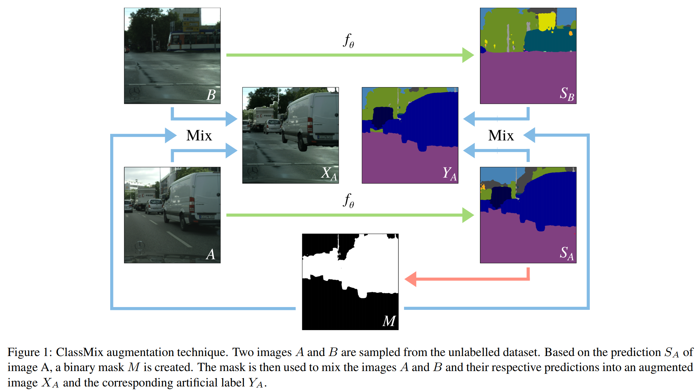
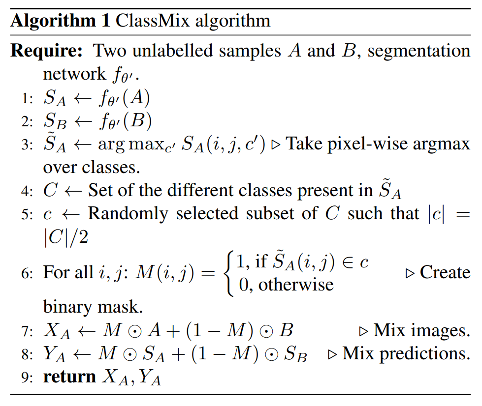
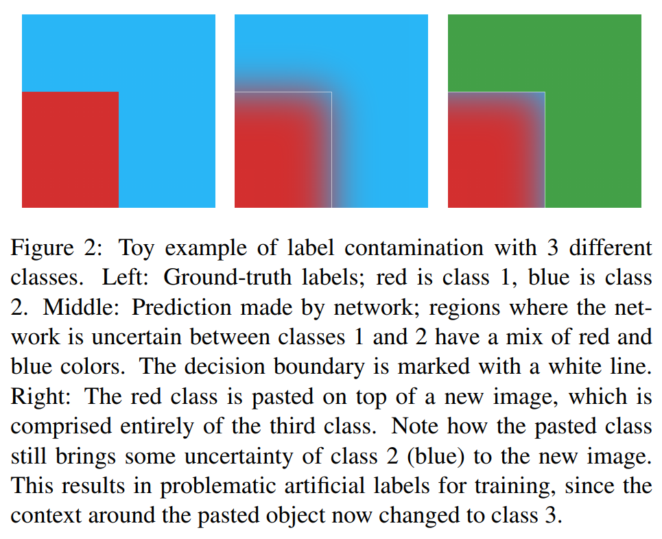

# 一、背景

ClassMix: 基于分割的半监督学习的数据增量

语义分割进展受限于为训练而生成标签的成本，故半监督方法已被应用于这项任务，并取得了不同程度的成功

一个关键的挑战是，在半监督分类中使用的普通增强方法对语义分割来说不太有效

提出了一种**新的数据增强机制** ClassMix，通过混合未标记的样本，利用网络对对象边界的预测来产生增强效果

该增强策略从一幅图像中切下一半的预测类别，并将其粘贴到另一幅图像上，形成一个新的样本，该样本更好地保持语义边界，同时在没有 ground truth 的情况下仍然可以使用

主要贡献：

* 引入了一种语义分割的新的增强策略，我们称之为 ClassMix
* 将 ClassMix 纳入一个统一的框架，利用一致性正则化和伪标签进行语义分割
* 通过对 Cityscapes 数据集的半监督学习取得最先进的结果，以及对 Pascal VOC 数据集的竞争结果，证明方法的有效性

> ClassMix 代码：https://github.com/WilhelmT/ClassMix

# 二、相关工作

对于语义分割来说，半监督学习已经通过基于**对抗性学习**[19, 28, 31]、**一致性正则化**[13, 21, 25, 30]和**伪标签**[12, 5]的技术进行了探索

本方法主要吸收了后两种方法的思想

## （一）一致性正则化

核心思想：无标签数据的预测应不受扰动影响的

一种流行的分类技术是增强锚定（augmentation anchoring）[37, 33, 1]，其中对强增强样本进行的预测被强制趋于同图像的弱增强版本的预测

本方法利用了增强锚定：执行未受干扰的图像与混合图像的一致性

混合图像会在困难的背景下产生遮挡和类，是一种强增强

本文提出的 ClassMix 方法通过使用分割网络的预测来构建混合，通过这种方式，可以在高度变化的混合样本上执行一致性，同时更好地遵循原始图像的语义边界

## （二）伪标签

主要动机来自于熵最小化，以鼓励网络对未标记的图像进行自信的预测

## （三）相关的增强策略

在 CutMix 算法[38]中，随机的矩形区域从一个图像中切出并粘贴到另一个图像上。这种技术是基于基于掩码的混合，即使用与图像大小相同的二进制掩码来混合两幅图像

我们提出的技术，ClassMix，是基于类似的图像组合原理，并利用预测的分割来生成二进制掩码，而不是矩形

ClassMix 与其他基于分割的增强策略有相似之处[9, 32, 8, 35, 11]，在这些策略中，注释过的物体的单一实例被从图像中切出，并粘贴到新的背景场景中

我们以预测的语义图为条件组合两幅图像的方法也是利用了合成图像的想法

与现有的几种技术相比，ClassMix 并不依赖于 ground truth，允许我们在半监督环境下从无标签的图像中学习

此外，我们对每幅图像中存在的多个类别而不是单一实例进行语义分割，通过随机转移哪些类别来实现多样性

如前所述，ClassMix是作为CutMix的概括而制定的，使用二进制掩码来混合两个随机采样的图像。这意味着我们只在生成二进制掩码时区分前景和背景，而不是在混合图像上进行训练。对前景和背景图像进行分割意味着网络所识别的语义对象不仅要对其背景不发生变化，还要对各种不同的遮挡不发生变化

# 三、方法

## （一）ClassMix 的主要思想 

使用数据集中未标记的样本来合成新的图像和相应的人工标签（指的是在增强锚定设置中用于训练增强图像的目标）

ClassMix 使用两张没有标签的图像作为输入，并输出一张新的增强图像，以及相应的人工标签

这个增强的输出是由输入的混合组成的，其中一个图像的一半语义类别被粘贴在另一个图像上，从而产生了一个新颖和多样化的输出，但仍然与数据集中的其他图像相当相似

图 1：ClassMix 工作的本质

* 两张没有标签的图像，$A$ 和 $B$，从数据集中取样
* 两张图片都被送入分割网络 $f_\theta$，该网络输出预测值 $S_A$ 和 $S_B$
* 在经过 argmax 的预测图中随机选择一半的类别，将这些类别设置为 1，所有其他类别设置为 0，形成二进制掩码 $M$
* 将图像 $A$ 和 $B$ 按照掩码 $M$ 融合为新的图像 $X_A$，$X_A$ 将包含 $M$ 中为 1 的图像 $A$ 部分和其他图像 $B$ 部分
* 将预测图 $S_A$ 和 $S_B$ 也按照上法融合为 $Y_A$

虽然由于混合策略的性质，可能会出现假象，但随着训练的进行，假象会越来越少，越来越小

此外，一致性调节往往在不完美的标签下也能产生良好的性能，这一点被我们强有力的结果进一步证实

## （二）ClassMix 的细节

增加了另外两项技术以提高其性能

图：算法 1

### 1. Mean-Teacher 框架

为了提高 ClassMix 预测的稳定性，使用 Mean-Teacher 框架

* 不使用 $f_\theta$ 对ClassMix中的输入图像 $A$ 和 $B$ 进行预测，而是使用 $f_{\theta'}$，其中 $\theta'$ 是整个过程的 EMA 权重（exponential moving average）

* 网络 $f_\theta$ （不用 EMA 的网络版本）用来预测 $X_A$，与 $Y_A$ 监督，使用梯度下降法更新参数 $\theta$

在 ClassMix 中引入这种时间集合代价很低，很简单，且在训练过程中会产生更稳定的预测，为增强后的图像提供更稳定的标签

### 2. 伪标签的输出

一个重要细节：在为增强的图像生成标签时，$Y_A$ 经过 argmaxed，即每个像素的类别的依照概率被编码为 one-hot 向量，如此形成了一个用于训练的硬伪标签

伪标签的额外的目的是即**消除边界上的不确定性**

由于掩码 $M$ 是由 $A$ 的输出预测生成的，掩码的边缘将与语义图的决策边界对齐

这造成了**标签污染的问题**：预测在接近混合边界的地方特别不确定，因为分割任务最难接近类的边界，在边界存在没有分割彻底的其他类内容

图 2：

当 $M$ 所选择 $A$ 的类被贴在图像 $B$ 的上面时，它们的相邻上下文往往会发生变化，从而导致不良的人工标签

伪标签有效地缓解了这一问题，因为每个像素的概率质量函数被改变为最有可能的类别的单热向量，因此“锐化”了人工标签，导致没有污染（存疑）

对于本文的所有实验，我们通过最小化以下损失来训练语义分割网络fθ的参数。

### 3. 损失函数和训练

$$L(\theta) = E[\rho(f_\theta(X_L),Y_L) + \lambda\rho(f_\theta(X_A),Y_A)]$$

* $X_L$ $Y_L$ - 标注数据集的图像和 ground truth 语义图
* $X_A$ $Y_A$ - 增强后的图像和它的人工标签，由 ClassMix 增强方法产生（如算法 1），其中输入图像 $A$ 和 $B$ 是从未标注数据集中均匀随机抽取的
* $\lambda$ - 无监督权重，控制监督和非监督条款之间的平衡
* $\rho$ - 交叉熵损失，在语义图的所有像素位置上取平均值

无监督权重 $\lambda$ 开始时接近零，这对训练的进展是有利的，因为最初网络预测的质量不高，因此产生的伪标签不会成为训练增强图像的合理目标。随着网络预测的改善，这个权重就可以增加

$$\rho(S,Y) = -\frac{1}{W \cdot Y} \sum_{i=1}^W \sum_{j=1}^H \left(\sum_{c=1}^C Y(i,j,c) \cdot log(S(i,j,c))\right)$$

* $W$ $H$ - 图像的宽度和高度
* $S(i,j,c)$ $Y(i,j,c)$ - 预测和标签，是坐标 $(i,j)$ 中的像素属于 $c$ 类的概率

通过 SGD 对这个损失进行训练，每个 batch 使用 50% 的标注数据和 50% 的增强数据

无监督权重λ开始时接近零，这对训练的进展是有利的，因为最初网络预测的质量不高，因此产生的伪标签不会成为训练增强图像的合理目标。随着网络预测的改善，这个权重就可以增加。这是通过将增强样本的λ值设置为其人工标签中像素的比例，其中最可能的类别的概率高于预定的阈值τ来实现的。
