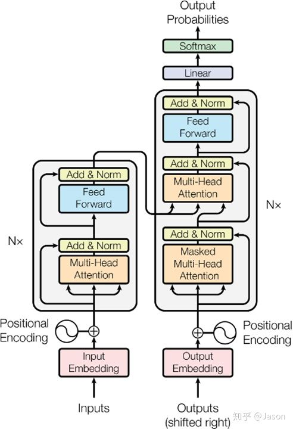
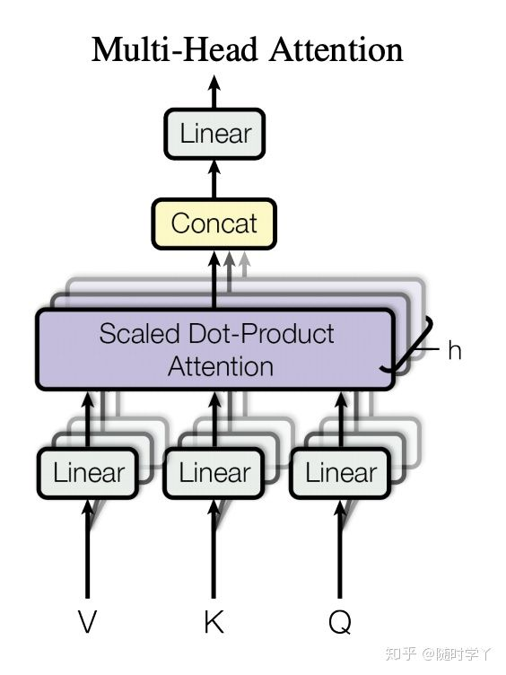

图：Transformer 结构

编码器：

* N 个编码器堆叠
* 每个编码器包含两个子层：
  * **多头自注意力子层** + 规范化层 + 残差连接
  * **前馈全连接子层** + 规范化层 + 残差连接

## 输入部分

文本嵌入层（Embedding）：将文本（源文本和目标文本）的数字表示（word to index）转换为向量表示（index to vector）

掩码张量：在 attention 中遮挡一部分信息，避免信息被提前利用

位置编码器（Positional Encoding）：transformer 中没有对词汇**位置信息**的处理，故需要将位置信息额外编码，添加到词嵌入张量中，弥补位置信息的丢失

最后的输入为：加入位置信息的**词嵌入张量**

## 注意力机制

注意力：最具有辨识度的部分，对判断结果最重要的部分

注意力计算规则：

* 输入 Q-Query、K-Key、V-Value，通过公式计算得到注意力结果
* 结果代表 Q 在 K 和 V 作用下的表示
* $$Attention(Q,K,V) = softmax(\frac{Q \cdot K^T}{\sqrt{d_k}}) \cdot V$$
  * Q 和 K 点乘，除以方差归一化（防止 softmax 后结果相近），再乘 V

具象化理解：

* 任务：给出文本，抽出关键词进行描述
  * 预先给出关键词 Key
  * 整个文本信息 Query
  * 看完文本后，脑子里浮现的信息 Value
* 刚开始看完，理解 Value 和提示 Key 基本相同
* 随着时间推移，开始理解 Query 中的信息，Value 随之发生变化，Value 是在给定文本 Query 的基础上对提示 Key 的延伸
* 注意力机制：默认 Value 和 Key 基本相同，但与 Query 不同，使用不同于给定文本的关键词来表示文本
* 自注意力机制：特殊情况，Value、Key、Query 都基本相同，未给定提示信息，用文本自身来表达自身，对文本自身做一次特征抽取

注意力机制：将注意力加入神经网络

多头注意力机制：

* 多头的每个头从词义方面分割输入的张量
* 每个头只分得一维词向量
* 作用：
  * 让每个头优化每个词汇的不同特征部分
  * 均衡同一种注意力可能带来的偏差，让词义有多元表达

图：多头注意力机制

## 前馈全连接层

具有两层线性层的全连接网络

作用：网络可能拟合程度不够，以此增强网络能力