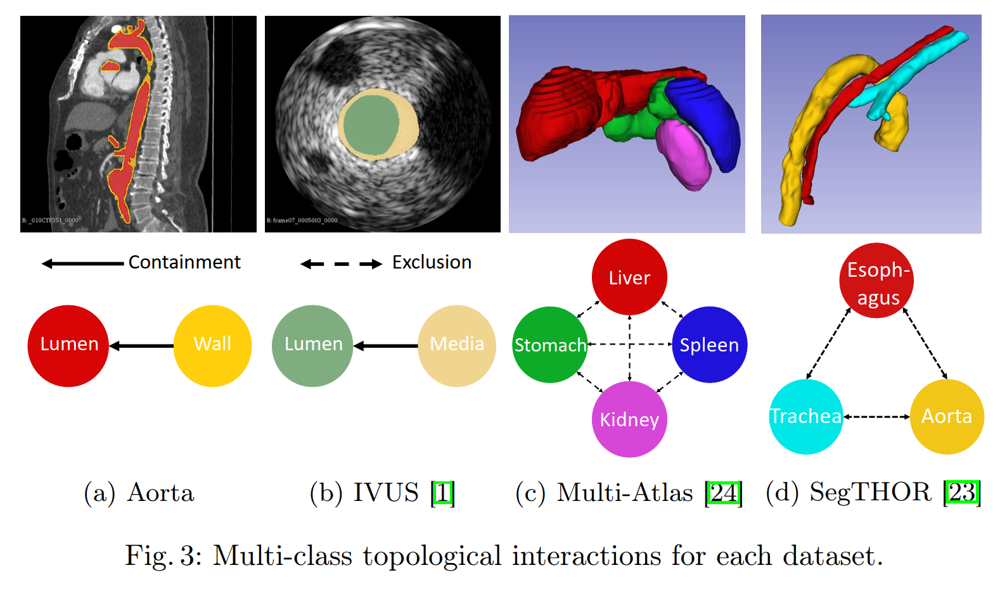

# 一、概述

深度学习方法在编码**不同类别之间的拓扑相互作用**（如包含和排斥）的能力方面是有限的

本文引入了一个新的**拓扑学互动模块**，将**拓扑学互动编码**到深度神经网络中，该实现**完全基于卷积**，非常有效

还证明了该方法的数据集通用性，包括 2D 和 3D 环境，不同成像模式，如 CT 和超声波

> 本文代码：https://github.com/TopoXLab/TopoInteraction

最先进的深度分割方法[4,5,6,16,29]不使用手工制作的特征，而是自动学习强大的特征表示，并取得令人满意的性能。然而，标准的深度神经网络不能学习关于语义标签的全局结构约束，这在生物医学领域往往是至关重要的。虽然现有的工作主要集中在对单一标签的拓扑结构进行编码[18,19,8,36]，但在解决不同标签之间的相互作用的约束方面取得的进展有限。即使是强大的方法（如nnUNet[21]）也可能无法保留这些约束，因为它们只优化每像素的准确性

图 1：主动脉分割示例

图 1 中，红色 - 主动脉腔、黄色 - 主动脉壁。解剖学上，管腔总是被管壁包围着，与背景分开，而即使强大的 baseline（UNet、nnUNet）也不能遵从这一解剖学拓扑约束，因为输入的主动脉壁的强度往往与背景的强度相似

另一种全局约束是不同标签的相互排斥，如在多器官分割中，保证不同的器官不互相接触，有助于提高分割质量

本文方法明确地编码了这一约束，从而提高了分割的质量

本文研究如何帮助深度神经网络学习这些**全局性的结构约束**，称为**不同语义标签之间的拓扑互动**，将这种互动约束编码到卷积神经网络中具有挑战性：

* 很难将硬约束直接编码到内核中，同时保持其可学习性
* 传统方法[10,39,31,26,22,3]将分割问题作为一个组合优化问题来解决（如图切 graph-cut 或多切 multicut），并将这些拓扑学上的相互作用编码为解决方案的约束
* 然而传统方法并不适用于深度神经网络，因为深度神经网络并不依赖全局优化来进行推理
* 即使可以将约束性优化编码为后处理步骤，其效率也会非常低
* 优化是不可微调的，不能纳入训练中。

关键观察：拓扑交互作用（包围和排斥）可以归结为**相邻像素（体素）的某些不允许的标签组合**

本文提出一种新的方法：

* 一个拓扑交互模块，通过一系列**卷积运算**将约束条件编码到神经网络中
* 不直接将约束条件编码到卷积核中，而是**直接确定违反约束条件的位置**
* 由于基于卷积的设计，我们的模块非常高效，且可以自然地被纳入神经网络的训练中（如通过额外的损失来惩罚违反约束的像素）
* 本文方法在专有和公共挑战数据集上，在 2D 和 3D 环境中都通用

本文贡献：

* 提出了一个高效的**基于卷积**的模块来编码多类分割环境中的拓扑相互作用
* 所提出的模块是非常**有效和通用**的。它可以被纳入任何骨干系统，以编码**端到端训练管道中的约束**
* 通过对多个医学成像数据集的广泛实验，我们表明我们的方法在**不增加计算成本**的情况下有效地提高了分割的质量

# 二、相关工作

## （一）多类图像分割

在前深度学习时代，已经提出了许多基于图或能量的方法来处理多类图像分割问题。其中一些方法整合了模糊的空间关系[9]或通过物体间的距离编码空间互动[28]。其他的则是为分层分割编码空间关系[12,37]。例如，Strekalovskiy等人[37]通过引入一个标签排序约束来强制执行几何约束。Li等人[27]提出用基于图的方法来分割嵌套对象。Delong等人[10]提出将不同区域之间的几何约束编码到多类图像分割的图切框架中。

## （二）几何和拓扑结构的约束

早期的工作，使用经典的框架，如水平集或马尔科夫随机场，在解决能量最小化问题时强制执行拓扑或几何约束[14,25,3,10,39,31,26,22] 。然而，这些方法不容易被纳入深度神经网络的训练中。近年来，人们提出了新的方法，将几何/拓扑约束纳入深度神经网络（DNNs）的训练中[18,19,8,36,40]。这些方法使DNNs能够学习几何/拓扑意识的表征，并提供更好的分割结果。然而，所有这些方法都集中在拓扑结构上，例如，单一前景类的连接、循环和分支。他们不能强制执行不同类别之间的拓扑相互作用。例如，在主动脉分割中，强迫主动脉壁在三维中成为一个管子并不能保证该壁包含管腔并将其与背景分开。这一差距促使我们研究在DNN训练中对类间拓扑相互作用进行编码。

与我们最接近的方法是[2]，我们称之为TopoCRF。它将相互排斥约束编码为对每个像素/象素的后验概率（softmax层输出）的约束，而不考虑邻域。因此，这种方法不能真正排除相邻像素有一个禁止的标签组合的情况。为c类问题明确构建2c约束编码先验，也是非常昂贵的，而且没有规模。与TopoCRF类似的其他方法有[33]，我们称之为MIDL，以及[32]，我们称之为NonAdj。NonAdj通过考虑相邻的像素来扩展TopoCRF，然而，它需要一个强大的预训练模型才能表现良好。MIDL和NonAdj都专注于联合分布的建模，因此存在与TopoCRF类似的问题。

# 三、方法

图 2：拓扑相互作用的示意图

图 3：

广义上讲，不同前景类之间的拓扑互动包括两种类型，即包含和排斥。在图2中，我们用三个类标签 $\alpha$、$\beta$ 和 $\gamma$ 来说明这些约束。

* 包含：
  * 如果 $\beta$ 完全包围着 $\alpha$，则 $\beta$ 类包含 $\alpha$
  * 用从 $\beta$ 到 $\alpha$ 的实心箭头来表示包含关系
  * 在主动脉分割中，主动脉壁包含管腔
* 互斥：
  * 如果 $\alpha$ 类和 $\gamma$ 类的像素不能彼此相邻，则互斥
  * 用虚线的双箭头来表示互斥关系
  * 在多器官分割中，胃和肝之间有明显的分离，是互斥的

可以执行更强的约束：
* 对于包含 - 可以要求包围的类（图 2 中的 $\beta$）至少有 d 个像素厚
* 对于排斥 - 可以要求两个相互排斥的类之间的差距至少是 d 像素宽
* 称这些广义的约束为 d-containment 和 d-exclusion

## （一）方法概述

尽管上述的拓扑交互是全局性的约束，但可以**以局部的方式进行编码**，即包含和排斥约束都可以被改写为**禁止相邻像素的某些标签组合**：

* 包含：$\beta$ 包含 $\alpha$ 等于约束，即标签为 $\alpha$ 的像素不能与标签为 $\beta$ 和自身以外的任何像素相邻
* 互斥：如果任何两个相邻的像素没有标签对（$\alpha$，$\gamma$）或（$\gamma$，$\alpha$），即不存在则相邻的 $\alpha$ 和 $\gamma$ 像素，则 $\alpha$ 和 $\gamma$ 是互斥的

监督方法：

* 提出一个新的拓扑交互模块，将这些约束强加给 DNN 训练
* 遍历所有相邻的像素对，确定违反所需约束的对，其中的像素拓扑交互错误的诱因，称为**关键像素**，拓扑交互模块输出这些关键像素
* 通过设计一个对关键像素**额外惩罚的损失**，将该模块纳入训练。

但是遍历所有像素中过于昂贵，不能在训练期间频繁操作

为此提出了一种纯粹基于卷积运算的高效约束实现方法，该方法效率更高，更容易推广到更具挑战性的 d-containment 和 d-exclusion，不需要太多的额外计算量

图 4：方法概况

## （二）拓扑交互模块

拓扑交互模块对上述定义的拓扑交互进行编码，关键是禁止某些标签组合出现在任何一对相邻的像素中，即本模块会识别出违反约束的标签对

如何将约束条件映射为关于两个不应出现在相邻像素中的标签的局部约束：

* 互斥约束：$\alpha$ 和 $\gamma$ 是相互排斥的。我们创建新的标签 $A=\alpha$ 和 $C=\gamma$，并禁止它们出现在相邻的像素中

* 包含约束：创建新的标签 $A=\alpha$ 和 $\alpha \cup \beta$ 的补集标签 $C$，则 $\beta$ 包含 $\alpha$ 就等同于 $A$ 不接触 $C$

接下来重点讨论如何创建一个模块来识别具有标签对 $(A,C)$ 或 $(C,A)$ 的相邻像素对

假设一个 2D 的 4 连通性邻域（即每个像素只与 4 个相邻的像素相邻），因此 d = 1

### 1. 天真的解决方案

给定一个预测分割图，天真的解决方案是在所有像素上循环遍历，对于每个像素，扫描其所有邻居

将每一对具有标签对 $(A,C)$ 或 $(C,A)$ 的相邻像素标记为关键

问题：计算代价非常昂贵，且只能在 CPU 上运行，速度相当慢

### 2. 基于卷积的解决方案

让 $P \subseteq R^d$ 表示由网络预测的 $d$ 维离散分割图

目标：产生一个**临界像素图**，其中只有与标签 $C$ 像素毗邻标签 $A$ 像素被激活，反之亦然

通过对不同语义掩码的操作来实现这一目标:

* 为了确定 $A$ 中的临界像素，我们将 $C$ 掩码扩大了 d 个像素，然后找出扩大后的掩码与 $A$ 掩码的交点（d = 1，为二维四连性），于是得到了所有临界 $A$ 像素的集合：它们落在扩展的 $C$ 掩码内，因此必须是某些 $C$ 像素的邻居
* 在图 5 的第一行 2 至 4 列，我们显示了 $C$ 掩码（用 $M_C$ 表示），它的扩展，以及与 $A$ 掩码的交集（用 $M_A$ 表示），从而得到了临界 $A$ 像素。同理在图 5 的底排 2 至 4 列，通过扩展 $A$ 掩码并找到它与 $C$ 掩码的交点来获得临界 $C$ 像素的集合。

图 5：

### 3. 连接核 $K$

在实践中，扩大遮罩可以使用扩张形态学操作[15]有效地完成。在扩张过程中，我们用内核 $K$ 对给定的二进制遮罩进行卷积，内核定义了给定体素的邻域

形式上，让 $M_A$ 和 $M_C$ 分别为 $A$ 和 $C$ 的类掩码。然后，我们通过扩张/卷积得到邻域信息 $N_A$ 和 $N_C$，如下所示。

$$N_A = M_A \textcircled{*} K,\ \ \ N_C = M_C \textcircled{*} K$$

* $\textcircled{*}$ - 表示标准卷积操作
* $K$ - 是卷积核，也称为连接核。2D 的 4 连通性使用的连通性核为图 5 中的

$V$ 表示整个临界像素图，它可以进一步划分为 $V_A$ 和 $V_C$，分别包含 $A$ 类和 $C$ 类的临界像素

能够通过推导与拓扑相互作用相关的信息来增加现有的信息

$K$ 的选择对应于连接性邻域：
* 在二维中，可以有 4 和 8 的连接性
* 在三维中，可以有 6 个和 26 个连通性
* 还可以为 $A$ 类和 $C$ 类指定不同的连接核

我们还注意到，很自然地对邻域定义进行概括，并相应地修改内核，以执行更普遍/更强的约束：d-containment 和 d-exclusion

这些约束基本上归结为标签 $A$ 和 $C$ 不能出现在距离为 $d$ 的两个像素上。为了编码这些约束，我们简单地将像素 p 的邻域定义为以 p 为中心的 $(2d+1) \times (2d+1)$ 局部补丁内的所有像素

### 4. 计算效率

我们通过确定其复杂性与输入和邻域大小的关系来分析所提出方法的计算效率。让图像大小为 $N \times N$。假设我们执行 $d$ 个像素的分离，那么每个像素要检查的邻域将是 $k \times k$，其中 $k=2d+1$

在天真的解决方案中，我们需要通过循环来扫描每个像素的邻域，因此时间复杂度为 $O(N^2k^2)$，并不是真正可扩展的。除此之外，这样的解决方案只能在CPU上运行。相反，基于卷积的解决方案的时间复杂性为$O(N^2\cdot log N)$

虽然天真的解决方案的运行时间是对k的二次方，但由于 FFT，我们提出的解决方案与 $k$ 无关

在实践中，深度学习框架对卷积操作进行了高度优化，因此它们比天真的解决方案要便宜几个数量级。两种方法对内存的要求相似，都是 $O(N^2)$ 的数量级来存储映射 $V$

## （三）纳入端到端训练

提出了一个拓扑交互损失，通过惩罚关键像素来纠正违规行为，从而将拓扑交互模块纳入端到端训练

让 $f \in R^{c \times H \times W}$ 是网络预测的多类似然图，$c$ - 类数、$H$ - 图像高度、$W$ - 图像宽度

$g \in R^{H \times W}$ 是具有离散标签的 ground truth 分割图，范围为 $0-（c-1）$

用 $L_{pixel}$ 表示像素级的损失函数，如交叉熵、均方误差和 dice 损失

用二进制掩码 $V$ 来定义 $L_{ti}$，表示额外的拓扑交互损失，即：。

$$L_{ti} = L_{pixel}(f ⊙ V,g ⊙ V)$$

* $⊙$ - 相当于取交集

$L_{ti}$ 基本上可以对拓扑交互进行编码，纠正拓扑交互错误，最终产生一个拓扑正确的分割。我们方法的最终损失，$L_{total}$，由以下公式给出。

$$L_{total} = L_{ce} + \lambda_{dice}L_{dice} + \lambda_{ti}L_{ti}$$

其中 $L_{ce}$ 和 $L_{dice}$ 表示交叉熵和骰子损失。该损失由权重 $\lambda_{dice}$ 和 $\lambda_{ti}$ 控制