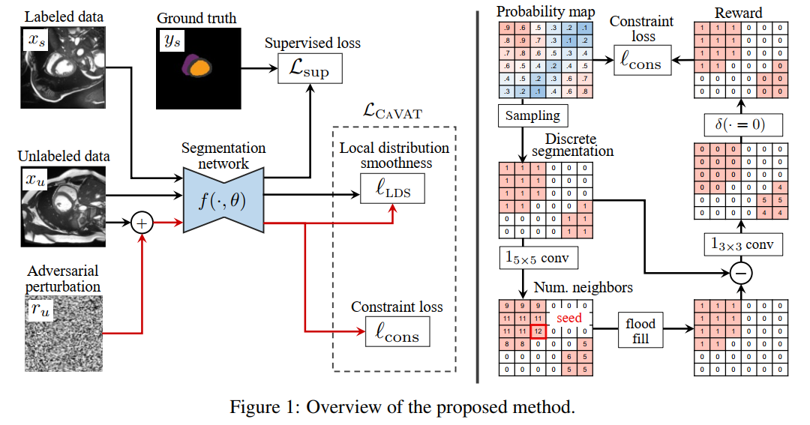
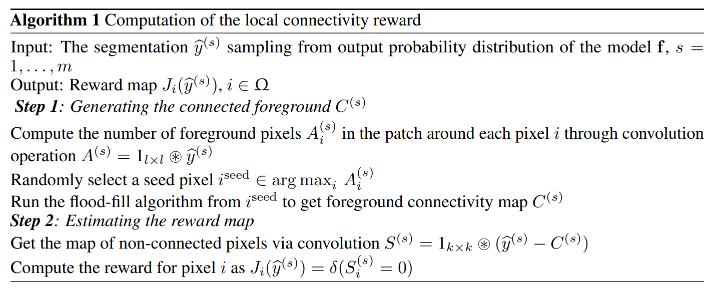

# 一、概述

## （一）摘要

半监督分割方法会产生解剖学上的不合理预测，如包含洞或不连接的区域

为了解决这个问题，提出了一种**上下文感知的虚拟对抗训练方法**（Context-aware Virtual Adversarial Training，CAVAT），用于生成解剖学上合理的分割

与只关注准确性的方法不同，本方法还考虑了**复杂的拓扑约束**，如连通性，这在可分化的损失函数中不容易被建模

**使用对抗性训练来产生违反约束的例子**，因此网络可以学习避免在新的例子上做出这种不正确的预测，并采用 REINFORCE 算法来处理非可分的分割约束

所提出的方法提供了一种通用和有效的方法，**可以在任何分割网络之上添加任何约束条件**

在两个临床相关的数据集上的实验表明，本方法产生的分割既准确又在区域连接方面符合解剖学原理

## （二）相关工作

最近的努力也是为了在分割网络中加入强大的**解剖学预设**

* Oktay 等 2017 提出了一个解剖约束神经网络（ACNN），使用一个自动编码器来重建标记图像的分割掩码。然后，自动编码器对给定图像的重建损失被用作分割形状先验。由于训练自动编码器需要足够数量的标记数据，这种方法不适合半监督学习环境
* Zotti 等 2018 的心脏分割方法通过在训练期间将概率形状图集与预测的分割对齐来提高准确性
* Duan 等 2019 使用多任务方法来定位地标，在细化步骤中指导基于图集的标签传播。尽管他们增加了鲁棒性，但这两种方法都需要大量的注释数据集来学习图集，并且对图集注册错误很敏感。
* Painchaud 等 2020 提出了一种分割方法，使用变异自动编码器来学习有效分割的流形。在推理过程中，预测的分割被映射到流形中最接近的有效点。虽然它提供了强大的解剖学保证，但这种后处理方法需要预先计算出重要的有效点数量。此外，预测输出在这些点上的投影可能导致与基础事实有很大不同的分割。

## （三）主要贡献

本文提出的用于半监督性分割的 CAVAT 方法在训练中考虑了复杂的约束条件，以学习解剖学上可信的分割

现有的方法仅限于简单的、可区分的约束条件（如区域大小、中心点位置等），并需要设计一个定制的损失函数，与此不同的是，我们的方法可以开箱即用，在给定的分割模型上添加任何约束条件，无论是否可区分

详细贡献如下：

* 提出了一个新的框架，通过在学习过程中考虑复杂的解剖学先验，帮助获得解剖学上可信的分割
  * 框架基于虚拟对抗训练（VAT）（Takeru 等 2019），它优化了一个最小的问题，即**从训练样本中创建对抗性的例子，以便最大化网络的预测分歧**
  * 与 VAT 不同的是，我们的方法生成的对抗性例子可以最大限度地提高预测发散性以及约束的违反
  * REINFORCE 算法（Ronald 1992）被用来计算非差异性分割约束的梯度

* 此分割方法是第一个在一般半监督环境下考虑复杂的解剖学先验的方法
  * 现有的方法需要大量的标记图像来学习形状先验（Oktay 等 2017；Painchaud 等 2020）或涉及图集注册的复杂和特定问题的步骤（Duan 等 2019；Dong 等 2020），与这些方法不同，本方法只需要**很少的标记实例**，可以**用于任何分割网络**

# 二、方法

图 1：网络结构

我们首先定义了我们工作中考虑的半监督分割问题

$S = \{(x_s; y_s)\}^{|S|}_{s=1}$ 是一个小型的标记数据集，其中每个 $x_s \in R^{|Ω|}$ 是一个图像

$y_s \in \{0;1\} ^{|\Omega| \times |C|}$ 是相应的 ground truth 分割掩码，$\Omega \subset Z^2$ 表示图像像素的集合，$C$ 表示分割类的集合

对于标注数据集 $S$ 和更大的无标注数据集 $U=\{x_u\}^{|U|}_{u=1}$，我们想学习一个由权重 $\theta$ 设置参数的网络 $f$，它产生的分割既准确又符合解剖学原理

图 1 显示了所提方法的概况。我们的方法是通过优化以下目标来训练有标签和无标签的数据

$$\min_\theta L_{total}(\theta;D)=L_{sup}(\theta;S) + \lambda L_{CAVAT}(\theta;U)$$

监督损失 $L_{sup}(\cdot)$ 鼓励网络依照 ground truth 来进行预测，使用交叉熵损失：

$$L_{sup}(\theta;S) = - \frac{1}{|S|} \sum_{(x,y) \in S} \sum_{x \in \Omega} \sum_{y \in C} y_{ij} log(f_{ij}(x;\theta))$$

语境感知 VAT 损失 $L_{CAVAT}(\cdot)$ 使用未标记的图像，增加了模型对对抗性噪声的鲁棒性，并帮助模型学习产生关于给定约束的有效分割

## （一）语境感知 VAT 损失

增加一个损失项，对违反约束条件的行为进行惩罚，但是这种方法带来三个问题：
* 可能无法用一个函数来模拟一个给定的约束条件。如测试区域连通性，要求区域内的每一对点都由区域内的路径连接，需要运行一个算法
* 即使存在这样的函数，也不一定是可微的。由于连续网络的输出和应用约束条件的离散分割之间的差异，在分割中经常出现这种情况
* 尽管这两个条件都得到了满足，但并不能保证在训练过程中会违反某个约束条件，尤其是当它模拟了一个复杂的关系。如果网络从未违反过约束，它将无法学习如何满足它，因为来自约束损失的梯度将是空的

为了解决这些问题，我们在未标记的例子上定义了以下的上下文感知的 VAT 损失

$$L_{CAVAT}(\theta;U) = \frac{1}{|U|} \sum_{x_u \in U} \max_{||r|| \le \epsilon} \left[ l_{LDS}(x_u,r_u;\theta) + \gamma l_{cons}(x_u,r_u;\theta)\right ]$$

这个损失由局部分布平滑度（LDS）项 $l_{LDS}(x_u,r_u;\theta)$ 和强化约束项 $l_{cons}(x_u,r_u;\theta)$ 组成，它对网络参数 $\theta$ 最小，对图像扰动 $r_u$ 最大。 γ是平衡两个损失项的权重，下面将介绍。

### 1. 局部分布平滑度（LDS）

公式（3）中的第一个项是原始VAT方法Takeru等人（2019）中基于发散的LDS，它由以下公式给出

最小化'LDS(-)可以增强模型对违反虚拟对抗方向的对抗性例子的鲁棒性，从而提高泛化性能。

### 2. 强化约束损失

公式（3）中的第二项鼓励产生导致违反约束的对抗性例子，这对于学习这些约束是必要的。强化约束的损失由以下公式给出

其中，yb是从输出概率分布pu = f(xu +ru; θ)中抽取的离散分割掩码，用于对抗性图像xu + ru，J是奖励函数，如果约束条件得到满足则输出1，否则返回0。

其中m是一个给定的样本数，在本文中经验性地设定为10。假设在输入图像的情况下，不同像素的输出是有条件独立的，即p(yb(s)) = Qi pybi(s))，最终损失可以表示为

## （二）局部连通性约束

尽管我们的方法可以用于任何可微分或不可微分的约束，但在本文中，我们在一个具有广泛适用性的著名约束上进行说明：连通性

给定一个分割区域 $G$，说 $G$ 是连通的，当且仅当每对像素 $p,q \in G$ 之间存在一条路径，使得路径中的所有像素都属于 $G$

在分割中强加连接性会导致一个高度复杂的问题，只能在简化的情况下解决，例如，通过将图像表示为一个小的超像素集（Shen等人，2020）

然而，考虑整个图像的连接性可能并不实际，因为在早期训练阶段很难实现。例如，有一个单一的断开连接的噪声像素就违反了该约束条件

为了解决这个问题，我们放松了全局约束，转而考虑每个**局部斑块的连接性**。由于局部斑块的满足是全局满足的一个必要条件，强制执行它有助于实现我们的目标

此外，这样做提供了一个空间上的密集梯度，因为满意度可以从一个子区域到另一个子区域有所不同。

奖励的计算过程如图 1-右所示，并在补充材料的算法 1 中详细说明

算法 1

* 通过**多项式抽样**从输出概率图中生成离散的分段 $\hat{y}^{(s)},s=1,\cdots,m$

* 对于每个采样的 $\hat{y}^{(s)}$，从一个选定的**种子像素**开始应用**泛滥填充算法**（flood fill），以产生连接的前景区域 $C^{(s)}$

* 为了选择种子像素，在 $\hat{y}^{(s)}$ 上使用 $1_{l \times l}$ 卷积核来计算以图像的每个像素为中心的 $l \times l$ 窗口中的前景像素的数量

* 我们随机选择一个具有最大值的像素，以利于选择大的连接部件作为参考区域。对于每个 $k \times k$ 的补丁，我们用一个简单的卷积法测量不在 $C^{(s)}$ 中的前景像素的数量：
$$S^{(s)} = 1_{l \times l} \textcircled{*} (\hat{y}^{(s)} - C^{(s)})$$

* 在像素 $i$ 处评估约束，即 $J_i(\hat{y}^{(s)}) = \delta(S_i^{(s)} = 0)$，其中 $\delta(\cdot)$ 是克罗内克函数（Kronecker delta）

> Flood Fill 算法：https://blog.csdn.net/weixin_46207366/article/details/122832373
> 多项式采样算法：https://blog.csdn.net/devil_son1234/article/details/117694319
> 克罗内克函数：https://baike.baidu.com/item/Kronecker%20delta/1207595?fr=aladdin