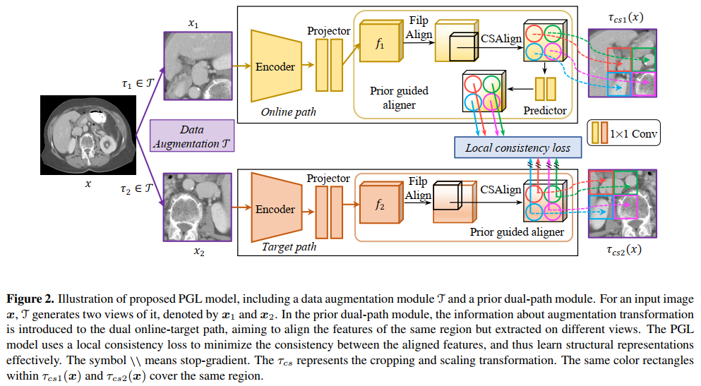
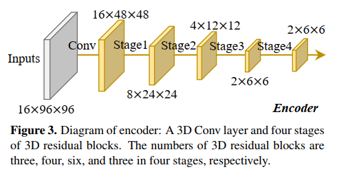
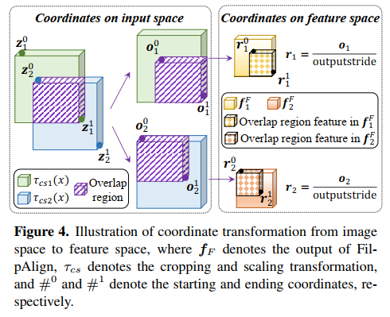

# PGL：用于三维医学图像分割的事先指导下的局部自我监督学习

Prior-Guided Local Self-supervised Learning for 3D Medical Image Segmentation

# 一、概述

人们普遍认为，深度学习在图像分割方面的成功绝大部分依赖于大量密集注释的训练数据，然而，由于需要大量的人力和专业知识，这些数据很难获得，特别是在注释三维医学图像方面

尽管自监督学习（SSL）在解决这个问题上显示出巨大的潜力，但大多数SSL方法只关注图像层面的全局一致性，而忽略了局部一致性，而局部一致性在捕捉密集预测任务（如分割）的结构信息方面起着关键的作用

在本文中，我们提出了一个 PriorGuided Local（PGL）自监督模型，该模型可以学习潜在特征空间中的区域性局部一致性：

* 使用**空间变换**（产生**同一图像的不同增强视图**）作为先验来推断两个视图之间的位置关系，然后用它来对齐在两个视图上提取的同一局部区域的特征图
* 构建了一个**局部一致性损失**，以最小化对齐的特征图之间的体素级差异。因此，我们的 PGL 模型学习了**局部区域的独特表征**，因此能够保留结构信息，这种能力有利于下游的分割任务
* 对四个公共计算机断层扫描（CT）数据集进行了广泛的评估，这些数据集涵盖了 11 种主要人类器官和两种肿瘤

结果表明，使用预先训练好的 PGL 模型来初始化下游网络，比随机初始化和基于全局一致性模型的初始化都有很大的性能提高

> 代码和预训练权重：https://git.io/PGL

最近的自我监督学习（SSL）通常基于对比学习，根据**同一图像的增强视图（正面对）的表征应该是一致的，而不同图像的增强视图（负面对）的表征应该是不一致**的这一假设来利用未标记的数据

## BYOL 模型

Bootstrap Your Own Latent（BYOL）模型使用**双在线-目标路径**范式学习图像表征，该模型在图像的增强视图上训练在线网络，以预测由目标网络产生的同一图像的另一个增强视图的表征。因此，BYOL将负数对解放出来，摆脱了对比性原型，并在SSL中实现了最先进的性能。

尽管 BYOL 取得了成功，但它**只注重学习每个正对之间的全局一致性**，而**忽略了局部一致性**，而局部一致性在捕捉密集预测任务（如图像分割）的结构信息方面起着关键的作用

然而，学习局部一致性并不容易，因为生成输入图像视图的变换会极大地改变体素位置。幸运的是，无论进行哪种转换，只要两个增强的视图是从同一图像转换而来，它们之间的空间位置关系就可以推断出来。这种关系可以作为一种先验，引导网络从未标记的数据中学习一致的局部表征。

## 主要贡献

提出了一个用于三维医学图像分割的先验引导的局部自监督模型（PriorGuided Local，PGL），该模型采用**一对正面图像之间的先验位置关系**来学习同一区域的特征间的局部一致性

该模型由一个**用于图像视图生成的数据增强模块**和一个**用于特征提取的先验双路径模块**组成

用于数据增强的转换信息（即翻转、裁剪和缩放）被引入到双在线-目标路径范式中作为先验，目的是使同一区域但在不同视图上提取的图像特征保持一致

然后，我们构建一个局部一致性损失，以最小化每对对齐特征之间的差异。这样，我们的模型可以学习到更好的局部区域表征，捕获更多的结构信息，并且比基于全局一致性的模型更适合下游的分割任务

在四个公共数据集上进行的大量实验证明了所提出的 PGL 模型的有效性。

主要贡献：

* 提出了 PGL 自监督模型，可以在无标注图像上学习有效的视觉表征，减轻了对大规模密集注释训练数据集的依赖

* 使用**输入的空间变换**作为先验，**在不同的视图上绘制同一图像区域的一致的潜在表征**，并通过最小化局部一致性损失保证这种一致性。因此，该网络能够为医学图像分割掌握更多的结构表征

* 在四个公共 CT 数据集上进行了广泛的实验，结果表明，我们的 PGL 模型大大超过了随机初始化和基于全局一致性的 SSL 方法 BYOL

# 三、方法

图 2：网络结构

PGL 模型包括一个**数据增强模块** $T$ 和一个**先验双路径模块**，模型的目的是**利用未标记的体积医学图像学习一个通用的结构表征，从而改善下游的分割任务**

* 数据增强模块：
  * 对于输入图像 $x$，$T$ 产生它的两个视图 $x_1$ 和 $x_2$
* 先验双路径模块：
  * 增强变换的信息被引入到双在线-目标路径中，目的是使同一区域但在不同视图上提取的特征一致
  * 在线路径和目标路径提取的潜在特征图用 $f_1$ 和 $f_2$ 表示
  * 数据增强中使用的变换被作为先验来指导特征的对齐，这些特征是在同一图像区域提取的，但分别位于 $f_1$ 和 $f_2$ 上
* PGL 模型使用**局部一致性损失**来最小化对齐的特征之间的一致性，从而有效地学习结构表征
  * \\\\ - 停止梯度回传
  * $\tau_{cs}$ - 代表裁剪和缩放变换，$\tau_{cs1}$ 和 $\tau_{cs2}$ 内相同颜色的矩形覆盖了同一区域
  * 在推理阶段，我们只保留在线路径中的编码器进行评估

## （一）数据增强模块

1. 随机裁剪和缩放：
   * 从原始图像中随机裁剪三维斑块，其尺寸范围为输入尺寸的 110% 和 140%
   * 为了保证转换先验在后期能够很好地工作，要求同一输入的两个视图之间的重叠率不低于 10%
   * 裁剪后的补丁被调整为输入尺寸
2. 以 50% 的概率沿三条轴随机翻转
3. 加入白色高斯噪声：方差从 0 到 0.1 之间的均匀分布中抽取。应用这种变换的概率是 10%
4. 高斯模糊：概率为 20%，高斯核的 $\sigma$ 从 0.5 和 1 之间的均匀分布中抽出
5. 调整右度和对比度：概率为 50%，体素值首先乘以一个从 0.75 到 1.25 之间的均匀分布中采样的常数，然后被剪切到原始动态范围
6. 在逐个体素上应用伽马变换 $i_{new} = i_{old}^\lambda$，其中 $\lambda$ 是从 0.7 和 1.5 之间的均匀分布中采样的。变换后的体素值被缩放为 $[0,1]$。这种转换的概率为 50%

## （二）先验双路径模块

先验双路径模块包含一个在线路径和一个目标路径：
* 在线路径包括：一个编码器 $E_\theta$、一个投影仪 $P_\theta$ 和一个带有额外预测器 $Y_\theta$ 的先验引导对齐器
* 目标路径包括：一个编码器 $E_\mu$、一个投影仪 $P_\mu$ 和一个没有预测器的先验引导的对齐器
* 编码器和投影仪的结构在两条路径中的结构相同，但权重 $\theta$ 和 $\mu$ 不同

### 1. 编码器

图 3：编码器

为了处理 3D 数据，选择 3D ResNet-50 作为编码器 backbone，包含一个 3D 卷积层和四个阶段的 3D 残差块，各阶段的三维残差块的数量分别为 3、4、6、3

### 2. 投影仪

使用的投影仪将编码器的输出映射到**特征空间**，其中只应用了全局一致性损失，没有考虑空间信息。为了弥补这一缺陷，我们的投影仪去掉了全局平均池化层，用 Conv-BN-Relu-Conv 块代替了两层感知，包括：

一个 1x1 的卷积层（4096 通道），Batch Normalization，ReLU，一个 1x1 的卷积层（256 通道）

### 3. 事先引导的对齐器

图 4：对齐器

目标：基于增强变换的先验信息建立 $f_1$ 和 $f_2$ 之间的空间关系，并采用这种关系来对齐特征

考虑到只有随机裁剪/缩放和翻转才能改变提取的斑块的空间位置，我们提出以下两步对齐策略。

#### （1）FilpAlign

FilpAlign 使用逆变换 $\tau_F$ 的先验，将表征 $f_1$ 和 $f_2$ 对齐到它们的原始位置：

$$f_1^F = \tau_{F1}^{-1}(f_1) \qquad f_2^F = \tau_{F2}^{-1}(f_2)$$

* $\tau_F^{-1}$ - $\tau_F$ 的反向操作
* $f_1^F$ - 在线 FilpAlign 的输出
* $f_2^F$ - 目标 FilpAlign 的输出

#### （2）CSAlign

CSAlign 采用裁剪/缩放变换的先验方法来对齐特征空间中的重叠区域，用 $\tau_{cs}$ 表示

* 对输入图像 $x$ 应用 $\tau_{cs}$ 得到的两个视图分别用 $\tau_{cs1}$ 和 $\tau_{cs2}$ 表示（在原图 $x$ 中的绝对坐标）
* $\tau_{cs1}(x)$ 的起点和终点坐标用 $z_1^0$ 和 $z_1^1$ 来表示
* $\tau_{cs2}(x)$ 的起点和终点坐标用 $z_2^0$ 和 $z_2^1$ 来表示

首先计算 $\tau_{cs1}(x)$ 和 $\tau_{cs2}(x)$ 中重叠区域的坐标（见图4），如下所示

$$o_1^0 = max(z_1^0,z_2^0)-z_1^0 \qquad o_1^1 = max(z_1^1,z_2^1)-z_1^0 \\ 
o_2^0 = max(z_1^0,z_2^0)-z_2^0 \qquad o_2^1 = max(z_1^1,z_2^1)-z_2^0$$

* $o_1^0$ $o_1^1$ - $\tau_{cs1}(x)$ 中重叠区域的起点和终点坐标
* $o_2^0$ $o_2^1$ - $\tau_{cs2}(x)$ 中重叠区域的起点和终点坐标
* 都是在裁剪后图中重叠部分的坐标，将原图的坐标映射到裁剪后图的坐标的过程

然后，我们进行从图像空间到特征空间的坐标转换，如下所示

$$r_1^0 = \frac{o_1^0}{outputstride} \qquad r_1^1 = \frac{o_1^1}{outputstride} \\ 
r_2^0 = \frac{o_2^0}{outputstride} \qquad r_2^1 = \frac{o_2^1}{outputstride}$$

* $r1$ $r2$ - 分别是重叠区域在 $f_1^F$ 和 $f_2^F$ 中的坐标
* $outputstride$ - 缩放因子，指的是输入图像尺寸和输出特征尺寸之间的比例，在深度轴、高度轴、宽度轴上设置为 8、16、16

#### （三）RoIAlign

进行三维 RoIAlign 操作，在 $r_1$ 和 $r_2$ 的指导下从 $f_1^F$ 和 $f_2^F$ 中提取重叠区域的特征

最后，我们使用双线性插值将提取的特征大小调整为 $f^F$ 的大小。这两个步骤可以表述为

$$f_1^{F \& CS} = R(RoIAlign(f_1^F,r_1)) \\ 
f_2^{F \& CS} = R(RoIAlign(f_2^F,r_2))$$

* $R(\cdot)$ - 一个调整大小的函数
* $f_1^{F \& CS}$ $f_2^{F \& CS}$ - 在线 CSAlign 和目标 CSAlign 的输出，它们分别从 $f_1$ 和 $f_2$ 中提取，但描述了输入图像上的同一区域
