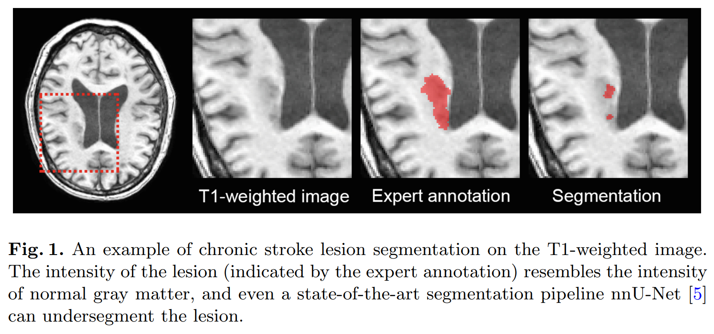

卷积神经网络（CNN）大大改善了脑部病变分割的性能。然而，当病变的外观与正常的脑组织相似时，对脑部病变的准确分割仍然是一个挑战。为了解决这个问题，在这项工作中，我们试图利用健康受试者的扫描信息来改善脑部病变的分割，其中关于正常脑组织的解剖学先验知识可以被考虑在内，以更好地分辨病变。为了纳入这样的先验知识，我们建议将一组健康受试者的参考扫描数据注册到每个有病变的扫描中，注册的参考扫描数据为每个体素的正常组织提供参考强度样本。通过这种方式，空间自适应先验知识可以指出异常体素的存在，即使它们的强度与正常组织相似，因为它们的位置与正常组织的先验知识相矛盾。具体来说，通过参考扫描，我们计算出有病变的扫描的异常得分图，这些图被用作分割网络的辅助输入，以帮助大脑病变的分割。我们在不同的脑部病变分割任务中评估了所提出的策略，结果表明使用我们的方法纳入解剖学先验的好处。

图 1：分割混淆

当病变的外观与正常脑组织相似时，对脑病变的精确分割可能仍然是一个挑战

如图 1，慢性中风病变在白质中的强度可能与正常灰质相似，即使是最先进的分割方法也可能将病变与正常组织混淆，产生低质量的分割结果

为了解决这个问题，可以结合正常脑组织**的先验知识**，这样即使病变的强度与正常脑组织的强度相似，也能更好地分辨出来

如基于正常组织倾向于出现对称性的假设，可以将感兴趣的图像与其反射的版本进行登记，它们之间的差异可以表明可能是病变的不对称区域

在这项工作中，我们继续探索将有关正常脑组织的先验知识纳入脑病变分割。尽管脑部病变的强度可能与其他地方的正常组织相似，但这些病变的位置有助于区分它们。基于这一观察，我们建议使用健康受试者的扫描来提供正常组织的体素参考强度，这样就可以更好地识别每个体素的异常强度

具体来说，将一组健康受试者的参考图像注册到有病变的相关扫描中。然后，凭直觉，可以计算出感兴趣的扫描和注册的参考图像的强度之间的差异图，以指示异常情况

此外，每个体素的注册扫描的强度可以被视为从该体素的正常组织强度的分布中抽取的样本。我们用这些样本拟合分布，并计算出感兴趣的扫描强度的可能性，这给了异常指示一个不同的角度。

这两种类型的异常得分图与有病变的图像结合起来进行网络训练和推理，这样就可以利用关于正常脑组织的知识来改善分割的效果。为了评估，我们将提出的方法与 nnUNet 分割管道整合，并进行了慢性中风病灶和缺血性中风病灶的分割实验

结果表明，所提出的纳入解剖学先验信息的策略提高了脑部病变分割的质量

> 本文代码：https://github.com/lchdl/NLL